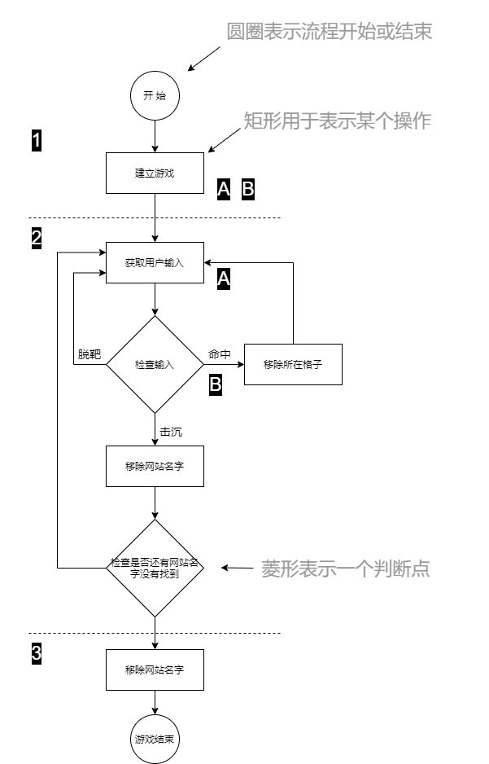

# 实战编程：给方法赋能

本章就要给方法以力量。前面已经详细讨论了变量，也玩了玩几个对象，还写了一点代码。这个时候还不够强大，我们需要一些新的工具。比如 **运算符（operators）**。需要更多的运算符来完成一些比 `bark` 更有趣的事情。我们还需要 **循环（loops）**，是需要循环，但那个羸弱的 `while` 循环能干些什么呢？干正事的时候我们需要 `for` 循环。**生成一个随机数**也会是有用的，同时 **将一个字符串转换成整数**也是这样。从本章开始将从头开始构建一个真实的应用，那将会是一个游戏。这是一个繁重的任务，因此将占据两个章节。

## 第一步，高级别设计（a high-level design）

Java程序设计当然要用到类与方法，但他们到底是怎样的呢？要回答这个问题，就需要更多有关应用的信息。

首先就要搞清楚应用的一般流程。

1. 用户启动游戏
    - A. 游戏创建出三个网站名字
    - B. 游戏将这三个网站名字，放置在一个虚拟网格上

2. 开始玩游戏
    重复下面的步骤，知道翻出所有网站名字：
    - A. 提醒玩家给出某个网格上的格子（比如 `A2`、`C0`）
    - B. 将玩家猜的格子，与所有网站名字所在的格子进行检查，看看有没有猜中。根据结果，进行适当的操作

3. 游戏结束
    基于猜中的次数，给玩家打分。

    
