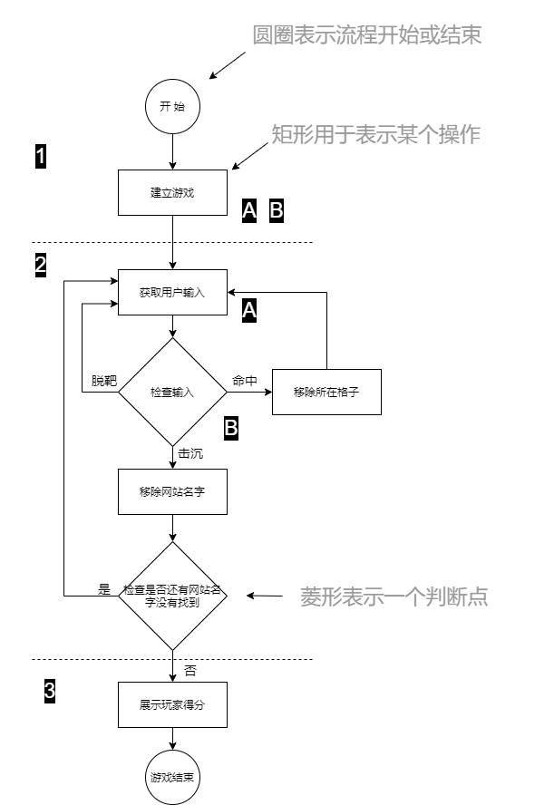

# 实战编程：给方法赋能

本章就要给方法以力量。前面已经详细讨论了变量，也玩了玩几个对象，还写了一点代码。这个时候还不够强大，我们需要一些新的工具。比如 **运算符（operators）**。需要更多的运算符来完成一些比 `bark` 更有趣的事情。我们还需要 **循环（loops）**，是需要循环，但那个羸弱的 `while` 循环能干些什么呢？干正事的时候我们需要 `for` 循环。**生成一个随机数**也会是有用的，同时 **将一个字符串转换成整数**也是这样。从本章开始将从头开始构建一个真实的应用，那将会是一个游戏。这是一个繁重的任务，因此将占据两个章节。

## 第一步，高级别设计（a high-level design）

Java程序设计当然要用到类与方法，但他们到底是怎样的呢？要回答这个问题，就需要更多有关应用的信息。

首先就要搞清楚应用的一般流程。

1. 用户启动游戏
    - A. 游戏创建出三个网站名字
    - B. 游戏将这三个网站名字，放置在一个虚拟网格上

2. 开始玩游戏
    重复下面的步骤，知道翻出所有网站名字：
    - A. 提醒玩家给出某个网格上的格子（比如 `A2`、`C0`）
    - B. 将玩家猜的格子，与所有网站名字所在的格子进行检查，看看有没有猜中。根据结果，进行适当的操作

3. 游戏结束
    基于猜中的次数，给玩家打分。

    

下面就要搞清楚，为了完成这个游戏作品，需要怎样的一些对象。需要以面向对象思维，而不是面向过程思维，着眼于程序中的 **事物（things）**，而不是程序中的 **过程（procedures）**。

## 类的编写（Developing a Class）

每名程序员，都要有编写代码的方法论/流程/途径（As a programmer, you probably hava a methodology/process/approach）。当然Java程序员也是这样，下面的这个排序，就是在编写Java类的时候，所考虑到的事情。在现实工作中并非都要按照这样的顺序来执行。实际工作中，会按照自己偏好、项目的不同，甚至雇主的意愿来操作。基本上是可以想怎么来就怎么来的。不过这里以教学为目的，通常会按照下面的顺序进行类的编写：

- 搞清楚所编写的类计划用来做什么
- 列出其实例变量与方法
- 编写方法的 **预代码（prepcode）**
- 编写方法的 **测试代码（test code）**
- 将类进行 **部署**（**Implement** the class）
- 对方法进行 **测试**（**Test** the methods）
- 进行必要的 **调试** 和 **再部署** （**Debug** and **reimplement** as needed）
- 邀请真实用户，对应用进行测试

__每个类都要编写的三种代码__

- 预编码，prep code
    是一致伪代码（pseudocode）, 用于理清逻辑，而不用面对语法上的压力

- 测试代码
    对真实代码进行测试，以验证真实代码是在正确工作

- 真实代码
    类的具体实现。这里才是编写Java代码的地方

## 什么是预代码/伪代码（prepcode）

是类的真实Java代码与其自然语言描述之间的中介。大多数预代码包含三个部分：实例变量的声明、方法的声明和方法的逻辑。预代码最重要的部分，就是方法的逻辑，因为方法的逻辑，对要发生什么进行了定义。

## 编写方法的实现（Writing the method implementations）

在编写方法之前，先要编写方法的测试代码。注意，这里是先于方法本身，编写方法的测试代码的。

首先编写测试代码的做法，是极限编程（Extreme Programming, XP）的一种实践。采取这种方法，可以令到写代码更为容易和快速。当然并不是说非得要采用极限编程的方法，但真的喜欢首先编写测试代码的部分，同时极限编程听起来也很酷。

## 关于极限编程

极限编程，作为软件开发方法论领域的新兴成员，被许多程序员认为是“程序员正确的工作方式”，极限编程出现在1990年代，已经被许多公司所采行。XP的核心在于，软件用户在提出新的需求时，可以很快实现。

XP基于一套验证过的实践方法，这些方法应该组合运用。不过业者通常只选取其中一些方法，同时仅采行XP规则中的一部分。这些实践方法包含下面这些：

- 高频发布小版本（Make small, but frequent, releases）
- 以迭代周期方式开发（Develop in interation cycles）
- 绝不把不包含在软件规格中的功能/特性，加入到项目中去（不管有多想要以“为将来考虑”的原因，加入某项功能，Don't put in anything that's not in the spec(no matter how tempted you are to put int functionality "for the future")）
- 首先编写测试代码
- 不设苛刻时间表；不加班（No killer schedules; work regular hours）
- 一有机会就搞重构（提升代码质量，Refactor(improve the code) whenever and wherever you notice the opportunity）
- 根据小版本，设置合理可行的时间表（Set realistic schedules, based around small releases)
- 保持代码简单（Keep it simple）
- 结对编程，并定期调换人员岗位，从而令到每个人都对代码的各个部分有所了解（Program in pairs, and move ppl around so that everybody knows pretty much everything about the code）

## `++n` 和 `n++` 的不同

`++n` increments the value and returns the new one. `n++` increments the value and returns the old one. Thus, `n++` requires extra storage, as it has to keep track of the old value so it can return it after doing the increment.
