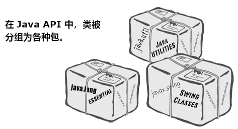

# 了解Java API：使用Java的库

Java语言本身，就带有多达数百个的预构建类。若掌握了如何从 Java 库，也就是常说的 **Java API**中找到你所需要的功能，那么就不必去重新发明轮子了（You don't have to reinvent the wheel if you know how to find what you need in the Java library, known as the **Java API**）。_还有更好的事情等着你去做_。若要编写代码，也只是要去编写对于你的应用来说，真正特有的代码。你知道那些下午5点就下班，早上10点都还没到公司的程序员吗？__他们就是善于使用 Java API__。Java的核心库，有着大量的类，就等着你去使用，可以像使用砖块一样，从大量预构建的代码，组装出你自己的程序。本书中用到的写好Java程序示例，就是无需从头再编写的代码，但还是必须输入到你的程序中去。而Java API则是些甚至不用输入的代码。你只需要学会怎样去使用他们就可以了。

Java标准版带有数百个预构建类（除非使用的是针对小型设备的微型版本，那么Java标准版就是你手头的版本，The Java Standard Edition，which is what you have unless you're working on the Micro Edition for small devices and believe me, you'd know）。他们就和本书中这些编写好的代码一样，只是这些内建的类，时已经编译好的。

_这就是说这些内建类无需再次输入了__。直接使用他们就好。

`ArrayList` 是Java库中无数内建类之一。你可以在自己的代码中，如同是你自己编写的`ArrayList`一样使用他。

_我该怎么来知道，Java API里有些什么呢？_

这正是如何成为一名正式的Java程序员的关键所在。这并不是说在构建软件时尽可能的懒，而是说在有人已经完成了这门语言中大多数最重要的部分后，你可以节省那么多的时间，而你只需要花点时间去了解这些API，去完成你的软件中有趣的部分即可。

有点离题了，这个问题的答案，往短了说，就是你得花点时间来学习，在Java核心API中有些什么。往大了说，就是在完成本章学习后，就知道该怎么去获知Java API中有些什么了。

_怎么才知道我要用到Java API的某个类，该如何从“要完成某个功能”过渡到“找到实现某个功能的方法”？_

你已经发现了问题的本质了。在学完本书后，你将会对Java这门语言有很好的掌握。之后你的学习曲线，就是了解如何从找到问题，到通过编写尽可能少的代码，来得到问题的解决方案了。随后将讨论这个问题。

## `ArrayList` 与 `array` 的不同

`ArrayList` 是一个对象。`array`也是对象，与其他对象一样，也是存活在内存堆（heap）上的。但 `array`仍然只是`array`，不会是`ArrayList`，只是个冒牌货的。对象是同时有 __状态__ 和 __行为__ 的（state and behavior）。`array`就没有可调用的方法。Java 中的 `array` 一旦初始化，就再也不能追加或移除其中的元素了。`ArrayList`作为头等对象，就有着移除其中元素的能力，可以动态地改变大小。`ArrayList`有着极大的灵活性。__不可以直接将原生类型变量放入到 `ArrayList`中__ 。但将原生类型变量，封装到一个原生类型封装器类中之后，就可以将原生变量放入到 `ArrayList`中了（You can put a primitives in an `ArrayList`, as long as it's wrapped in a primitive wrapper class）。自 Java 5.0 开始，原生类型变量的封装（以及在取出原生类型变量时的解封装），就已经是自动的了。可以确定的说，在运用由原生变量构成的 `ArrayList`时，可能比使用`array`还要快，因为所有的原生变量封装与解封装，都是........话又说回来，如今谁还会用到原生类型变量呢？

对于 `ArrayList`，只是在操作一个普通的 `ArrayList` 类型的对象，只是调用普通对象上的方法，使用普通对象上的 `.` 运算符。而对于一个 `array`，就要使用 _特殊的数组语法_ （比如 `myList[0] = foo`），这些语法只能在数组上使用，其他地方都用不到。就算数组也是对象，但数组是存在于他自己的世界中，你无法调用他上面的任何方法。可以访问到的，也只是他唯一的实例变量 `length`。

1. 普通的老式 `array`，在创建出来时就必须知道大小。

但对于 `ArrayList` 来说，就只需要生成一个类型为 `ArrayList`的对象就行。因为随着有对象加入或移除，`ArrayList`对象的大小会增加或收缩。

```java
String[] a = new String[2];
ArrayList<String> al = new ArrayList<String> ();
```

2. 要将某个对象放入到常规数组中，就必须为其指定一个特定位置。

（而且这个位置，必须要是从 `0` 到小于该数组长度的一个值。）

```java
myList[1] = b;
```

在指定的索引位置超出了该数组的边界时（比如对于一个声明了大小为2的数组，在尝试将某个值赋给索引3时），运行时就会报错（`java.lang.ArrayIndexOutOfBoundsException: Index 3 out of bounds for length 3`）。但对于 `ArrayList`，就可以使用 `add(anInt, anObject)` 方法，或是只写 `add(anObject)`，就可以为新加入的对象，分配到空间。

```java
myList.add(b);
```

3. 数组所使用的语法，在Java中的其他任何地方都不会用到。

但 `ArrayList` 就是普通的 Java 对象，因此没有特殊的语法。

```java
myList[1];
```

4. 自 Java 5.0 开始，`ArrayList` 就已经是参数化的了（parameterized）。

```java
ArrayList<String>
```

这里的在尖括号中的 `String` 是一个 “类型参数”（`type parameter`）。 `ArrayList<String>` 的意思是，“一个字符串清单”，以示与 `ArrayList<Dog>` 表示“一个 Dog 的清单”的不同。

如今使用 `<type>` 这样的语法，就可以声明并创建 `ArrayList` 变量所能保存的对象类型。在“集合”章节将会仔细审视 `ArrayList` 中的参数化类型语法。现在只需要知道，这种语法是一种强制编译器，只允许特定类型的对象，放入到 `ArrayList` 中的办法。

## 构造器函数（The `constructor` function）

构造器函数是一个与类名称同名的特殊函数，在某个对象创建时运行，返回的是其所创建的对象（非 `void`），故构造器函数如下面这样：

```java
public class DotCom {
...

public DotCom (...) {
    ...
}

...
}
```

## 超级强大的布尔表达式（Supper Powerful Boolean Expressions）

在 `DotComBust` 类中的循环或 `if` 条件测试里，就已经用到了布尔表达式，这些布尔表达式是很简单的。在后续代码中，将用到更加强大的布尔表达式。

### “与”及“或”运算符（`&&`、`||`）

假设我写一个 `chooseCamera()` 方法，有很多如何去选择一台相机的规则。也许要选择价钱在 $50 到 $1000 的相机，在某种情形下，要更精细地去限定价格范围。可能会这样：

- “加入价钱在 $300 到 $400, 那么就选择 X”:

```java
if (price >= 300 && price < 400) {
    camera = "X";
}
```

- 在有10个相机品牌可供选择时，有一些适用于品牌清单中少数几个的规则：

```java
if (brand.equals("A") || brand.equals("B")) {
    // 仅针对品牌 A 和 B 进行某些操作
}
```

布尔表达式可以时相当大且复杂的：

```java
if ((zoomType.equals("optical") &&
    (zoomDegree >= 3 && zoomDegree <= 8)) ||
    (zoomType.equals("digital") && 
    (zoomDegree >= 5 && zoomDegree <= 12))) {
        // 对这种变焦，执行相应操作
}
```

若要真的熟知布尔表达式，就要了解这些运算符的优先级（the precedence of these operators）。除了深入了解他们的优先级，还可以使用括号，来令到代码中的复杂布尔表达式更加清晰明了。

### 不等于（`!=` 和 `!`）

假设有这样的一个逻辑：“10个相机型号中，除开其中的一个型号”：

```java
if (model != 2000) {
    // 针对型号不是 2000 的相机，执行一些操作
}
```

或者对字符串等一些对象进行比较：

```java
if (!brand.equals("X")) {
    // 对品牌不是 X 的相机进行一些操作
}
```

### 短路运算符（Short circuit operators, `&&`、`||`）

对于 `&&` 运算符，是要其两边都是 `true` 时，表达式才是 `true` 的。所以只要虚拟机看到其左边的值为 `false`，就不会在计算运算符右边的表达式了。所以他叫做短路运算符。

同样对于 `||` 也是这样的，只要 JVM 看到他的左边是 `true`，会得出整个表达式就是 `true`，就不会再计算右边的值了。

说这个有什么用呢？比如不确定某个引用变量是否已经被赋值了某个对象，就去调用某个使用了这个空引用变量（null reference variable, 也就是，尚未将对象赋值给该引用变量）的方法时，就会得到一个 `NullPointerException`的错误代码。那么就可以这样写：

```java
if (refVar != null && refVar.isValidType()) {
    // 执行“已有某种类型”下的操作
}
```

### 非短路运算符（Non Short Circuit Operators, `&`、`|`）

在布尔表达式中使用 `&` 与 `|` 运算符时，他们的表现，就跟他们的同伴 `&&` 与 `||` 相似，不同之处在于，这两个运算符，是要强制JVM对运算符的两边，都要进行检查。通常情况下，`&` 与 `|` 是用在不同的情形下的，比如对二进制位的操作。

## 使用库（Java API）

由于使用了 `ArrayList`，前面完成了 `DotComBust` 游戏。现在就是学习怎么用好 Java 库的时间了。

__在 Java API 中，类是以包的形式分组的（In the Java API, classes are grouped into packages）__。



__要使用API中的某个类，就要知道他在哪个包里头__。

Java 库中的每一个类，都是属于某个包的。那个包有个名字，比如 `javax.swing` （一个有着一些 Swing GUI 类的包）。`ArrayList`则是在名为 `java.util`的包中，这个包有一堆的 _工具（utility）_ 类。在第17章，将会学到更多的有关包的知识，包括如何将自己编写的类，放入自己组织的包中。

在代码中使用API的类，是很简单的。只需将那个类当成自己编写的，自己编译的，就在那里等着使用就可以了。有一个不同点在于，在代码中的一些地方，需要用库类的 _完整_ 名字来表示，完整名字就是，包的名字 + 类的名字。

就算对这个不了解，_实际上很早就用到了来自某个包的类_。`System`（`System.out.println`），`String`，以及 `Math` （`Math.random()`），这些类，都是属于 `java.lang` 包的。

__对于在代码中要用到的类，就必须知道他的完整名字__。

`ArrayList` 并不是 `ArrayList` 的完整名字，就如同 `Kathy` 不是一个全名一样（除非像是 Madonna 或 Cher 这样的人）。`ArrayList`的全名实际上是：

```java
java.util.ArrayList
```

其中 `java.util`是包的名字，`ArrayList`是类的名字。

__必须告诉 Java，你要使用哪个 `ArrayList`__，有两种做法：

- 导入（`IMPORT`）

    在源代码文件的顶部，放上一个导入语句：

```java
import java.util.ArrayList;
public class MyClass {...}
```

- 手动输入（TYPE）

    在代码中使用到 `ArrayList` 的各处，输入完整的名字。

    在声明或初始化某个 `ArrayList` 变量时：

```java
java.util.ArrayList<Dog> list = new java.util.ArrayList<Dog> ();
```

在使用 `ArrayList` 变量作为参数类型时：

```java
public void go (java.util.ArrayList<Dog> list) {...}
```

在将 `ArrayList` 作为返回值的类型时：

```java
public java.util.ArrayList<Dog> foo () {...}
```

_为什么这些库类，都必须有一个全名呢？难道这就是Java包的目的吗？_


包的重要性，有三个方面。首先，包有助于某个项目或库的良好组织。相比于有着可怕的一大堆类文件，使用包就可以将众多的类文件，以不同目的（比如GUI的、数据结构的，或者数据库方面的等等），组织成包。

其次，包的使用，可以带来名称上的范围限制，从而有助于防止冲突的发生。比如你和公司的其他12名程序员，都以同样的名字编写类文件时。再比如你自己编写了一个名为 `Set` 的类文件，其他人（包括 Java 的 API）也有同名的类文件，那么就要需要一种告诉 JVM，到底要使用那个 `Set` 类的机制。

第三，包在一定程度上提供了安全性。因为可以对做编写的代码做了限制，从而只有同一包里的其他类，才能访问到这个包。这一点在第17章将会讲到。

Java语言有一个命名约定，通常可以阻止冲突的发生。

__包名字中 `x` 表示什么意思__

在第一版和第二版的 Java 中（`1.02` 和 `1.1`），与 Java 语言一起发布的类（也就是标准库），都是以 `java` 打头的。这些都是 `java.lang` 的，也就是不必加以导入的。同时还有 `java.net`、`java.io`、`java.util`（尽管那个时候还没有 `ArrayList`），以及一些其他的类库，包括保存GUI相关类的 `java.awt`包。

逐渐的，其他标准库中未包含的包一一出现了。这些类也就是我们所说的 __扩展（extensions）__，这些扩展又有两种： _标准（standard）_ 与 _非标准（not standard）_ 扩展。标准扩展时那些 Sun 公司认为是官方的扩展，他们与实验性扩展、早期版本或者说 beta 版，这样的或许永远也不会投入使用的包，有所不同。

按照惯例，标准扩展都是在原本作为开头的 `java` 之后，追加了 `x` 打头的。而所有标准扩展的开创者，就是 Swing 库。这个库包含了若干个包，这些包都是以 `javax.swing` 开头的。

而某些标准扩展，就有机会得到提升，从而成为头等的、Java自带的、标准的即开即用的库文件包。从 Java 1.2 开始，Swing就享受到了这样的待遇。

“真不赖” ，所有都这样想，“往后所有装了Java的人就都有了 Swing 类文件了，就再也不需要给我们的终端用户去安装这个类了”。

但麻烦随之而来，在这些包得到提升之后，理所当然他们就不得不以 `java` 打头，而再也不是 `javax`打头了。所有人都知道标准库都不带有 `x`，而只有扩展才有。那么，就在 `1.2` 版本终结的时候，Sun公司就修改了这些包的名字，把其中的 `x` 删除掉了（以及其他的一些改变）。这个时候很多即将印刷以及在书店售卖的Java书，将 Swing 代码以新名字加以介绍。命名约定得到遵守。在Java世界里万事大吉。

但对于超过 20k 的开发者来说，他们意识到这样简单的名字改变，却带来了灾难！他们的所有用到 Swing 的代码，都不得不进行修改！多么可怕！想想那些以 `javax` 开头的代码...

在最后时刻，伴随着希望变得渺茫，他们绝望了，这些开发者说服了 Sun 公司，去“打破惯例，拯救他们的代码”。剩下的事情就成了历史。因此当你看到在库中以 `javax` 打头的某个包，就应该知道这个包是以某个扩展诞生，随后获得了提升（进入到标准库中）。

## 知识点

- `ArrayList` 是 Java API 中的一个类
- 使用 `add()` 方法，往 `ArrayList` 中放入某些东西
- 要从`ArrayList`中移除某物，使用 `remove()` 方法
- 使用 `indexOf()`方法，来确定某对象是否在 `ArrayList` 中
- 要确定某个 `ArrayList` 是否为空，使用 `isEmpty()` 方法
- 使用 `size()` 方法，来获取某个 `ArrayList` 的大小（元素个数）
- 对于常规的老式数组，要获取其长度（length, 元素个数），使用的是其变量`length`
- `ArrayList` 引用变量的大小，可以根据需要动态的改变。在添加了对象后，就会变大；在移除对象后，相应地会变小
- 在声明`ArrayList`引用变量的数组类型时，使用的是 __类型参数（type parameter）__，也就是在尖括号中的一个类型名称。比如，`ArrayList<Button>` 意思是这个 `ArrayList` 将只能保存类型为 `Button` 的对象（或者 `Button` 的子类，后续章节会学习相关的内容）。
- 尽管 `ArrayList` 保存的是对象而非原生变量，但编译器会自动地对原生变量进行封装（ __wrap__, 并在从 `ArrayList` 中取出原生变量时，进行解封装， __unwrap__），使其成为一个对象，从而放入到 `ArrayList` 中的，就是封装后的对象，而不在时原来的原生变量了。
- 类是以包的形式进行组织的。
- 类有着由其所属包的名字，和类本身名字，组合而成的全名。类 `ArrayList` 实际上是 `java.util.ArrayList`
- 要使用除 `java.lang` 之外的其他包中的某个类，就必须告诉 Java 那个类的全名
- 要么在源代码文件的顶部使用一条导入语句，要么就在代码中所有要用到类的地方，输入这个类的全名


## 关于 `import` 语句

`import` 与 C 语言中的 `include` 不同。因此 `import` 的使用不会令到类变得更大，同时也不会将所导入的类或包，编译到自己的代码中去。`import` 的使用，是从大量的敲代码中拯救你的。无需担心过多地使用 `import` 会导致代码臃肿或变慢。`import`就只是一种你让Java知道某个类的全名的方式而已。

__为什么不需要导入 `String` 或 `System` 类呢？__

那是因为 `java.lang` 是特殊的 __预导入（pre-imported）__ 包。因为在 `java.lang`中的那些类是相当基础的类，因此就不必使用他们的全名。这样的也就只有两个： `java.lang.String` 和 `java.lang.System`，Java 很清楚可以在哪里找到他们。

__必须把自己编写的类也放入Java包里吗？怎样才能放入包里，可以这样做吗？__

在生产中，是应该把自己编写的类文件，放入到包中的。在第17章会讲到这个问题。

## 牢牢记住

```console
Roses are red,
apples are ripe,
if you don't import
you'll just have to type
```

在没有使用导入语句时，除了那些 `java.lang`包中的类之外，就 __必须告诉Java所用到的每个类的全名__。在源代码文件顶部，使用一个类或包的`import`导入语句，是一种简便方法。否则，就必须在使用到那个类或包的所有地方，都敲入他的全名！

## 使用 API 的方法

两个问题：

1. 在库中有哪些类文件？
2. 在找到某个类之后，怎样才能知道他是用来做什么的？


有两个途径：

1. 翻书

一本 Java 参考书，就是去发现Java库里有些什么的最好办法。

2. 查看线上的 HTML API 文档

Java 本身就有着一套良好的线上文档，名字就叫 Java API。这套文档又是另外一套更大的名为 Java 5 标准版文档的一部分，这些线上文档还必须得去单独下载；这些文档不是和 Java 程序一起提供的。

这些API文档，在要进一步了解某个类及其方法时，最好的参考资料。比如在查阅参考书时，在 `java.util`包中发现一个名为 `Calendar` 的类时，参考书只能告诉你这个类的有限的、仅能让你明白这个类正是你要用到的一点点内容，在你需要了解更多的有关这个类的信息时，就可以在线上文档里找到。
