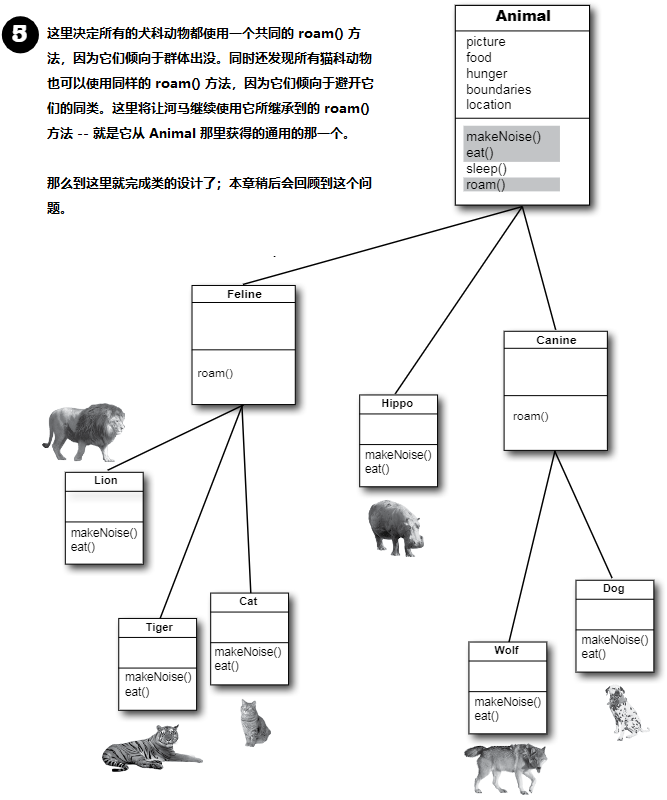
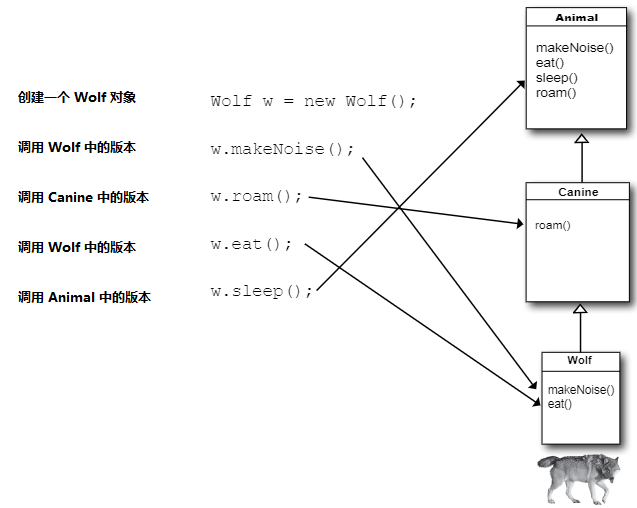

# 继承与多态：在对象村里过得更好

__打心底里就要给你的程式谋划未来__。如果有某种可以休假更多的写Java代码的方法，那这种方法价值几何呢？如果其他人可以轻易地对你写的代码进行扩展，同时还可以编写出，能够应对那些令人厌烦的最后一分钟规格变更的灵活的代码来，对于这样的方法论，你会感兴趣吗？今天就是你的幸运日，只需要花3个小时，就可以学到这有用的方法。在多态课程，将学到“改良类设计的5步法”、“多态3窍门”，以及“8招让你编写灵活代码”。还有一节额外的“运用继承的4个诀窍”课程送给你。不要犹豫，不要迟疑，掌握继承与多态，将带给你程序设计的自由，让你获得灵活编程的好处。从今天开始，就要着重于抽象（abstraction）这个话题了。


*图 1 - 继承的原理*

可以读作：“ __正方形继承自形状__ ”，“ __圆形继承自形状__ ” 等等。这里将 `rotate()` 与 `playSound()` 从其他形状中移除了，那么现在需要维护的，就只有一个拷贝了。

这里的 `Shape` 类，叫做其他四个类的 __超类（superclass）__。其他四个类就是 `Shape` 的子类。子类继承着超类的方法。换句话说， _如果`Shape`类有着某项功能，那么他的子类将自动获得同样的功能_。

## 那么对于 `Amoeba` 的 `rotate()` 又该怎么办呢？

>（Amoeba, [əˈmibə]，阿米巴虫）

对于有着完全不同的 `rotate` 与 `playSound` 行为的 `Amoeba` 形状来说，在从 `Shape` 类继承的情况下，该怎样才能有不同的行为呢？

这就是面向对象的最后一步，`Amoeba` 类对 `Shape` 类的方法，进行 __重写（override）__。如此以来，在运行时，JVM就准确地知道，在其他代码调用到 `Amoeba` 去旋转时，该执行哪一个 `rotate()` 方法了。


*图 2 - 重写方法*

## BRAIN POWER

对于家猫与老虎，以继承架构，该怎么来表示？该把家猫看成是老虎的特殊版本吗？他们中到底哪一个应该是子类，哪个应该是超类呢？又或者说他们都是另一个类的子类呢？

怎样来设计一个继承架构？哪些方法需要重写？

在翻开下一页之前，请思考一下。

## 掌握继承

__Understanding Inheritance__

在设计继承时，是将共同的代码，放在一个类中，同时告诉其他更为特定的类，这个通用的（更为抽象的）类，是他们的超类。在某个类从其他类进行继承时，那么就是 __子类从超类进行继承__。

在 Java语言中，有着 __子类对超类进行扩展__。继承关系（An inheritance relationship）的意思是，子类对超类成员的继承。在提及 “类成员” 时，意思就是实例变量与方法。

比如，`PantherMan` 是 `SuperHero`的一个子类，`PantherMan` 类就自动继承了对于所有超级英雄来说，共同的实例变量，包括 `suit`、`tights`、`specialPower`、`useSpecialPower()`等等。同时 `PantherMan`  __子类还可以加入自己新的方法和实例变量__。同时他还 __可以对其继承自超类__ `SuperHero` __的方法进行重写__。

相比 `PantherMan`, `FriedEggMan`就不需要任何独特的行为，因此他就没有重写任何的方法。此时`SuperHero`中的方法与实例变量，都还是有效的。

但 `PantherMan` 则对他的外套有着特殊要求，同时还有两种特殊的威力，因此在 `PantherMan`类中，`useSpecialPower()`和`putOnSuit()`两个方法都被重写了。

__实例变量不被重写__，因为没有必要。他们并没有定义什么特别的行为，因此子类可以赋给实例变量任何子类所需的值。`PantherMan`可以将他所继承的 `tights` 设置为紫色，同时 `FriedEggMan` 则可以设置为白色。

# 一个继承的实例

```java
public class Doctor {

    boolean worksAtHospital;

    void treatPatient () {
        // perform a checkup
    }
}
```

```java
public class FamilyDoctor extends Doctor {

    boolean makesHouseCalls;

    void giveAdvice () {
        // give homespun advice
    }
}
```

```java
public class Surgeon extends Doctor {
    
    void treatPatient () {
        // perform surgery
    }

    void makeIncision () {
        // make incision (yikes!)
    }
}
```


*图 3 - 继承实例*


## 给某个动物模拟程序设计继承树（the inheritance tree）

设想有人邀请你，设计一个让用户将一堆动物丢到某个环境中，看看到底会发生什么，这样的模拟程序。现在无需编写这个程序，而是关注与其设计。

此时已经得知了程序中会有的部分动物的清单，但这不是全部。显然每个动物都将由一个对象来表示，这些表示各种动物的对象，将在所给的环境中走动，并干一些根据各自种类而预先为其编写的行为。

_同时要让其他程序员在任何时候都能往程序里加入新种类的动物_。

首先要找出所有动物都有的那些共同的、抽象的特征，并将这些特征构建到一个所有动物类都可以对其进行扩展的类里去。


*图 4 - 找出有着共同属性与行为的那些对象*


## 使用继承来避免子类中的重复代码

这个模拟程序中有五个 ___实例变量（instance variables）___：

- `picture` -- 表示该动物的 JPEG 的文件名
- `food` -- 该动物所食用的事物的种类。现在只能有两个值：`meat` 或 `grass`
- `hunger` -- 一个表示该动物饥饿程度的整数值。这个实例变量会依据动物进食的时间（以及进食量）而变化
- `boundaries` -- 表示该动物活动范围空间的长度与宽度（比如，`640x480`）的值
- `location` -- 该动物在其空间中所在位置坐标 `X` 与 `Y` 的表示

有着四个 ___方法（methods）___:

- `makeNoise()` -- 在该动物嘶叫时的行为
- `eat()` -- 在该动物碰到其偏好的食物，也就是 `meat` 或 `grass` 时的行为
- `sleep()` -- 在该动物需要睡眠时的行为
- `roam()` -- 在动物没有进食或睡觉时的行为（或许是四处游荡去寻获事物，或者探索他的边界）

    

    *图 5 - 设计超类*


## 所有动物都是以同样方式进食吗？

这里假定对这个事都表示同意：超类中的实例变量对 __所有__ 动物都是适用的。一头狮子将有着他自己的 `picture`、`food`（也就是 `meat`）、`hunger`、`boundaries`以及`location` 的取值。一头河马则会有着其各个实例变量的不同取值，但河马仍然有着其他 `Animal` 类别的同样的那些变量。与 `Dog`、`Tiger`等相同的实例变量。但对于这些动物的 __行为（behavior）__呢？

### 到底需要重写哪些方法？

狮子会发出与狗子一样的嘶吼吗？猫咪会像河马那样进食吗？或许在你的版本中会这样，但在我们的版本中，进食与嘶叫，是特定于动物种类的（`Animal`-type-specific）。似乎无法找到一种对所有动物都适用的，编写这些方法的途径。好吧，这样说是不对的。可以这样编写 `makeNoise()` 方法，譬如说这个方法就是简单地播放一个，定义在特定动物类别中的实例变量中的声音文件，但这样处理还不够专业。一些动物在不同情形下会有不同的嘶吼（比如在进食的时候一种，在碰到天敌的时候又是一种等等）。

因此，就如同为了获得更多特定于 `Amoeba` （也就是 __独特（unique）__）的行为，`Amoeba` 对 `Shape` 类的 `rotate()` 进行重写的做法一样，这里将对 `Animal` 的子类进行同样的操作。


*图6 - 重写方法*

## 查找剩余的继承机会

__Looking for more inheritance opportunities__

现在，类的层次就逐渐形成了。前面已经让各个子类对 `eat()` 和 `makeNoise()` 方法进行了重写，因此就不会让狗子像猫咪那样叫唤（那样会让狗子和猫咪都相当气愤）。同时河马也不会像狮子那样进食了。

不过或许可以更进一步。这时就要对`Animal`的子类进行充分检视，并看看有没有两种或者更多的动物，可以某种方式组织在一起，并只为这个新的组别写特定的代码。`Wolf`与 `Dog`有着相似点；同时 `Lion`、`Tiger` 和 `Cat` 也有。


*图7 - 穷尽抽象机会*

## 完成类层次设计

__Finish the class hierarchy__

因为动物们本身就有着一个有组织的层次（整个的动物王国，种，门之类的，动物学相关），所以就可以直接套用这种分级，而令到我们的类的设计更有意义。这里就将使用生物学上的“族”（the biological "families"）概念，通过构造一个 `Feline` 类和一个 `Canine` 类，而将这些动物组织起来。



*图8 - 类设计的完成*

## 所调用的究竟是哪个方法

`Wolf` 类有四个方法。一个是从 `Animal` 类继承得来，一个是从 `Canine` （这实际上是重写了 `Animal` 的其中一个方法后的版本）继承来的，`Wolf`类本身有两个重写后的方法。在创建一个 `Wolf` 对象并将该对象赋值给某个变量后，就可以使用那个引用变量上的 `.` 运算符，去调用这四个方法了。但调用的到底是那个 _版本_ 的方法呢？



*图 9 - 继承类中方法的版本*

在调用对象引用上的某个方法时，调用的是对象类型（类）上最具体的方法版本。换个说法就是，___最低者获胜（the lowest one wins）___!

“最低”指的是在继承树（the inheritance tree）中位置最低。`Canine` 要比 `Animal` 低，而`Wolf`又要比 `Canine` 更低，因此在对某个 `Wolf` 对象上的方法进行调用时，就意味着 JVM 开始首先在 `Wolf` 类中进行查找。若JVM未能在 `Wolf` 类中找到该方法的一个版本时，他就开始沿着继承树向后移动，到发现一个匹配的方法为止。

__既然JVM是自继承树中调用方法所在的类类型（the class type），往上去查找。那么如果 JVM 始终没有找到那个方法，会怎样呢？__

无需担心这个问题。对于某个特定引用类型（类），编译器会确保其方法始终是可调用的。对于所调用的方法，在运行时究竟来自继承树上的哪个类，这个问题并不重要。以 `Wolf`这个类为例，编译器会对 `sleep()` 方法进行检查，但编译器并不会关心 `sleep()` 是在 `Animal` 类中进行定义（并从那里继承到）的。如类 __继承__ 了某个方法，那他就 __拥有__ 了这个方法。

对于编译器来说，方法在何处定义（也就是定义这个方法是哪个超类）并不重要。但在运行时， __JVM 始终会选出正确的那个__。而所谓的正确的那个，是指 __对于特定对象最为具体的版本__。

## 运用 `IS-A` 与 `HAS-A` 法则

> “浴缸是一个浴室”，或者“浴室是一个浴缸”，这样讲行的通吗？浴室和浴缸的关系，应该是归属的关系。是浴室具有浴缸。也就是说，浴室有着一个浴缸的实例变量。

前面讲到，在某个类从另一个进行了继承时，就说这个子类对超类进行了 _扩展_。在要确定某物是否要对其他东西进行扩展时，使用 `IS-A` 法则就行。

`Triangle` IS-A `Shape`，看吧，这是行得通的; `Cat` IS-A `Feline`，同样可行；`Surgeon` IS-A `Doctor`，还是没问题；而要用浴缸去拓展浴室，听起来似乎没问题，但要用一个 `IS-A` 去测试，就不行了。

要搞清楚有没有正确地设计类型，就问一下“类型A IS-A 类型B 说得通吗”？如果讲不通，那么在设计中肯定就有问题了，因此如果运用 `IS-A` 法则，那么 `Tub` IS-A `Bathroom` 明显就是错的。

那如果反过来，用 `Bathroom` 去扩展 `Tub` 又会怎样呢？仍然行不通，`Bathroom` IS-A `Tub` 并不行。

`Tub` 与 `Bathroom` __确实__ 有联系，但不是通过继承联系起来的。`Tub` 与 `Bathroom` 是由一种叫做 `HAS-A` 的关系，连接起来的。看看“`Bathroom` HAS-A `Tub`” 说得通吗？如果行，那么就是说 `Bathroom` 有着一个 `Tub` 的实例变量。也就是说，`Bathroom` 有着一个到 `Tub` 对象的引用变量，而并非 `Bathroom` 扩展了 `Tub`，或者 `Tub` 扩展了 `Bathroom`。

`IS-A`法则在继承树中 __所有地方__ 都是有效的。在继承树设计良好时，那么不论在任何时候，提出某个子类 IS-A 其任何一个超类型问题时，都是说得通的。


___在类 B 对类 A 进行了扩展时，那么类 B IS-A 类 A。这在继承树的任何地方，都是成立的。而在类 C 又对类 B 进行了继承后，那么类 C 就能同时通过对类 B 和类 A 的 IS-A 测试___。


*图 10 - IS-A 法则*
