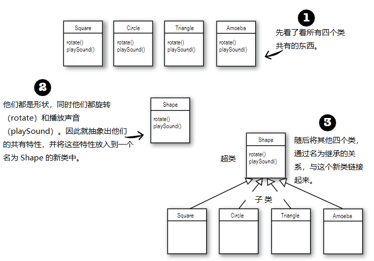
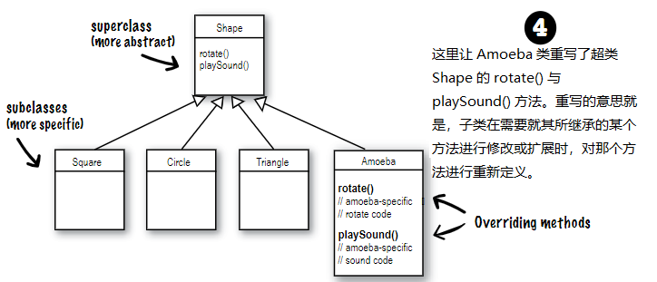
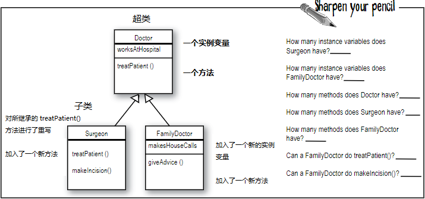
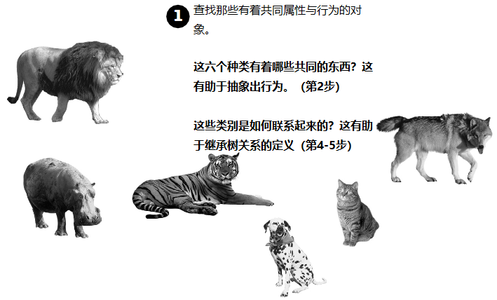
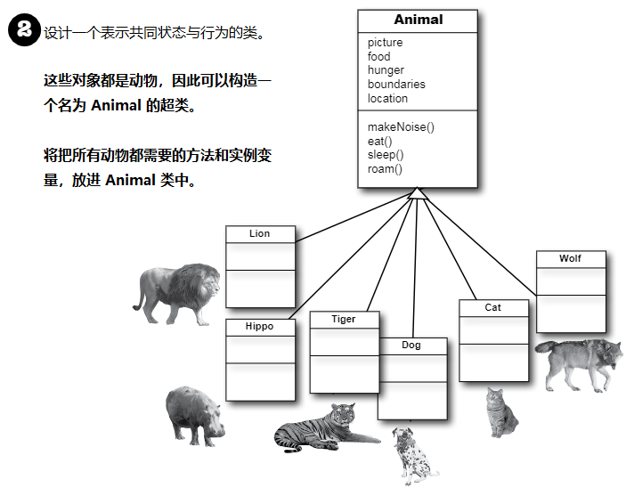
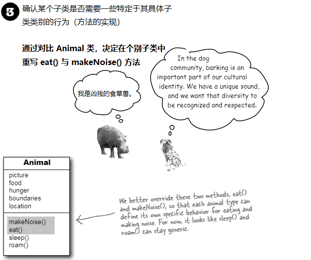
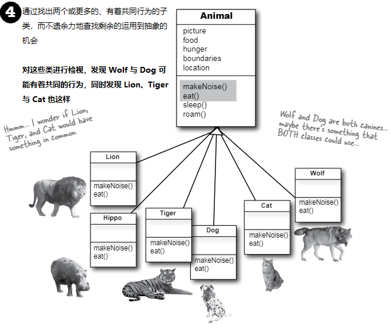

# 继承与多态：在对象村里过得更好

__打心底里就要给你的程式谋划未来__。如果有某种可以休假更多的写Java代码的方法，那这种方法价值几何呢？如果其他人可以轻易地对你写的代码进行扩展，同时还可以编写出，能够应对那些令人厌烦的最后一分钟规格变更的灵活的代码来，对于这样的方法论，你会感兴趣吗？今天就是你的幸运日，只需要花3个小时，就可以学到这有用的方法。在多态课程，将学到“改良类设计的5步法”、“多态3窍门”，以及“8招让你编写灵活代码”。还有一节额外的“运用继承的4个诀窍”课程送给你。不要犹豫，不要迟疑，掌握继承与多态，将带给你程序设计的自由，让你获得灵活编程的好处。从今天开始，就要着重于抽象（abstraction）这个话题了。



可以读作：“ __正方形继承自形状__ ”，“ __圆形继承自形状__ ” 等等。这里将 `rotate()` 与 `playSound()` 从其他形状中移除了，那么现在需要维护的，就只有一个拷贝了。

这里的 `Shape` 类，叫做其他四个类的 __超类（superclass）__。其他四个类就是 `Shape` 的子类。子类继承着超类的方法。换句话说， _如果`Shape`类有着某项功能，那么他的子类将自动获得同样的功能_。

## 那么对于 `Amoeba` 的 `rotate()` 又该怎么办呢？

>（Amoeba, [əˈmibə]，阿米巴虫）

对于有着完全不同的 `rotate` 与 `playSound` 行为的 `Amoeba` 形状来说，在从 `Shape` 类继承的情况下，该怎样才能有不同的行为呢？

这就是面向对象的最后一步，`Amoeba` 类对 `Shape` 类的方法，进行 __重写（override）__。如此以来，在运行时，JVM就准确地知道，在其他代码调用到 `Amoeba` 去旋转时，该执行哪一个 `rotate()` 方法了。



## BRAIN POWER

对于家猫与老虎，以继承架构，该怎么来表示？该把家猫看成是老虎的特殊版本吗？他们中到底哪一个应该是子类，哪个应该是超类呢？又或者说他们都是另一个类的子类呢？

怎样来设计一个继承架构？哪些方法需要重写？

在翻开下一页之前，请思考一下。

## 掌握继承

__Understanding Inheritance__

在设计继承时，是将共同的代码，放在一个类中，同时告诉其他更为特定的类，这个通用的（更为抽象的）类，是他们的超类。在某个类从其他类进行继承时，那么就是 __子类从超类进行继承__。

在 Java语言中，有着 __子类对超类进行扩展__。继承关系（An inheritance relationship）的意思是，子类对超类成员的继承。在提及 “类成员” 时，意思就是实例变量与方法。

比如，`PantherMan` 是 `SuperHero`的一个子类，`PantherMan` 类就自动继承了对于所有超级英雄来说，共同的实例变量，包括 `suit`、`tights`、`specialPower`、`useSpecialPower()`等等。同时 `PantherMan`  __子类还可以加入自己新的方法和实例变量__。同时他还 __可以对其继承自超类__ `SuperHero` __的方法进行重写__。

相比 `PantherMan`, `FriedEggMan`就不需要任何独特的行为，因此他就没有重写任何的方法。此时`SuperHero`中的方法与实例变量，都还是有效的。

但 `PantherMan` 则对他的外套有着特殊要求，同时还有两种特殊的威力，因此在 `PantherMan`类中，`useSpecialPower()`和`putOnSuit()`两个方法都被重写了。

__实例变量不被重写__，因为没有必要。他们并没有定义什么特别的行为，因此子类可以赋给实例变量任何子类所需的值。`PantherMan`可以将他所继承的 `tights` 设置为紫色，同时 `FriedEggMan` 则可以设置为白色。

# 一个继承的实例

```java
public class Doctor {

    boolean worksAtHospital;

    void treatPatient () {
        // perform a checkup
    }
}
```

```java
public class FamilyDoctor extends Doctor {

    boolean makesHouseCalls;

    void giveAdvice () {
        // give homespun advice
    }
}
```

```java
public class Surgeon extends Doctor {
    
    void treatPatient () {
        // perform surgery
    }

    void makeIncision () {
        // make incision (yikes!)
    }
}
```




## 给某个动物模拟程序设计继承树（the inheritance tree）

设想有人邀请你，设计一个让用户将一堆动物丢到某个环境中，看看到底会发生什么，这样的模拟程序。现在无需编写这个程序，而是关注与其设计。

此时已经得知了程序中会有的部分动物的清单，但这不是全部。显然每个动物都将由一个对象来表示，这些表示各种动物的对象，将在所给的环境中走动，并干一些根据各自种类而预先为其编写的行为。

_同时要让其他程序员在任何时候都能往程序里加入新种类的动物_。

首先要找出所有动物都有的那些共同的、抽象的特征，并将这些特征构建到一个所有动物类都可以对其进行扩展的类里去。




## 使用继承来避免子类中的重复代码

这个模拟程序中有五个 ___实例变量（instance variables）___：

- `picture` -- 表示该动物的 JPEG 的文件名
- `food` -- 该动物所食用的事物的种类。现在只能有两个值：`meat` 或 `grass`
- `hunger` -- 一个表示该动物饥饿程度的整数值。这个实例变量会依据动物进食的时间（以及进食量）而变化
- `boundaries` -- 表示该动物活动范围空间的长度与宽度（比如，`640x480`）的值
- `location` -- 该动物在其空间中所在位置坐标 `X` 与 `Y` 的表示

有着四个 ___方法（methods）___:

- `makeNoise()` -- 在该动物嘶叫时的行为
- `eat()` -- 在该动物碰到其偏好的食物，也就是 `meat` 或 `grass` 时的行为
- `sleep()` -- 在该动物需要睡眠时的行为
- `roam()` -- 在动物没有进食或睡觉时的行为（或许是四处游荡去寻获事物，或者探索他的边界）

    


## 所有动物都是以同样方式进食吗？

这里假定对这个事都表示同意：超类中的实例变量对 __所有__ 动物都是适用的。一头狮子将有着他自己的 `picture`、`food`（也就是 `meat`）、`hunger`、`boundaries`以及`location` 的取值。一头河马则会有着其各个实例变量的不同取值，但河马仍然有着其他 `Animal` 类别的同样的那些变量。与 `Dog`、`Tiger`等相同的实例变量。但对于这些动物的 __行为（behavior）__呢？

### 到底需要重写哪些方法？

狮子会发出与狗子一样的嘶吼吗？猫咪会像河马那样进食吗？或许在你的版本中会这样，但在我们的版本中，进食与嘶叫，是特定于动物种类的（`Animal`-type-specific）。似乎无法找到一种对所有动物都适用的，编写这些方法的途径。好吧，这样说是不对的。可以这样编写 `makeNoise()` 方法，譬如说这个方法就是简单地播放一个，定义在特定动物类别中的实例变量中的声音文件，但这样处理还不够专业。一些动物在不同情形下会有不同的嘶吼（比如在进食的时候一种，在碰到天敌的时候又是一种等等）。

因此，就如同为了获得更多特定于 `Amoeba` （也就是 __独特（unique）__）的行为，`Amoeba` 对 `Shape` 类的 `rotate()` 进行重写的做法一样，这里将对 `Animal` 的子类进行同样的操作。



## 查找剩余的继承机会

__Looking for more inheritance opportunities__

现在，类的层次就逐渐形成了。前面已经让各个子类对 `eat()` 和 `makeNoise()` 方法进行了重写，因此就不会让狗子像猫咪那样叫唤（那样会让狗子和猫咪都相当气愤）。同时河马也不会像狮子那样进食了。

不过或许可以更进一步。这时就要对`Animal`的子类进行充分检视，并看看有没有两种或者更多的动物，可以某种方式组织在一起，并只为这个新的组别写特定的代码。`Wolf`与 `Dog`有着相似点；同时 `Lion`、`Tiger` 和 `Cat` 也有。

]
