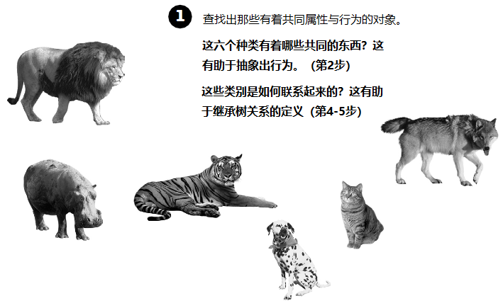
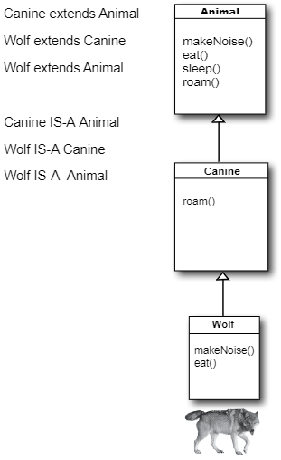
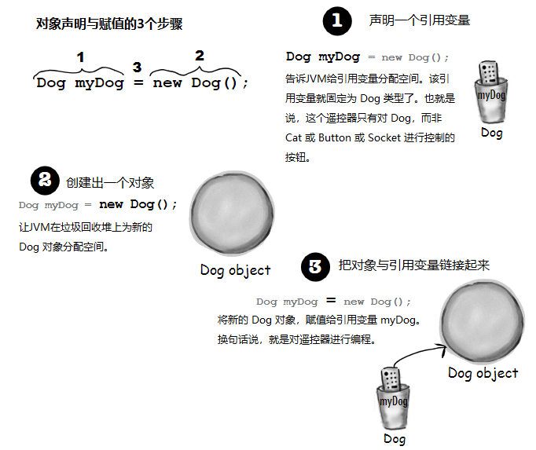
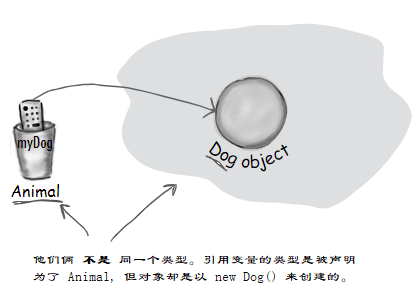
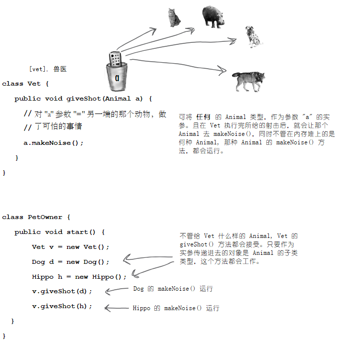
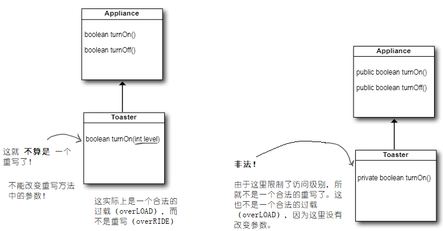

# 继承与多态：在对象村里过得更好

__打心底里就要给你的程式谋划未来__。如果有某种可以休假更多的写Java代码的方法，那这种方法价值几何呢？如果其他人可以轻易地对你写的代码进行扩展，同时还可以编写出，能够应对那些令人厌烦的最后一分钟规格变更的灵活的代码来，对于这样的方法论，你会感兴趣吗？今天就是你的幸运日，只需要花3个小时，就可以学到这有用的方法。在多态课程，将学到“改良类设计的5步法”、“多态3窍门”，以及“8招让你编写灵活代码”。还有一节额外的“运用继承的4个诀窍”课程送给你。不要犹豫，不要迟疑，掌握继承与多态，将带给你程序设计的自由，让你获得灵活编程的好处。从今天开始，就要着重于抽象（abstraction）这个话题了。


*图 1 - 继承的原理*

可以读作：“ __正方形继承自形状__ ”，“ __圆形继承自形状__ ” 等等。这里将 `rotate()` 与 `playSound()` 从其他形状中移除了，那么现在需要维护的，就只有一个拷贝了。

这里的 `Shape` 类，叫做其他四个类的 __超类（superclass）__。其他四个类就是 `Shape` 的子类。子类继承着超类的方法。换句话说， _如果`Shape`类有着某项功能，那么他的子类将自动获得同样的功能_。

## 那么对于 `Amoeba` 的 `rotate()` 又该怎么办呢？

>（Amoeba, [əˈmibə]，阿米巴虫）

对于有着完全不同的 `rotate` 与 `playSound` 行为的 `Amoeba` 形状来说，在从 `Shape` 类继承的情况下，该怎样才能有不同的行为呢？

这就是面向对象的最后一步，`Amoeba` 类对 `Shape` 类的方法，进行 __重写（override）__。如此以来，在运行时，JVM就准确地知道，在其他代码调用到 `Amoeba` 去旋转时，该执行哪一个 `rotate()` 方法了。


*图 2 - 重写方法*

## BRAIN POWER

对于家猫与老虎，以继承架构，该怎么来表示？该把家猫看成是老虎的特殊版本吗？他们中到底哪一个应该是子类，哪个应该是超类呢？又或者说他们都是另一个类的子类呢？

怎样来设计一个继承架构？哪些方法需要重写？

在翻开下一页之前，请思考一下。

## 掌握继承

__Understanding Inheritance__

在设计继承时，是将共同的代码，放在一个类中，同时告诉其他更为特定的类，这个通用的（更为抽象的）类，是他们的超类。在某个类从其他类进行继承时，那么就是 __子类从超类进行继承__。

在 Java语言中，有着 __子类对超类进行扩展__。继承关系（An inheritance relationship）的意思是，子类对超类成员的继承。在提及 “类成员” 时，意思就是实例变量与方法。

比如，`PantherMan` 是 `SuperHero`的一个子类，`PantherMan` 类就自动继承了对于所有超级英雄来说，共同的实例变量，包括 `suit`、`tights`、`specialPower`、`useSpecialPower()`等等。同时 `PantherMan`  __子类还可以加入自己新的方法和实例变量__。同时他还 __可以对其继承自超类__ `SuperHero` __的方法进行重写__。

相比 `PantherMan`, `FriedEggMan`就不需要任何独特的行为，因此他就没有重写任何的方法。此时`SuperHero`中的方法与实例变量，都还是有效的。

但 `PantherMan` 则对他的外套有着特殊要求，同时还有两种特殊的威力，因此在 `PantherMan`类中，`useSpecialPower()`和`putOnSuit()`两个方法都被重写了。

__实例变量不被重写__，因为没有必要。他们并没有定义什么特别的行为，因此子类可以赋给实例变量任何子类所需的值。`PantherMan`可以将他所继承的 `tights` 设置为紫色，同时 `FriedEggMan` 则可以设置为白色。

# 一个继承的实例

```java
public class Doctor {

    boolean worksAtHospital;

    void treatPatient () {
        // perform a checkup
    }
}
```

```java
public class FamilyDoctor extends Doctor {

    boolean makesHouseCalls;

    void giveAdvice () {
        // give homespun advice
    }
}
```

```java
public class Surgeon extends Doctor {
    
    void treatPatient () {
        // perform surgery
    }

    void makeIncision () {
        // make incision (yikes!)
    }
}
```


*图 3 - 继承实例*


## 给某个动物模拟程序设计继承树（the inheritance tree）

设想有人邀请你，设计一个让用户将一堆动物丢到某个环境中，看看到底会发生什么，这样的模拟程序。现在无需编写这个程序，而是关注与其设计。

此时已经得知了程序中会有的部分动物的清单，但这不是全部。显然每个动物都将由一个对象来表示，这些表示各种动物的对象，将在所给的环境中走动，并干一些根据各自种类而预先为其编写的行为。

_同时要让其他程序员在任何时候都能往程序里加入新种类的动物_。

首先要找出所有动物都有的那些共同的、抽象的特征，并将这些特征构建到一个所有动物类都可以对其进行扩展的类里去。



*图 4 - 找出有着共同属性与行为的那些对象*


## 使用继承来避免子类中的重复代码

这个模拟程序中有五个 ___实例变量（instance variables）___：

- `picture` -- 表示该动物的 JPEG 的文件名
- `food` -- 该动物所食用的事物的种类。现在只能有两个值：`meat` 或 `grass`
- `hunger` -- 一个表示该动物饥饿程度的整数值。这个实例变量会依据动物进食的时间（以及进食量）而变化
- `boundaries` -- 表示该动物活动范围空间的长度与宽度（比如，`640x480`）的值
- `location` -- 该动物在其空间中所在位置坐标 `X` 与 `Y` 的表示

有着四个 ___方法（methods）___:

- `makeNoise()` -- 在该动物嘶叫时的行为
- `eat()` -- 在该动物碰到其偏好的食物，也就是 `meat` 或 `grass` 时的行为
- `sleep()` -- 在该动物需要睡眠时的行为
- `roam()` -- 在动物没有进食或睡觉时的行为（或许是四处游荡去寻获事物，或者探索他的边界）

    

    *图 5 - 设计超类*


## 所有动物都是以同样方式进食吗？

这里假定对这个事都表示同意：超类中的实例变量对 __所有__ 动物都是适用的。一头狮子将有着他自己的 `picture`、`food`（也就是 `meat`）、`hunger`、`boundaries`以及`location` 的取值。一头河马则会有着其各个实例变量的不同取值，但河马仍然有着其他 `Animal` 类别的同样的那些变量。与 `Dog`、`Tiger`等相同的实例变量。但对于这些动物的 __行为（behavior）__ 呢？

### 到底需要重写哪些方法？

狮子会发出与狗子一样的嘶吼吗？猫咪会像河马那样进食吗？或许在你的版本中会这样，但在我们的版本中，进食与嘶叫，是特定于动物种类的（`Animal`-type-specific）。似乎无法找到一种对所有动物都适用的，编写这些方法的途径。好吧，这样说是不对的。可以这样编写 `makeNoise()` 方法，譬如说这个方法就是简单地播放一个，定义在特定动物类别中的实例变量中的声音文件，但这样处理还不够专业。一些动物在不同情形下会有不同的嘶吼（比如在进食的时候一种，在碰到天敌的时候又是一种等等）。

因此，就如同为了获得更多特定于 `Amoeba` （也就是 __独特（unique）__）的行为，`Amoeba` 对 `Shape` 类的 `rotate()` 进行重写的做法一样，这里将对 `Animal` 的子类进行同样的操作。


*图6 - 重写方法*

## 查找剩余的继承机会

__Looking for more inheritance opportunities__

现在，类的层次就逐渐形成了。前面已经让各个子类对 `eat()` 和 `makeNoise()` 方法进行了重写，因此就不会让狗子像猫咪那样叫唤（那样会让狗子和猫咪都相当气愤）。同时河马也不会像狮子那样进食了。

不过或许可以更进一步。这时就要对`Animal`的子类进行充分检视，并看看有没有两种或者更多的动物，可以某种方式组织在一起，并只为这个新的组别写特定的代码。`Wolf`与 `Dog`有着相似点；同时 `Lion`、`Tiger` 和 `Cat` 也有。


*图7 - 穷尽抽象机会*

## 完成类层次设计

__Finish the class hierarchy__

因为动物们本身就有着一个有组织的层次（整个的动物王国，种，门之类的，动物学相关），所以就可以直接套用这种分级，而令到我们的类的设计更有意义。这里就将使用生物学上的“族”（the biological "families"）概念，通过构造一个 `Feline` 类和一个 `Canine` 类，而将这些动物组织起来。


*图8 - 类设计的完成*

## 所调用的究竟是哪个方法

`Wolf` 类有四个方法。一个是从 `Animal` 类继承得来，一个是从 `Canine` （这实际上是重写了 `Animal` 的其中一个方法后的版本）继承来的，`Wolf`类本身有两个重写后的方法。在创建一个 `Wolf` 对象并将该对象赋值给某个变量后，就可以使用那个引用变量上的 `.` 运算符，去调用这四个方法了。但调用的到底是那个 _版本_ 的方法呢？


*图 9 - 继承类中方法的版本*

在调用对象引用上的某个方法时，调用的是对象类型（类）上最具体的方法版本。换个说法就是，___最低者获胜（the lowest one wins）___!

“最低”指的是在继承树（the inheritance tree）中位置最低。`Canine` 要比 `Animal` 低，而`Wolf`又要比 `Canine` 更低，因此在对某个 `Wolf` 对象上的方法进行调用时，就意味着 JVM 开始首先在 `Wolf` 类中进行查找。若JVM未能在 `Wolf` 类中找到该方法的一个版本时，他就开始沿着继承树向后移动，到发现一个匹配的方法为止。

__既然JVM是自继承树中调用方法所在的类类型（the class type），往上去查找。那么如果 JVM 始终没有找到那个方法，会怎样呢？__

无需担心这个问题。对于某个特定引用类型（类），编译器会确保其方法始终是可调用的。对于所调用的方法，在运行时究竟来自继承树上的哪个类，这个问题并不重要。以 `Wolf`这个类为例，编译器会对 `sleep()` 方法进行检查，但编译器并不会关心 `sleep()` 是在 `Animal` 类中进行定义（并从那里继承到）的。如类 __继承__ 了某个方法，那他就 __拥有__ 了这个方法。

对于编译器来说，方法在何处定义（也就是定义这个方法是哪个超类）并不重要。但在运行时， __JVM 始终会选出正确的那个__。而所谓的正确的那个，是指 __对于特定对象最为具体的版本__。

## 运用 `IS-A` 与 `HAS-A` 法则

> “浴缸是一个浴室”，或者“浴室是一个浴缸”，这样讲行的通吗？浴室和浴缸的关系，应该是归属的关系。是浴室具有浴缸。也就是说，浴室有着一个浴缸的实例变量。

前面讲到，在某个类从另一个进行了继承时，就说这个子类对超类进行了 _扩展_。在要确定某物是否要对其他东西进行扩展时，使用 `IS-A` 法则就行。

`Triangle` IS-A `Shape`，看吧，这是行得通的; `Cat` IS-A `Feline`，同样可行；`Surgeon` IS-A `Doctor`，还是没问题；而要用浴缸去拓展浴室，听起来似乎没问题，但要用一个 `IS-A` 去测试，就不行了。

要搞清楚有没有正确地设计类型，就问一下“类型A IS-A 类型B 说得通吗”？如果讲不通，那么在设计中肯定就有问题了，因此如果运用 `IS-A` 法则，那么 `Tub` IS-A `Bathroom` 明显就是错的。

那如果反过来，用 `Bathroom` 去扩展 `Tub` 又会怎样呢？仍然行不通，`Bathroom` IS-A `Tub` 并不行。

`Tub` 与 `Bathroom` __确实__ 有联系，但不是通过继承联系起来的。`Tub` 与 `Bathroom` 是由一种叫做 `HAS-A` 的关系，连接起来的。看看“`Bathroom` HAS-A `Tub`” 说得通吗？如果行，那么就是说 `Bathroom` 有着一个 `Tub` 的实例变量。也就是说，`Bathroom` 有着一个到 `Tub` 对象的引用变量，而并非 `Bathroom` 扩展了 `Tub`，或者 `Tub` 扩展了 `Bathroom`。

`IS-A`法则在继承树中 __所有地方__ 都是有效的。在继承树设计良好时，那么不论在任何时候，提出某个子类 IS-A 其任何一个超类型问题时，都是说得通的。


___在类 B 对类 A 进行了扩展时，那么类 B IS-A 类 A。这在继承树的任何地方，都是成立的。而在类 C 又对类 B 进行了继承后，那么类 C 就能同时通过对类 B 和类 A 的 IS-A 测试___。



*图 10 - IS-A 法则*

对于上图中的继承树，就可以说 “`Wolf` 扩展了 `Animal`” 或 “`Wolf` IS-A `Animal`”。就算`Animal`是`Wolf`超类的超类，也是没有影响的。事实上， ___只要`Animal` 位于`Wolf`所在的继承树上部的某处，那么 `Wolf` IS-A `Animal` 这个判断，就始终是正确的。___

这个 `Animal` 继承树的结构，向外界通告：

“`Wolf` IS-A `Canine`，因此 `Wolf` 可以干 `Canine` 能干的那些事。同时 `Wolf` IS-A `Animal`, 因此 `Wolf` 也可以干 `Animal` 能干的事。”

就算 `Wolf` 重写了 `Animal` 或 `Canine` 的一些方法，对此也没有影响。外界（其他代码）所知的，就是 `Wolf` 可以执行这四种方法。至于`Wolf`怎样去执行，或者说 ___这些方法在哪个类中被重写的___，无关紧要。某个 `Wolf` 可以 `makeNoise()`、`eat()`、`sleep()`及`roam()`，因为`Wolf`是扩展`Animal`得来的。

## 怎么判断继承设计是正确的

显然目前所探讨的还有欠缺，好在后续会深入了解面向对象的问题。此时我们知道，运用 `IS-A`测试是一条不错的准则。如果 “X IS-A Y”讲得通，那么这两个类就应该位处同一个继承层次上。这种可能性，就在于他们有着同样的或重叠的行为表现。

___划重点，IS-A 关系仅在一个方向上有效___！

`Triangle` IS-A `Shape` 讲得通，因此可以用 `Triangle` 去扩展 `Shape`。

但反过来，`Shape` IS-A `Triangle`，就说不通了，因此 `Shape`就不能对 `Triangle` 进行拓展。`IS-A`关系，表示在 `X IS-A Y`时，`X`就能完成`Y`能干的事（甚至更多）。

__既然子类可以继承超类的某个方法，那么超类想要使用子类版本的这个方法时，会怎样呢__？

超类是没有必要了解其子类的任何一点的。在你编写完某个类后，就会有人沿用这个类，并对其进行扩展，此时你所编写的那个类，就成了超类。尽管作为这个超类的作者的你，想要了解（或使用）这个类中某个方法的子类版本，也是做不到的，并不存在 __逆向（reverse）__ 或者说 __向后（backwards）__ 的继承。试想一下，孩子从父母那里继承，而不是反过来吧。

__可以在子类中同时使用某个方法的超类版本与子类的这个方法的重写版本吗？也就是说，在不想完全替换该方法的超类版本，而只想对其进行补充时，该怎么办呢？__

这是可以做到的！__同时这也是一个重要的设计特性（an important design feature）__。这正是 “扩展” 一词的本义所在，是“要对超类功能进行扩展”的体现。

```java
public void roam () {
    super.roam ();
    // 它自己的 游荡 行为
}
```

上面的代码首先调用了继承到的 `roam()` 版本，随后再回到特定于子类的代码。

在设计超类方法时，虽然超类的各个子类会往这些方法“追加”代码，同样可以在超类的这些方法中，包含所有子类都适用的方法实现。在子类重写某个方法时，就可以使用关键字 `super`，来调用超类版本的这个方法。这样写就像是说，“先运行超类版本，然后回来继续完成子类自己的代码..._”。

## 怎样知道子类可以从超类继承到哪些东西

子类对超类的成员加以继承。到目前为止，这些成员包括了实例变量与方法，后续会涉及其他被继承的成员。通过为成员设定不同的访问级别，超类是可以对其子类所要继承的成员加以选择的（A subclass inherits members of the superclass. Members include instance variables and methods, although later in this book we'll look at other inherited members. A superclass can choose whether or not it wants a subclass to inherit a particular member by the level of access the particular member is given）。

本书中将涉及以下四个访问级别。从严到宽，这四个级别分别是：

`private`、`default`、`protected`、 `public`

**这些访问级别，控制了 *哪些对谁可见***，这对具备良好设计、健壮的 Java 代码来说至关重要。现阶段只关注 `public` 与 `private`。他们两的规则较为简单：

- `public` 成员是继承得来的
- `private` 成员不是继承得来的


在子类继承到某个成员时，那么这个成员 __就好像是子类自己定义的一样__。在 `Shape` 的示例中，`Square`继承了 `rotate()` 与 `playSound()` 两个方法，而对于外界（其他代码）而言，就是 `Square` 有着这两个方法而已。

某个类的成员，包括在这个类中所定义的变量与方法，加上这个类从他的超类所继承到的全部成员。

> 注意：有关 `default` 与 `protected` 的细节，将在第 17 章及附录 B中涉及。

## 正确运用继承，杜绝滥用


下面的这些规则背后的缘由，要在后续章节才会揭示，现在只需了解，几条简单的规则，就可以助力构建良好的继承设计。

- 在某个类确实是某个超类的更具体类型时，才使用继承。比如 `Willow` 是 `Tree` 的一个更具体的类型，因此 `Willow`对 `Tree` 进行扩展是讲得通的。

- 存在确实可以在同一通用类型的多个类之间共用的行为表现（方法的实现代码）时，要考虑使用继承。比如，`Square`、`Circle`、`Triangle` 都需要 `rotate()` 与 `playSound()`，因此将这两个功能放入到 `Shape` 中就讲得通。不过要留意，尽管 __继承作为面向对象编程的关键特性之一__，但对于代码重用这个目的，继承却不是必要的。继承带你进入面向对象编程的世界，而且通常也是正确的设计选择，然而真正能让你见识到更多巧妙与灵活设计的，则是那些设计模式（Be aware, however, that while inheritance is one of the key features of object-oriented programming, it's not neccessarily the best way to achieve behavior reuse. It'll get you started, and often it's the right design choice, but design patterns will help you see other more subtle and flexible options）。若你对设计模式没有了解，那么可以看看另一本书 “*Head First Design Patterns*”。

- 超类与子类之间的关系，违背了上面两条规则时，不要仅为了重用另一个类的代码，而使用继承。比如设想在已经编写好 `Alarm` 类中的打印代码后，又要编写 `Piano` 类的打印代码，于是就让 `Piano` 去继承 `Alarm`，目的是让`Piano`继承到这些打印代码。这样做毫无意义！因为某个`Piano`并不是`Alarm`的更为具体的类型（正确的做法，应该把打印代码放在一个 `Printer`的类中，如此所有可打印对象，都可以通过一种 `HAS-A` 关系而得到打印功能）。

- 在子类与超类无法通过 `IS-A` 测试时，不使用继承。要一直询问，子类究竟是不是超类的更具体类型。比如，`Tea` IS-A `Beverage` 讲得通。`Beverage` IS-A `Tea` 就不行。


## 本章重点


- 子类对超类进行扩展
- 子类继承到超类的所有 `public` 实例变量与方法，对超类的`private`实例变量和方法，不予继承
- 继承到的方法可被重写；而实例变量则不能被重写（尽管实例变量可在子类中被重新定义，但与重写相比不是一回事，同时机会也完全没有这样做的必要）
- 使用 `IS-A`测试来对继承层次进行有效性验证。若 `X` 对 `Y` 进行了扩展，那么 `X` IS-A `Y` 必须能说得通
- `IS-A`关系只在一个方向上有效。某个 `Hippo` 是一个 `Animal`，但并非所有 `Animal` 都是 `Hippo`s
- 在子类中重写了某个方法，且这个方法于此子类的某个对象中被调用到时，所调用的是重写后的版本（__最低者入选法则__）
- 在类 `B` 扩展了类 `A`，同时类 `C`扩展了类`B`的情况下，那么类 `B` IS-A 类`A`，同时类 `C` IS-A 类`B`，此外类`C` IS-A 类`A`

## 继承带来的好处

掌握了具备继承的设计之后，离面向对象的目标就不远了（You get a lot of OO mileage by designing with inheritance）。通过将一组类中共用的行为抽象出来，放入到超类中，就可以解决重复代码的问题。这样做还有另一个好处，就是在需要修改这些共用代码时，只需要在一个地方去更新这些共用代码，并且 *代码的改变，会神奇地在所有继承了这些代码的类中反应出来*。当然，这里并没有什么魔法，而是相当简单：做出修改，然后重新编译那个超类。这就完了。__完全不需要去动那些子类__！

__只需投放新修改的超类，所有对超类进行了扩展的那些子类，就会自动使用新的版本了__。

因为一个Java程序，只是一堆的类而已，因此无需对子类进行编译，就能使用上新版本的超类。同时超类并不会破坏子类的任何东西，所以一切都相安无事（后续章节会讨论到在这种语境下，“破坏”的意义。目前来讲，可以设想一下，比如对超类中子类所依赖的某个特定方法的参数或返回值，或者方法的名称的修改）。


- 避免了重复代码

    将共用代码放在了一起，并让子类从超类继承这些代码。在要修改某个行为时，只需在一个地方进行修改，这时所有子类都能看到修改。

- 给一组类定义了共用的协议

## 继承可以确保组织在某个特定超类型之下的所有类，拥有那个超类型所拥有的全部方法

__Inheritance lets you guarantee that all classes grouped under a certain supertype hava all the methods that the supertype has__

> 在提及 “全部方法” 时，指的是 “全部可继承的方法”，目前实际上是指，“所有`public`方法”，不过后面会对这个定义做进一步修订

也就是说，通过继承，给一组相关的类定义了一个共用的协议（In other words, you define a common protocol for a set of class related through inheritance）。

在定义超类中可被子类们继承的那些方法时，就是在向其他代码通告某种协议，像是在说 “我的所有子类型（也就是子类）可以下面这些方法，完成这些事情...”。

换句话说，就是建立了一个 *合约（contract）*。

类 `Animal` 为所有 `Animal` 的子类型，建立了这样一个共用协议：

| Animal |
| :- |
| makeNoise()<br>eat()<br>sleep()<br>roam()<br> |

需要注意的时，当提及 *所有 `Animal`* 时，指的是 `Animal` *以及所有扩展了 `Animal` 的类*。还指的是 *所有的在继承层次中，可往上追溯到 `Animal` 的类*。

对于 OO 中真正精彩的部分，还远未涉及，因为我们把其中最好的东西 -- *多态（polymorphism）* 留在了最后。

在为一组类定义超类型的时候，*在用到超类型的所有地方，那个超类型的所有子类，都可以被取代（any subclass of that supertype can be substituted where the supertype is expected）*。

然而这句话到底是什么意思呢？

不要着急，现在还不能把这句话解释清楚。


- **为何要了解多态**

    因为可以利用上多态的优势


- **多态为什么重要**

    因为可以使用一个声明为超类型的引用变量，去引用某个子类的对象（refer to a subclass object using a reference declared as the supertype）


- **这又到底意味着什么呢**

    意味着可以编写出真正灵活的代码来。代码更加干净（更高效、简单）。不仅开发起来更容易，同时扩展起来也要容易得多，以先前写代码得经验来看，运用多态这种方式，是你所无法想象的。

    这样就意味着，当你的同事忙着更新程序时，你还可以加勒比海享受假期，而你的同事们甚至不需要你的源码。

    在下一页就能了解到多态的原理。


___要了解多态的原理，就要回顾一下声明引用变量和创建对象的寻常方式___。



*图 11 - 常规的引用变量与对象创建方式*

__要点时引用变量的类型 _与_ 对象的类型，是一致的__。

在这个示例中，他们都是 `Dog`。

__有了多态，引用变量与对象，就可以不同__。

```java
Animal myDog = new Dog();
```



*图 12 - 多态 - 引用变量与其对象具有不同的类型*

__运用多态特性，引用变量的类型，可以是实际对象的类型的超类__。

在声明某个引用变量时，可以通过引用变量的类型的 `IS-A` 测试的所有对象，都可以赋值给那个引用变量。换个说法，就是所有扩展了所声明的引用变量类型的类的对象，都可以赋值给该引用变量。 __这可以让我们能够完成建立多态的数组等操作（This lets you do things like make polymorphism arrays）__。

__一个实例可以更好的帮你理解这句话__。


*图 13 - 多态下的数组*

__除了上面两个特性，多态还有更多用法__！

__可以在方法中，使用多态的参数和返回值类型__。

声明比如 `Animal` 这样的超类型（supertype）引用变量，并将某个子类，比如`Dog`的对象赋值给他，是可以的。设想把这个引用变量作为方法的参数时，会怎样......



__运用多态特性，可以编写出无需修改，就可以引入新的子类类型的代码__。

就像上面示例中的 `Vet` 类一样，在将 `Vet` 类编写为使用声明为 `Animal` 类型的参数之后，这段代码就可以处理所有 `Animal` 的子类了。这就意味着有人要用到这个 `Vet` 类时，只要确保他们的新 `Animal` 类型，是扩展类 `Animal` 得来的就可以了。就算类 `Vet` 对那些`Vet`要处理的、新的 `Animal` 子类型一无所知，`Vet` 的那些方法仍然会工作。

## 思考题

为什么多态一定就可以这样运作？为什么就可以一直假定，所有子类类型都正好有这些在他们之上调用的方法（也就是在超类的引用变量上使用`.`运算符）？

## 答疑

- __在设计子类时，存在层级的限制吗？最多有多少的层级呢？__

    
> 在深入研究 Java API之后，就会发现多数的继承层次，都是宽泛的，而不是很深的继承。大多数都只有一到两级的继承，不过也有例外（尤其是在 GUI 的那些类中）。后续你发现，让继承树保持浅薄而不是浓密，更有意义，不过在继承深度上时没有硬性限制的（起码一般情况下不会触及到这个限制）。

- __刚想到一个问题，在拿不到某个类源码的情况下，仍打算修改那个类中某个方法，可以对那个类进行子类操作来实现这个目的吗？也就是对那个“差” 类进行扩展，并用自己改进的代码来重写某个方法__。

> 当然可以，这正是 OO 的特色之一，还可以避免从头开始去重写某个类，或者去找那个隐藏代码的程序员。

- __不论什么类都可以扩展吗？或者说像类的成员一样，在类为 `private` 时，就不能继承到他......__


> 除了在非常特殊的情况下，有一种现在还没有见过的，叫做 *内部* 类（an *inner* class）之外，是不存在 `private` 私有类的。有三种阻止某个类被子类化操作的办法：

> - 第一个叫做访问控制。虽然类不能用 `private` 标注，但某个类可以是非公开的（non-public，只要不将类声明为 `public`就能得到）。非公开类只能在该类所在包中进行子类化操作。在其他包中就无法对非公开类进行子类操作（甚至无法使用）。

> - 第二种，就是使用 `final` 关键字。`final` 修饰的类，表示这个类已经是继承线（the inheritance line）的末端了。没有人可以再对 `final` 类进行扩展。

> - 第三，若某个类仅有 `private` 的构造器，那么他就是不能被子类的（The third issue is that if a class has only `private` constructors, it can't be subclassed）。

- __设置 `final` 类的目的何在？阻止某个类被子类化能带来哪些好处呢？__


> 通常情况下，不需要将类设置为 `final`。但在需要考虑安全 -- 确保类中的那些方法一直按照编写的方式工作（由于某些原因不能被重写）时，使用 `final` 类就可以做到。Java API中的很多类，都是因为这个原因，而被设置为 `final`。比如 `String` 类就是 `final` 的，之所以这样做，你可以想象一些有人贸然去修改 `String` 的行为，将会带来多大的灾难。

- __可以不将整个类设置为 `final`，而只将某个方法设置为 `final`吗__ ？


> 可以将某个特定方法使用 `final` 修饰符标记起来，从而把那个方法保护起来，防止被重写。将整个类都标记为 `final`的话，就可以保证那个类中所有方法都不能被重写。


## 遵守约定：重写时要遵循的一些规则

在对来自超类的某个方法进行重写时，前提就是要合乎约定（When you override a method from superclass, you're agreeing to fulfill the contract）。约定是什么呢，举例来说，“没有参数，且返回一个逻辑值”。换句话说，所重写方法中，外部世界所能看到的参数与返回值类型，必须要与超类中所重写的方法一致。

__方法即合约__。

在应用了多态的情况下，来自 `Appliance` 的 `Toaster` 版的重写方法，在运行时就必须工作。要记住，编译器通过引用变量的类型，来判断是否能够调用那个引用变量上的某个特定方法。在某个 `Appliance` 对象，是对某个 `Toaster` 的引用时，那么编译器就只关心类 `Appliance` 有无在那个 `Appliance`对象引用上的被调用到的方法。但在运行时，JVM所查看的，则不是在引用变量的类型（`Appliance`）上，而是在内存堆中确切的 `Toaster` 对象上，有无那个方法。因此即使编译器已经证实该方法调用，决定方法能够工作的，仍然是所重写的方法，是否有着同样的参数与返回值类型。否则，就会出现某人在 `Appliance` 引用变量上调用不带参数地调用 `turnOn()` 方法，而`Toaster`中的`turnOn()`版本，却有着一个 `int` 的参数的情况。那么这个时候运行时会调用到哪个方法呢？`Appliance` 中的那个。也就是说，__在 `Toaster` 中的那个 `turnOn()` 方法，是不算作重写的__！

- 1. 方法的参数必须一致，而返回值类型则必须是兼容的。

    超类的合约，对外部代码如何去使用某个方法，进行了定义。超类以什么做参数，重写方法的子类都要使用同样的参数。同时超类声明了一个什么样的返回值，重写的方法也必须要么同样类型，要么是 __原类型的子类类型（type, the subclass type）__ 的返回值。要记住，子类对象是要保证能够完成其超类所声明的任何事情的，因此在期望返回超类的地方，返回子类是安全的。

- 2. 方法可访问性，不能降低（The method can't be less accssible）。

    这说的是，方法的访问级别必须一致，或者更为友好（That means the access level must be the same, or friendlier）。也就是说，在对某个 `public` 方法进行重写时，不能将其标注为 `private`。这样对调用该方法的代码来说，本来调用的是一个 `public` 的方法（在编译时），却在运行时因为重写版本是一个私有方法，而突然被 JVM 关上了访问之门时，会是多么的懵逼！

    到现在为止，我们所知的有两个访问级别：`private` 与 `public`。在部署章节（发布代码）和附录 B 还有两个访问级别。同时还有一条与例外处理相关的方法重写规则，只能在有关例外的那章里来说了。

    

    *图 15 - 方法重写时的两条规则*


## 方法的过载（Overloading a method）

方法的过载，名字一样，参数清单不同的两个方法。仅此而已。对于过载的方法，实际上不涉及到多态！

借助过载特性，可以实现方法的带有不同参数清单的多个版本，从而方便不同的调用者。比如有个只取用整数的方法时，调用代码在对其进行调用之前，就不得不将先将他的双精度数转换成整数。而在将该方法以另一个取用双精度数的版本对其进行过载后，对于这个调用者就容易多了。在对象生命周期那一章，将更多地了解过载。

因为方法过载特性打破了由超类所定义的多态约定，因此过载的方法有着更多的灵活性。

***本质上看，过载方法是有着相同方法名称的一个不同方法。与继承和多态没有半毛钱关系。过载方法与重写方法不一样***。

1. 返回值类型可以不同。

既然参数清单不同了，那么也就可以随意改变过载方法中的返回值类型了。

2. 不能只改变返回值类型。

在只改变返回值类型时，就不再是有效的过载了 -- 编译器会假定是在重写方法。除非返回值类型是超类方法中声明的返回值类型的子类型，这样做甚至不能算合法。要对某个方法进行过载，就必须修改参数清单，之后就可以随便修改返回值类型了。

3. 可以随意改变过载方法的访问级别（提升或降低都是可以的）

可以限制更高的方法，去过载某个方法。因为新方法没有义务去满足被过载方法的约定，因此是无所谓的。


__方法过载的合法示例__：


```java
public class Overloads {
    String uniqueID;

    public int addNums ( int a, int b ) {
        return a + b;
    }

    public double addNums (double a, double b) {
        return a + b;
    }

    public void setUniqueID (String theID) {
        // 一大堆验证代码，然后：
        uniqueID = theID;
    }

    public void setUniqueID (int ssNumber) {
        String numString = "" + ssNumber;
        setUniqueID(numString);
    }
}
```

