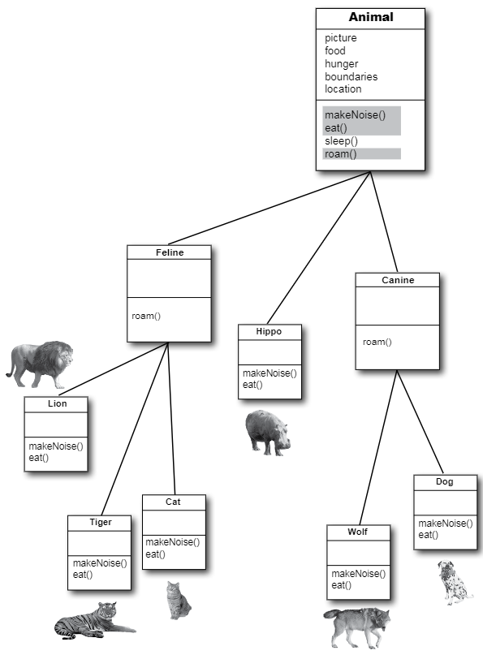

# 接口与抽象类

__继承只开了个头__。为运用好多态，就需要使用接口（interfaces, 不是GUI中的界面）。需要超越简单继承，通过按照接口规范，来设计和编写代码，才能获得间距灵活性与扩展性的水平。Java中最酷炫的部分，在不使用接口的情况下，是达不到的。所以就算你在设计Java程序时拒绝使用接口，但你仍避免不了接口的使用。__你会明白没有接口，是无法生存的__。那么接口到底是什么呢？他是一个 100% 的抽象类。而什么又是抽象类呢？是一个无法初始化的类。有什么好处呢？很快就能看到。回顾一下上一张的结尾，通过使用多态参数，就可以让 `Vet` 中仅仅一个方法，就能够处理所有类型的 `Animal` 子类，而那仅仅只是冰山一角而已。接口就是多态（polymorphism）中的 __多（poly）__。抽象（abstract）中的 __象（ab）__。是 Java 国的 __咖啡因（caffine）__。

__在设计 `Animal` 继承树时，是不是遗漏了什么__？

这个类结构并没有什么毛病。通过设计，让重复代码降到了最低水平，同时也已经重写了那些应该有着特定子类实现的方法。从多态角度上看，因为可以使用 `Animal`参数（以及 `Animal` 的数组声明），来设计出使用到 `Animal` 类的程序，因此可以说已经很不错且灵活了，从而所有 `Animal` 的子类型 -- *包括在编写代码时想象不到的* -- 在运行时都可以传递进去并得到使用。还已经把所有 `Animal`s 的共用协议（就是那四个希望外部世界知道的所有 `Animal`s 都有的方法），放入到了 `Animal` 超类中，同时也已准备好生成新的狮子、老虎以及河马了。



*图 1 - Animal 继承树*

__我们可以这样说__：

```java
Wolf aWolf = new Wolf ();
```


*图 2 - 对象与对象的引用变量类型相同时*

__也可以这样说__：


```java
Animal aHippo = new Hippo ();
```


*图 3 - 对象与其引用变量的类型不同时*


__但如果像下面这样，就会显得令人费解__：

```java
Animal anim = new Animal ();
```


*图 4 - 创建出一个 Animal 对象时*


__ 一个 `new Animal()` 对象会是怎样的__ ？


*图 5 - 一些可怕的对象*

__那些实例变量的值，都是些什么呀__？

***有些类就不应该被实例化***！

去创建一个 `Wolf` 对象、一个 `Hippo` 对象，或者一个 `Tiger` 对象，这些都说得通，但一个 `Animal` 对象到底是个什么东西？它的形状是怎样？是什么颜色的？有多大？有几条腿......

尝试去创建一个 `Animal` 类型的对象，就好像 __星际迷航中噩梦般的传输机故障__。

怎样才能解决这个问题呢？为了实现继承和多态，`Animal`类肯定是需要的。但又要其他程序员只能对那些，`Animal`的不那么抽象的子类，而不是`Animal`本身进行初始化。我们要的是 `Tiger` 对象与 `Lion` 对象，而 *不是 `Animal` 对象*。

好在有这么一种简单的方法，来防止某个类不被初始化。也就是通过将类标记为 `abstract`，从而阻止人们在他前面说 `new`，之后编译器就会在任何时候、任何地方，把那些试图创建那个类型实例的举动，拦截下来。

仍可以将抽象类型，作为引用变量的类型使用。实际上这正是抽象类存在的首要原因（将抽象类用作多态参数或返回值的类型，或者用于构造多态数组）。

在设计类继承层次结构时，就面临着确定哪些是抽象类、哪些是具体的问题（When you're designing your class inheritance stucture, you have to decide which classes are *abstract* and which are *concrete*）。具体类是那些足够具体、可被初始化的类。某个具体类，就应该是可以构造出其对象的类。

要构造一个抽象类是很简单的 -- 将关键字 `abstract` 放在类的声明前面：

```java
abstract class Canine extends Animal {
    public void roam () {}
}
```

__编译器会阻止对某个抽象类的初始化__


抽象类意味着无人能构造出他的新实例。但仍然可以出于多态目的，将其用作某个引用变量声明中的类型，由于编译器会确保抽象类不会被初始化，因此就无需担心有人构建出抽象类类型的对象来。

```java
abstract public class Canine extends Animal {
    public void roam () {}
}
```

```java
public class MakeCanine {
    public void go () {
        Canine c;
        c = new Dog ();
        c = new Canine ();
        c.roam();
    }
}
```


这个时候编译器就会报错：

```console
Canine is abstract; cannot be initiated
```

抽象类在未被扩展时，实质上毫无用处、不会有取值、没有目的。

> 其中一个例外是，抽象类可以有静态成员，在 IO 那一章会涉及这个问题。

使用到抽象类时，在运行时真正做事的，是那些抽象类的子类的实例。

## 关于“抽象”与“具体”

不是抽象的类，就叫做 *具体（concrete）* 类。在 `Animal` 继承树中，是将 `Animal`、`Canine` 与 `Feline` 作为抽象类，将 `Hippo`、`Wolf`、`Dog`、`Tiger`、`Lion`及`Cat`作为具体类的。


*图 6 - `Animal` 继承树上的抽象和具体类*

通读 Java API 文档，就会发现很多的抽象类，尤其是在 GUI库中。那么某个GUI组件看起来是怎样的呢？所谓GUI组件类， 是指诸如按钮、文本框、滚动条、对话框等等这样的GUI相关的众多类的超类。比如在构建一个 `JButton`时，并没有构建这个通用组件的实例并把实例放在屏幕上的。而是对组件的一个具体子类进行实例化，绝不会对组件本身进行实例化。

## 抽象与具体（abstract or concrete）？

什么时候类应该是抽象的？__酒（Wine）__ 大概就是抽象的。但 __红葡萄就（Red）__ 和 __白葡萄酒（White）__ 呢？大概率也是抽象的（至少对部分人是这样的）。那到底在继承体系中的什么地方，其中的事物才成为具体的呢？

是将 `PinotNoir` 设置为具体，还是同样作为抽象呢？看起来 “1997年份的骆驼庄园黑皮葡萄酒（the Camelot Vineyards 1997 Pinot Noir）” 好像是具体的，但又怎么确定呢？

再看看上面的 `Animal` 继承树。再给各个类安排具体和抽象时，到底恰当吗？是不是要对这个`Animal`继承树加以改进呢（而不是仅仅添加更多的动物）？

## 抽象方法

除了可以将类标记为 `abstract`，也可以将方法标记为 `abstract`。抽象类意味着那个类必须被扩展；而抽象方法，则是那个方法必须被 __重写（be *overridden*）__；对于抽象类中的部分（或全部）行为/方法，可能断定他们不被抽象类的更具体子类实现时，会毫无用处（You might decide that some (or all) behaviors in an abstract class don't make any sense unless they're implemented by a more specific subclass）。简单地说，对于抽象类的各个子类，任何通用方法实现都没有价值。设想一下，一个通用的 `eat()` 方法，到底会是什么样子？

__抽象方法，是没有函数体的__！

现在既然已经断定抽象方法中的代码不会有任何意义，那么就没有必要再加上函数体了。因此就没有了那一对花括弧了 -- 那么就只需用分号结束抽象函数的声明即可。

```java
public abstract void eat();
```


*图 7 - 没有函数体的抽象方法*

__在声明了一个抽象方法后，就必须把其所在的类也标记为 `abstract`。在非抽象类中，是不能有抽象方法的__。

其中只要有一个抽象方法，那么那个类就必须是抽象类。但在抽象类中，是可以同时有抽象与非抽象方法的。

## 答疑

- 抽象方法有什么意义？我所知的是抽象类的意义在于，可把那些由各个子类继承的共用代码放在抽象类中。

    将那些可被继承的方法实现（也就是带有确切方法体的那些方法），放在超类中，确实是不错的做法。那只是在这些代码确实能被子类使用到的时候。但通常的情况是，这些方法实现，并不总是能用到，因为基本设想不到那些子类可以利用上的通用代码呀。抽象方法的意义就在于，就算不放入任何确切代码，任意可以为一组子类型（子类）定义出 *协议（protocol）*。


- 为什么说这样做就好呢？

    就是为了多态！别忘了，我们所需要的，是将超类作为方法参数与返回值类型，或者数组类型。这样就可以在不必重新编写新的方法的情况下，加入很多新的子类型。设想如果不将 `Animal` 超类型（supertype）作为 `Vet` 中各个方法的参数类型，那么后续对 `Vet` 的修改将会多么麻烦。那就不得不给所有 `Animal` 的每个子类一个单独方法！一个用于 `Lion`，一个用于`Wolf`，一个用于......，明白了吧。那么现在就可以使用抽象方法，就是说“这个类型的所有类型，都有这个方法”。多态的好处，就在这里啦。

## 所有抽象方法，都必须被实现

__对抽象方法的实现，就如同方法的重写一样__。

抽象方法没有方法体；他们仅是为了多态而存在。这就意味着继承树中最开始的具体类，必须实现 *所有* 抽象方法。

同样可以通过将自己要编写的类设置为抽象类，来将编写实现代码的责任推给其他人。在示例中 `Animal` 与 `Canine` 两个都是抽象的，因此他们都有抽象方法，类 `Canine` 就没有实现那些来自 `Animal` 的方法。不过只要到了最开始的具体类的地方，比如 `Dog`，那么这个子类就必须实现 *所有* 的同时来自 `Animal` 与 `Canine` 的抽象方法了。

在提及 “必须实现抽象方法”时，说的就是 *必须提供一个方法体*。那就意味着必须在具体类中，使用同样的方法签名（method signature, 即方法的名字与参数），以及与抽象方法中所声明的返回值类型兼容的返回值类型，创建出一个非抽象的方法来。该方法其他剩余部分则没有要求。Java所关心的，只是在具体类中，要有这么一个方法。

## 实战多态

这里假设尚不知道Java库中的 `ArrayList` 类，而需要要编写一个保存 `Dog` 对象的清单类。作为第一步，就只给这个清单类一个 `add()` 方法。这里将使用一个 `Dog` 数组 （`Dog []`） 来保存所加入的 `Dog` 对象，同时给定其长度为 `5`。若达到了 5 个 `Dog` 对象的限制，那么虽然仍旧可以调用 `add()` 方法，但不会有任何效果。在尚未达到限制时，`add()` 方法将把所给的`Dog`对象，放入到下一个可用的索引位置，之后对下一个可用索引（`nextIndex`）加一。

__构造自己的 `Dog` 专用清单__

（或许这是世上最糟糕的从头开始构建类似于`ArrayList`类的尝试）


*图 8 - 第一版的自制对象清单*

__哦吼，现在还需要保存 `Cat`s 了__

现在有这么几个选择：

1. 再单独构建一个类，`MyCatList`，来保存 `Cat` 的那些对象。这就相当笨拙。

2. 仅构建一个类，`DogAndCatList`，其中有两个不同的数组，作为实例变量，同时还有不同的 `add()` 方法：`addCat(Cat c)` 与 `addDog(Dog d)`。这也是一个笨拙的方法。

3. 构造一个可以接收所有 `Animal` 子类（就目前这种需求规格修改为要添加 `Cat`s来看，后面肯定还会有其他种类的动物要往里面添加）的、具异质性的 `AnimalList` 类。这当然是最好的方案了。那么就着手将这个类修改成更具通用性、可以接收所有 `Animal` 而不仅是 `Dog`s 的类吧。其中的关键修改，已被标记出来了（代码逻辑没有变，只是把代码中所有的 `Dog` 修改成了 `Animal`）。

__构建自己的`Animal`专用清单__


*图 9 - 第二版的 Animal 清单*

运行结果：

```java
$ java -jar target/com.xfoss.learningJava-0.0.1.jar
Animal added at 0.
Animal added at 1.
```


__对于不是 `Animal` 的对象呢? 为什么不构造一个可接收所有东西的通用类呢__ ？


你可能猜到了要做的是什么。这里就要将数组类型，与 `add()` 方法的参数类型，一并修改为`Animal` 类 *之上（above）* 的某个东西。某个比 `Animal` *更* 通用的、更为抽象的东西。然而怎么才能做到呢？毕竟示例中的 `Animal` 之上，已经没有超类了呀。

再一次，也许我们可以......

还记得`ArrayList`的那些方法吗？看看 `remove`、`contains`以及 `indexOf` 这些方法，他们都使用到一个类型为.....的对象，是的，那就是 `Object`！

***Java 中的所有类，都是对类 `Object` 的扩展***。

类 `Object` 是所有类的始祖；他是万事万物的超类。

尽管运用了多态，但还必须创建一个有着接收和返回多态类型方法的类。如果在Java中缺少这么一个可以作为万物始祖的超类，那么Java程序员就无法创建出有着可以接收定制类型，*那些他们在编写类似 `ArrayList` 这样的类时无法想象到的各种各样的类型* ，的方法的各种类来（Even if you take advantage of polymorphism, you still have to create a class with methods that take and return your polymorphic type. Without a common superclass for everything in Java, there'd be no way for the developers of Java to create classes with methods that could take your custom types... *types they never knew about when they wrote the ArrayList class*）。

因此实际上在不知情的情况下，从一开始就已经在构造类 `Object` 的子类了。 ***你所编写的每一个类，都是对 `Object` 的扩展***，尽管没有提到 `Object`。但可以看着像是下面这个样子：

```java
public class Dog extends Object {}
```

等一下，`Dog` 不是已经扩展了 `Canine` 了吗？好吧，编译器将让 `Canine` 去扩展 `Object`，然而 `Canine`又是扩展的 `Animal`。还是没问题，这个时候编译器又会去让 `Animal` 对 `Object` 进行扩展。

__所有的没有显式扩展另一个类的类，都是隐式地扩展了 `Object`。__ 

那么，因为 `Dog` 扩展了 `Canine`，他就不算是直接扩展了 `Object`（但他还是间接扩展了 `Object`），对于 `Canine`，也是这样的，不过`Animal`则是直接扩展了 `Object`。


*图 10 - 第三版的数组列表 -- ArrayList*


__那么在这个超超元类的 `Object` 中究竟有些什么呢__ ？

*So what's in this ultra-super-megaclass `Object`* ?

假如你是Java，那么你会希望每个对象都有些什么行为（方法）呢？ 嗯...，来查一下吧，一个可以检查两个对象是否相等的方法如何？一个可以获取到对象的确切类类型的方法怎样？或许有那么一个可以获取到对象的哈希码的方法，从而可以在哈希表中去使用到对象会更好（关于Java的哈希表，会在第16章中涉及）；哦，还有一个更不错的，可以打印出对象字符串讯息的方法。

就好像施了魔法一样，类 `Object` 确实有着实现这四个目的的方法。虽然他还有着其他方法，但这里只关注这四个。


*图 11 - 所有类都会继承到类 Object 的那些方法*

## 答疑

- __类 `Object` 是抽象类吗__ ？

> 不是。这不是通常意义上的抽象类（Well，not in the formal Java sense anyway）。由于 `Object`具有可被所有类继承、且开箱即用的方法实现代码，因此他是非抽象类。


- __那么可以重写 `Object`中的这些方法吗__ ？

> 可以重写其中一些。但有些方法是被标记为 `final`的，因此就不能对其进行重写。对于 `hashCode()`、`equals()`及`toString()`三个方法，是强烈建议进行重写的，本书后面会叫你怎么去重写他们。对于另一些代码，比如`getClass()`，他们就必须以特定的、有保证的方式运作。


- __既然 `ArrayList` 的那些方法，对于使用 `Object` 已经足够通用，那写 `ArrayList<DotCom>` 又有什么意义呢？是将 `ArrayList`限制为只能保存 `DotCom` 对象的意思吗__ ？

> 那确实是在对其进行限制。在 Java 5.0 版本之前，`ArrayList`就是无法施加限制的。不过时至今日，在Java 5.0中，通过 `ArrayList<Object>` 这种方式对其进行限制，已成为必须的了。`ArrayList<Object>` 的意思，就是 __一个被限制为属于对象的任何东西的 `ArrayList`__ ，也就是Java中从任何类类型初始化得来的任何对象。后面会讨论到这种新的  `<type>` 语法。

- __好的，回到类 `Object` 作为非抽象的问题上（那么我猜那意味着他是具体的），我们该 *怎样* 构造出一个 `Object` 的对象？ 那样做不就和构建一个 `Animal` 的对象一样古怪了吗__ ？

> 不错的问题！确实有构造 `Object` 实例的需求。在有的时候，就是只需要一个作为对象使用的通用对象。也就是一个 *轻量级（lightweight）* 对象。就目前所知，`Object`类型的实例最常用在线程同步上（将在第15章涉及，By far, the most common use of an instance of type `Object` is for thread synchronization）。现在可以不管这个，只需知道即使可以构造出 `Object` 的对象，也很少会用到这个。

- __那么可以说 `Object` 类型的主要目的，就是用作多态下的参数和返回值类型，就像是在 `ArrayList`中那样吗__ ？

> `Object`类的主要目的有两个：其一是对于那些需要处理自己或其他人编写的所有类的方法，作为他们的多态类型；再者就是，为Java中所有对象，提供给他们在运行时所需要的方法代码（把这些代码都放在类 `Object`中，那么所有类都能继承到这些代码）。在 `Object`中的一些重要方法与线程相关，在本书的后面会看到。

- __既然使用多态类型有这么多好处，那为什么不把 *所有* 方法都做成接收和返回 `Object` 类型呢__ ？

> 呃......想想这样做会发生什么。那样肯定会完全破坏“类型安全”（For one thing, you would defeat the whole point of 'type-safty'），而“类型安全”正是Java语言中，对代码的最大保护机制。Java的类型安全机制，确保不会在计划的对象类型之外，请求到其他对象类型。比如，让一个 `Ferrari` （以为是一个 `Toaster`）去烤面包。
> 事实上即使在各处使用了 `Object` 类型的引用变量，也不必担心会出现热烘烘的`Ferrari`情形。因为当那些类型是由 `Object` 引用变量类型表示时，Java 就会将其视为类型 `Object` 的一个实例变量。那么就只能调用类 `Object` 中声明的那些方法！所以假如这样写代码：

```java
Object o = new Ferrari ();
o.goFast (); // 这是非法的！
```

> 这样的代码甚至无法通过编译器检查。
> Java作为强类型语言，其编译器将就所调用对象的某个方法，看这个对象是否实际有能力响应，进行检查（Because Java is a strongly-typed language, the compiler checks to make sure that you're calling a method on an object ）。也就是说，在调用某个对象引用变量上的方法时，只能调用该引用类型确实有的方法。在后续章节，会详细讨论Java的“类型安全”特性，所以即使现在还不是很明白，也没有关系。

## 使用多态的`Object`类型的引用变量的代价

在开始将类型`Object`用于所有超灵活参数级返回值之前，需要考虑一些将类型 `Object`作为参数使用时的一些小问题。同时记住这里不会涉及构造类型`Object`实例；这里讲的是构造其他类型的实例，而只是使用类型`Object`做引用变量（we're talking about making instances of some other type, but using a reference of type `Object`）。

在将某个对象放入 `ArrayList<Dog>`时，是作为 `Dog`被放入进去的，同时取出来时也是一个 `Dog`:

```java
ArrayList<Dog> myDogArrayList = new ArrayList<Dog>;

Dog aDog = new Dog ();
myDogArrayList.add (aDog);
Dog d = myDogArrayList.get(0);
```

而如果将其声明为了 `ArrayList<Object>` 时，会怎样呢？在要构造一个名义上要保存任何种类的`Object`的 `ArrayList`时，就可以这样声明：

```java
ArrayList<Object> myDogArrayList = new ArrayList<Object>;
Dog aDog = new Dog();
myDogArrayList.add(aDog);
```

但在尝试获取这个`Dog`对象，并将其赋值给一个 `Dog` 的引用变量时，会怎样呢？

```java
Dog d = myDogArrayList.get(0);
```

> 这样是行不通的。这不会被编译！！ 在使用`ArrayList<Object>`时，那么 `get()` 方法将返回类型 `Object`。编译器知道对象是从`Object`继承的（在其继承树的某处），但不知道对象就是 `Dog`！！

***所有从 `ArrayList<Object>` 中出来的东西，都是作为类型 `Object` 的一个引用变量，而不管他原本是个什么样的对象，或者在将其加入到清单时他的引用变量类型是什么***。


*图 12 - `ArrayList<Object>`对象的存入与取出*


