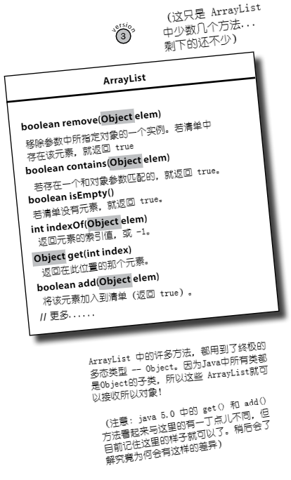
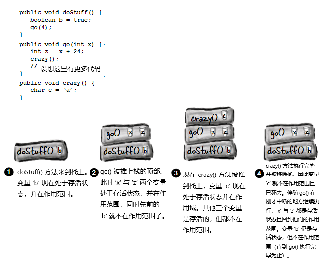

# 接口与抽象类

__继承只开了个头__。为运用好多态，就需要使用接口（interfaces, 不是GUI中的界面）。需要超越简单继承，通过按照接口规范，来设计和编写代码，才能获得间距灵活性与扩展性的水平。Java中最酷炫的部分，在不使用接口的情况下，是达不到的。所以就算你在设计Java程序时拒绝使用接口，但你仍避免不了接口的使用。__你会明白没有接口，是无法生存的__。那么接口到底是什么呢？他是一个 100% 的抽象类。而什么又是抽象类呢？是一个无法初始化的类。有什么好处呢？很快就能看到。回顾一下上一张的结尾，通过使用多态参数，就可以让 `Vet` 中仅仅一个方法，就能够处理所有类型的 `Animal` 子类，而那仅仅只是冰山一角而已。接口就是多态（polymorphism）中的 __多（poly）__。抽象（abstract）中的 __象（ab）__。是 Java 国的 __咖啡因（caffine）__。

__在设计 `Animal` 继承树时，是不是遗漏了什么__？

这个类结构并没有什么毛病。通过设计，让重复代码降到了最低水平，同时也已经重写了那些应该有着特定子类实现的方法。从多态角度上看，因为可以使用 `Animal`参数（以及 `Animal` 的数组声明），来设计出使用到 `Animal` 类的程序，因此可以说已经很不错且灵活了，从而所有 `Animal` 的子类型 -- *包括在编写代码时想象不到的* -- 在运行时都可以传递进去并得到使用。还已经把所有 `Animal`s 的共用协议（就是那四个希望外部世界知道的所有 `Animal`s 都有的方法），放入到了 `Animal` 超类中，同时也已准备好生成新的狮子、老虎以及河马了。


*图 1 - Animal 继承树*

__我们可以这样说__：

```java
Wolf aWolf = new Wolf ();
```


*图 2 - 对象与对象的引用变量类型相同时*

__也可以这样说__：


```java
Animal aHippo = new Hippo ();
```


*图 3 - 对象与其引用变量的类型不同时*


__但如果像下面这样，就会显得令人费解__：

```java
Animal anim = new Animal ();
```


*图 4 - 创建出一个 Animal 对象时*


__ 一个 `new Animal()` 对象会是怎样的__ ？


*图 5 - 一些可怕的对象*

__那些实例变量的值，都是些什么呀__？

***有些类就不应该被实例化***！

去创建一个 `Wolf` 对象、一个 `Hippo` 对象，或者一个 `Tiger` 对象，这些都说得通，但一个 `Animal` 对象到底是个什么东西？它的形状是怎样？是什么颜色的？有多大？有几条腿......

尝试去创建一个 `Animal` 类型的对象，就好像 __星际迷航中噩梦般的传输机故障__。

怎样才能解决这个问题呢？为了实现继承和多态，`Animal`类肯定是需要的。但又要其他程序员只能对那些，`Animal`的不那么抽象的子类，而不是`Animal`本身进行初始化。我们要的是 `Tiger` 对象与 `Lion` 对象，而 *不是 `Animal` 对象*。

好在有这么一种简单的方法，来防止某个类不被初始化。也就是通过将类标记为 `abstract`，从而阻止人们在他前面说 `new`，之后编译器就会在任何时候、任何地方，把那些试图创建那个类型实例的举动，拦截下来。

仍可以将抽象类型，作为引用变量的类型使用。实际上这正是抽象类存在的首要原因（将抽象类用作多态参数或返回值的类型，或者用于构造多态数组）。

在设计类继承层次结构时，就面临着确定哪些是抽象类、哪些是具体的问题（When you're designing your class inheritance stucture, you have to decide which classes are *abstract* and which are *concrete*）。具体类是那些足够具体、可被初始化的类。某个具体类，就应该是可以构造出其对象的类。

要构造一个抽象类是很简单的 -- 将关键字 `abstract` 放在类的声明前面：

```java
abstract class Canine extends Animal {
    public void roam () {}
}
```

__编译器会阻止对某个抽象类的初始化__


抽象类意味着无人能构造出他的新实例。但仍然可以出于多态目的，将其用作某个引用变量声明中的类型，由于编译器会确保抽象类不会被初始化，因此就无需担心有人构建出抽象类类型的对象来。

```java
abstract public class Canine extends Animal {
    public void roam () {}
}
```

```java
public class MakeCanine {
    public void go () {
        Canine c;
        c = new Dog ();
        c = new Canine ();
        c.roam();
    }
}
```


这个时候编译器就会报错：

```console
Canine is abstract; cannot be initiated
```

抽象类在未被扩展时，实质上毫无用处、不会有取值、没有目的。

> 其中一个例外是，抽象类可以有静态成员，在 IO 那一章会涉及这个问题。

使用到抽象类时，在运行时真正做事的，是那些抽象类的子类的实例。

## 关于“抽象”与“具体”

不是抽象的类，就叫做 *具体（concrete）* 类。在 `Animal` 继承树中，是将 `Animal`、`Canine` 与 `Feline` 作为抽象类，将 `Hippo`、`Wolf`、`Dog`、`Tiger`、`Lion`及`Cat`作为具体类的。


*图 6 - `Animal` 继承树上的抽象和具体类*

通读 Java API 文档，就会发现很多的抽象类，尤其是在 GUI库中。那么某个GUI组件看起来是怎样的呢？所谓GUI组件类， 是指诸如按钮、文本框、滚动条、对话框等等这样的GUI相关的众多类的超类。比如在构建一个 `JButton`时，并没有构建这个通用组件的实例并把实例放在屏幕上的。而是对组件的一个具体子类进行实例化，绝不会对组件本身进行实例化。

## 抽象与具体（abstract or concrete）？

什么时候类应该是抽象的？__酒（Wine）__ 大概就是抽象的。但 __红葡萄就（Red）__ 和 __白葡萄酒（White）__ 呢？大概率也是抽象的（至少对部分人是这样的）。那到底在继承体系中的什么地方，其中的事物才成为具体的呢？

是将 `PinotNoir` 设置为具体，还是同样作为抽象呢？看起来 “1997年份的骆驼庄园黑皮葡萄酒（the Camelot Vineyards 1997 Pinot Noir）” 好像是具体的，但又怎么确定呢？

再看看上面的 `Animal` 继承树。再给各个类安排具体和抽象时，到底恰当吗？是不是要对这个`Animal`继承树加以改进呢（而不是仅仅添加更多的动物）？

## 抽象方法

除了可以将类标记为 `abstract`，也可以将方法标记为 `abstract`。抽象类意味着那个类必须被扩展；而抽象方法，则是那个方法必须被 __重写（be *overridden*）__；对于抽象类中的部分（或全部）行为/方法，可能断定他们不被抽象类的更具体子类实现时，会毫无用处（You might decide that some (or all) behaviors in an abstract class don't make any sense unless they're implemented by a more specific subclass）。简单地说，对于抽象类的各个子类，任何通用方法实现都没有价值。设想一下，一个通用的 `eat()` 方法，到底会是什么样子？

__抽象方法，是没有函数体的__！

现在既然已经断定抽象方法中的代码不会有任何意义，那么就没有必要再加上函数体了。因此就没有了那一对花括弧了 -- 那么就只需用分号结束抽象函数的声明即可。

```java
public abstract void eat();
```


*图 7 - 没有函数体的抽象方法*

__在声明了一个抽象方法后，就必须把其所在的类也标记为 `abstract`。在非抽象类中，是不能有抽象方法的__。

其中只要有一个抽象方法，那么那个类就必须是抽象类。但在抽象类中，是可以同时有抽象与非抽象方法的。

## 答疑

* 抽象方法有什么意义？我所知的是抽象类的意义在于，可把那些由各个子类继承的共用代码放在抽象类中。

    将那些可被继承的方法实现（也就是带有确切方法体的那些方法），放在超类中，确实是不错的做法。那只是在这些代码确实能被子类使用到的时候。但通常的情况是，这些方法实现，并不总是能用到，因为基本设想不到那些子类可以利用上的通用代码呀。抽象方法的意义就在于，就算不放入任何确切代码，任意可以为一组子类型（子类）定义出 *协议（protocol）*。


* 为什么说这样做就好呢？

    就是为了多态！别忘了，我们所需要的，是将超类作为方法参数与返回值类型，或者数组类型。这样就可以在不必重新编写新的方法的情况下，加入很多新的子类型。设想如果不将 `Animal` 超类型（supertype）作为 `Vet` 中各个方法的参数类型，那么后续对 `Vet` 的修改将会多么麻烦。那就不得不给所有 `Animal` 的每个子类一个单独方法！一个用于 `Lion`，一个用于`Wolf`，一个用于......，明白了吧。那么现在就可以使用抽象方法，就是说“这个类型的所有类型，都有这个方法”。多态的好处，就在这里啦。

## 所有抽象方法，都必须被实现

__对抽象方法的实现，就如同方法的重写一样__。

抽象方法没有方法体；他们仅是为了多态而存在。这就意味着继承树中最开始的具体类，必须实现 *所有* 抽象方法。

同样可以通过将自己要编写的类设置为抽象类，来将编写实现代码的责任推给其他人。在示例中 `Animal` 与 `Canine` 两个都是抽象的，因此他们都有抽象方法，类 `Canine` 就没有实现那些来自 `Animal` 的方法。不过只要到了最开始的具体类的地方，比如 `Dog`，那么这个子类就必须实现 *所有* 的同时来自 `Animal` 与 `Canine` 的抽象方法了。

在提及 “必须实现抽象方法”时，说的就是 *必须提供一个方法体*。那就意味着必须在具体类中，使用同样的方法签名（method signature, 即方法的名字与参数），以及与抽象方法中所声明的返回值类型兼容的返回值类型，创建出一个非抽象的方法来。该方法其他剩余部分则没有要求。Java所关心的，只是在具体类中，要有这么一个方法。

## 实战多态

这里假设尚不知道Java库中的 `ArrayList` 类，而需要要编写一个保存 `Dog` 对象的清单类。作为第一步，就只给这个清单类一个 `add()` 方法。这里将使用一个 `Dog` 数组 （`Dog []`） 来保存所加入的 `Dog` 对象，同时给定其长度为 `5`。若达到了 5 个 `Dog` 对象的限制，那么虽然仍旧可以调用 `add()` 方法，但不会有任何效果。在尚未达到限制时，`add()` 方法将把所给的`Dog`对象，放入到下一个可用的索引位置，之后对下一个可用索引（`nextIndex`）加一。

__构造自己的 `Dog` 专用清单__

（或许这是世上最糟糕的从头开始构建类似于`ArrayList`类的尝试）


*图 8 - 第一版的自制对象清单*

__哦吼，现在还需要保存 `Cat`s 了__

现在有这么几个选择：

1) 再单独构建一个类，`MyCatList`，来保存 `Cat` 的那些对象。这就相当笨拙。

2) 仅构建一个类，`DogAndCatList`，其中有两个不同的数组，作为实例变量，同时还有不同的 `add()` 方法：`addCat(Cat c)` 与 `addDog(Dog d)`。这也是一个笨拙的方法。

3) 构造一个可以接收所有 `Animal` 子类（就目前这种需求规格修改为要添加 `Cat`s来看，后面肯定还会有其他种类的动物要往里面添加）的、具异质性的 `AnimalList` 类。这当然是最好的方案了。那么就着手将这个类修改成更具通用性、可以接收所有 `Animal` 而不仅是 `Dog`s 的类吧。其中的关键修改，已被标记出来了（代码逻辑没有变，只是把代码中所有的 `Dog` 修改成了 `Animal`）。

__构建自己的`Animal`专用清单__


*图 9 - 第二版的 Animal 清单*

运行结果：

```java
$ java -jar target/com.xfoss.learningJava-0.0.1.jar
Animal added at 0.
Animal added at 1.
```


__对于不是 `Animal` 的对象呢? 为什么不构造一个可接收所有东西的通用类呢__ ？


你可能猜到了要做的是什么。这里就要将数组类型，与 `add()` 方法的参数类型，一并修改为`Animal` 类 *之上（above）* 的某个东西。某个比 `Animal` *更* 通用的、更为抽象的东西。然而怎么才能做到呢？毕竟示例中的 `Animal` 之上，已经没有超类了呀。

再一次，也许我们可以......

还记得`ArrayList`的那些方法吗？看看 `remove`、`contains`以及 `indexOf` 这些方法，他们都使用到一个类型为.....的对象，是的，那就是 `Object`！

***Java 中的所有类，都是对类 `Object` 的扩展***。

类 `Object` 是所有类的始祖；他是万事万物的超类。

尽管运用了多态，但还必须创建一个有着接收和返回多态类型方法的类。如果在Java中缺少这么一个可以作为万物始祖的超类，那么Java程序员就无法创建出有着可以接收定制类型，*那些他们在编写类似 `ArrayList` 这样的类时无法想象到的各种各样的类型* ，的方法的各种类来（Even if you take advantage of polymorphism, you still have to create a class with methods that take and return your polymorphic type. Without a common superclass for everything in Java, there'd be no way for the developers of Java to create classes with methods that could take your custom types... *types they never knew about when they wrote the ArrayList class*）。

因此实际上在不知情的情况下，从一开始就已经在构造类 `Object` 的子类了。 ***你所编写的每一个类，都是对 `Object` 的扩展***，尽管没有提到 `Object`。但可以看着像是下面这个样子：

```java
public class Dog extends Object {}
```

等一下，`Dog` 不是已经扩展了 `Canine` 了吗？好吧，编译器将让 `Canine` 去扩展 `Object`，然而 `Canine`又是扩展的 `Animal`。还是没问题，这个时候编译器又会去让 `Animal` 对 `Object` 进行扩展。

__所有的没有显式扩展另一个类的类，都是隐式地扩展了 `Object`。__ 

那么，因为 `Dog` 扩展了 `Canine`，他就不算是直接扩展了 `Object`（但他还是间接扩展了 `Object`），对于 `Canine`，也是这样的，不过`Animal`则是直接扩展了 `Object`。




*图 10 - 第三版的数组列表 -- ArrayList*


__那么在这个超超元类的 `Object` 中究竟有些什么呢__ ？

*So what's in this ultra-super-megaclass `Object`* ?

假如你是Java，那么你会希望每个对象都有些什么行为（方法）呢？ 嗯...，来查一下吧，一个可以检查两个对象是否相等的方法如何？一个可以获取到对象的确切类类型的方法怎样？或许有那么一个可以获取到对象的哈希码的方法，从而可以在哈希表中去使用到对象会更好（关于Java的哈希表，会在第16章中涉及）；哦，还有一个更不错的，可以打印出对象字符串讯息的方法。

就好像施了魔法一样，类 `Object` 确实有着实现这四个目的的方法。虽然他还有着其他方法，但这里只关注这四个。


*图 11 - 所有类都会继承到类 Object 的那些方法*

## 答疑

* __类 `Object` 是抽象类吗__ ？

> 不是。这不是通常意义上的抽象类（Well，not in the formal Java sense anyway）。由于 `Object`具有可被所有类继承、且开箱即用的方法实现代码，因此他是非抽象类。


* __那么可以重写 `Object`中的这些方法吗__ ？

> 可以重写其中一些。但有些方法是被标记为 `final`的，因此就不能对其进行重写。对于 `hashCode()`、`equals()`及`toString()`三个方法，是强烈建议进行重写的，本书后面会叫你怎么去重写他们。对于另一些代码，比如`getClass()`，他们就必须以特定的、有保证的方式运作。


* __既然 `ArrayList` 的那些方法，对于使用 `Object` 已经足够通用，那写 `ArrayList<DotCom>` 又有什么意义呢？是将 `ArrayList`限制为只能保存 `DotCom` 对象的意思吗__ ？

> 那确实是在对其进行限制。在 Java 5.0 版本之前，`ArrayList`就是无法施加限制的。不过时至今日，在Java 5.0中，通过 `ArrayList<Object>` 这种方式对其进行限制，已成为必须的了。`ArrayList<Object>` 的意思，就是 __一个被限制为属于对象的任何东西的 `ArrayList`__ ，也就是Java中从任何类类型初始化得来的任何对象。后面会讨论到这种新的  `<type>` 语法。

* __好的，回到类 `Object` 作为非抽象的问题上（那么我猜那意味着他是具体的），我们该 *怎样* 构造出一个 `Object` 的对象？ 那样做不就和构建一个 `Animal` 的对象一样古怪了吗__ ？

> 不错的问题！确实有构造 `Object` 实例的需求。在有的时候，就是只需要一个作为对象使用的通用对象。也就是一个 *轻量级（lightweight）* 对象。就目前所知，`Object`类型的实例最常用在线程同步上（将在第15章涉及，By far, the most common use of an instance of type `Object` is for thread synchronization）。现在可以不管这个，只需知道即使可以构造出 `Object` 的对象，也很少会用到这个。

* __那么可以说 `Object` 类型的主要目的，就是用作多态下的参数和返回值类型，就像是在 `ArrayList`中那样吗__ ？

> `Object`类的主要目的有两个：其一是对于那些需要处理自己或其他人编写的所有类的方法，作为他们的多态类型；再者就是，为Java中所有对象，提供给他们在运行时所需要的方法代码（把这些代码都放在类 `Object`中，那么所有类都能继承到这些代码）。在 `Object`中的一些重要方法与线程相关，在本书的后面会看到。

* __既然使用多态类型有这么多好处，那为什么不把 *所有* 方法都做成接收和返回 `Object` 类型呢__ ？

> 呃......想想这样做会发生什么。那样肯定会完全破坏“类型安全”（For one thing, you would defeat the whole point of 'type-safty'），而“类型安全”正是Java语言中，对代码的最大保护机制。Java的类型安全机制，确保不会在计划的对象类型之外，请求到其他对象类型。比如，让一个 `Ferrari` （以为是一个 `Toaster`）去烤面包。
> 事实上即使在各处使用了 `Object` 类型的引用变量，也不必担心会出现热烘烘的`Ferrari`情形。因为当那些类型是由 `Object` 引用变量类型表示时，Java 就会将其视为类型 `Object` 的一个实例变量。那么就只能调用类 `Object` 中声明的那些方法！所以假如这样写代码：

```java
Object o = new Ferrari ();
o.goFast (); // 这是非法的！
```

> 这样的代码甚至无法通过编译器检查。
> Java作为强类型语言，其编译器将就所调用对象的某个方法，看这个对象是否实际有能力响应，进行检查（Because Java is a strongly-typed language, the compiler checks to make sure that you're calling a method on an object ）。也就是说，在调用某个对象引用变量上的方法时，只能调用该引用类型确实有的方法。在后续章节，会详细讨论Java的“类型安全”特性，所以即使现在还不是很明白，也没有关系。

## 使用多态的`Object`类型的引用变量的代价

在开始将类型`Object`用于所有超灵活参数级返回值之前，需要考虑一些将类型 `Object`作为参数使用时的一些小问题。同时记住这里不会涉及构造类型`Object`实例；这里讲的是构造其他类型的实例，而只是使用类型`Object`做引用变量（we're talking about making instances of some other type, but using a reference of type `Object`）。

在将某个对象放入 `ArrayList<Dog>`时，是作为 `Dog`被放入进去的，同时取出来时也是一个 `Dog`:

```java
ArrayList<Dog> myDogArrayList = new ArrayList<Dog>;

Dog aDog = new Dog ();
myDogArrayList.add (aDog);
Dog d = myDogArrayList.get(0);
```

而如果将其声明为了 `ArrayList<Object>` 时，会怎样呢？在要构造一个名义上要保存任何种类的`Object`的 `ArrayList`时，就可以这样声明：

```java
ArrayList<Object> myDogArrayList = new ArrayList<Object>;
Dog aDog = new Dog();
myDogArrayList.add(aDog);
```

但在尝试获取这个`Dog`对象，并将其赋值给一个 `Dog` 的引用变量时，会怎样呢？

```java
Dog d = myDogArrayList.get(0);
```

> 这样是行不通的。这不会被编译！！ 在使用`ArrayList<Object>`时，那么 `get()` 方法将返回类型 `Object`。编译器知道对象是从`Object`继承的（在其继承树的某处），但不知道对象就是 `Dog`！！

***所有从 `ArrayList<Object>` 中出来的东西，都是作为类型 `Object` 的一个引用变量，而不管他原本是个什么样的对象，或者在将其加入到清单时他的引用变量类型是什么***。


*图 12 - `ArrayList<Object>`对象的存入与取出*

__当一个 `Dog` 不再像一个 `Dog` 那样行事时__

将所有东西都多态地处理，看成是一个 `Object`，这样做的问题就是，这些对象将失去（暂时，而不是永久）他们自己的特质。`Dog`将失去他的狗性。下面是一个传入`Dog` 类型对象，返回同一 `Dog` 对象，不过将返回类型声明为了类型 `Object` 而不是 `Dog` 的示例：

```java
public void go () {
    Dog aDog = new Dog();
    Dog sameDog = getObject (aDog); 
}

public Object getObject (Object o) {
    return o;
}
```

> 上面的 `Dog sameDog = getObject (aDog)` 是不会工作的！就是该方法返回了一个到与参数所引用的 `Dog` 非常相似的引用变量，但返回类型 `Object` 就意味着编译器不会让你将返回的引用变量，赋值给除了 `Object` 之外的任何类型的变量。
> `getObject()` 方法中返回的是同一个 `Dog` 的引用，但是作为类型 `Object` 返回的。这样做仍然是合法的。注意：就与使用 `ArrayList<Object>` 而非 `ArrayList<Dog>` 时的 `get()`方法类似。

```console
incompatible types: Object cannot be converted to Dog
```

> 在所有东西都可以通过对 `Object` 的 `IS-A` 测试，所以可将所有东西都赋值给类型为 `Object` 的引用变量，而正因为如此，修改为下面这样，就可以运行（尽管这样的代码没有什么用处，马上就能见到）。因为对于Java中的所有类，在其继承树的顶端，都是 `Object`，正因为如此，Java 中所有东西，都是类型 `Object` 的实例。

```java
public void go () {
    Dog aDog = new Dog ();
    Object sameDog = getObject (aDog);
}

public Object getObject (Object o) {
    return o;
}
```

__这些无法叫唤的对象__


*图 13 - 到具体类型引用变量的类型为 `Object` 的多态引用变量*

到这里就清楚了，在某个对象是由声明为类型 `Object`的变量引用时，就无法将其赋值给声明为对象具体类型的变量了。还知道在返回值或参数类型被声明为类型 `Object`时，这种情况就会发生，如如同上面的示例，在将对象放入到一个使用 `ArrayList<Object>`的、类型为 `Object` 的 `ArrayList`中那样。然而这样会有什么影响呢？使用一个 `Object`的引用变量来表示一个 `Dog`对象会是一个问题吗？下面就来尝试在原本是`Dog`但编译器以为是`Object`的对象上，调用一下`Dog`的一些方法试试：

```java
Object o = al.get(index);
int i = o.hashcode();
o.bark();
```

> 其中的 `int i =o.hashcode();` 语句没有问题，类`Object`是有 `hashCode()`方法的，因此可以在 Java中的所有对象上调用这个方法。
> `o.bark();`语句就不会被编译！`o` 做不了这事！类 `Object` 对 `bark()`是毫无头绪的。就是作为人类是知道位于 `index`处的对象实际上是一个 `Dog`对象，但作为机器的编译器是不知道的。


**编译器根据 *引用变量* 类型，而不是实际的对象类型，来判断是否可以调用某个方法**。

就算作为人类，知道那个对象可以（“老实说，他确实是个 `Dog`......”）调用某个方法，编译器还是指挥将其视为一个通用的 `Object`。就编译器所能知道的全部来讲，将在那里放了个 `Button` 对象，抑或是一个 `Microwave` 对象，或其他任何的不知道如何去叫唤的对象。

在使用某个引用变量时，编译器将检查 ***引用变量*** 的类型，而不是 ***对象*** 本身的类型，来得出是否可以调用那个引用变量上的方法。


*图 14 - 引用变量上所能调用方法的范围*


## 了解核心的 `Object`

对象包含了 ***所有*** 其从他的各个超类所继承的东西。也就意味着 ***每个*** 对象 -- 不管他的具体类类型是什么 -- 都是类 `Object` 的一个实例。那也意味着，在 Java 中的所有对象，不仅可以作为一个 `Dog`、`Button`、`Snowboard`看待，同时都可以作为一个 `Object` 看待。在写出 `new Snowboard()`时，就得到一个位于内存堆上的对象 -- 一个 `Snowboard` 对象 -- 而这个 `Snowboard` 则是在作为他自身一部分的、一个表示 `Object` 对象的内核周围，封装上各层超类得来的。


*图 15 - Object 是所有对象的内核*


***“多态” 意即 “多种形式”（"Polymorphism" means "many forms"）***。

比如在上面的示例中，就 **可将 `Snowboard` 既可以视为 `Snowboard`，也可视为 `Object`**。

> ***在将某个对象放入到 `ArrayList<Object>`中后，就只能将这个对象视为 `Object` 了，而与在将其放入时他的类型无关***。
> ***在从某个 `ArrayList<Object>` 取得一个引用变量时，该引用变量始终时类型 `Object`的***。
> ***也就是得到的是一个`Object`的遥控器***。


*图 16 - 同一对象不同引用变量的区别*


## 将某个对象引用变量，强制转换为其真实类型。

__Casting an object reference bask to its *real* type__.

虽然是用 `Object` 类型引用变量来表示的 `Dog` 对象，但该对象实际仍是一个 `Dog` 对象，但在要调用一个特定于 `Dog`的方法时，就需要一个声明为类型 `Dog`的引用变量。在可以肯定该对象真的是一个 `Dog`时，就可以通过拷贝那个 `Object` 引用变量，并使用一个强制转换运算符`(Dog)`，来强制那个拷贝成为一个 `Dog`的引用变量，从而构造出一个新的到该对象的 `Dog` 引用变量。现在就可以使用这个新构造出来的 `Dog` 引用变量，来调用类 `Dog` 中的方法了。

```java
Object o = al.get(index);
Dog d = (Dog) o;
d.roam();
```

> 其中 `Dog d = (Dog) o;`语句，强制将 `o` 转换成我们可以肯定的就在那里的 `Dog`。


*图 17 - 拷贝一个 `Object` 类型的引用变量，并将其强制转换为 `Dog`类型*

若不确定那个对象是一个 `Dog`，则可以使用 `instanceof` 运算符进行检查。这是因为在进行强制转换时出错的话，就会在运行时收到`ClassCastException`，并进入一个程序挂起。

```java
if (o instanceof Dog) {
    Dog d = (Dog) o;
}
```

**现在知道Java有多么重视 *引用* 变量的类中的方法了吧**。

只有引用变量的类中有着某个方法，才能对其引用对象上的那个方法进行调用（You can call a method on an object *only* if the class of the reference variable has that method）。

回想一下类中作为合约的那些 `public` 方法，即对外界有关可以完成的事情的许诺。

在编写某个类时，总是会对外部代码 *暴露* 一些方法。*暴露* 某个方法即是要令到某个方法可被访问，这通常通过将其标记为 `public` 实现。

设想这样的情景：正在编写一个小企业的账户系统。一个为 “西蒙冲浪用品店”定制的应用。作为一名良好的代码重用者，根据某个 `Account`类的文档，发现该类正好能满足这个应用的需求。每个账户实例，代表着该店铺的一名顾客的账户。那么这里就会考虑在自己的业务逻辑中，当意识到要获取某个账户余额时，去调用某个账户对象上的 `credit()`及`debit()`方法。毫无问题 -- 因为会有一个 `getBalance()`方法可以很好的做到。

除非......在调用 `getBalance()` 方法后，运行时整个事情失控。忘掉 `Account` 类的文档吧，他根本就没有那个方法。

但这不会发生在我们身上的。因为每次在引用变量上使用`.`运算符（`a.doStuff()`），编译器都会查看该 *引用变量* 的类型（也就是 `a` 所声明的类型），并对那个类进行检查以确保其有着那个方法（`doStuff()`），且那个方法确实接收传递给他的参数，并返回所期望得到值的类型。

__只要记住，编译器就参考变量的类进行检查，而不是对 `=` 另一端的实际对象的类进行检查__。


## 在需要修改合约时，怎么办？

好的，假设你是一个 `Dog` （对象/实例）。那么你的 `Dog`类就不是定义何为你的 *唯一* 合约。记住，你还从你的所有超类，继承到一些可访问（accessible, 通常就是 `public`）方法。

确实，你的 `Dog` 类定义了一份合约。

但不是你的合约的 *全部*。

__类 `Canine` 中的所有东西，是你的合约的一部分__ 。

__类 `Animal` 中的所有东西，是你合约的一部分__ 。

__类 `Object` 中的所有东西，是你合约的一部分__ 。

通过 `IS-A` 测试，你都是这些事物 -- `Canine`、`Animal` 以及 `Object` 的一员。

然而假如那个在 `Animal` 模拟程序中涉及了你的类的那个人，现在想要在一个有关 `Animal` 对象的 “Science Fair Tutorial” 的应用中使用你（`class Dog`）的话，会怎样呢？

好的，现在假设你就是那名类 `Dog` 的程序员。没问题吧？只要往类 `Dog` 里加入几个方法就可以了。通过加入方法，就不会破坏其他人的代码，这是因为你并没有碰到那些其他人可能会调用的、`Dog`对象上的既有方法。

你发现了这样的方法的劣势了吗（将 `Pet`的那些方法，加入到 `Dog`类可以吗）？

__脑力时间__

假如你是类 `Dog`的程序员，而需要将 `Dog`修改为可以干 `Pet` 的事情，你会做些什么。我们知道可以将新的 `Pet` 的行为（方法），添加到`Dog`类就可以，而且不会破坏其他人的代码。

但是......这是一个 `PetShop` 应用。他不光有 `Dog`s！同时如果有人要在一个有着野狗的应用中使用你的 `Dog`类时怎么办？你只是在考虑你的选项可能会怎样，而没有考虑Java怎么来处理这些事。想想你该怎样去修改那些 `Animal` 类，来包含进 `Pet` 的行为，从而解决这个问题吧。

现在停下来思考一下，在下一页就会揭晓答案。

（如果直接看答案，就会让练习没有意义，也让你失去燃烧脑力的机会）


__先来看看在 `PetShop`应用中，重用原有一些类的各个设计选项__

接下来的几页中，将贯穿几种可能。不会关注后续各种情形下 Java 是否可以切实做到。在各种取舍中求得平衡后，就自然会跨过这条沟壑。

### 选项一

这是容易的路径，将 `Pet` 的方法放入到类 `Animal`中。


*图 18 - 合约的修改：选项一，把所有宠物的方法，放在类 `Animal`中*


__优点__ ：

所有动物将直接继承到这些 `Pet` 的行为。一点也不必修改既有的那些 `Animal` 的子类，同时往后创建的所有 `Animal`子类，也都将获益于对这些方法的继承。这样，类`Animal`就可以在所有打算将 `Animal`作为宠物对待的程序中，作为多态类型加以使用。

__缺点__ ：

那么......，你什么时候在宠物店看到过河马？狮子？狼？这说明将宠物的那些方法，给到那些非宠物上面，是很危险的。

还有，几乎可以肯定的是，将不得不去修改诸如 `Dog` 和 `Cat` 这样的宠物类，因为狗子和猫咪基本上在宠物行为的实现上，有着巨大的差别。

### 选项二

在选项一的基础上，将宠物的那些方法，放在类 `Animal` 中，但这次是将这些方法标记为 `abstract`，从而强制让`Animal`的那些子类重写这些方法。


*图 19 - 合约的修改：选项二，把所有宠物的抽象方法，放在类 `Animal`中，继承树中的每个具体类，都必须加以实现*

__优点__：

这样就可以在不必让那些非宠物的动物们按照宠物的那些方法（比如`beFriendly()`）行事的同时，又能享受到选项一的那些优势。所有`Animal`类都有着这些方法（因为这些方法放在类 `Animal`中），但因为这些方法是抽象的，因此那些非宠物的 `Animal`类就不会继承到任何功能。所有类都必须重写这些方法，但他们可以让这些方法“不做事”。

__缺点__ ：

因为在 `Animal`类中的那些宠物方法都是抽象的，那么所有 `Animal`的子类都被强制要求去实现全部的这些宠物的方法。（记住，所有抽象方法，都必须由继承树下部第一个具体子类去实现。）这是多么浪费时间的一件事！就必须坐在那里，把每个宠物的方法，在所有那些具体非宠物类，以及所有将来的那些子类中，都要敲入一遍。同时也没有解决那些非宠物的动物，在干着宠物的那些事情的问题（因为这些非宠物从类`Animal`继承到的宠物的功能），那么这样的合约是不良的。就算在非宠物那里这些宠物的方法不干任何事情，那些非宠物类，还是向外界宣告了，他们有着这些宠物的方法。

这种方式看起来一点也不好。那么把除开某种`Animal`类型所需的所有东西都装进类`Animal`，看起来是不对的。除非是把所有 `Animal` 子类都需要的才装进类`Animal`。


### 选项三

将那些宠物的方法，只放入到这些宠物所在的类中。



*图 19 - 合约的修改：只将宠物的那些方法，放入到可以成为宠物的那些类中*

__优点__ :

再也不必担心河马会在门口欢迎你或舔你的脸了。宠物的那些方法，现在就在属于他们的地方，且只在属于他们的地方。狗子们可以实现这些方法，同时猫咪们也可以实现这些方法。但不是每种动物都必须知道这些方法。

__缺点__ ：

这种方法有两大问题。首先，必须就某个协议达成一致意见，同时所有当前及将来的那些宠物的 `Animal`类的程序员，也必须 __了解__ 该协议。所谓协议，指的是那些确定下来的那些所有宠物都具有的方法。没有任何东西来承载这个宠物合约（The pet contract without anything to back it up）。那么如果某个程序员在理解这个协议时出了一点问题时后怎样呢？比如说，某个接收字符串的方法，在被错误的给与了整数时，或者把 `beFriendly()` 错误的命名为了 `doFriendly()`？因为这个方法没有放在合约中，编译器就没有办法帮你检查是否正确地实现这些宠物的方法。就会有人随后就使用到这些宠物的 `Animal`类，并发现这些类并不是所有都能正常工作。

其次，无法再对这些宠物的方法，使用多态机制了。所有需要使用到宠物行为的类，就都必须了解每个的宠物类！也就是说，现在再也不能把 `Animal`当作多态类型了，因为编译器不允许你在 `Animal` 引用变量上调用某个宠物的方法（即使那确实是一个 `Dog` 对象），因为 `Animal` 没有这个方法。

__那么我们真正需要的是什么呢__ ？


* 一种只在宠物类中才有的宠物行为的方式（A way to have pet behavior in just the pet classes）
* 一种不需要重复的键盘输入，就能确保所有宠物类都具有同样的所定义全部方法的方式（这些方法名字相同、参数相同、同样的返回值类型、不会有找不着的方法等等），且所有程序员都能正确获取到这些方法。
* 一种可以利用上多态优势，以便在无需对每个、每种宠物类，都使用参数、返回值类型及数组的情况下，所有宠物都能被调用到他们的方法（A way to take advantage of polymorphism so that all pets can have their pet methods called, without having to use arguments, return types, and arrays for each and every pet class）。


**看起来似乎需要在顶部放置 *两个* 超类**。


*图 21 - 顶部有 `Animal` 和 `Pet` 两个超类的动物继承树*

*这种 “两个超类” 的方案，只有一个问题* ......

** 这种做法，叫做 “多重继承”，这样做可能成为 *相当糟糕的事情***。

当然，这要是能在 Java 中做到才能称得上是“相当糟糕的事”。

显然，Java是不允许多重继承的。因为多重继承有着著名的 “致命死亡钻石”问题（a problem known as The Deadly Diamond of Death）。


*图 22 - 致命死亡钻石问题，the Deadly Diamon of Death*


允许致命死亡钻石的语言，因为不得不加入特殊规则来解决潜在的歧义，从而会带来一些恶心的复杂性。额外的那些规则，除了意味着在学习掌握这些规则时付出额外努力，还有在编写代码时对这些“特别实例”的关注。Java语言作为一种简单的语言，有着不会在某些情形下就随意改变的一致性规则。因此Java（与 C++ 不一样）就不用你去考虑这个致命死亡钻石问题。但这又回到了最初的问题！*怎么去解决这个 `Animal`/`Pet` 问题*？

##<a id="interface_rescue"></a>使用接口来拯救！

**Interface to the rescue**!

Java给到了一个解决方案。就是 *接口*。这指的不是 *GUI* 中的接口，也不是通常说的接口，如“那是 `Button` 类 API 的公开接口”中的接口，这里的接口，是 Java 语言的关键字 `interface`。

Java `interface` 在不带来致命死亡钻石（the Deadly Diamon of Death, DDD）伤害的同时，又带来了多重继承的大部分多态好处，从而解决了多重继承的问题。

`interface` 避开 DDD 那些坑的方式，惊人的简单：***把所有方法做成抽象的方法***！照这种方式，子类就 __必须__ 实现这些方法（记住，抽象的方法，必须在第一个具体类中实现），因此在运行时JVM不会被到底应该调用两个继承版本中的哪一个搞晕。


*图 23 - Java 的 `interface`*

**这样来定义一个 `interface`**:

```java
public interface Pet {...}
```

> 使用关键字 `interface` 而不是 `class`。

**这样来实现一个 `interface`**:

```java
public class Dog extends Canine implements Pet {...}
```

> 使用关键字 `implements` 带上 `interface` 的名字。注意在实现某个 `interface`时，同时仍然好对某个类进行扩展。


*图 24 - Pet `interface`的构造与实现*

## 答疑

* **等一下，由于不能把任何实现代码放在 `interface`s 里，那么这些 `interface`s 就没有真正带来多重继承。如果所有方法都是抽象的，那么 `interface`究竟有什么好处呢**？

> 多态机制，多态机制，多态机制。使用 `interface`s 在灵活性上是终极的，因为使用 `interface`s 而不是具体子类（甚至抽象的超类类型），作为参数或返回值类型，就可以以实现了那个 `interface`的所有具体类类型，进行传递（Interfaces are the ultimate in flexibility, because if you use interfaces instead of concrete subclasses(or even abstract superclass types) as arguments and return types, you can pass anything that implements that interface）。同时可以试想一下， 在具备 `interface` 的情况下，类就不必只来自单一的继承树了。某个类可以对一个类进行扩展，再去实现某个 `interface`。而另一个类在实现同一个接口的同时，可以来自完全不同的继承树！所以就可以根据对象所扮演的角色，而不是其从哪个类类型初始化得来去对待他（So you can get treat an object by the role it plays, rather than by the class type from which it was instantiated）。

> 事实上，在运用 `interface` 来编写代码后，甚至不需要将某个超类给到其他人去扩展。只需要给他们一个接口然后告诉他们：“这就够了，我不在乎你那边的继承结构是怎样的，只需要实现这个 `interface` 就可以了”。

> 因为`interface`中的大多数方法，在进行通用实现后都没有什么意义，因此不将实现代码放在`interface`里头这种实践，对大多数优良设计就不再是个问题。也就是说，即使不强制将这些大多数`interface`方法设置为抽象方法，这些方法也需要被重写。


*图 25 - 来自不同继承树的类，可以实现同一个`interface`*

在将 *类* 作为多态类型（比如某个类型为 `Animal` 的数组，或者取 `Canine` 类型参数的某个方法）时，该类型下的对象，就只能来自同样的继承树。而且不能时继承树的所有地方，这些对象只能来自用作多态类型的超类的某个子类。类型 `Canine`的参数，就只能接受一个 `Wolf`或者`Dog`，而不能接受 `Cat` 或 `Hippo`。

但在使用 ***`interface`*** 作为多态类型时（比如一个 `Pet` 的数组），该 `interface` 类型下的变量所指的对象，就可以来自继承树的任意位置了。唯一要求是这些对象，是来自某个实现了该 `interface` 的类。Java API中允许不同继承树中的类对同一 `interface` 进行实现，是非常关键的。想要某个对象能够将其状态保存到文件中？那么对 `Serializable` 这个 `interface` 进行实现就可以了。想要一些对象在一个单独的执行线程中运行他们的方法？那么对 `Runable` 这个 `interface`进行实现就可以了。明白了吧。在后续章节将了解更多有关 `Serializable` 和 `Runable` 这两个 `interface`的细节，这里就只是要记住，不管类来自继承树的哪里，都可能需要继承这些 `interface`s。几乎 *所有* 类，都是希望能进行保存或执行的。

***更重要的是，一个类可以实现多个 `interface`s***！！

某个 `Dog` 对象 `IS-A` `Canine`，同时 `IS-A` `Animal`，还 `IS-A` `Object`，这些都是通过继承得来的。但经由实现 `interface`得来的一个 `Dog` `IS-A` `Pet`，同时该`Dog`还可以实现其他的接口。可以这样写：

```java
public class Dog extends Animal implements Pet, Saveable, Paintable {...}
```

> ## 牢记
>
> 红玫瑰，白牡丹
>
> 扩展一，实现俩
>
> Java重视家庭观
>
> **父辈只能有一个**！某个Java类只能有 **一个** 父辈（超类），而正是那个父辈，定义了你是谁。但你可以实现多个 `interface`s, 这些 `interface`s 定义了你可以扮演的角色。

***怎样才知道，究竟应该构造一个类，一个超类，一个抽象类，还是一个 `interface`呢***？

* 在新的类不能通过既有类型的 `IS-A` 测试时，就要构造一个不对其他类（当然除了 `Object`）进行扩展的类了

* 仅在需要构造某个类的 **更具体** 版本，且需要重写或加入新的行为时，才去构建一个子类（也就是对某个类进行扩展）

* 在打算为一组子类定义一个 **模板**，且已经有一些所有子类都能使用的实现代码时，就要使用一个抽象类了。如果要保证其他人不能构造出某个类的对象，那么就让这个类作为抽象类。

* 在想要定义对于不论位处哪个继承树的类，都可以扮演的角色时，就要使用一个 `interface`。


### 调用某个方法的超类版本

* ***在构造某个具体子类时，既要重写某个方法，又需要该方法的超类版本的行为，该怎么办？也就是说，不希望通过重写来替换掉这个方法，而只想把一些额外特定代码，添加到这个方法***。

> 呃... 请想想“扩展” 一词的意思。良好“面向对象”设计的一个方面，就是对如何去设计那些为了重写的代码的关注。也就是说，在抽象类中所写下的方法代码，就应该是可以支撑到具体实现的那些足够通用的代码（One area of good OO design looks at how to design concrete code that's meant to be overridden. In other words, you write method code in, say, an abstract class, that does work that's generic enough to support typical concrete implementations）。不过这些具体代码，并不足以应对 *全部* 特定于子类的工作。因此子类就会重写方法，并通过添加其剩余代码，对类进行 *扩展*。在子类里使用关键字 `super` ，就可以调用到某个重写方法的超类版本。


*图 26 - 子类对超类方法的调用：关键字 `super`*


## 重点

* 在不希望某个类被实例化（也就是不希望有人构造那个类的对象）时，就将该类用关键字 `abstract` 标记起来；
* 抽象类可以同时有抽象与非抽象方法；
* 某个类就算只要有一个抽象方法，就必须被标记为抽象类；
* 抽象方法没有方法体，同时其声明是以分号（`;`）结束的（没有花括弧）；
* 继承树中的第一个具体类，必须实现全部抽象方法；
* Java中每个类，都直接或间接是类 `Object`（`java.lang.Object`）的子类；
* 可以 `Object` 类型的参数和/或返回值类型，来声明方法；
* 对于某个对象，只能调用作为该对象的引用变量类型的类（或`interface`）中有的那些方法，这跟该对象实际类型无关。因此引用变量类型为 `Object` 类型的对象，就只能用于调用类 `Object`中定义的方法，而与该引用变量实际所指的对象类型无关；
* 类型 `Object` 的引用变量，在不使用强制转换运算符的情况下，不能赋值给任何其他类型的引用变量。可使用强制转换，来将一种类型的引用变量，赋值给该类型的子类型的引用变量，但如果内存堆中的对象，与强制类型转换运算不兼容时，运行时就会转换失败。比如：

```java
Dog d = (Dog) x.getObject(aDog);
```

* 从 `ArrayList<Object>` 中拿出的所有对象的类型，都是 `Object`（意即除非使用强制类型转换，否则这些对象只能被 `Object` 类型的引用变量所引用）；
* 由于多重继承会带来“致命死亡钻石”问题，因此Java中不允许多重继承。这就意味着只能对一个类进行扩展（也就是只能有一个直接的超类）；
* `interface` 就像一个 100% 的抽象类。只用于定义抽象方法；
* 使用关键字 `interface` ，而不是 `class`, 来创建 `interface`；
* 使用关键字 `implements` 来实现 `interface`，比如：

```java
public class Dog extends Canine implements Pet
```

* 类可以实现多个 `interface`s；
* 因为 *`interface`的全部方法，隐式的都是 `public` 与 `abstract` 的*，所以实现某个 `interface` 的类，就必须实现该 `interface` 的全部方法；
* 使用关键字 `super` 来从子类中调用所重写方法的超类版本。比如 `super.runReport();`
