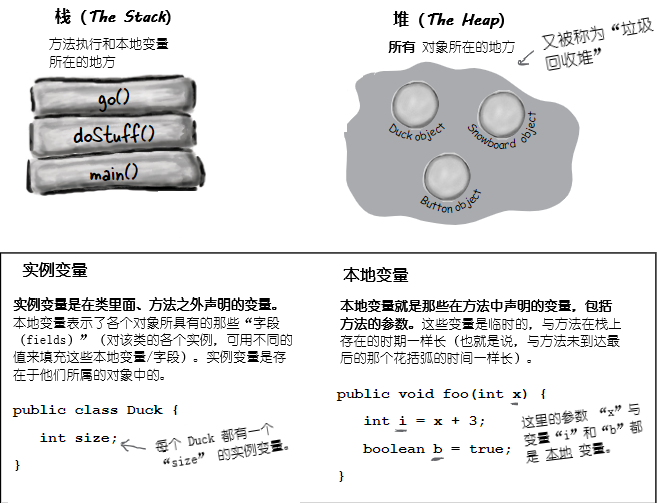

# 构造器与垃圾回收：对象的生命与死亡

**对象生下来又死去（Objects are born and objects die）**。你负责了某个对象的生命周期。你决定何时及怎样去 **构造** 他。你决定何时去 **摧毁** 他。即使你没有亲自去 *摧毁* 某个对象，也是有意无意的 *抛弃* 了他。而一旦某个对象被抛弃，无情的 **垃圾收集器（Garbage Collector, gc）** 就会让他消失，收回该对象所占用的内存。要编写Java程序，就会创建对象。早晚都会让某些对象死去，否则就会耗尽运行内存。本章将了解对象是如何创建出来的，在他们存活的时候呆在哪里，以及如何高效地留存或弃用他们。这就是说要涉及到内存堆（the heap）、栈（the stack）、作用范围（scope）、构造器、超级构造器（super constructors）、空引用（null references）等等。警告：本章涉及可能令某些人反感的对象死亡的材料。介意者请勿阅读。

## 栈与堆：Java万物存在之处

在了解创建对象涉及到的东西之前，就必须先往后一点。需要了解Java中各种东西都存在于什么地方（以及存在多长时间）。那就要了解栈和堆（the Stack and the Heap）。Java程序员关心内存的两个区域 -- 一个是对象所在的内存堆（the heap），另一个是方法执行（method invocations）与本地变量所在的栈（the stack）。在JVM启动时，就从所在的OS获取到一块内存，并使用这块内存来运行你的Java程序。至于有多少内存，以及后期是否可以调整大小，取决于所运行的JVM版本（以及在何种平台）。不过通常你没有话语权，且在良好编程下，也无需关心（这方面后期会讨论更多）。

已知所有 *对象* 都存活在可垃圾回收的堆上，而对于那些 *变量* 在什么地方，还没有关注。变量存在于何处，取决于变量是何种类别。所谓“类别（kind）”，就跟 *类型（type）*，也就是原生变量与对象引用变量，有所不同。在讲到变量存在于何处时所关心的变量类别，是指 *实例* 变量与 *本地* 变量两种。本地变量又被成为是 *栈* 变量，之所以这样称呼，正是与其所存在的位置有关。

]

*图 1 - 栈与堆，实例与本地变量*
