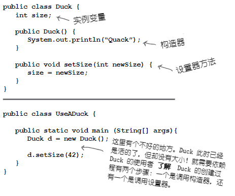
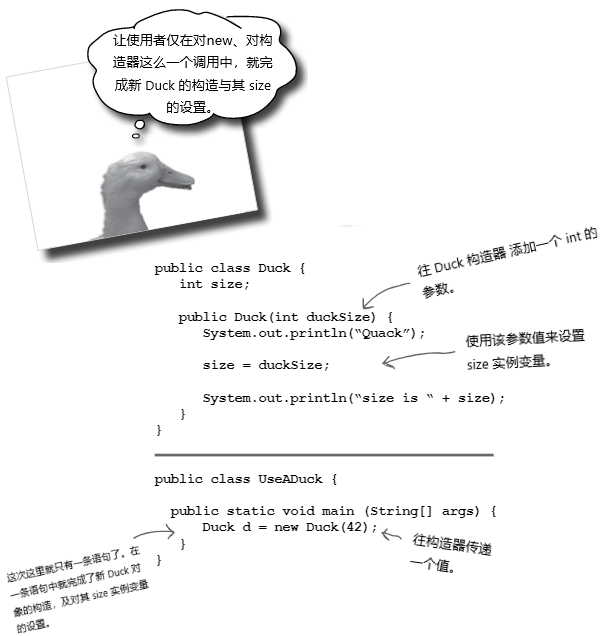

# 构造器与垃圾回收：对象的生命与死亡

**对象生下来又死去（Objects are born and objects die）**。你负责了某个对象的生命周期。你决定何时及怎样去 **构造** 他。你决定何时去 **摧毁** 他。即使你没有亲自去 *摧毁* 某个对象，也是有意无意的 *抛弃* 了他。而一旦某个对象被抛弃，无情的 **垃圾收集器（Garbage Collector, gc）** 就会让他消失，收回该对象所占用的内存。要编写Java程序，就会创建对象。早晚都会让某些对象死去，否则就会耗尽运行内存。本章将了解对象是如何创建出来的，在他们存活的时候呆在哪里，以及如何高效地留存或弃用他们。这就是说要涉及到内存堆（the heap）、栈（the stack）、作用范围（scope）、构造器、超级构造器（super constructors）、空引用（null references）等等。警告：本章涉及可能令某些人反感的对象死亡的材料。介意者请勿阅读。

## 栈与堆：Java万物存在之处

在了解创建对象涉及到的东西之前，就必须先往后一点。需要了解Java中各种东西都存在于什么地方（以及存在多长时间）。那就要了解栈和堆（the Stack and the Heap）。Java程序员关心内存的两个区域 -- 一个是对象所在的内存堆（the heap），另一个是方法执行（method invocations）与本地变量所在的栈（the stack）。在JVM启动时，就从所在的OS获取到一块内存，并使用这块内存来运行你的Java程序。至于有多少内存，以及后期是否可以调整大小，取决于所运行的JVM版本（以及在何种平台）。不过通常你没有话语权，且在良好编程下，也无需关心（这方面后期会讨论更多）。

已知所有 *对象* 都存活在可垃圾回收的堆上，而对于那些 *变量* 在什么地方，还没有关注。变量存在于何处，取决于变量是何种类别。所谓“类别（kind）”，就跟 *类型（type）*，也就是原生变量与对象引用变量，有所不同。在讲到变量存在于何处时所关心的变量类别，是指 *实例* 变量与 *本地* 变量两种。本地变量又被成为是 *栈* 变量，之所以这样称呼，正是与其所存在的位置有关。


*图 1 - 栈与堆，实例与本地变量*

## 方法是堆叠的（Methods are stacked）

在对某个方法进行调用时，所调用的那个方法，就位处调用栈的顶部（When you call a method, the method lands on the top of a call stack）。这里被推到栈上去的，是一个叫做栈 *帧（frame）* 的新事物，栈帧驻留着方法的状态，包括正在执行哪一行代码，以及所有本地变量当前的值。

在栈顶部的方法，始终是那个栈上当前正在运行的方法（此时假设只有一个栈，后续第14章会加入更多栈）。栈上的方法在抵达其最后的结束花括弧（表示方法执行完毕）后，就从栈上消失了，在这之前方法都是留在栈上的。在 `foo()` 方法调用 `bar()`方法时，那么 `bar()`方法是堆叠在 `foo()` 方法之上的。


*图 2 - 有两个方法的调用栈*


*图 3 - 另一个栈场景*


## 对于是对象的那些本地变量的情况

记住，保存了对某个对象的引用的非原生值变量，并不是对象本身（是到对象在堆上的地址）。前面已经知道了对象存活的地方 -- 在内存堆上。不论对象是被声明的还是创建出来的，对象都是在堆上。 ***当本地变量是一个到某对象的引用时，只是该变量（引用/遥控器）在栈上***。

*对象本身，还是在堆上的*。

```java
public class StackRef {
    public void foof {
        barf();
    }

    public void barf () {
        Duck d = new Duck (24);
    }
}
```


*图 4 - 本地变量为对象时的情况*


- **再问一次，*为何* 要了解这些栈/堆的情况？了解他们对编写 Java 程序有什么帮助？真的需要了解这些吗？**

> 具备 Java 栈和堆的基础知识，对于掌握变量作用域（variable scope）、对象创建中的问题（object creation issues）、内存管理（memory management）、线程（threads），以及例外处理（exception handling）等等，至关重要。再后续章节，会涉及线程与例外处理，其他内容本章就会讲到。对特定JVM及/或平台上，栈和堆的实现细节不必了解。只需要了解这里讲到有关栈和堆的情况。如吃透了这里的内容，那么对上述的其他知识点的掌握，就会容易得多。记得我说过的，往后你会感谢我在这里啰嗦栈和堆的。


### 知识点

- Java有着两块我们所关心的内存：栈（the Stack）和堆（the Heap）
- 实例变量是在类中、方法外部声明的变量
- 本地变量是在方法里声明的变量，或方法的参数
- 所有本地变量，都是存活在栈上的，在声明本地变量的相应方法的帧中
- 对象引用变量像原生值变量那样运作 -- 若引用变量是作为本地变量声明，那么该引用变量在栈上
- 所有对象都存活在堆中，不管对象的引用变量是本地变量，还是实例变量


## 既然本地变量存活在栈上，那实例变量又存活在哪里呢？

在写下 `CellPhone()`时，Java就必须给那个 `CellPhone`对象在堆上分配空间。但要分配多少空间呢？就要给那个对象足够的空间，就是说要就足够的空间来保存对象的实例变量。那就得了，实例变量存活在堆上，在他们所属对象内部。

请记住对象的实例变量的值，是存活在对象的内部的。在实例变量都是原生值时，Java根据原生变量类型，为这些实例变量分配空间。一个`int`实例变量，需要 32个二进制位，一个 `long`长整型需要 64个二进制位等等。Java并不去看原生变量里的值；对于一个 `int` 的变量，不管他的值是 `32,000,000`还是 `32`，其所占据的位大小，始终都是 32位。

但如果实例变量是 *对象*，那又是怎样的呢？比如 `CellPhone` 就 `HAS-A` `Antenna`？也就是说，`CellPHone`有一个`Antenna`类型的引用变量。

在对象有着一些除开原生变量的、对象引用变量的实例变量时，真正的问题就是：对象需要空间来保存他的那些引用变量所指的对象吗（When the new object has instance variables that are object references rather than primitives, the real question is: does the object need space for all of the objects it holds reference to）？答案是肯定的，但 *不准确*。不管哪种情况，Java都必须给实例变量 *值（values）* 分配空间。但要记住，引用变量不是 *对象* 本身，而仅仅是到对象的 *遥控器*。因此在 `CellPhone` 有一个声明为非原生类型的 `Antenna` 实例变量时，Java 就只需在 `CellPhone`对象里头，给 `Antenna` 的遥控器，而不是`Antenna`对象本身，分配空间即可。

那么什么时候`Antenna`会在堆上获取到空间呢？首先就必须找到对象 `Antenna`本身在什么时候创建出来。这是由`Antenna`这个实例变量的声明决定的。在只声明了这个实例变量，而没有给他赋值的时候，就只有声明的这个引用变量（遥控器）的空间会被创建。

```java
private Antenna ant;
```

直到有新的 `Antenna` 对象赋值给这个对象引用实例变量，才会有真实的 `Antenna`对象在堆上创建出来。

```java
private Antenna ant = new Antenna();
```


*图 5 - 对象的实例变量*

## 对象创建的奇迹

现在知道了变量与对象存活的地方，就可以深入到对象创建的神奇世界。请记住对象声明与赋值的三个步骤：声明一个引用变量，创建出一个对象，还有将对象赋值给引用变量。

到现在为止，其中的第二步 -- 奇迹发生的地方和新对象 “诞生”的地方 -- 仍旧是个大秘团。准备好了解对象生命的一些实情了吗？ *希望你不要太过娇气*。


*图 6 - 对象3步骤*

***这里是调用了一个名为 `Duck()` 的方法吗？因为他真的看起来像个方法***。


*图 7 - 对象创建的问题*

***不是的***。
***这里调用的是 `Duck` 构造器***。

构造器 *确实* 看起来且感觉很像是个方法，但他并不是一个方法。在写下关键字 `new` 时，他就有了运行的代码。也就是说，*在实例化某个对象时，所运行的代码* （It's got the code that runs when you say `new`. In other words, *the code that runs when you instantiate an object*）。

运行构造器的唯一方式，就是使用关键字 `new` 加上类名字。JVM去找到类并运行类中的构造器（好吧，技术上讲这不是运行构造器的 *唯一* 方式。但这确实是从构造器 *外部* 运行他的唯一方式。是 *可以* 在构造器中有限制地调用另一个构造器的，本章后面会讲到这点）。

> ***构造器*** 有着在实例化某个对象时运行的代码。也就是说，当于某个类类型上写下 `new` 时，所运行的代码。
> 你所创建的或不是你创建的全部类，都有一个构造器。


***那构造器在哪里呢？如果我们没有编写构造器，那又是谁编写的呢***？

自己是可以编写自己的类的构造器的（我们就即将那样做），但如果自己没有编写他，那么***编译器将为你编写出一个来***！

编译器默认的构造器看起来是这样的：

```java
public Duck () {}
```

***注意到缺了什么吗？这和方法有什么不同的地方***？


*图 8 - 构造器与方法的不同*

### 构造一个 `Duck`


*图 9 - 构造器实例*

```console
$ java -jar target/com.xfoss.learningJava-0.0.1.jar
Quack
```

### 初始化某个新 `Duck`对象的状态

多数人使用构造器来初始化对象的状态。也就是给对象的实例变量构造和赋值。

```java
public Duck () {
    size = 34;
}
```

在`Duck`类 *开发者* 知道 `Duck` 对象应该是多大的时候，这样做没有问题。但在希望由 *使用* `Duck` 类的程序员来决定，某个特定的 `Duck` 对象应该多大的时候会怎样呢？

设想 `Duck` 有个 `size` 实例变量，同时希望使用这个`Duck`类的程序员来设置新 `Duck` 对象的 `size`。可以怎么办到呢？

当然，可以给类加上一个设置器`setSize()`（setter）。但这样做会给 `Duck` 的 `size` 暂时没有取值（实例变量是有默认值的。对于数值原生值，为`0`或者浮点数的`0.0`，对于布尔值是 `false`，对于引用变量默认值是 `null`），并会让使用者必须用 *两条* 语句 -- 一条来创建 `Duck` 对象，一条来调用 `setSize()` 方法。下面的代码就是使用了一个设置器方法来设置新 `Duck` 的 `size` 初始值。



*图 10 - 使用设置器而不是构造器参数的弊端*

### 答疑

- __既然编译器会提供构造器，那为何还有自己编写构造器__ ？

> 在需要代码来帮助对象初始化，以及为使用该对象做好准备时，就必须编写自己的构造器。或许也会需要对象使用者的输入，才能完成对象的构建。就算自己不需要任何的构造器代码，但还是有必须编写构造器的理由，这一点与超类的构造器有关，后面很快就会讲到这点。

- __怎样区分构造器与普通方法？也可以让某个方法与类有相同的名字吗？__

> Java允许声明与类名字相同的方法。不过这样做不会使其成为构造器。将普通方法和构造器区别开的，就是返回值的类型。方法必须有一个返回值类型，与此相反，构造器就不能有返回值类型（**注意：构造器返回的实际上是一个对象的引用**！）。

- **构造器会被继承吗？在当前类的超类具有构造器，他本身没有构造器时，会将超类的构造器作为默认的构造器吗**？

> 不会。构造器是不被继承的。在后面后讨论这个问题。


### 使用构造器来对一些 `Duck` 的重要状态进行初始化

若要求在对象状态（实例变量）的一个或多个部分未初始化之前，不能使用该对象的话，就应该在完成对象初始化之前，不应将 `Duck` 对象交给任何引用变量（If an object shouldn't be used until one or more parts of its state(instance variables) have been initialized, don't let anyone get ahold of a `Duck` object until you're finished initializing）！让别人构造一个需要再次调用 `setSize()` 这样的设置器，才能得到一个可以使用的构造器，是具有相当风险的。因为在调用设置器之前，就已经将这个未准备好的对象，交给了其引用变量。如果类 `Duck`的使用者不知道或者忘记了调用设置器，那么会怎样呢？

放置初始化代码的最佳地点，就是在构造器中。只需要构造一个带有参数的构造器。




*图 11 - 带有参数的构造器*


## 让 `Duck` 的构造更容易

__就要确保有一个不带参数的构造器__

若 `Duck` 构造器接受一个参数时会怎样？想一下这个问题。在上面的示例中，只有一个 `Duck` 构造器 -- 并接收一个 `int` 参数作为 `Duck` 的大小。这或许不是个大问题，但将让那些尚不知道某个 `Duck` 应该多大的程序员，感到手足无措。如果 `Duck` 能有个默认的 `size`，就会很有帮助，那样 `Duck` 类的使用者，即使不知道一个合适的 `size`，也仍然可以构造出一个可工作的 `Duck`来。

__设想打算让 `Duck` 的使用者，在构造`Duck` 时有两个选项 -- 一个时提供到`Duck`的 `size`（构造器参数），另一个则不指定 `size`，因此就要使用预先准备的 *默认* `Duck` `size`__。

若只有一个构造器，那么肯定就实现不了这个。记住，某个方法（或构造器--适用同样的规则）有个参数，那么在执行该方法或构造器时，就 *必须* 传递一个适当的参数给他。就不能这样写，“如果没有传递任何东西给构造器，就使用默认的 `size`”，因为在没有传递一个 `int` 参数给构造器调用的话，就甚至不能进行编译的。*或许* 可以像下面这样写：

]


*图 12 - 只使用一个构造器*

这样做还是要求构造新 `Duck` 对象的程序员知道，传入一个 `0` 就可以得到默认 `Duck` `size` 的约定。这就很恶心了。要是其他程序员不知道呢？或者某人真的需要一个大小为零的 `Duck`呢？（假设大小为零的 `Duck` 是允许的。就是真的不想要大小为零的 `Duck` 对象存在，就要在构造器中放入验证代码来防止）关键是，不总是能识别出`Duck`的使用者，到底是真的想要一个大小为零的 `Duck`，还是他要传入一个 `0`来得到默认的 `Duck` `size`。


__实际上，需要的是有两种构造新 `Duck`的方式__ :

```java
public class Duck2 {
    int size;

    public Duck2 () {
        // 提供一个默认的 size
        size = 27;
    }

    public Duck2 (int duckSize) {
        // 使用 duckSize 参数
        size = duckSize;
    }
}
```

__要构造一个已知 `size` 的新 `Duck` 时__ ：


```java
Duck2 d = new Duck2 (15);
```


__要构造一个不知道 `size` 的 `Duck` 时__ ：

```java
Duck2 d2 = new Ducks()
```

因此这种 **构造 `Duck` 的双项选择** 做法，就需要 *两个* 构造器。其一接收一个 `int` 参数，其二没有参数。 ***在类中有着多个构造器时，就是说使用了过载的构造器（overloaded constructors）***。
