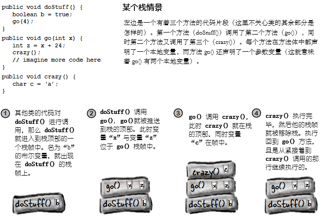

# 构造器与垃圾回收：对象的生命与死亡

**对象生下来又死去（Objects are born and objects die）**。你负责了某个对象的生命周期。你决定何时及怎样去 **构造** 他。你决定何时去 **摧毁** 他。即使你没有亲自去 *摧毁* 某个对象，也是有意无意的 *抛弃* 了他。而一旦某个对象被抛弃，无情的 **垃圾收集器（Garbage Collector, gc）** 就会让他消失，收回该对象所占用的内存。要编写Java程序，就会创建对象。早晚都会让某些对象死去，否则就会耗尽运行内存。本章将了解对象是如何创建出来的，在他们存活的时候呆在哪里，以及如何高效地留存或弃用他们。这就是说要涉及到内存堆（the heap）、栈（the stack）、作用范围（scope）、构造器、超级构造器（super constructors）、空引用（null references）等等。警告：本章涉及可能令某些人反感的对象死亡的材料。介意者请勿阅读。

## 栈与堆：Java万物存在之处

在了解创建对象涉及到的东西之前，就必须先往后一点。需要了解Java中各种东西都存在于什么地方（以及存在多长时间）。那就要了解栈和堆（the Stack and the Heap）。Java程序员关心内存的两个区域 -- 一个是对象所在的内存堆（the heap），另一个是方法执行（method invocations）与本地变量所在的栈（the stack）。在JVM启动时，就从所在的OS获取到一块内存，并使用这块内存来运行你的Java程序。至于有多少内存，以及后期是否可以调整大小，取决于所运行的JVM版本（以及在何种平台）。不过通常你没有话语权，且在良好编程下，也无需关心（这方面后期会讨论更多）。

已知所有 *对象* 都存活在可垃圾回收的堆上，而对于那些 *变量* 在什么地方，还没有关注。变量存在于何处，取决于变量是何种类别。所谓“类别（kind）”，就跟 *类型（type）*，也就是原生变量与对象引用变量，有所不同。在讲到变量存在于何处时所关心的变量类别，是指 *实例* 变量与 *本地* 变量两种。本地变量又被成为是 *栈* 变量，之所以这样称呼，正是与其所存在的位置有关。


*图 1 - 栈与堆，实例与本地变量*

## 方法是堆叠的（Methods are stacked）

在对某个方法进行调用时，所调用的那个方法，就位处调用栈的顶部（When you call a method, the method lands on the top of a call stack）。这里被推到栈上去的，是一个叫做栈 *帧（frame）* 的新事物，栈帧驻留着方法的状态，包括正在执行哪一行代码，以及所有本地变量当前的值。

在栈顶部的方法，始终是那个栈上当前正在运行的方法（此时假设只有一个栈，后续第14章会加入更多栈）。栈上的方法在抵达其最后的结束花括弧（表示方法执行完毕）后，就从栈上消失了，在这之前方法都是留在栈上的。在 `foo()` 方法调用 `bar()`方法时，那么 `bar()`方法是堆叠在 `foo()` 方法之上的。


*图 2 - 有两个方法的调用栈*




*图 3 - 另一个栈场景*


## 对于是对象的那些本地变量的情况

记住，保存了对某个对象的引用的非原生值变量，并不是对象本身（是到对象在堆上的地址）。前面已经知道了对象存活的地方 -- 在内存堆上。不论对象是被声明的还是创建出来的，对象都是在堆上。 ***当本地变量是一个到某对象的引用时，只是该变量（引用/遥控器）在栈上***。

*对象本身，还是在堆上的*。

```java
public class StackRef {
    public void foof {
        barf();
    }

    public void barf () {
        Duck d = new Duck (24);
    }
}
```


*图 4 - 本地变量为对象时的情况*


- **再问一次，*为何* 要了解这些栈/堆的情况？了解他们对编写 Java 程序有什么帮助？真的需要了解这些吗？**

> 具备 Java 栈和堆的基础知识，对于掌握变量作用域（variable scope）、对象创建中的问题（object creation issues）、内存管理（memory management）、线程（threads），以及例外处理（exception handling）等等，至关重要。再后续章节，会涉及线程与例外处理，其他内容本章就会讲到。对特定JVM及/或平台上，栈和堆的实现细节不必了解。只需要了解这里讲到有关栈和堆的情况。如吃透了这里的内容，那么对上述的其他知识点的掌握，就会容易得多。记得我说过的，往后你会感谢我在这里啰嗦栈和堆的。


### 知识点

- Java有着两块我们所关心的内存：栈（the Stack）和堆（the Heap）
- 实例变量是在类中、方法外部声明的变量
- 本地变量是在方法里声明的变量，或方法的参数
- 所有本地变量，都是存活在栈上的，在声明本地变量的相应方法的帧中
- 对象引用变量像原生值变量那样运作 -- 若引用变量是作为本地变量声明，那么该引用变量在栈上
- 所有对象都存活在堆中，不管对象的引用变量是本地变量，还是实例变量


