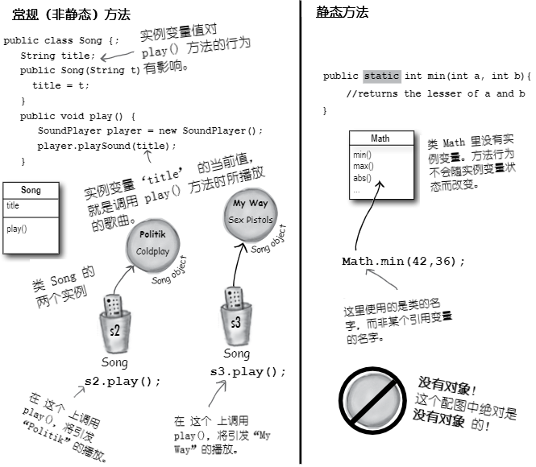
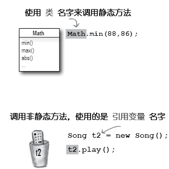
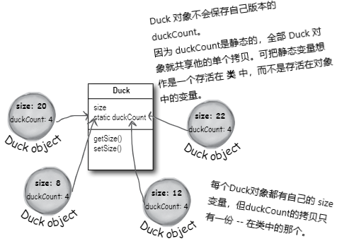
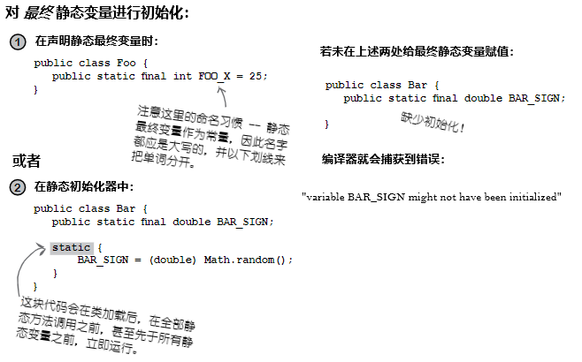
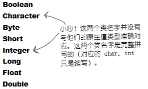
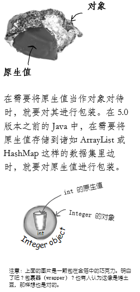
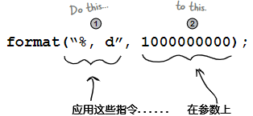

# 数字与静态值：数字为要

**Numbers and Statics: Numbers Matter**

**做运算（Do the Math）**。除了原生算术运算，数字方面还有更多的要做。可能要获取某个数字的绝对值，或对某个数字四舍五入，或者找出两个数中较大的等等。还可能希望只打印某个数的两位小数，或者要在大数中放进逗号，从而让大数更易于阅读。日期又该怎样处理呢？或许要以各种方式来打印日期，甚至要对日期进行 *操作（manipulate）*，比如“把今天的日期加上三周”。还有怎样把字符串解析到数字呢？或是把数字转换成字符串？有幸的是，Java API 提供了很多易于上手的数字处理方法（full of handy number-tweaking methods）。但这些方法大多是 **静态的（`static`）**，因此先要了解某个变量或方法为静态时，以及 Java 中的常量 -- 静态最终变量，是什么意思（But most of them are `static`, so we'll start by learning what it means for a variable or method to be static, including constants in Java -- `static` `final` variables）。

## 数学方法：接近全局方法

**MATH methods: as close as you'll ever get to a `global` method**

但 Java 中不存在全局的 *任何东西*。但请想想：有个不依赖实例变量值的方法会怎样。就拿类 `Math` 中的 `round()` 方法来说。他会每次都会执行相同的操作 -- 将浮点数（该方法的参数）四舍五入到最接近的整数。每次都这样的。就是有一万个类 `Math` 的实例，都运行 `round(42.2)` 方法，得到的结果都是 `42`。每次都是。也就是说，方法在参数上执行，而绝不会受某个实例变量状态影响。改变方法 `round()`运行方式的唯一值，就是传递给该方法的参数！

看起来为了运行 `round()` 方法而构造一个类 `Math` 的实例，确实是浪费了很多高价值的内存堆空间吧？对于 *其他* 一些 `Math` 的方法，比如接收两个数字原生值并返回二者中较小的值的 `min()`，或 `max()`，或者返回某个数的绝对值的 `abs()`等等，又会怎样呢？

***这些方法绝不会用到实例变量值***。事实上类 `Math` 是没有任何实例变量的。那么构造一个类 `Math` 的实例就没有任何价值。所以猜猜会怎样？所以就不必构造类 `Math` 的对象。事实上也无法构造类`Math`的实例。

**在尝试构造类 `Math` 的实例时**：

```java
Math mathObj = new Math();
```

**将得到这个错误消息**：

```console
Math() has private access in java.lang.Math
```

> 该错误消息显示，`Math` 构造器是被标记为 `private` 的！那就是说，**绝** 不可以在类 `Math` 上写 `new` 来构造一个新的 `Math` 对象。


*图 1 - 类`Math`的方法*


### 常规（非静态）方法与静态方法的区别

虽然Java作为面向对象语言，不过后面就会发现一个特殊案例，尤其是那些工具方法（就像这些`Math`的方法），在这些地方就没有必要用到类的实例。关键字 `static` 让方法在 ***没有任何其所属类的实例*** 情况下，就可以运行。静态方法就是指 “其行为不依赖实例变量，因此不需要实例或对象。只需要类就行”。




*图 2 - 常规方法与静态方法的区别*





*图 3 - 静态方法与非静态方法的调用*

### 让类具有静态方法有什么意义？

通常（尽管不总是这样），有着静态方法的类，都是些不打算被实例化的类（Often(although not always), a class with static methods is not meant to be instantiated）。在第8章就谈到过抽象类，以及如何使用 `abstract` 关键字类对类进行标记，从而使得任何人都不可以在那个类类型上写 `new`。也就是说，***绝无可能对抽象类进行实例化***。

到这里，还可以通过将构造器标记为 `private`，来阻止其他代码对 *非*抽象类进行实例化了。请记住，标记为 `private` 的方法意味着只有类中的代码才可以运行那个方法。标记成 `private` 的构造器，基本与标记为 `private` 的方法一样 -- 只有类中的代码才可以运行构造器。那么在类 *外部* 就没有人可以对类写 `new` 了。这就是类 `Math` 的运作方式。他的构造器是私有的，就不能构造出 `Math` 的实例。编译器了解你的代码是不能访问私有构造器的。

这又并不是说，有着一个或多个静态方法的类，绝对不会被实例化。事实上，只要放入了一个 `main()` 方法，那个类中就有了一个静态方法！

通常是要构造一个 `main()` 方法来启动或测试另一个类的，几乎总是要在 `main()` 方法中去实例化某个类，且随后会在构造的新实例上运行某个方法。

因此虽然存在一个非静态方法，就意味着一定有某种构造类实例的方式，但在类中结合静态和非静态方法一起使用，是自由的。获取新对象的唯二方式，是通过关键字 `new`，或者逆序列化（deserialization, 或称为Java Reflection API，附录会讲到）。此外并无他法。不过还有一个非常有趣的问题，那就是到底是 *谁* 来写下 `new`，后面会讨论这个问题。


### 静态方法不能使用非静态（实例）变量！

**Static methods can't use non-static (instance) variable**!

静态方法的运行，无需对其所属类的任何特定实例有所了解。就如同前面所说的，静态方法所属类甚至没有实例变量。因为静态方法是使用 *类*（`Math.random()`），而非 *实例引用变量* （`t2.play()`）调用，所以静态方法就不能引用其所属类的任何实例变量。

**若尝试编译这样的代码：**

```java
class Duck {
    private int size;

    public static void main (String [] args) {
        System.out.format("Size of duck is %s\n", size);    // 哪个 Duck? 谁的 size ?
    }                                                       // 若在内存堆上的某处有个 Duck, 这里也是对其一无所知的

    public void setSize (int s) {
        size = s;
    }

    public int getSize () {
        return size;
    }
}
```

**将收到这样的错误信息**：

```console
non-static variable size cannot be reference from a static context
```

> **在某个静态方法中尝试使用实例变量时，编译器就会想 “我不知道你讲的是哪个对象的实例变量”！就算在内存堆上有 10 只鸭子，静态方法也对他们一无所知**。

### 静态方法也不能使用非静态方法！

非静态方法是用来做什么的？***非静态方法通常要使用实例变量的状态，来影响他们自己的行为***。`getName()`方法，返回的是变量 `name` 的值。谁的名字？当然是用于运行 `getName()` 方法的那个对象的 `name`。

**这段代码不会被编译**：

```java
class Duck {
    private int size;

    public static void main (String [] args) {
        System.out.format("Size of duck is %s\n", getSize());    // 调用 getSize () 方法只是推迟了必然会出现的问题 -- getSize() 使用了实例变量 size
    }

    public void setSize (int s) {
        size = s;
    }

    public int getSize () {
        return size; // 这里又回到同样的问题......到底是谁的 size ？
    }
}
```

**错误信息**：

```console
non-static method getSize() cannot be reference from a static context
```

### 答疑

- **去调用那些不使用任何实例变量的非静态方法会怎么样，编译器会允许吗**？

> 不行。编译器对是否在非静态方法中有没有使用实例变量清楚得很。设想如果那样可以通过编译，而又在未来的某一天，修改了非静态方法的实现而带进了实例变量，会有什么影响？或者更离谱，在某个子类重写了那个非静态方法，并在重写版本中带入了一个实例变量呢？

- **对天发誓，见到过使用引用变量，而并非类名字去调用静态方法的代码**。

> 是可以那样做，但就跟你妈妈经常教导你那样，“仅仅因为它是合法的并不意味着它是好的（Just because it's legal doesn't mean it's good）”。虽然使用类实例去调用静态方法可行，但这样写会构造出带误导性（缺乏可读性）代码。你可以这样写：

```java
Duck d = new Duck ();
String[] = {};
d.main(s);
```

> 这段代码是合法的，但编译器只会将这段代码解析回真正的类（“好的”，`d` 的类型为 `Duck`，同时 `main()` 是静态的，那么我就会调用类 `Duck` 中的静态 `main()`）。也就是说，使用实例 `d` 来运行 `main()` 并不会让 `main()` 对这个引用的对象 `d` 有更多具体知识。这只是另一种调用静态方法的方式而已，方法本身仍然是静态的！

故有诗云：

> 红玫瑰
>
> 开得晚
>
> **实例变量的状态**
>
> **静态方法见不到**

### 静态变量：对类的 *所有* 实例，其值保持一致

**Static variable: value is the same for ALL instances of the class**

设想打算数一下程序运行时创建了多少个 `Duck` 的实例。怎样才能做到呢？或许需要一个在构造器中递增的实例变量？

```java
clas Duck {
    int duckCount = 0;

    Duck () {
        duckCount++; // 这会在每次构造出一个 Duck 时，将 duckCount 设置为 1
    }
}
```

这样写是做不到的，因为`duckCount`是个实例变量，对每个 `Duck`都是以 `0` 开始的。当然可以再构造另一个类来完成 `Duck` 的计数，但那样就显得笨拙。这个时候就需要一个只有某变量的单份拷贝，且所有实例变量都共享那份拷贝的类。

这就是静态变量可以给到的特性：可被所有类实例共享的值。也就是说，每个类一个值，而非每个实例一个值（In other words, one value per *class*, instead of one value per *instance*）。

```java
class Duck {
    private int size;
    private static int duckCount = 0;   // 这个静态变量 `duckCount` 只会在类第一次加载时初始化
                                        // 而不会在每次构造新实例时初始化

    Duck () {
        duckCount++;    // 因为 duckCount 是静态的，且不会被重置为 0
                        // 所以现在静态变量 duckCount 就会在 Duck 构造器每次运行时递增
    }

    public void setSize (int s) {
        size = s;
    }

    public int getSize () {
        return size;
    }
} 
```



*图 4 - 实例变量与静态变量的区别*


**静态变量是共享的**。

**同一类的所有实例，共享静态变量的单个拷贝**。

- 实例变量：每个 **实例** 一个
- 静态变量：每个 **类** 一个

### 脑力锻炼

在本章早先部分，我们见到了私有构造器表示类不可被类外部的代码实例化。也就是说，只有类里面的代码，才可以使用私有构造器，构造类的新实例。（这里就有了“鸡生蛋蛋生鸡”问题。）

若要编写一个只能构造一个实例，且要使用类实例的所有人，就都只能使用这单个的实例，会怎样呢？

### 静态变量的初始化

**Initializing a static variable**

静态变量是在 *类加载* 的时候初始化的。而类的加载，则是 JVM 判定应该加载他的时候，才加载的。通常情况下，JVM加载某个类，是因为第一次有人尝试构造那个类的新实例，或者使用该类的静态方法或静态变量。作为 Java 程序员，当然还有显式地让JVM去加载某个类的选项，不过极不可能需要去那样做的。在几乎所有情况下，都最好让JVM去决定何时加载类。

同时静态变量初始化有两条定律：

- 类中的静态变量，是在类的所有对象可被创建出来之前初始化的
- 类中的静态变量，是在类的所有静态方法运行之前初始化的

```java
class Player {
    static int playerCount = 0; // playerCount 是在类 Player 加载时初始化的。
    private String name;        // 这里显式将其初始化为 0，不过并不需要，因为整数
                                // 的默认值本来就是 0。静态变量获取默认值的方式，与
                                // 实例变量是一样的。
    Player (String n) {
        name = n;
        playerCount++;          // 已声明但未初始化的静态变量与实例变量，他们的默认值
    }                           // 一样：
}                               // 原生整数（长整形、短整型等）：0
                                // 原生浮点数（单精度、双精度）：0.0
                                // 布尔值：false
public class PlayerTestDrive {  // 对象引用变量：null 
    public static void main (String[] args) {
        System.out.println(Player.playerCount);
        Player one = new Player ("Tiger Woods");
        System.out.println(Player.playerCount);
    }                        // 对静态变量的访问，就如同对静态
}                            // 方法的访问 -- 使用类的名字。
```

运行结果：

```console
$ java -jar target/com.xfoss.learningJava-0.0.1.jar
0 <-- 在没有构造任何实例时
1 <-- 在构造了一个对象后
```

### 静态最终变量即为常量

**`static` `final` variables are constants**

标记为 `final` 的变量，就意味着 -- 一旦被初始化 -- 就绝不会再改变。也就是说，静态最终变量的值，从类被加载开始，就始终保持一致。查看 Java API 中的 `Math.PI` ，就会发现：

```java
public static final double PI = 3.1415926535889793;
```

变量 `PI` 被标记为 `public` 表示所有代码都可以访问他。

标记为`static`就无需类 `Math` 的实例就可以使用（还要记住不能创建类 `Math`的实例）。

还因为 `PI` 是不会改变的，因此变量 `PI` 又被标记为了 `final`（就Java 这个编程语言来说）。

除了上面这种方式，就再没有其他方式将变量指定为常量了，但对常量命名的约定，可以帮助我们识别出其为常量。***常量的名字，应全为大写***！


> **静态初始化器（static initializer），是一个再类加载时，于外部代码可以使用这个类前，运行的一个代码块，因此这个代码块就是对静态最终变量进行初始化的好地方**。

```java
class Foo {
    final static int X;

    static {
        X = 42;
    }
}
```




*图 5 - 静态最终变量 -- 常量，与静态初始化器*


### `final` 不止于 `static` 变量

也可使用关键字 `final` 去修改非静态变量，包括实例变量、本地变量，甚至方法的参数。在每种情况下，关键字 `final` 都意味着同样的事情：再也不能改变值了。还可以使用关键字 `final` 去阻止别人重写方法，或构造子类。

- **`final` 的那些非静态变量**

```java
class Foof {
    final int size = 3; // 现在就再不能修改 size 了
    final int whuffie;

    Foof () {
        whuffie = 42; // 这里是不能修改 whuffie 的
    }

    void doStuff (final int x) {
        // 就无法改变 x 了
    }

    void doMore () {
        final int z = 7;
        // 就无法改变 z 了
    }
}
```

> 实际上这里有个问题。其中的 `final int whuffie;` 语句中的 `whuffie` 实例变量，其默认值不是 `0` 吗？怎么后面又可以再构造器中赋值呢？说明构造器是最先运行的。

- **`final` 的方法**

```java
class Poof {
    final void calcWhuffie () {
        // 必须保证不被重写的
        // 一些重要事务
    }
}
```


- **`final` 的类**

```java
final class MyMostPerfectClass {
    // 这个类就不能被扩展了
}
```

> **`final` 的 *变量*，就是说不能修改他的值**。
>
> **`final` 的 *方法*，就是说不能重写这个方法**。
>
> **`final` 的 *类*，就是说不能对这个类进行扩展（即不能构造他的子类）**。


## 答疑

- **静态方法不能访问非静态变量。那么非静态方法可以访问静态变量吗**？

> 当然，类中的非静态方法，总是可以调用类中的静态方法，以及类的静态变量。


- **将类标记为 `final` 的目的是什么？这样做不就与面向对象的整体目标相违背了吗**？

> 是的，不会。将类构造成 `final`的典型原因，是为了安全性。比如就无法构造类 `String` 的子类。设想有人扩展了类 `String`，并以多态方式，在原本是 `String` 对象的地方，使用他们自己的`String`子类对象，会是多大的麻烦。在需要一些方法保持特定实现时，就要把他们的类标记为 `final`。


- **如果类已经是 `final`了，那么再把其中的方法标记为 `final`，不就是多余的吗**？

> 在类为 `final` 时，就不需要将方法标记为 `final`了。想想吧 -- 在类为 `final` 时，就不能被扩展为子类，那么当然他的方法就不能被重写了。
>
> 此外，在确实打算允许其他人对你编写的类进行扩展，又不想要他们重写其中的一些而不是全部的方法时，就可以不将这个类整个标记为 `final`，而是有选择性地将特定方法标记为 `final`就行了。最终方法指的就是子类不能对其进行重写。

## 知识点


- 调用静态方法应使用类名字，而不是对象引用变量：

    `Math.random()` 与 `myFoo.go()`

- 无需堆上静态方法所属类上的任何实例变量，就可以运行静态方法；
- 对于不依赖特定实例变量值的那种工具性方法，写成静态方法是不错的选择；
- 静态方法不与特定实例关联 -- 而只与类关联 -- 因此静态方法就访问不到其所属类的所有实例变量。静态方法不知道该去使用那个实例的值；
- 静态方法无法访问到非静态方法，这是因为非静态方法通常是与实例变量状态关联起来的；
- 在类只有静态方法时，就不希望整个类被实例化，从而可将类构造器标记为 `private`；
- *静态变量*是类的全体实例共享的变量。类中的静态变量只有一份拷贝，而不是实例变量那样每个实例都有一份拷贝；
- 静态方法可以访问静态变量；
- 在 Java 语言中要构造一个常量，是将某个变量同时标记为 `static` 与 `final`实现的；
- 最终静态变量必须被赋值，要么在声明时，要么在某个静态初始化器中。

```java
static {
    DOG_CODE = 420;
}
```

- 常量（`final` `static` variables）的命名约定是要将名字全部大写；
- 标记为 `final` 的变量，一经赋值后就不能在改变了；
- 给某个 `final` 的实例变量赋值，要么在该变量声明时，要么在构造器中；
- `final` 的方法不能被重写；
- `final`的类无法被扩展（子类化操作）。

## 类`Math`的那些方法

既然已经知道静态方法工作的方式，不如现在来看看类 `Math`中的一些静态方法。这里举例的只是其中一些常用的。对照 API 文档，就可以查看到剩余的那些，包括 `sqrt()`、`tan()`、`ceil()`、`floor()`以及 `asin()`等等。

- **`Math.random()`**

> 返回一个`0.0`到`1.0`（不包括`1.0`）之间的双精度数。

```java
double r1 = Math.round();
int r2 = (int) (Math.random() * 5);
```

- **`Math.abs()`**

> 返回一个双精度数，为参数的绝对值。该方法有多个过载方法，因此如果传入的是整数，那么返回的也是整数；传入的是双精度数，返回的也是双精度数。

```java
int x = Math.abs(-240); // 返回 240
double d = Math.abs(240.45); // 返回 240.45
```

- **`Math.round()`**

> 返回参数被取整到最近的整数或长整数（取决于参数是单精度或是双精度数）。

```java
int x = Math.round(-24.8f); // 返回 -25
int y = Math.round(24.45f); // 返回 24
                        //请记住，浮点数在没有加上字母 ‘f’ 时，默认都假定是双精度数
```

- **`Math.min()`**

> 返回两个参数中较小的数。该方法也具有多个过载方法，用于接收整数、长整数、单精度浮点数或双精度数。

```java
int x = Math.min(24, 240); // 返回 24
double y = Math.min(90876.5, 90876.49); // 返回 90876.5
```

- **`Math.max()`**

> 与 `Math.min()` 类似，返回两个参数中的较大值。也是过载的方法。


## 对原生值进行包装

**Wrapping a primitive**

一些时候要将原生值当作对象来对待。比如在 Java 早于5.0的全部版本中，是无法把原生值直接放入到 `ArrayList`或 `HashMap`等数据结构中去的：

```java
int x = 32;
ArrayList list = new ArrayList();
list.add(x);    // 在 5.0 之前的 Java 版本中，这样写是不行的！！ 
                // 那个时候 ArrayList 还没有 add(int) 方法
                // 来接收整数！（那个时候的 ArrayList 只有
                // 接收对象引用变量，而非原生值的 add() 方法）
```

每种原生值类型都有一个打包类，且因为这些打包类都是在 `java.lang` 包中，所有不必导入他们。由于这些类的名字，都是将（全小写字母的）原生值类型的首字母改为大写得来，因此就很容易识别和区分这些类。

由于某种无人所知的原因，JAVA API 设计者们，决定了不把这些类的名字，按照原生值类型与类类型准确地映射起来（Oh yeah, for reasons absolutely nobody on the planet is certain of, the API designers decided not to map the names *exactly* from primitive type to class type）。后面就会明白这句话说的是什么。




*图 6 - 原生类型包装类的名字：例外*





*图 7 - 什么是原生值包装类*


### 在 5.0 版本之前的 Java 中，就不得不自己去做...

> 太TM愚蠢了，那时候不能构造整数的 `ArrayList`？必须把每个整数都包装成新的 `Integer` 对象，然后再在要访问 `ArrayList` 中的值的时候，从 `Integer`对象解包为 整数？这样真是浪费时间，并必然会出错的......

在先于 5.0 版本的所有 Java 版本中，原生值就是原生值，对象引用就是对象引用，二者直接绝不会视为可互换的（In all versions of Java prior to 5.0, primitives were primitives and object references were object references, and they were NEVER treated interchangeably）。都是依赖程序员去完成打包和解包。并无将原生值传递给期望得到对象引用变量的方法，也没有方法来把方法返回的对象引用变量，直接赋值给原生值变量 -- 就算是返回的引用变量指向的是一个 `Integer`对象，要赋值的是个原生的 `int` 变量也是不行的。`Integer`与`int`两个类型之间，就是没有联系，而实际上 `Integer`是有一个类型为 `int` 的实例变量的（用于保存 `Integer` 所包裹的原生值）。这些事情，都有由程序员来亲自做。

**一个原生整数的 `ArrayList`**

***在没有 “自动打包” 特性时（Java 5.0 之前的版本）***

```java
public void doNumsOldWay () {
    ArrayList listOfNumbers = new ArrayList (); // 构造一个 ArrayList。（请记住，在 5.0 之前是无法
                                                // 指定类型的，因此所有的 ArrayList 都是 Object 的
                                                // 清单）
    listOfNumbers.add(new Interger(3)); // 是不能将原生值 '3' 加入到清单的，因此
                                        // 必须首先将其包装为一个 Integer
    Integer one = (Integer) listOfNumbers.get(0);   // 从 listOfNumbers 这个 ArrayList 中出来的
                                                    // 是个 Object, 不过可以将其强制转换为 Integer
    int intOne = one.intValue(); // 终于可以从 Integer 得到整个原生值了。
}
```

### 自动打包：模糊原生值与对象之间的界线

***Autoboxing: bluring the line between primitive and object***

Java 5.0 加入进来的自动打包特性（the autoboxing feature），就可以 *自动* 完成原生值到包装对象的转换！

下面瞧瞧在构造一个保存整数的 `ArrayList` 时，发生了什么。

**一个原生整数的 `ArrayList`**

***有着自动打包时（Java 5.0 及以后的版本中）***

```java
public void doNumsNewWay () {
                                    // 构造一个类型为 Integer 的 ArrayList 
    ArrayList<Integer> listOfNumbers = new ArrayList<Integer>;

    listOfNumbers.add(3); // 这样就加入进去了！
                                    // 尽管 ArrayList 中没有 add(int) 的方法，编译器
                                    // 仍然为你做了所有包装（打包）的工作。也就是说
                                    // 现在确实有一个 Integer 对象存储在这个 ArrayList
                                    // 中了，只不过这里 “假装” ArrayList 接收的是整数而已
                                    // （既可以把整数，也可以把 Integer 对象添加到
                                    // ArrayList<Integer>中去）

    int num = listOfNumbers.get(0);
        // 编译器还会自动将 Integer 对象解包，从而可将整数值直接赋值到原生变量
        // 无需调用 Integer 对象上的 intValue() 方法
}
```

- **既然要保存 `int`s, 为什么不声明一个 `ArrayList<int>` 呢**？

> 因为...不可以这样。请记住，泛型规则（the rule for generic types）就是，你只能指定的，仅为类或接口的类型，并非原生类型。因此 `ArrayList<int>` 是不会被编译的。不过就如同上面的代码，实际上这并不重要，因为编译器允许把整数放到 `ArrayList<Integer>` 中去。事实上，在使用兼容Java 5.0 的编译器时，对于把原生值放入到清单为原生值包装类类型的 `ArrayList`，是没有办法阻止的，也因为在这样的编译器下，自动打包是默认启用的。那么就可以把原生布尔值放入到 `ArrayList<Boolean>`中，把字符放入到 `ArrayList<Character>`里。


### 自动打包几乎无处不在

**Autoboxing works almost everywhere**

自动打包特性不光是可以完成数据集（a collection）中原生值的打包和解包......还可以让我们在几乎所有期望得到原生值，或原生值包装的任何地方，去方便地直接二者互用。这就非常方便了！

**自动打包的乐趣**

- **作为方法的参数使用**

> 在某个方法接收原生值包装类类型时，既可以传递一个引用变量，也可以直接传递一个与包装类类型匹配的原生值。反之依然 -- 在某个方法接收原生值时，既可以传递一个兼容的原生值，也可以传递一个原生值类型对应的包装类类型的引用变量。


- **在返回值处运用**

> 在某个方法声明了一个原生的返回类型时，既可以返回一个兼容的原生类型值，也可以返回一个声明的原生类型对应的包装类类型的引用变量。反之依然，在某个方法声明了一个原生的包装类类型时，既可以返回一个引用变量，也可以返回一个兼容原生类型的值。


- **在布尔表达式中运用**

> 在希望得到一个布尔值的任何地方，都既可以使用一个可以计算得到布尔值的表达式（比如：`4 > 2`），也可以直接使用一个原生布尔值，还可以使用一个到 `Boolean` 包装类的对象引用变量。

- **在数字运算中的运用**

> 这可能时最奇怪的运用了 -- 是的，运算中即使期望的是原生值，但仍然可以使用包装类类型。这就意味着可以把自增运算符（`++`）运用在类 `Integer` 的对象上！
>
> 但不必焦虑，这只是编译器的小把戏。并没有对Java语言本身进行修改来支持这样的在对象上应用运算符的特性；编译器只是在执行运算前，简单地把对象转换成了对象的原生值类型。不过这看起来还是很奇怪的。

```java
Integer i = new Integer(42);
i++;
```

同样可以这样写：

```java
Integer j = new Integer (5);
Integer k = j + 3;
```

- **用在赋值中**

> 可把包装类类型对象或原生值，赋值给匹配的包装类类型引用变量或原生值。比如，一个原生值的 `int` 变量，就可以赋值给一个 `Integer`类类型的引用变量，反之亦然。

下面的这个 `TestBox` 类，可以通过编译，但运行时会报错。

```java
package com.xfoss.learningJava;

public class TestBox {
    Integer i;
    int j;

    public static void main (String [] args) {
        TestBox t = new TestBox ();
        t.go();
    }

    public void go () {
        j = i;
        System.out.format("j is %s\n", j);
        System.out.format("i is %s\n", i);
    }
}
```

错误信息为：

```console
$ java -jar target/com.xfoss.learningJava-0.0.1.jar
Exception in thread "main" java.lang.NullPointerException
        at com.xfoss.learningJava.TestBox.go(TestBox.java:13)
        at com.xfoss.learningJava.TestBox.main(TestBox.java:9)
```

### 等等！还有些东西呢！这些包装类还有自己的静态工具方法！

**But wait! There's more! Wrappers hava static utility methods too!**

除了可以像普通类那样行事，包装类还有一大堆相当有用的静态方法。前面就用到过一个 -- `Integer.parseInt()`。

这些解析方法接收一个字符串，并返回一个原生值。

**把字符串转换成原生值就很容易**：

```java
String s = "2";
int x = Integer.parseInt(s); // 把 “2” 解析为 2 是没问题的。
double d = Double.parseDouble("420.24");

boolean b = Boolean.parseBoolean("True");
                        // Java 1.5 中新的 parseBoolean() 方法会忽略那个字符串参数中的大小写字母。
```

**但如果这样写**：

```java
String t = "two";
int y = Integer.parseInt(t);    //  噢。这可以通过编译，但在运行时会报错。所有不能被解析为数字的
                                // 的东西，都将导致一个 NumberFormatException 的报错
```

**将收到这样的运行时例外**：

```console
$ java -jar target/com.xfoss.learningJava-0.0.1.jar
Exception in thread "main" java.lang.NumberFormatException: For input string: "two"
        at java.base/java.lang.NumberFormatException.forInputString(NumberFormatException.java:65)
        at java.base/java.lang.Integer.parseInt(Integer.java:652)
        at java.base/java.lang.Integer.parseInt(Integer.java:770)
        at com.xfoss.learningJava.TestBox.go(TestBox.java:13)
        at com.xfoss.learningJava.TestBox.main(TestBox.java:9)
```

**对字符串进行解析的所有方法或构造器，都可能抛出 `NumberFormatException`。这是运行时例外，因此可以不必对其加以处理或进行例外声明。不过或许会想要对其进行处理或进行例外声明的**。

> （在下一章就会讲到例外`Exception`。）

### 现在反过来......把原生值转换成字符串

**And now in reverse......turning a primitive number into a String**

把数字转换成字符串的方法有好几种。最容易的就是，把数字直接连接到一个既有的字符串上。

```java
double d = 42.5;
String doubleString = "" + d;   // 请记住这里的 ‘+’ 运算符，是 Java 中唯一的一个过载的
                                // 运算符，在这里是一个字符串连接器。所有添加到某个字符串
                                // 的东西，都将被字符串化。

double d = 42.5;
String doubleString = Double.toString(d);   // 另一种使用类 Double 中静态方法 toString()
                                            // 的方式
```

### 数字的格式化操作

**Number formatting**

在 Java 语言中，对数字进行格式化，不必与 `I/O` 相关联。细想一下。把数字展示给用户的一种典型方式，就是经由 GUI 途径。把数字放在一个滚动的文本框、或者在表格里。若把格式化写在打印语句中，那么就根本没办法把数字格式化到可以在 GUI 中很好呈现的字符串了。在 Java 5.0 之前的版本中，大部分的格式化操作，是通过 `java.text` 包中的类来完成的，而这个包在现在版本的本书中甚至没有提及，因为现在Java中已经不是这样的了。

在 Java 5.0 中，Java 团队通过 `java.util` 包中的 `Formatter` 类，带来了更加强大且灵活的格式化功能。不过无需自己去创建和调用`Formatter`类上的方法，因为Java 5.0 已经将一些便捷方法，添加到部分 `I/O` 类（包括 `printf()`）及`String`类了。因此调用 `String.format()`并把需要格式化的东西，以及格式化指令传递给他，就变得相当简单了。

当然，还是必须知道该怎样去提供这些格式化指令，同时如果对 `C/C++` 中的 `printf()` 函数不熟悉，那就要费点劲儿了。幸运的是，就算不知道`printf()`，也可以按照指引，完成一些最基本的格式化操作（就是这里所展示的）。但如果要进行混合与匹配，来得到想要的全部，那么就要对`printf()`有所掌握了。

下面以一个基本例子开始，并在其后看看数字格式化是怎样运作的。（注意：在 `I/O` 那一章，将再度回顾格式化）

- **将数字格式化为逗号分组样式**

**Formatting a number to use commas**

```java
package com.xfoss.learningJava;

public class TestFormats {
    public static void main (String [] args) {
                                    // '1234567890' -- 要格式化的数字
                                    // 这里希望让他有些逗号
        System.out.format("%,d\n", 1234567890);
                        // "%,d" 就是用于指示如何对作为第二个参数的数字（在
                        // 此示例中，就是一个整数）进行格式化的指令。
                        // 请记住，format() 方法仅有两个参数 -- 第一个逗号是
                        // 在字符串字面值（the String literal, "%,d"）里面的
                        // 因此这个逗号，与第二个逗号不同，他不是把参数分开
                        // 提供给 format() 方法的。
    }
}
```

输出：

```console
$ java -jar target/com.xfoss.learningJava-0.0.1.jar
1,234,567,890
```

> 于是就得到了插入到数字中的多个逗号了。

### 对格式化的解构

**Formatting deconstructed...**

在格式化的最底层（At the most basic level），包含了两个主要部分（当然还有其他东西，不过这里为了简明目的，只讨论两个）：

1. **格式化指令，Formatting instructions**

使用了特定的，用于描述如何对参数进行格式化的 *格式化说明符*（You use special *format specifiers* that describe how the argument should be formatted）。

2. **要格式化的参数，The argument to be formatted**

虽然可以有多个参数，但这里会从一个开始。这个参数并非任何类型都可以的...... 只能是可以使用前面格式化指令的格式化说明符可以格式化的。比如在格式化指令指定了一个 *浮点数* 时，就不能传入一个 `Dog`，甚至一个看起来像浮点数的 `String`也是不可以的。

> 注意：假如已经了解 `C/C++` 中的 `printf()` 函数，那么只要跳过接下来的本节的内容就好。



*图 8 - 解构格式化*

**那么这些指令到底说了什么呢**？

“取该方法的第二个参数，并将其作为一个十进制整数进行格式化，并插入 **逗号** （Take the second argument to this method, and format it as a **d**ecimal and insert **commas**）”。
