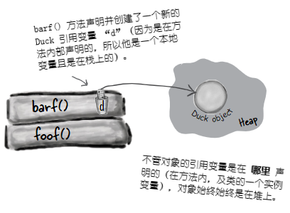

# 数字与静态值：数字为要

**Numbers and Statics: Numbers Matter**

**做运算（Do the Math）**。除了原生算术运算，数字方面还有更多的要做。可能要获取某个数字的绝对值，或对某个数字四舍五入，或者找出两个数中较大的等等。还可能希望只打印某个数的两位小数，或者要在大数中放进逗号，从而让大数更易于阅读。日期又该怎样处理呢？或许要以各种方式来打印日期，甚至要对日期进行 *操作（manipulate）*，比如“把今天的日期加上三周”。还有怎样把字符串解析到数字呢？或是把数字转换成字符串？有幸的是，Java API 提供了很多易于上手的数字处理方法（full of handy number-tweaking methods）。但这些方法大多是 **静态的（`static`）**，因此先要了解某个变量或方法为静态时，以及 Java 中的常量 -- 静态最终变量，是什么意思（But most of them are `static`, so we'll start by learning what it means for a variable or method to be static, including constants in Java -- `static` `final` variables）。

## 数学方法：接近全局方法

**MATH methods: as close as you'll ever get to a `global` method**

但 Java 中不存在全局的 *任何东西*。但请想想：有个不依赖实例变量值的方法会怎样。就拿类 `Math` 中的 `round()` 方法来说。他会每次都会执行相同的操作 -- 将浮点数（该方法的参数）四舍五入到最接近的整数。每次都这样的。就是有一万个类 `Math` 的实例，都运行 `round(42.2)` 方法，得到的结果都是 `42`。每次都是。也就是说，方法在参数上执行，而绝不会受某个实例变量状态影响。改变方法 `round()`运行方式的唯一值，就是传递给该方法的参数！

看起来为了运行 `round()` 方法而构造一个类 `Math` 的实例，确实是浪费了很多高价值的内存堆空间吧？对于 *其他* 一些 `Math` 的方法，比如接收两个数字原生值并返回二者中较小的值的 `min()`，或 `max()`，或者返回某个数的绝对值的 `abs()`等等，又会怎样呢？

***这些方法绝不会用到实例变量值***。事实上类 `Math` 是没有任何实例变量的。那么构造一个类 `Math` 的实例就没有任何价值。所以猜猜会怎样？所以就不必构造类 `Math` 的对象。事实上也无法构造类`Math`的实例。

**在尝试构造类 `Math` 的实例时**：

```java
Math mathObj = new Math();
```

**将得到这个错误消息**：

```console
Math() has private access in java.lang.Math
```

> 该错误消息显示，`Math` 构造器是被标记为 `private` 的！那就是说，**绝** 不可以在类 `Math` 上写 `new` 来构造一个新的 `Math` 对象。


*图 1 - 类`Math`的方法*


### 常规（非静态）方法与静态方法的区别

虽然Java作为面向对象语言，不过后面就会发现一个特殊案例，尤其是那些工具方法（就像这些`Math`的方法），在这些地方就没有必要用到类的实例。关键字 `static` 让方法在 ***没有任何其所属类的实例*** 情况下，就可以运行。静态方法就是指 “其行为不依赖实例变量，因此不需要实例或对象。只需要类就行”。


*图 2 - 常规方法与静态方法的区别*


*图 3 - 静态方法与非静态方法的调用*

### 让类具有静态方法有什么意义？

通常（尽管不总是这样），有着静态方法的类，都是些不打算被实例化的类（Often(although not always), a class with static methods is not meant to be instantiated）。在第8章就谈到过抽象类，以及如何使用 `abstract` 关键字类对类进行标记，从而使得任何人都不可以在那个类类型上写 `new`。也就是说，***绝无可能对抽象类进行实例化***。

到这里，还可以通过将构造器标记为 `private`，来阻止其他代码对 *非*抽象类进行实例化了。请记住，标记为 `private` 的方法意味着只有类中的代码才可以运行那个方法。标记成 `private` 的构造器，基本与标记为 `private` 的方法一样 -- 只有类中的代码才可以运行构造器。那么在类 *外部* 就没有人可以对类写 `new` 了。这就是类 `Math` 的运作方式。他的构造器是私有的，就不能构造出 `Math` 的实例。编译器了解你的代码是不能访问私有构造器的。

这又并不是说，有着一个或多个静态方法的类，绝对不会被实例化。事实上，只要放入了一个 `main()` 方法，那个类中就有了一个静态方法！

通常是要构造一个 `main()` 方法来启动或测试另一个类的，几乎总是要在 `main()` 方法中去实例化某个类，且随后会在构造的新实例上运行某个方法。

因此虽然存在一个非静态方法，就意味着一定有某种构造类实例的方式，但在类中结合静态和非静态方法一起使用，是自由的。获取新对象的唯二方式，是通过关键字 `new`，或者逆序列化（deserialization, 或称为Java Reflection API，附录会讲到）。此外并无他法。不过还有一个非常有趣的问题，那就是到底是 *谁* 来写下 `new`，后面会讨论这个问题。


### 静态方法不能使用非静态（实例）变量！

**Static methods can't use non-static (instance) variable**!

静态方法的运行，无需对其所属类的任何特定实例有所了解。就如同前面所说的，静态方法所属类甚至没有实例变量。因为静态方法是使用 *类*（`Math.random()`），而非 *实例引用变量* （`t2.play()`）调用，所以静态方法就不能引用其所属类的任何实例变量。

**若尝试编译这样的代码：**

```java
class Duck {
    private int size;

    public static void main (String [] args) {
        System.out.format("Size of duck is %s\n", size);    // 哪个 Duck? 谁的 size ?
    }                                                       // 若在内存堆上的某处有个 Duck, 这里也是对其一无所知的

    public void setSize (int s) {
        size = s;
    }

    public int getSize () {
        return size;
    }
}
```

**将收到这样的错误信息**：

```console
non-static variable size cannot be reference from a static context
```

> **在某个静态方法中尝试使用实例变量时，编译器就会想 “我不知道你讲的是哪个对象的实例变量”！就算在内存堆上有 10 只鸭子，静态方法也对他们一无所知**。

### 静态方法也不能使用非静态方法！

非静态方法是用来做什么的？***非静态方法通常要使用实例变量的状态，来影响他们自己的行为***。`getName()`方法，返回的是变量 `name` 的值。谁的名字？当然是用于运行 `getName()` 方法的那个对象的 `name`。

**这段代码不会被编译**：

```java
class Duck {
    private int size;

    public static void main (String [] args) {
        System.out.format("Size of duck is %s\n", getSize());    // 调用 getSize () 方法只是推迟了必然会出现的问题 -- getSize() 使用了实例变量 size
    }

    public void setSize (int s) {
        size = s;
    }

    public int getSize () {
        return size; // 这里又回到同样的问题......到底是谁的 size ？
    }
}
```

**错误信息**：

```console
non-static method getSize() cannot be reference from a static context
```

### 答疑

- **去调用那些不使用任何实例变量的非静态方法会怎么样，编译器会允许吗**？

> 不行。编译器对是否在非静态方法中有没有使用实例变量清楚得很。设想如果那样可以通过编译，而又在未来的某一天，修改了非静态方法的实现而带进了实例变量，会有什么影响？或者更离谱，在某个子类重写了那个非静态方法，并在重写版本中带入了一个实例变量呢？

- **对天发誓，见到过使用引用变量，而并非类名字去调用静态方法的代码**。

> 是可以那样做，但就跟你妈妈经常教导你那样，“仅仅因为它是合法的并不意味着它是好的（Just because it's legal doesn't mean it's good）”。虽然使用类实例去调用静态方法可行，但这样写会构造出带误导性（缺乏可读性）代码。你可以这样写：

```java
Duck d = new Duck ();
String[] = {};
d.main(s);
```

> 这段代码是合法的，但编译器只会将这段代码解析回真正的类（“好的”，`d` 的类型为 `Duck`，同时 `main()` 是静态的，那么我就会调用类 `Duck` 中的静态 `main()`）。也就是说，使用实例 `d` 来运行 `main()` 并不会让 `main()` 对这个引用的对象 `d` 有更多具体知识。这只是另一种调用静态方法的方式而已，方法本身仍然是静态的！

故有诗云：

> 红玫瑰
>
> 开得晚
>
> **实例变量的状态**
>
> **静态方法见不到**

### 静态变量：对类的 *所有* 实例，其值保持一致

**Static variable: value is the same for ALL instances of the class**

设想打算数一下程序运行时创建了多少个 `Duck` 的实例。怎样才能做到呢？或许需要一个在构造器中递增的实例变量？

```java
clas Duck {
    int duckCount = 0;

    Duck () {
        duckCount++; // 这会在每次构造出一个 Duck 时，将 duckCount 设置为 1
    }
}
```

这样写是做不到的，因为`duckCount`是个实例变量，对每个 `Duck`都是以 `0` 开始的。当然可以再构造另一个类来完成 `Duck` 的计数，但那样就显得笨拙。这个时候就需要一个只有某变量的单份拷贝，且所有实例变量都共享那份拷贝的类。

这就是静态变量可以给到的特性：可被所有类实例共享的值。也就是说，每个类一个值，而非每个实例一个值（In other words, one value per *class*, instead of one value per *instance*）。

```java
class Duck {
    private int size;
    private static int duckCount = 0;   // 这个静态变量 `duckCount` 只会在类第一次加载时初始化
                                        // 而不会在每次构造新实例时初始化

    Duck () {
        duckCount++;    // 因为 duckCount 是静态的，且不会被重置为 0
                        // 所以现在静态变量 duckCount 就会在 Duck 构造器每次运行时递增
    }

    public void setSize (int s) {
        size = s;
    }

    public int getSize () {
        return size;
    }
} 
```



*图 4 - 实例变量与静态变量的区别*
