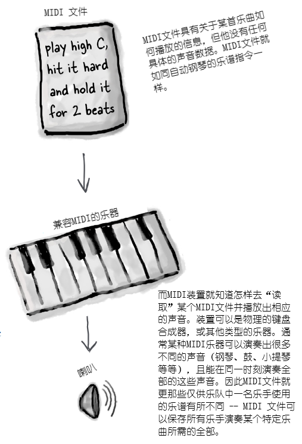
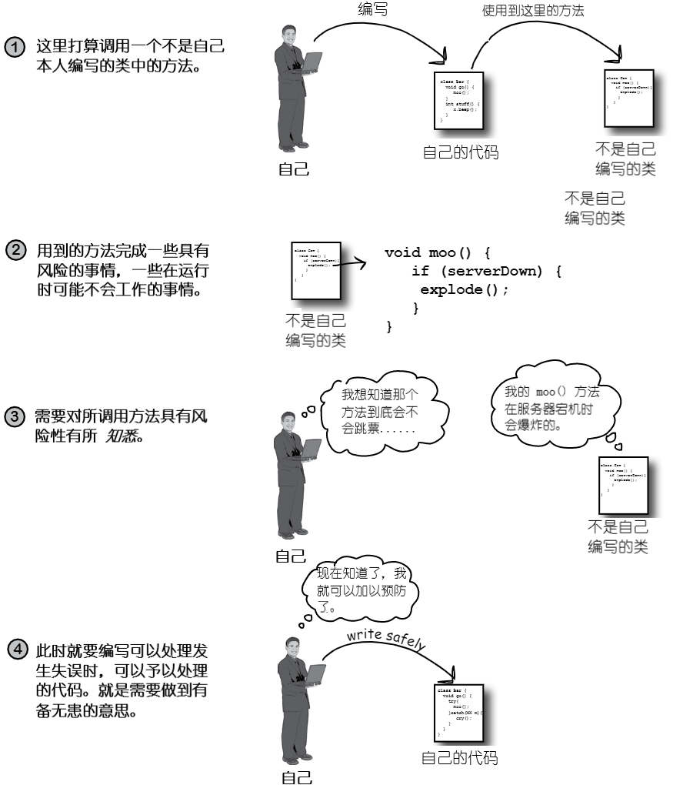
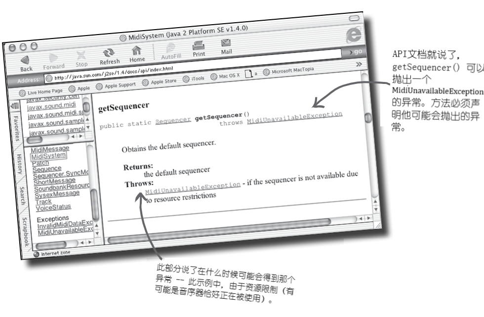
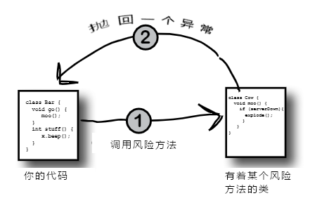
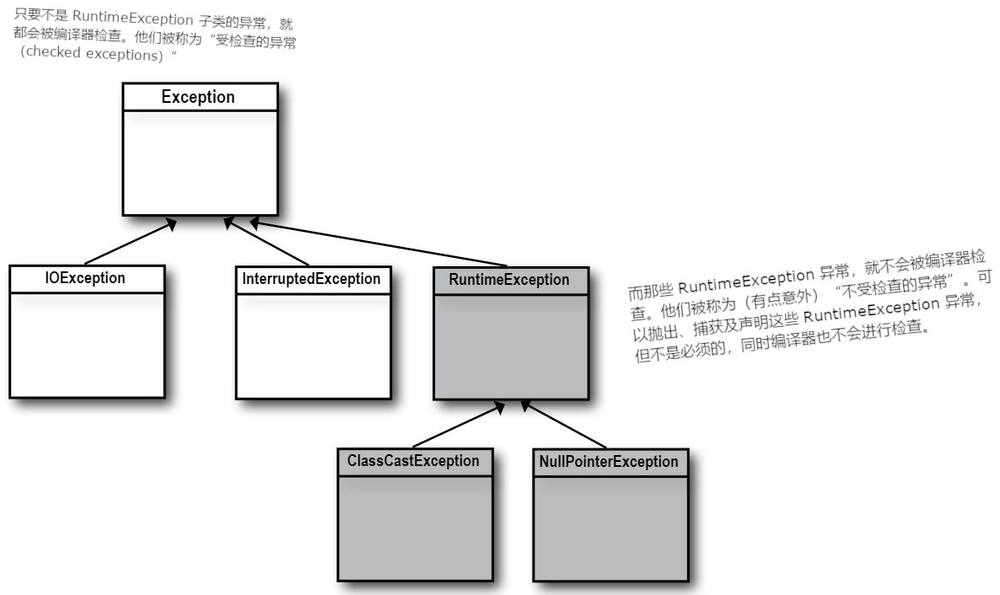
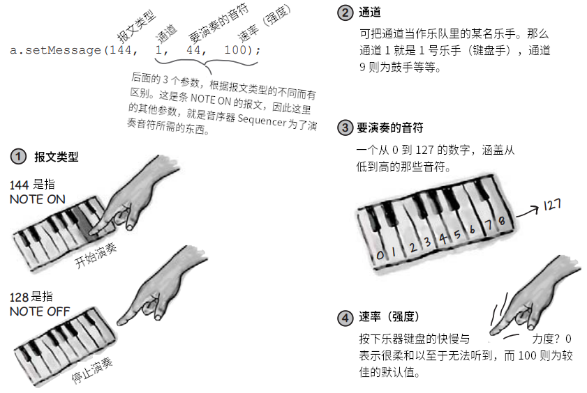
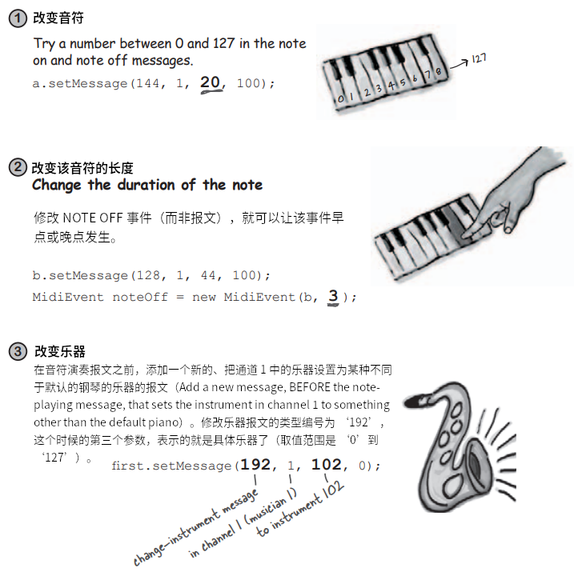

# 例外处理：风险行为

**Exception Handling: Risky Behavior**

> 那肯定有风险，但在有什么事情出错的时候，可以处理风险。

**发生了状况。文件不在那里。服务器宕机了**。不过你是多么优秀的程序员，都没办法掌控所有事情。总会有些事情会出错。甚至错得离谱。在编写有风险的方法时，就需要代码来处理可能发生的不好情况。那么怎么知道某个方法具有风险呢？同时又要把 *处理* **例外** 情形的代码放在哪里呢？到目前为止，都还没有真正面对过任何风险。在运行时确实有出错的情况，但这些问题主要是自己编写代码的缺陷。也就是代码漏洞（bugs）。这些在开发时（development time, compilation time and runtime）都可以修复。然而这一章所说的问题处理代码，指的不是之前的那种，而是在运行时无法确保可以工作的代码。比如那些期望文件就在某个目录、服务器是在运行，或者线程确实保持睡眠等等的代码。同时也必须完成对异常处理的掌握。因为就要构建一个 “MIDI 音乐播放器”了。

## 构造一个“Music Machine”的应用

在接下来的三章，会构建几个有着些许不同的声音应用，包括一个 “BeatBox Drum Machine”。实际上，在本教程完结时，就会写出一个可以把鼓节拍循环，像聊天室应用一样中聊天一样，发送给其他玩家的多玩家版本。虽然可以从GUI章节拷贝写好的程序，不过也可以马上开始编写这个应用的各个部分。

虽然不是每个IT部门都需要这样的一个 “BeatBox” 服务器，这里编写这个应用的目的是更好地掌握 Java 语言。构建的目的是在学习 Java 时可以带来些乐趣而已。

**完工后的 “BeatBox” 应用看起来像下面这样**：


*图 1 - 完成后的“BeatBox”应用*

玩法是在16个“节拍”的各种乐器的复选框中打勾。比如，在节拍 1（16拍中的）时，贝斯鼓和沙锤就会演奏，节拍 2 上就什么也不会演奏，而在节拍 3 上则是沙锤和踩镲......明白了吧。点击“开始（Start）”按钮，程序就会循环播放编排的这些模式，直到点击 “停止（Stop）”停下来为止。在任何时候都可以通过将这些模式发送给 `BeatBox`服务器，对自己编排的模式加以“捕获（capture）”（这样其他玩家就可以收听到）。通过点击聊天框中的消息，还可以收听到和消息一起发出来的收到的曲目。

## 先从简单的开始

**We'll start with the basics**

显然在完成这整个的程序前，需要学习一些东西，包括怎样去构建一个 `Swing` GUI，怎样通过网络通信与另一台机器连接，还需要一个小型的 `I/O`，从而可以一些东西发送给其他机器。

当然还有 `JavaSound` 这个 API了。本章就要从这个API开始。现在先不要想 GUI的事情，忘掉网络通信和`I/O`，而是要专心获取到一些由 MIDI 产生、可以从电脑中传出来的声音。即使对 MIDI，也就是一种读取或构造音乐的技术不了解，也不用担心。

所有需要掌握的内容，这里都有讲到。几乎可以嗅到一个唱片生意的味道。

### 关于 `JavaSound` API

`JavaSound`是自 1.3 版本开始加入到 Java 中的一套类与接口。这些类与接口并非特别的附加组件；他们是标准 J2SE 类库的一部分。`JavaSound`又被分为了两个部分：`MIDI`和`Sampled`。这里只使用到 `MIDI`。`MIDI`表示“乐器数字接口（Musical Instrument Digital Interface）”，同时也是各种不同种类的电音设备得以通信的标准协议（a standard protocol for getting different kinds of electronic sound equipment to communicate）。但对于这里的 `BeatBox` app，可以把 `MIDI` 想作 *某种类型的乐谱*，可将一些装置，比如某种高科技的“演奏钢琴”，放进这个表格。也就是说，MIDI数据本身并没有包含任何的 *声音*，他保存的是由MIDI所读取的、某种乐器的、可以回放的 *指令*（MIDI data doesn't actually include any *sound*, but it does include the *instructions* that a MIDI-reading instrument can play back）。或以另一个比方说，可把某个MIDI文件当作一个HTML文档，那么乐器就会对这个MIDI文件进行渲染（也就是演奏这个MIDI文件），如同Web浏览器渲染HTML文档一样。

MIDI数据说的是要做 *什么*（奏出一个中音`C`调，还有多大力度，以及这个音有多长等等），但MIDI数据并不会描述会听到的 *声音*。MIDI是不知道怎样去发出长笛、钢琴或者 Jimi Hendrix 吉他声的。对于这些真实的声音，是需要某种可以读取和演奏MIDI文件的乐器（即MIDI设备）的。不过MIDI设备通常更像 *一整个乐队或乐团* 的很多种乐器了。这些乐器可以是实体装置，比如摇滚乐手使用的电子键盘合成器，也可以是存在于电脑种的、完全由软件构建的乐器。

对于这里的 `BeatBox`应用，只会使用到Java自带的、内建的、纯软件的乐器。这些乐器叫做 *合成器（synthesizer）* （有人也称他们为 *软件合成器（software synth）*），因为他们可以 *创建出* 声音来。就是能听到的声音。



*图 2 - 关于MIDI文件*


### 首先需要一个 `Sequencer`

在可以播放出一个声音出来之前，首先就需要一个 `Sequence`对象。音序器是一个可以接收全部MIDI数据并将其发送到相应乐器的对象（The sequencer is the object that takes all the MIDI data and sends it to the right instruments）。正是这个东东，负责把音乐 *播放* 出来。音序器可以完成很多不同的事情，这里只是将其作为一个回访设备使用而已。就跟立体声音响上的CD播放器一样，只不过还有一些其他附加功能特性。类 `Sequencer`是在 `javax.sound.midi`包中（这个包是自版本1.3开始的Java的标准库）。因此首先就要确保可以构造（或获取到）一个`Sequencer`对象。

```java
package com.xfoss.BeatBox;

// 这里导入了 javax.sound.midi 包
import javax.sound.midi.*;

public class MusicTest1 {
    public void play () {
        // 这里需要一个 Sequencer 对象。他是要用到的MIDI设备/乐器
        // 的主要部分。他就是把所有MIDI信息编排为一首“乐曲”的那个
        // 东东。但这里不会由我们自己去构造一个全新的 Sequencer 
        // 对象 -- 必须请求 MidiSystem 给出一个来（与之前的用到的 
        // Calendar 类中的静态方法 getInstance() 类似）
        Sequencer seq = MidiSystem.getSequencer();

        System.out.println("我们就得到了一个‘音序器（Sequencer）’");
    }

    public static void main(String [] args) {
        MusicTest1 mt = new MusicTest1 ();
        mt.play();
    }
}
```

然而在编译编译这段代码时，就会抛出错误：

```console
[ERROR] .../src/main/java/com/xfoss/BeatBox/MusicTest1.java:[7,48] unreported exception javax.sound.midi.MidiUnavailableException; must be caught or declared to be thrown
```

**显然有地方出错了**！

这段代码不会被编译！编译器说有一个必须被捕获或声明的“未报告的例外（异常）”（The compiler says there's an "unreported exception" that must be caught or declared）。

### 在打算调用的方法（在某个不是由自己本人编写的类中）存在风险时，会发生什么呢？




*图 3 - 异常处理原理*

### Java中的方法使用异常来告诉调用代码，“不好的事情发生了。运行失败”

**Methods in Java use *exceptions* to tell the calling code, "Something Bad Happened. I failed"**

Java的异常处理机制，作为处理运行时发生的“例外情形”方式，具有干净明亮的特点；可允许把全部的错误处理代码，放在易于阅读的位置。这种机制是基于代码编写者对调用到的方法具有风险性的了解（即调用的方法 *可能* 产生一个异常），因此就可以编写应对那种可能性的代码。在已经知道调用某个特定方法时可能得到异常时，就可以对导致异常的故障有所准备 -- 或许还可以从异常中恢复过来。

那么，又怎样才能获悉某个方法是否会抛出异常呢？可以在具风险性的方法中，发现某个 `throws` 的线索。

**方法 `getSequencer()` 带有风险。可能在运行时失败。因此他就必须 “声明” 在调用他时所有承担的风险**。




*图 4 - Java语言中方法抛出异常的约定示例*


### 编译器也需要明确代码编写者是否知悉所调用的方法具有风险性

**The compiler needs to know that YOU know you're calling a risky method**.

如果能够把风险代码使用 `try/catch` 包装起来，那么编译器就会轻松很多。

代码编写者运用`try/catch`代码块，就可以就告诉编译器，自己知道在所调用的方法中，可能会发生某种异常情况，同时准备好处理这种异常了。编译器不会关心怎样处理的异常；他只会关心代码编写者已经注意到有异常。

> 亲爱的编译器：
> 我了解这里会有风险，你认为这样做值得吗？我应该怎么做呢？
> Waikiki的 geeky
>
> 亲爱的geeky:
> 生命苦短（尤其是在内存堆上）。就承担那个风险吧。尝试（`try`）一下。只要在事情不妙的时候，在事情失控之前，可以捕获（`catch`）到所有问题就好。

```java
package com.xfoss.BeatBox;

import javax.sound.midi.*;

public class MusicTest1 {
    public void play () {
        try {
            // 把有风险的东西放在一个 'try' 的代码块中
            Sequencer seq = MidiSystem.getSequencer();
            System.out.println("我们就得到了一个‘音序器（Sequencer）’");
        } catch (MidiUnavailableException e) {
            // 构造一个用于在异常情形发生时 -- 也就是调用 getSequencer() 时
            // 抛出了 MidiUnavailableException 时，要做什么的 ‘catch’ 代码块 
            System.out.println("Bummer");
        }
    }

    public static void main(String [] args) {
        MusicTest1 mt = new MusicTest1 ();
        mt.play();
    }
}
```

> 这里就要 **尝试（TRY）** 一下这个冒险的事，并且就要在失败时 **捕获（CATCH）** 自己了。


### 异常就是一个......类型为 `Exception` 的对象

这可是一件好事，因为比如如果异常为类型`Broccoli`类型时，要记住他的类型就很难了。


*图 5 - 类 `Exception` 本质*


回顾讲多态的那些章就知道，类型为 `Exception` 的某个对象，可以是类 `Exception` 任何子类的实例。

由于把 *异常* 当作了一个普通对象，那么 *捕获* 到的就是个对象了。接下来的代码中，`catch` 的参数就被声明为了类型 `Exception`，同时参数引用变量为 `ex`。

```java
try {
    // 这里完成一些有风险的事情
} catch (Exception ex) { // 这就跟声明某个普通方法的参数是一样的
    // 尝试从异常中恢复过来
    // 这里的代码只会在抛出了某个异常时才运行。
}
```

在 `catch` 代码块中编写什么，取决于抛出什么样的异常。比如在某台服务器宕机时，可能就会使用这个`catch`代码块来对另一台服务器进行尝试。在需要的文件不存在时，可能会请求用户帮助找到那个文件。


### 既然是自己编写的代码 **捕获** 了异常，那么又是谁的代码 **抛出** 的异常呢？

在以后的代码编写生涯中，花在异常 *处理* 上的时间，要比花在 *创建* 与 *抛出* 他们的时间，会多得多。现在只要知道在代码 *调用* 风险方法 -- 某个声明了异常的方法时 -- 是那个风险方法 *抛出* 异常给作为调用者的你。

在实际项目中，抛出异常的类和处理异常的类，都会由自己去编写。事实上到底谁去编写这些代码真的不重要......重要的是明白到底是那个方法 *抛出* 的异常，以及那个方法去 *捕获* 异常。




*图 6 - 调用风险方法及异常的抛出*

在编写的代码会抛出异常时，就必须 *声明* 那个异常。

1) **具风险性的方法的异常抛出代码**：

```java
// 该方法 必须 告诉（通过声明）外部世界，他抛出了一个 BadException
public void takeRisk () throws BadException {
    if (abandonAllHope) {
        // 创建一个新的 Exception 对象并将其抛出
        throw new BadException();
    }
}
```

2) **调用这个风险方法的代码**：

```java
public void crossFingers () {
    try {
        anObject.takeRisk();
    } catch (BadException ex) {
        System.out.println("Aaargh!");
        // 即使不能从异常中恢复过来，至少也可以使用所有例外都会
        // 继承的 printStackTrace() 方法
        // 获取到一个栈轨迹（a stack trace）信息。
        ex.printStackTrace();
    }
}
```

> 一个方法讲捕获到另一个方法所抛出的东西。例外总是被抛回给调用者。
> 抛出异常的方法，必须声明他可能会抛出的异常。

### 编译器会检查所有东西，除了运行时异常（ `RuntimeException`s）

**编译器要确保**：

1) 在代码中抛出了某个异常时，就必须在方法声明中，使用关键字 `throws` 对其进行声明。

2) 在调用到某个抛出了异常的方法时（也就是说，该方法声明了他会抛出异常），就必须就已经注意到可能的异常进行 *通告（acknowledge）*。让编译器得以放行的一种方式，就是把调用包装在一个 `try/catch` 中。（本章后面就会讲到第二种方法）




*图 7 - 运行时异常与非运行时异常*

## 答疑

* **请等一下！怎么就说这是我们第一次不得不对异常进行 `try/catch` 操作呢？之前不是已经见到过 `NullPointerException` 和 `DivideByZero` 这样的异常了吗？在 `Integer.parseInt()` 那里就已经得到过 `NumberFormatException`。对这些异常，怎么就不是必须捕获呢**？

> 编译器会关注所有 `Exception` 子类，但会把特殊类型 `RuntimeException` 排除在外。对`RuntimeException`进行扩展的所有异常类，都可以通过编译器检查。运行时异常可在任何地方抛出，带或不带`throws`声明，有或没有 `try/catch` 代码块都无关紧要。编译器不会把精力放在，对某个方法声明他抛出了一个 `RuntimeException` ，或者调用者知晓可能在运行时收到异常的检查上。

* **你这个含糊其辞的回答，让我更加迷糊了。到底为何编译器不会关注这些运行时异常呢？难道这些运行时异常不会让程序进入停止运行状态吗**？

> 绝大多数运行时异常，都是由代码逻辑引起，而非那种在运行时编程者无法预测或防止的失效情形造成。编程者无法保证需要的文件就在那里，无法确保服务器是开机的。但却可以确保代码在对某个数组进行索引时，不会超出那个数组的边界（这正是 `.length` 属性的职责所在）。
>
> 在开发和测试阶段，确实允许运行时异常的存在。但肯定不希望在 `try/catch` 代码块中编写代码，比如这样就会带来额外开销，去捕获那些压根儿就不应该出现的异常。
>
> `try/catch` 是用来应对异常情况，而不是代码中的缺陷。在真的无法确保可以调用成功时，才去使用 `catch` 代码块，让程序从异常中恢复过来。或者至少可以打印出一条消息与栈踪迹的调试信息给用户，这样用户还可以找出到底发生了什么问题。


## 重点

* 方法在运行时出现某些东西失效的情况下，可以抛出一个异常。
* 某个异常总是一个`Exception`类类型的对象。（也就是如同那些多态章中所讲的那样，所有异常都是源自某个可以在其继承树往上找到 `Exception` 类的子类，An exception is always an object of type Exception.(Which, as you remember from the polymorphism chapters means the object is from a class that has `Exception` somewhere up its inheritance tree)）。
* 编译器不会留意那些类型为 `RuntimeException` 的异常。不必对 `RuntimeException`进行声明，或将其包装在 `try/catch` 代码块中（不过这样做也是可以的，声明和/或放在 `try/catch` 代码块中都行）。
* 所有编译器关心的异常，叫做“受检查异常”，指的就是“编译器要检查的异常”。只有那些运行时异常会排除在编译器检查之外。依照此规则，那么除运行时异常外，其他所有异常都必须在代码中加以通告。
* 方法使用关键字 `throw`，并在其后带上一个新构造的异常对象，来抛出某个异常：

```java
throw new NoCaffeinException ();
```

* 抛出了受检查异常的方法，***必须*** 使用一条 `throws Exception` 声明进行宣告。
* 在代码调用了某个 “抛出受检查异常” 方法（a checking-exception-throwing method）时，就让编译器放心，已经对异常有所准备，并采取了预防措施。
* 在已准备好处理异常（受检查异常）时，就要把抛出异常的方法调用，放在 `try/catch` 代码块中，并把异常处理/恢复代码，放在 `catch` 代码块中。
* 在尚未准备好处理异常时，仍然可以通过正式 “躲开” 异常，来让编译器满意。在本章稍后，将对这种躲开异常进行说明。

> **元认知技巧**
>
> 在要掌握某种新东西时，可以把学习新内容安排在睡前。那么一旦放下了这本书（假设可以离这本书远远的），就不要再干别的事了。大脑需要时间去处理阅读和学习的内容。或许这个过程需要数小时。如果再学习Java之余，还要做其他的事情，那么之前学到的Java技能，就不会那么牢固。
>
> 不过这对于掌握某项体育技能并没有效果。比如练习跆拳道就不会影响 Java 的学习。
>
> 要求得最好效果，最好是在睡觉前看这本书。

## `try/catch` 代码块中的流程控制

**Flow control in `try/catch` blocks**

在对具风险的方法进行调用事，可能发生两种情况。风险方法要么成功，这时`try`代码块就会跑完，要么风险方法抛回一个异常给调用方法。


*图 8 - `try/catch` 代码块中的流程控制：无异常抛出时*


*图 9 - `try/catch` 代码块中的流程控制：抛出异常时*

## `finally`：不论何种情形，都要执行的操作

**Finally: for the things you want to do no matter what**.

在尝试煮饭时，总是要打开炉子的。

即使煮饭 **失败**，也总是要关上炉子的。

即便煮饭 **成功**，还是必须关上炉子。

***不论发生什么，都是要关上炉子***!

**`finally` 代码块就是放置那些与异常无关，必须要执行的代码的地方（A `finally` block is where you put code that must run regardless of an exception）**。

```java
try {
    turnOvenOn ();
    x.bake();
} catch (BakingException ex) {
    ex.printStackTrace();
} finally {
    turnOvenOff();
}
```

若没有这么一个 `finally` 关键字，就必须把 `turnOvenOff()` 方法同时放在 `try` 和 `catch` 代码块中，就是因为 ***不论何种情况，都必须关掉炉子***。而有了这样一个 `finally` 的代码块，就可以把所以清理代码放在一处，而不是像下面这样重复：

```java
try {
    turnOvenOn();
    x.bake();
    turnOvenOff();
} catch (BakingException ex) {
    ex.printStackTrace();
    turnOvenOff();
}
```

* **在 `try` 代码块失败（某个异常）时**，程序流程控制会立即移动至 `catch` 代码块。随着 `catch` 代码块执行完毕，`finally` 代码块就会运行。在 `finally` 代码块执行完毕后，会继续运行调用方法中的其余代码；
* **在 `try` 代码块成功（无异常）时**，程序流程控制会跳过 `catch` 代码块并移动至 `finally` 代码块。在 `finally` 代码块执行完毕后，就继续运行调用方法的其余代码；
* **即使 `try` 或 `catch` 代码块带有 `return` 语句，这里的 `finally` 代码块仍会运行**！程序流程会跳往 `finally` 代码块，然后在跳回到 `return` 语句。

```java
package com.xfoss.learningJava;

class ScaryException extends Exception {};

public class TestExceptions {
    public static void main (String [] args) {
        String test = "yes";

        try {
            System.out.println("开始尝试");
            doRisky(test);
            System.out.println("尝试结束");
        } catch (ScaryException ex) {
            System.out.println("可怕的异常");
            ex.printStackTrace();
        } finally {
            System.out.println("`finally` 代码块");
        }

        System.out.println("main方法的结束");
    }

    static void doRisky (String test) throws ScaryException {
        System.out.println("开始冒险");

        if ("yes".equals(test)) {
            throw new ScaryException ();
        }

        System.out.println("冒险结束");
        return;
    }
}
```

上面的代码输出为：

```console
开始尝试
开始冒险
可怕的异常
com.xfoss.learningJava.ScaryException
        at com.xfoss.learningJava.TestExceptions.doRisky(TestExceptions.java:27)
        at com.xfoss.learningJava.TestExceptions.main(TestExceptions.java:11)
`finally` 代码块
main方法的结束
```

在 `String test = "no"` 时，其输出为：

```console
开始尝试
开始冒险
冒险结束
尝试结束
`finally` 代码块
main方法的结束
```


## 多态的异常

**Exceptions are polymorphic**

记住，异常都是些对象。与其他对象相比，异常没有什么特别之处，除了可被 ***抛出*** 之外。那么与其他良好的对象一样，异常也可被多态地予以引用。比如对于某个 `LingerieException` 类型的对象，就可以赋值给某个 `ClothingException` 的引用变量。而一个 `PantsException`，也可以赋值给某个 `Exception` 类类型的引用变量。明白了吗？异常的多态特性，所带来的好处就是，方法不必显式地声明其可能抛出的所以可能的异常（The benefit for exceptions is that a method doesn't have to explicitly declare every possible exception it might throw）；他只需要声明这些可能异常的超类即可。对于 `catch` 代码块同样如此 -- 只要`catch`代码块能够处理全部抛出的异常，就不必编写针对各种可能异常的 `catch` 代码块（或多个代码块）。


*图 10 - `Exception` 继承树*


1) **可使用那些抛出异常的超类，来进行异常的声明**。

```java
public void doLaundry () throws ClothingException {
                                // 由于这里声明的是 ClothingException
                                // 那么就可以抛出 ClothingException 的任意子类类型的异常对象
                                // 就是说 doLaundry() 方法可抛出 PantsException、LingerieException
                                // TeeShirtException 以及 DressShirtException，而无需显示地
                                // 分别进行声明
```

2) **使用所抛出异常的超类，就可以 捕获 这些异常**。

```java
try {
    laundry.doLaundry();
} catch (ClothingException cex) { // 这就可以捕获到任意 ClothingException 的子类了
    // 恢复代码
}
```


```java
try {
    laundry.doLaundry();
} catch (ShirtException sex) { // 这就只能捕获 TeeShirtException 与 DressShirtException
    // 恢复代码
}
```

### 虽然可以使用一个大的超级多态捕获来捕获全部异常，但不表示应该这样做。

**Just because you CAN catch everything with one big super polymorphic catch, doesn't always mean you SHOULD**.

在编写异常处理代码时，可以在 `catch` 子语句处使用超级类型 `Exception`，从而仅用一个的 `catch` 代码块，就可以捕获到可能抛出的所有例外。

```java
try {
    laundry.doLaundry ();
} catch (Exception ex) {
    // 恢复代码......
    // 问题是，要从哪里恢复呢？这个 catch 代码块将捕获
    // 所有全部的异常，那么就没法知道到底什么地方出错了。
}
```

### 为需要专门处理的每个异常，都编写不同的 `catch` 代码块。

**Write a different catch block for each exception that you need to handle uniquely**.

比如在代码处理 `TeeShirtException`不同于处理 `LingrieException`时，就要为他们分别编写 `catch` 代码块。而假如可以同样方式对待`ClothingException`的其他子类型，那么就可以加入一个 `ClothingException`的 `catch` 代码块，来处理其余的异常。

```java
try {
    laundry.doLaundry();
} catch (TeeShirtException tex) {
    // 从 TeeShirtException 中恢复过来
} catch (LingrieException lex) {    // TeeShirtException 与 LingrieException 都需要
                                    // 不同的恢复代码，因此就要使用不同的捕获代码块
    // 从 LingrieException 中恢复过来
} catch (ClothingException cex) { // 在这里捕获索取其他的 ClothingException 异常
    // 从所有其他异常中恢复过来
}
```

### 有多个 `catch` 代码块时，必须以从小到大的顺序排序

**Multiple catch blocks must be ordered from smallest to biggest**


*图 11 - 多个`catch`代码块的排序*

在`Exception`继承树越往上的类，他的捕获“筐子”就会越大。而沿继承树往下，到越来越精细的 `Exception` 类的时候，捕获“筐子”就会越来越小。这与先前的多态机制别无二致。

`ShirtException`捕获对于接收 `TeeShirtException`或`DressShirtException`（以及将来的全部对`ShirtException`进行扩展的子类），是足够大的。而`ClothingException`则要更大（即使用类型`ClothingException`可对更多的东西进行引用）。除了接收`ClothingException`的异常之外，他还可以接收全部`ClothingException`的那些子类：`PantsException`、`UniformException`、`LingrieException`及`ShirtException`等等。随意 `catch` 捕获参数的始祖，就是 **`Exception`**；他会捕获所有异常，包括运行时（不受检查）异常，因此除了测试目的之外，多半是用不到这个最大的 `Exception`类类型的。

### 不能把较大的“筐子”放在比他们小的“筐子”之上

**You can't put bigger baskets above smaller baskets**

当然可以这样做，只是这样做编译不了的。这些捕获块与挑选最匹配的过载方法不一样。对于多个的 `catch` 代码块，JVM只是简单地从第一个捕获块开始，一直往下运作，直到发现一个可以处理异常的、足够宽泛的（也就是在继承树上足够高）捕获为止。若第一个`catch`代码块的就是 `catch (Exception ex)`，那么编译器就已经知道，没有地方再添加其他捕获参数了 -- 所以永远不会走到后面的捕获代码块。


*图 12 - 不良的`catch`代码块顺序*


> 在有着多个 `catch` 代码块时，捕获参数的大写至关重要（Size matters when you have multiple catch blocks）。有着最大“筐子”的捕获参数，就必须放在底部。否则那些较小的“筐子”就变得无用了。
>
> ***（继承树上）同辈份异常类的顺序没什么讲究，因为他们不会捕获到归属对方的异常***。
>
> 没人会介意把 `ShirtException` 放在 `LingrieException` 之上。因为尽管由于 `ShirtException` 可以捕获到其他一些类（他自己的那些子类）， 而相比于 `LingrieException` 是个更大（更宽泛）的类型，但 `ShirtException` 是捕获不到 `LingrieException` 的，因此就不存在问题。


## 在不打算处理异常时，只需躲开即可

**When you don't want to handle an exception... just duck it**

**在不打算对某个异常进行处理时，可通过 *声明* 这个异常，来 *躲开* 该异常**。

**If you don't want ot handle an exception, you can *duck* it by *declaring* it**.

> 这是什么鬼？我可不会捕获这个鬼东西。我要闪人了 -- 就让后来者去处理吧。

在对某个风险方法进行调用时，编译器需要明确调用者对此有所知悉。多数情况下，是通过把风险调用包装在 `try/catch` 中告知编译器的。但也有别的方式，那就是 *避开* 异常，而让那些对这个调用方法进行调用的方法去捕获该异常。

很简单 -- 只需要 *声明* 一下调用方法抛出异常即可。虽然在调用方法中声明了抛出异常，但抛出异常的却不是调用方法，这一点无关紧要。调用方法仍然是让异常直接通过的方法（It's easy -- all you have to do is *declare* that *you* throw the exceptions. Even though, technically, *you* aren't the one doing the throwing, it doesn't matter. You're still the one letting the exception whiz right on by）。

然而在避开异常时，就不会有 `try/catch` 语句了，那么在风险方法（`doLaunch()`）真的抛出了异常时，会怎么样呢？

在某个方法抛出异常时，则这个抛出异常的方法，就会立即被从栈上弹出，而异常就会被抛给栈上往下的第一个方法 -- 也就是那个 *调用者方法* （When a method throws an exception, that method is popped off the stack immediately， and the exception is thrown to the next method down the stack -- the *caller*）。但在调用者方法是个 *逃避者* 时，就没有这个异常的捕获了，因此调用者方法就立即从栈上弹出，而这个异常就被抛给栈上的下一个方法，如此这般......那么到哪里结束呢？后面就会看到。

```java
// foo()这个调用者方法，并没有真的抛出这个异常，而因为
// 没有针对他调用的这个风险方法的 try/catch，所以 foo()
// 就成了“风险方法”。这是因为现在不过哪个方法要调用 foo()
// 都必须要对此异常进行处理。
public void foo() throws ReallyBadException {
    // 不带 try/catch 地调用某个风险方法
    laundry.doLaundry();
}
```

### 通过声明异常的规避，只是延后了必然

**Ducking (by declaring) only delays the inevitable**

**迟早都要有人来处理异常。但要是 `main()` 方法规避了异常呢**？

```java
public class Washer {
    Laundry laundry = new Laundry();

    // 这里的 foo() 和 main() 两个方法都规避了那个异常
    // （通过声明他），那么就没有人去处理这个异常了！
    // 这对于编译来说毫无违和感。
    public void foo() throws ClothingException {
        laundry.doLaundry();
    }

    public static void main (String [] args) throws ClothingException {
        Washer a = new Washer ();
        a.foo();
    }
}
```


*图 13 - `main()`方法抛出异常的特别情形*


### 要么处理，要么声明。这是铁律。

**Handle or Declare. It's the law**.

**到这里，就见识过了在调用某个风险（有异常抛出）的方法时，满足编译器检查的两个方式**。

1) **对异常进行处理（HANDLE）**

将有风险的调用，放在某个 `try/catch` 中

```java
try {
    laundry.doLaundry();
} catch (ClothingException cex) {
    // 这里的捕获参数，最好是一个可以捕获到 doLaundry() 所
    // 抛出的全部异常、足够大的异常类类型。不然编译器仍然
    // 会抱怨没有对所有异常进行捕获。
    // 
    // 恢复代码
}
```


2) **声明异常（规避异常, DECLARE(duck it)）**

声明调用方法会抛出与所调用的风险方法同样的异常（Declare the YOUR method throws the same exceptions as the risky method you're calling）。

```java
// doLaundry()方法抛出了一个 ClothingException 类类型的异常
// 而作为其调用者的 foo() 方法，只需要通过声明该异常，就可以
// 避开这个异常。无需 try/catch
void foo() throws ClothingException {
    laundry.doLaundry();
}
```

不过现在就意味着那些 `foo()` 方法的调用者就必须要遵守这条 “处理抑或声明” 的法则了。在 `foo()` 方法规避了这个例外（通过对其进行声明），同时 `main()` 调用了 `foo()` 时，那么 `main()` 就必须对该例外进行处理。

```java
public class Washer {
    Laundry laundry = new Laundry();

    public void foo () throws ClothingException {
        laundry.doLaundry();
    }

    public static void main (String [] args) {
        // 麻烦了！现在 main() 就不会编译了，同时
        // 会收到一个 “unreported exception” 的报错。
        // 编译器所关心的是，foo() 方法抛出了一个异常
        Washer a = new Washer ();
        // 因为 foo() 方法规避了由 doLaundry() 所抛出
        // 的 ClothingException 类类型的异常，那么
        // main() 就必须把 a.foo() 包装在一个 try/catch
        // 中，或必须也要对异常进行声明，throws ClothingException !
        a.foo();
    }
}
```

## 回到前面的 `BeatBox` app 的代码

现在是不是完全忘掉了，这一章开始的时候，初步涉及了一些 `JavaSound` 的代码。在那里已经创建了一个 `Sequencer` 的对象，而由于`Midi.getSequencer()`方法声明了一个受检查的异常（a checked exception, `MidiUnavailableException`），导致那段代码无法编译。现在就可以通过把对该方法的调用，包装在一个 `try/catch` 中，修复这个问题了。

```java
package com.xfoss.BeatBox;

import javax.sound.midi.*;

public class MusicTest1 {
    public void play () {
        try {
            // 因为把对风险方法 MidiSystem.getSequencer() 包装
            // 在了 try/catch 代码块中，现在对该方法的调用就没有问题了
            Sequencer seq = MidiSystem.getSequencer();
            System.out.println("我们就得到了一个‘音序器（Sequencer）’");
        } catch (MidiUnavailableException ex) {
            // 这里的捕获参数必须是 “恰当” 的异常。若这里写
            // catch(FileNetFoundException f)，那么这段代码也不会编译
            // 因为从多态上讲，一个 MidiUnavailableException 并不适合
            // FileNotFoundException
            //
            // 请记住光是有 catch 代码块还不够，还必须捕获到抛出的异常！
            System.out.println("Bummer");
        }
    }

    public static void main(String [] args) {
        MusicTest1 mt = new MusicTest1 ();
        mt.play();
    }
}
```


### 异常处理的四条规则


1) **不能在没有 `try` 的情况下使用 `catch` 或 `finally`关键字**

**You cannot have a `catch` or `finally` without a `try`**

```java
void go () {
    Foo f = new Foo ();

    f.foo();

    // 非法！`try` 在哪里？
    catch (FooException ex) {}
}
```

2) **在 `try` 与 `catch` 直接不能再放置代码**

**You cannot put code between the `try` and the `catch`**

```java
try {
    x.doStuff();
}
// 非法！不能在 `try` 与 `catch` 之间放置代码
int y = 43;
catch (Exception ex) {}
```


3) **`try`后面只能/且必须有 `catch` 或/及 `finally`**

**A `try` MUST be followed by either a `catch` or a `finally`**


```java
try {
    x.doStuff();
} finally {
    // 合法。因为这里尽管没有 `catch`，但却有个 `finally`。
    // 但不能只有 `try` 一个
    // 
    // 清理工作
}
```

4) **在`try`后只有`finally`（不带`catch`）时，仍然必须对异常进行声明**。

**A `try` with only a `finally`(no `catch`) must still declare the exception**.

```java
// 不带 `catch` 的 `try`，不满足 `handle/declare` 法则
void go() throws FooException {
    try {
        x.doStuff();
    } finally {}
}
```

## 代码厨房

> 虽然后面的代码不需要自己去编写（可以在后面找到已经编写好的），然如果能够自己动手编写，就会有很多乐趣。
>
> 本章接下来的部分是可选的；可使用这个 音乐app 的全部已编写好的代码；
>
> 但如果要了解有关 `JavaSound` 声音子系统的更多细节，那么就应该继续看下去。

### 构造真实的声音

**Making actual sound**

还记得在本章开头的地方，我们在那里对 MIDI 数据如何保存那些，描述应该演奏些什么（以及该怎样演奏）的指令进行了审视，同时还提及了 MIDI 数据并没有真实地 *创建出我们所听到的任何声音*。要让声音从喇叭中发出来，就必须通过启动某种实体MIDI乐器，抑或“虚拟”乐器（软件合成器），把 MIDI数据交给一些接受 MIDI 指令，并将这些 MIDI 指令渲染出来的 MIDI 设备。这里只会用到软件装置，而下面就是 `JavaSound` 声音子系统中的运作方式：

**需要 *四个* 东西**：


*图 14 - `JavaSound`中演奏出声音的四个要件*

**同时需要五个步骤**：

1) 获取到一个 **`Sequencer`** 对象并打开他

```java
Sequencer player = MidiSystem.getSequencer();
player.open();
```

2) 构造一个新的 **序列（Sequence）**

```java
Sequence seq = new Sequence(timing, 4);
```


3) 从新构造的 `Sequence` 获取到一个新的 **音轨（Track）**

```java
Track t = seq.createTrack();
```

4) 使用一系列的 **`MidiEvent`**s 来对音轨进行填充，然后把这个`Sequence`对象交给音序器

```java
t.add(myMidiEvent);
player.setSetquence(seq);
```

5) 按下播放按钮（ ▶  ）。必须要启动 `start()` 这个音序器才行

```java
player.start();
```

### 一个非常早期的声音播放器 app

**Your very first sound player app**

编写下面的代码并运行。就会听到有人在演奏钢琴上的一个音符！（好吧，可能不是某 *人*，而是某 *物* 在演奏。）

```java
package com.xfoss.BeatBox;

// 不要忘记导入 midi 包
import javax.sound.midi.*;

public class MiniMiniMusicApp {
    public static void main (String [] args){
        MiniMiniMusicApp mini = new MiniMiniMusicApp();
        mini.play();
    }

    public void play () {
        try {
            // 获取一个音序器 Sequencer 并把他打开（这样就可以对其进行使用......
            // 音序器不会一来就是打开的）
            Sequencer player = MidiSystem.getSequencer();
            player.open();

            // 不要急于了解这些音序 Sequence 构造器的参数。这里只需要拷贝下来
            // 就可以了（把他们当作已编写好的参数）
            Sequence seq = new Sequence(Sequence.PPQ, 4);

            // 从上面构造的 Sequence 实例请求一个音轨 Track。
            // 请记住音轨是存在于音序上的，同时 MIDI 数据又
            // 存在于音轨中
            Track track = seq.createTrack();

            // 把一些 MIDI 事件（MidiEvent）放入到音轨中。这部分就更是
            // 些已经编写好的代码了。需要留意的就是 setMessage() 方法的
            // 那些参数，还有 MidiEvent 构造器的那些参数。接下来就会看到
            // 这些参数。
            ShortMessage a = new ShortMessage();
            a.setMessage(144, 1, 44, 100);
            MidiEvent noteOn = new MidiEvent(a, 1);
            track.add(noteOn);

            ShortMessage b = new ShortMessage();
            b.setMessage(128, 1, 44, 100);
            MidiEvent noteOff = new MidiEvent(b, 16);
            track.add(noteOff);

            // 把这个音序交给音序器（就好比把光盘放入到光盘播放器）
            player.setSequence(seq);
            // 启动（start()）音序器，就好比按下 PLAY 按键
            player.start();
        } catch (Exception ex){
            ex.printStackTrace();
        }
    }
}
```

### 构造一个 `MidiEvent` （乐曲数据）

**Making a `MidiEvent` (song data)**

一个 `MidiEvent` 对象，就是构成乐曲组成部分的一条指令（A `MidiEvent` is an instruction for part of a song）。而一系列的 `MidiEvent` 对象，就像是乐谱一样，或者像是自动钢琴的卷轴。这里所关心的绝大部分`MidiEvent`，都是描述 ***要做的事*** 以及 ***做这事的时刻***。时间部分的时刻尤其重要，因为对于音乐来说，时机就是全部（The moment in time part matters, since timing is everything in music）。音符接着一个音符。正是由于 `MidiEvent`如此详细，所以就必须要讲清楚，在什么时候 *开始* 演奏音符（即一个 `NOTE ON` 事件），还有在什么时候 *停止* 演奏这个音符（即 `NOTE OFF` 事件）。那么就可以联想到，在“开始演奏音符 G”（`NOTE ON`）消息之前，去发出“停止演奏音符 G”（`NOTE OFF` 消息），是不行的。

MIDI 指令实际上是放在 `Message` 类类型的对象中的；而 `MidiEvent` 则是结合 `Message`与发出这个`Message`的时间维度上的某个时刻，而的来的。也就是说，某个`Message`对象可能为 “开始演奏中音C调”，然后对应的`MidiEvent`对象可能说的是“在第4拍处出发这个消息”。

那么这样看来，总是需要（同时）一个 `Message` 与一个 `MidiEent`。

`Message` 对象将的是要做 *什么*，而 `MidiEvent` 讲的是 *什么时候* 做这个事情。

> `MidiEvent` 对象描述了要做 **什么** 以及 **何时** 做这个事情。
>
> 每条指令都必须包含用于该指令的时刻（Every instruction must include the **timing** for that instruction）。
>
> 也就是说，某个动作应该在 **哪一** 拍出现（In other words, at which **beat** that thing should happen）。


1) 构造一个 `Message` 对象

```java
ShortMessage a = new ShortMessage();
```

2) 把 **指令** （`Instruction`） 放在 `Message` 对象里

```java
// 此消息（报文，message）讲的是，“开始演奏 44 号音符”
// （在下面的内容中，将涉及其他 3 个数字说的是什么）
a.setMessage(144, 1, 44, 10);
```

3) 使用这个 `Message` 对象，来构造出一个新的 `MidiEvent` 对象

```java
// 所有指令都是在消息中，而 MidiEvent对象加入则是，应在何时
// 触发指令的、时间维度中的时刻。这个 MidiEvent 说的就是在
// 第一拍的时候，触发消息 'a'。
MidiEvent noteOn = new MidiEvent(a, 1);
```

4) 把`MidiEvent`添加到 **音轨`Track`上**

```java
// 音轨（a Track） 保存了全部的 MidiEvent 对象。音序 Sequence 对象
// 是通过各个 MidiEvent 事件对象应在何时发生的方式，来组织这些
// MidiEvent 对象的，且随后的音序器 Sequencer 对象，便以这种顺序，把
// 这些 MidiEvent 对象回放出来。在时间维度上的某个精准的同一时刻，可以有
// 很多 MidiEvent 事件发出。比如，可能想要同时演奏两个音符，或者要两种
// 不同乐器在同一时间演奏不同的声音等等。
track.add(noteOn);
```

### MIDI 消息/报文：`MidiEvent`对象的核心所在

MIDI 消息保存了 MIDI 事件中指出要做什么的部分。即要音序器干什么的具体指令。指令的第一个参数，总会是消息/报文的类型。而其他三个参数的取值，就依赖于报文的类型。比如，类型编号为 `144` 的报文，表示的是 `NOTE ON`类型。而音序器为了执行一个 `NOTE ON` 指令，就需要了解其他一些东西。可以设想音序器在讲，“好的，我将演奏一个音符，但是 *在哪个通道* 呢？也就是说，是要演奏一个鼓的音符，还是钢琴的音符？还有是 *哪个音符* 呢？ 是中音 C 调，还是 D 调高音？还有在演奏时，以 *什么样的速度* 来演奏这个音符呢？”

> `Message`对象，讲了要做什么，`MidiEvent`对象讲的是何时来做这些（The `Message` says what to do, the `MidiEvent` says when to do it）。

要构造一个 MIDI 报文，就要构造一个 `ShortMessage` 类的实例，并在运行其 `setMessage()` 方法时，传入报文的四个参数。但要记住，报文只讲了要做什么，因此还需要把报文“发出”的时间添加上，从而让报文成为一个事件（But remember, the message says only *what* to do, so you still need to stuff the message into an event that adds *when* that message should 'fire'）。

**报文剖析（Anatomy of a message）**

`setMessage()` 方法的第一个参数，表示的是报文的 “类型（type）”，根据这个表示类型的参数的不同，其他三个参数就会表示不同的东西。



*图 15 - MIDI 报文解析*

### 修改报文

**Change a message**

既然知道了 MIDI 报文是什么，那么就可以开始实验了。可以对要演奏的音符、音符持续时间、添加更多音符等进行修改，甚至改变乐器。




*图 16 - MIDI 报文实验*
