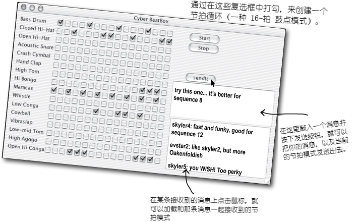

# 例外处理：风险行为

**Exception Handling: Risky Behavior**

> 那肯定有风险，但在有什么事情出错的时候，可以处理风险。

**发生了状况。文件不在那里。服务器宕机了**。不过你是多么优秀的程序员，都没办法掌控所有事情。总会有些事情会出错。甚至错得离谱。在编写有风险的方法时，就需要代码来处理可能发生的不好情况。那么怎么知道某个方法具有风险呢？同时又要把 *处理* **例外** 情形的代码放在哪里呢？到目前为止，都还没有真正面对过任何风险。在运行时确实有出错的情况，但这些问题主要是自己编写代码的缺陷。也就是代码漏洞（bugs）。这些在开发时（development time, compilation time and runtime）都可以修复。然而这一章所说的问题处理代码，指的不是之前的那种，而是在运行时无法确保可以工作的代码。比如那些期望文件就在某个目录、服务器是在运行，或者线程确实保持睡眠等等的代码。同时也必须完成对异常处理的掌握。因为就要构建一个 “MIDI 音乐播放器”了。

## 构造一个“Music Machine”的应用

在接下来的三章，会构建几个有着些许不同的声音应用，包括一个 “BeatBox Drum Machine”。实际上，在本教程完结时，就会写出一个可以把鼓节拍循环，像聊天室应用一样中聊天一样，发送给其他玩家的多玩家版本。虽然可以从GUI章节拷贝写好的程序，不过也可以马上开始编写这个应用的各个部分。

虽然不是每个IT部门都需要这样的一个 “BeatBox” 服务器，这里编写这个应用的目的是更好地掌握 Java 语言。构建的目的是在学习 Java 时可以带来些乐趣而已。

**完工后的 “BeatBox” 应用看起来像下面这样**：

*图 1 - 完成后的“BeatBox”应用*

玩法是在16个“节拍”的各种乐器的复选框中打勾。比如，
