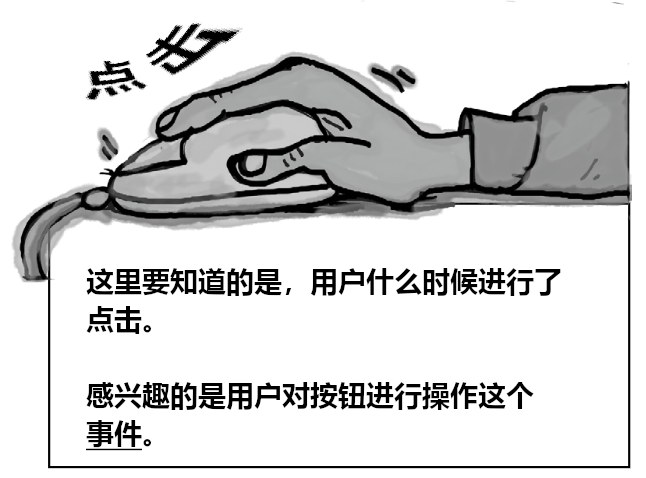
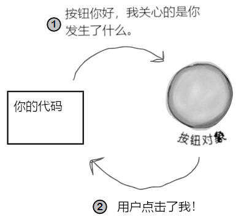
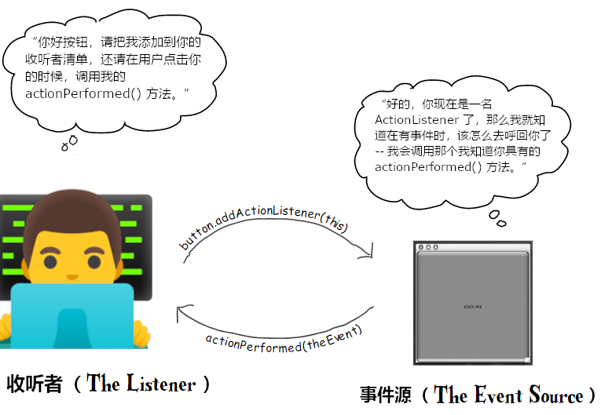
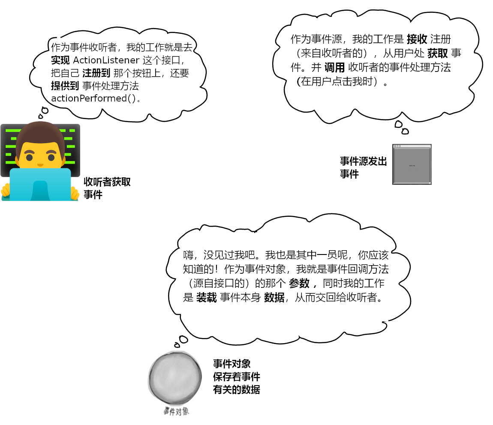

# 获取GUI，一个甚为形象的故事

> 我听说你前任只会做命令行的饭（I heard your ex-wife could only cook command-line meals）？
>
> 喔！这可真是棒极了。呈现真是至关重要啊（Wow! This looks great. I guess presentation really is everything）。

**就承认了吧，你得构造 GUIs 的 App**。在构建的 app 会被其他人用到时，那么就需要图形界面。在构建自己要用的App时，也会想要个图形界面。就算余生都将编写服务器端代码，客户端界面全是web页面，也会早晚会编写一些工具，那个时候也会用到图形界面。当然，命令行的 apps 是复古的，但却并不是一种良好的形式。命令行App功能很弱、不够灵活，还不友好。后续会用两章篇幅，来学习图形用户界面，并随之而了解包括 **事件处理（Event Handling）** 及 **内联类（Inner Classes）** 等 Java 语言的关键特性。这一章中，会将按钮放置在屏幕上，并在点击这个按钮时，让按钮完成一些事情。然后会在屏幕上进行绘制，显示一张 `jpeg` 的图片出来，甚至还会制作一些动画。


## 全都是从一个视窗开始

**It all starts with a `windows`**


> **如果再让我看到一个命令行的 app, 那么你就滚蛋吧**。
>
> **If I see one more commanl-line app, you're fired**.

`JFrame` 是表示屏幕上视窗的对象。在那里就可以放上诸如按钮、复选框、文本字段等的用户界面元素。真的还可以有个用起来不错、带一些菜单项的菜单栏。不管在哪个平台，视窗都会有那些小小的视窗图标，用于视窗的最小化、最大化及关闭。

根据所在平台的不同，`JFrame`就会有不同的样子。下面是在 Mac OS X 上某个 `JFrame`的样子：


*图 1 - 带有一个菜单栏与两个“小部件”：一个按钮及一个单选按钮的 `JFrame`*

> A `JFrame` with a menu bar and two 'widgets' (a button and a radio button)

### 把小部件放进视窗中

在有了一个 `JFrame` 之后，通过把物件（小部件，“widgets”）添加到这个 `JFrame`，这样就把这些物件放进了这个`JFrame`所表示的视窗中了。可以添加到`JFrame`的 `Swing` 组件相当多；在 `javax.swing`包中可以找到他们。最常用部件包括 `JButton`、`JRadioButton`、`JCheckBox`、`JLabel`、`JList`、`JScrollPane`、`JSlider`、`JTextArea`、`JTextField`，以及`JTable`等。其中大部分使用起来都很简单，但有些（比如 `JTable`）用起来就有点复杂。


### 构造一个GUI不难：

1) 构造一个帧（一个 `JFrame`）:


```java
JFrame frame = new JFrame();
```

2) 构造一个小部件（widget, 如按钮、文本字段等等）：

```java
JButton button = new JButton("点我");
```

3) 把这个小部件添加到帧

```java
// 并没有 直接 把物件添加到帧。可把帧当作是视窗周围的
// 窗框（the trim around the window），而把物件放在窗玻璃上的
frame.getContentPane().add(button);
```

4) 显示这个帧（给予其一个尺寸并令其可见）

```java
frame.setSize(300, 300);
frame.setVisible(true);
```

### 第一个GUI：在帧上的一个按钮


```java
// 不要忘了导入这个 swing 包（这里的 ‘x’ 表示 'extension'）
import javax.swing.*;

public class SimpleGui1 {
    public static void main (String [] args) {
        // 构造一个帧与按钮（可把希望在按钮上显示的文本，传递
        // 给按钮的构造器）
        JFrame frame = new JFrame();
        JButton button = new JButton("点击我");

        // 这行语句使得程序可在关闭视窗时，尽快退出（若没有
        // 这行语句，那么程序就会一直在屏幕上）
        frame.setDefaultCloseOperation(JFrame.EXIT_ON_CLOSE);

        // 将上面构造的按钮，添加到帧的窗格
        frame.getContentPane().add(button);

        // 给予该帧一个尺寸，是以像素为单位的
        frame.setSize(300, 300);

        // 最后，让该帧可见！！！（若忘记这一步，那么在运行
        // 这段代码时什么也看不到。）
        frame.setVisible(true);
    }
}
```

### 不过在点击这个按钮时，什么也没发生......

准确来说这样讲有点背离事实。在按下按钮时，按钮会展示“被按下”或“按进去”的样子（具体看起来怎样，跟平台的外观和感受有关，但不论在何种平台，在按钮被按下时，都会发生一些改变）。

然而真正的问题在于，“怎样才能让按钮在用户按下时，去执行某些特定操作（How do I get the button to do something specific when the user clicks it）?”。


**这里就需要两个东西**：

1) 在用户点击时，要调用到的 **方法** （即作为按钮点击结果的、所想要的东西）。

2) 一种 **获悉** 何时触发这个方法的机制。也就是说，一种获悉用户在什么时候点击了按钮的方式！



*图 2 - GUI 编程关注点：小部件上的事件*


## 答疑

- **在Windows 上运行 Java GUI程序时，按钮看起来会像个 Windows 的按钮吗**？

> 想要就可以。可从少数几种“外观及体验” -- 对应核心库中控制用户界面式样的几个类中加以选择。多数情况下，可以在至少两种外观之间加以选择：一种是被称作 ***`Metal`*** 的Java 标准的、同时也是平台的原生外观与体验；而这本书中使用的 Mac OS X 截屏，有的是 OS X 的 ***`Aqua`*** 主题，有的则是 ***`Metal`*** 外观与体验。


- **可以构造一个总是 Aqua 主题的程序吗？即便是运行在Windows下也要一直是Aqua主题的**。

> 注：Aqua 是苹果公司 MacOS 的主题外观。参见：[Aqua(GUI)](https://zh.wikipedia.org/wiki/Aqua_(GUI))

> 不可以。并不是在每个平台上全部外观与体验都是可行的。为了保持安全，那么就应该把外观和体验都设置为 ***`Metal`***，这样不管 app 运行在哪里，都能准确知道可以得到什么外观与体验，否则就干脆不指定外观与体验，而接受默认的样子。

- **听说 `Swing` 慢如蜗牛，没有人用这玩意儿**。

> 以前或许是这样，现在可不是这样了。在性能差的机器上，或许会感受到 `Swing` 的痛点。但只要是一台不那么老旧的机器，在使用 Java 版本1.3及以后的版本的情况下，甚至感受不到 `Swing` GUI 与原生GUI的有什么不同。时至今日，`Swing`在所有类别的app中都有重度使用。 


## 获取用户事件

**Getting a user event**

设想打算在用户按下按钮时，按钮上的文字由 *点击我* 改编为 *我已被点击*。首先可以编写一个修改按钮文本的方法（快速参考 API 文档就会发现修改按钮文本的方法`setText()`）:

```java
public void changeIt () {
    button.setText("我已被点击");
}
```

然而接下来呢？怎么知道这个方法应该什么时候运行呢？*怎么知道按钮在什么时候被点击的呢*？

在 Java 中，用户事件的获取与处理的过程，叫做 *事件处理（event-handling）*。尽管Java中有许多不同的事件类型，但绝大部分都涉及到 GUI 下的用户操作。在用户点击了某个按钮时，那就是一个事件。一个讲说“用户希望该按钮相对应的动作发生”的事件。假如按钮是个“慢节奏”按钮，那么用户就希望出现一个慢节奏的操作（An event that says "The user wants the action of this button to happen." If it's a "Slow Tempo" button, the user wants the slow-tempo action to occur）。又假如是个聊天客户端中的 “发送” 按钮，那么用户就希望出现一个“发送我的消息”的动作。因此最直接的事件就是，在用户点击按钮时，去表明他们是想要某个动作发生。

对于这些按钮，通常无需关心诸如 `button-is-being-pressed`及`button-is-being-released`这样的中间事件。想对按钮说的，实际上是“我不介意用户如何操作按钮，以及用户把鼠标悬停在按钮上多长时间，也不关心用户在按下按钮前改变了多少次注意和移开了多少次鼠标光标等等，***只要告诉我什么时候用户拿定主意就行***！也就是说，除了在用户点击按钮，表示他希望这个该死的按钮去干按钮要干的事情外，都不要说什么！”

**首先，按钮需要知道外界关心什么**

**First, the button needs to know what we care**.




*图 3 - Java中GUI事件处理*


**其次，按钮（GUI组件）需要某种在按钮点击事件发生时，呼回我们的方式（Second, the button needs a way to call us back when a button-clicked event occurs）**。

### 脑力大挑战

1) 到底怎样去通知某个按钮对象，你对其事件的关注？表明你是一个攸关的（事件）收听方（How could you tell a button object that you care about its events? That you're a concerned listener）？

2) 假设没有路径可以告知按钮那个独特方法名字（即`changeIt()`）的情况下，按钮又是在事件发生后怎样呼回的？那么还可以运用什么其他的东西来告知按钮，在事件发生时可以调用我们的特定方法吗？【提示：想想 `Pet` 类】（How will the button call you back? Assume that there's no way for you to tell the button the name of your unique method(`changeIt()`). So what else can we use to reassure the button that we have a specific method it can call when the event happens? [hint: think `Pet`]）


**在关心那个按钮的事件时，就去 *实现一个`interface`*（`JButton`类的），以表明 “正在收听你的事件”**

> 注：可以看着是注册一个 GUI 组件的事件收听者。

**收听者 `interface`** 是 **收听者（`listener`）** （你）与 **事件源（event source）** （按钮） 之间的桥梁。

`Swing` GUI 的那些组件，都属于是事件源。在 Java 词汇表中，事件源指的是可将用户动作（鼠标点击、键盘按键及关闭视窗等），转换为事件的对象（In Java terms, an event source is an object that can turn user actions(click a mouse, type a key, close a window) into events）。与Java中所有其他东西一样，事件本身也是以对象表示的。称之为某事件类的一个对象。通读 API 文档中的 `java.awt.event` 包就会发现，那里有着一大堆的事件类（很容易区分出来 -- 他们的名字中都有 `Event`）。将发现 `MouseEvent`、`KeyEvent`、`WindowEvent`、`ActionEvent`及其他好几种。

> 注：`java.awt.event` 中的 `awt` 表示：抽象视窗工具集，abstract window toolkit。

事件 *源*（比如一个按钮）在用户执行某些重要的操作时（比如 *点击* 按钮），就会创建处一个 *事件对象（event object）*。我们所要编写的大部分代码（以及这里的全部代码），都将 *接收* 事件，而不会 *创建* 事件。也就是说，编程生涯中花的大部分时间，都是作为事件的 *收听者*，而不是作为事件 *源*。

每种事件类型（即每个事件类），都有着一个相匹配的收听者 `interface`。在希望收听到那些 `MouseEvent` 事件时，就要去实现 `MouseLister` `interface`。要收听那些 `WindowEvent` 事件，就去实现 `WindowLister`。明白了吧。还有记住这些 `interface` 的规则 -- 要实现某个 `interface`，就要 *声明* 实现了他（`class Dog implement Pet`），这意味着必须那个 `interface` 中全部方法的具体实现代码。

因为事件本身有着各种区别，造成有些 `interface` 有着不止一个的方法。比如在实现 `MouseListener`时，就会收到 `mousePressed`、`mouseReleased`、`mouseMoved`等等不同事件。尽管这些不同鼠标事件都叫做`MouseEvent`，他们在 `interface` 中却都有单独方法。在实现 `MouseListener`时，在用户（猜测到的）按下鼠标时，就会调用到 `mousePressed()`方法。而在用户放开手指时，就会调用到`mouseReleased()`方法。那么对于这些鼠标事件，就只有一个事件 *对象*，那就是 `MouseEvent`，但却有多个不同的事件 *方法*，用以表示鼠标事件的不同 *类别*。

> 在实现收听者 `interface` 时，就是在赋予给按钮某种呼回的方式。而这个 `interface`，正是这个呼回方法声明的地方。
>
> When you implement a listener interface, you give the button a way to call you back. The interface is where the call-back method is declared.


*图 4 - 各种不同的收听者 `interface`*


### 收听者与事件源之间通信的方式

**How the listener and source communicate**：



*图 5 - Java GUI 事件处理：事件源与收听者*


**事件收听者**

若所编写的类希望获知某个按钮的那些 `ActionEvent` 事件，这个类就要实现 `ActionListener` 的 `interface`。那个按钮需要知道这个类对他的事件感兴趣，因此就要通过调用其`addActionListener(this)`方法，以及将一个`ActionListener` 类型的引用变量传递给`addActionListener()` 方法（在这个示例中，收听者就是所编写的类，因此传递了 `this`），从而注册到这个按钮。按钮需要一种在事件发生时呼回的方式，因此他会调用收听者`interface`中的方法。而作为一名收听者，所编写的类就 *必须* 实现那个接口中的唯一一个方法，`actionPerformed()`。整个过程中，编译器参与进来，确保没有差错。

**事件源**

按钮就是 `ActionEvent` 事件源，因此他必须知悉哪些对象是感兴趣的收听者。按钮有个`addActionListener()`方法，这样那些感兴趣对象（收听者）就有一种告诉按钮，他们对按钮的`ActionEvent`事件感兴趣的方式。

由于某个潜在的收听者的运行，`addActionListener()`就运行起来了，此时按钮就取得整个方法的参数（到收听者对象的引用变量），并存储在他的一个清单中。在用户点击按钮时，按钮就会“启动”通过调用 `actionPerformed()`方法，在清单中的各个收听者上，“启动” 该事件。

### 获取按钮的 `ActionEvent`

1) 实现 `ActionListener` 的 `interface`

2) 在按钮上进行注册（告诉按钮所编写的类想要收听按钮的事件）

3) 定义一个事件处理方法（对 `ActionListener`接口的 `actionPerformed()` 方法加以实现）

```java
package com.xfoss.learningJava;

import javax.swing.*;
// 一条新的、对 ActionListener 和 ActionEvent 所在包
// 进行导入的导入语句
import java.awt.event.*;


// 1) 实现这个接口。这一行讲的是，“SimpleGui 的实例 IS-A
// ActionListener”。
// （按钮只会把事件，交给那些 ActionListener 的实现者们）
public class SimpleGui implements ActionListener {
	JButton b;
	
	public static void main (String[] args) {
		try {
		SimpleGui gui = new SimpleGui();
		gui.go();
		} catch (HeadlessException e) {
			System.out.format("没有显示器，无法运行本程序。\n"
					+ "错误代码\n"
					+ "------------------------------\n%s\n", e);			
		}
	}
	
	public void go () {
        JFrame f = new JFrame ();
        b = new JButton ("点我");
		
        // 2) 在按钮上注册对按钮事件感兴趣。这行对按钮讲，“把我
        // 添加到你的收听者清单”。
        // 这里传递的参数，必须 是某个实现了 ActionListener 接口
        // 的类的对象！！！
        b.addActionListener(this);
        
        f.getContentPane().add(b);
        f.setDefaultCloseOperation(JFrame.EXIT_ON_CLOSE);
        f.setSize(300, 300);
        f.setVisible(true);
	}
	
    // 3) 对 ActionListener 接口的 actionPerformed() 方法进行实现......
    // 这就是那个具体的事件处理方法!
    // 
    // 按钮调用他的这个方法，来让用户知道某个事件发生了。此方法会将一个
    // ActionEvent 对象，作为参数发送给收听者，不过这里并不需要这个
    // 参数。这里知道事件发生了就足够了。
    public void actionPerformed (ActionEvent ev) {
        // 可以这样写：
        // JButton x = (JButton) ev.getSource();
        // x.setText("我已经被点击了!");
        //
        b.setText("我已经被点击了!");
        System.out.format("按钮 “%s” 被点击\n", ev.getActionCommand());
    }
}
```

## 收听者、事件源与事件

**Listeners，Sources，and Events**

对于今后闪亮的Java职业生涯而言，咱们自己多半不会成为事件 *源*。

（不管在你的社交圈子中有多么的优秀）。

要习惯这一点。*作为Java程序员，做好事件收听者就够了*。

（实际上在社交生活中，做好一名默默的听别人讲话的听众，也是有利于社交技能的。）




*图 6 - Java GUI 事件处理：事件收听者、源与事件对象*


## 答疑

- **为什么编写的类自己不能成为事件源（Why can't I be a source of events）**？

> 这是可以的。上面说的只是多数时候我们是事件接收者（至少在Java编程生涯的早期阶段是这样）。我们所可能关注的绝大部分事件，都是由 Java API 中的类“启动”的，这样所有要做的，就是做好这些事件的收听者。当然也会遇到设计的程序需要某种定制事件的情形，比如一个股市盯盘 app 发现发生了 app 认为重要的事情时，就会抛出一个 `StockMarketEvent`的事件出来。这时就要把 `StockWatcher` 对象造成一个事件源，不仅如此，还要完成与按钮（或其他事件源）所完成的那些一样的事情 -- 为定制事件构造收听者`interface`，提供到事件注册方法（`addStockListener()`），以及在有人调用到`StockWatcher`对象时，将调用者（某个收听者）添加到他自己的收听者清单。完成这些之后，那么当出现某个股市事件时，`StockWatcher`对象，就会实例化出一个 `StockEvent`（另一个需要编写的类） 对象，并通过调用那些收听者的 `stockChanged(StockEvent ev)`方法，把这个对象发送给那些收听者。还有不要忘记，对于每种 *事件类型*，都必须要有一个 *相应的收听者接口（a matching listener interface）*（那么就需要创建一个带有 `stockChanged()` 方法的 `StockListener` 接口出来）。


- **在上面的代码实例中，并未见识到传递给事件回调方法参数的重要性（the importance of the event object that's passed to the event call-back methods）。在有人调用了我的 `mousePressed` 方法时，我还需要其他的什么信息吗**？

> 很多时候，对于大部分设计来说，都不需要事件对象本身。事件对象除了作为一个数据承载者，用于发送事件的更多信息外，也没什么其他用途。不过在有的时候，就可能需要从事件对象查询一些事件的具体细节。比如在`mousePressed()`方法被调用到时，就知道有鼠标按键被按下。但是若需要准确知道鼠标在何处被按下呢？也就是说，若需要知道鼠标到底是在屏幕上的哪个X与Y坐标处被按下的时候。
>
> 也会有同一个收听者被注册到 *多个* 事件源对象的情况。比如有这么一个屏上计算器 app（an onscreen calculator），他有着10个数字按键且都会做同样的事情，这样就不大可能为每个按键都构造一个单独的收听者。那么就会把单个收听者同时注册到这10个按键上，那么在接收到某个事件时（由于收听者的回调方法被调用到），就可以调用事件对象上的某个方法，来找出事件的真实事件源来。也就是找出是哪个按键发出的这个事件。

- **我该怎样知道某个对象是不是事件源**？

> 去翻翻 API 文档。


- **好吧，那要去找什么呢**？

> 就是那些以 `add` 开头、`Listener`结束，且还会接收一个收听者`interface`参数的方法。比如在看到了：

```java
addKeyListener(KeyListener k)
```

> 就应该知道，带有此方法的那个类，就是一个 `KeyEvent` 事件的事件源。显然在这点上有着某种命名范式。


## 回到图形......

**Getting back to graphics......**


既然现在已对事件运行机制有了基本掌握（后续会学到更多有关事件的内容），那么就让我们回到往屏幕上放物件吧。在再次回到事件处理上去之前，先来花点时间来玩一下，看看几种获得图形的好玩方式。

**往GUI上放物件有三种方式**：

1) **在帧上放置小部件（Put widgets on a frame）**

此方式可以把按钮、菜单、单选按钮等小部件放上去。


```java
frame.getContentPane().add(myButton);
```

`javax.swing`包有着十多种小部件类型。


*图 7 - 往GUI上放东西之一：把`javax.swing`中的小部件放在帧上*


2) **在小部件上绘制 2D 图形**

运用图形对象，来绘制形状。

```java
graphics.fillOval(70, 70, 100, 100);
```

除了方块和圆形之外，还可以绘制很多很多的形状；`Java2D` API 充满了有趣、复杂的图形方法。


3) 把 JPEG 图片放在小部件上

可将自己的图像放在某个小部件上。

```java
graphics.drawImage(myPic, 10, 10, this);
```


