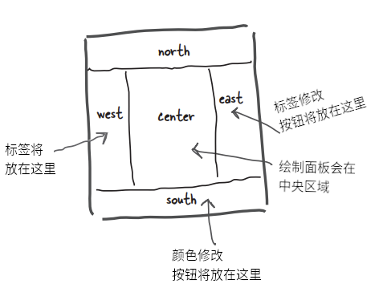

# 获取GUI，一个甚为形象的故事

> 我听说你前任只会做命令行的饭（I heard your ex-wife could only cook command-line meals）？
>
> 喔！这可真是棒极了。呈现真是至关重要啊（Wow! This looks great. I guess presentation really is everything）。

**就承认了吧，你得构造 GUIs 的 App**。在构建的 app 会被其他人用到时，那么就需要图形界面。在构建自己要用的App时，也会想要个图形界面。就算余生都将编写服务器端代码，客户端界面全是web页面，也会早晚会编写一些工具，那个时候也会用到图形界面。当然，命令行的 apps 是复古的，但却并不是一种良好的形式。命令行App功能很弱、不够灵活，还不友好。后续会用两章篇幅，来学习图形用户界面，并随之而了解包括 **事件处理（Event Handling）** 及 **内联类（Inner Classes）** 等 Java 语言的关键特性。这一章中，会将按钮放置在屏幕上，并在点击这个按钮时，让按钮完成一些事情。然后会在屏幕上进行绘制，显示一张 `jpeg` 的图片出来，甚至还会制作一些动画。


## 全都是从一个视窗开始

**It all starts with a `windows`**


> **如果再让我看到一个命令行的 app, 那么你就滚蛋吧**。
>
> **If I see one more commanl-line app, you're fired**.

`JFrame` 是表示屏幕上视窗的对象。在那里就可以放上诸如按钮、复选框、文本字段等的用户界面元素。真的还可以有个用起来不错、带一些菜单项的菜单栏。不管在哪个平台，视窗都会有那些小小的视窗图标，用于视窗的最小化、最大化及关闭。

根据所在平台的不同，`JFrame`就会有不同的样子。下面是在 Mac OS X 上某个 `JFrame`的样子：


*图 1 - 带有一个菜单栏与两个“小部件”：一个按钮及一个单选按钮的 `JFrame`*

> A `JFrame` with a menu bar and two 'widgets' (a button and a radio button)

### 把小部件放进视窗中

在有了一个 `JFrame` 之后，通过把物件（小部件，“widgets”）添加到这个 `JFrame`，这样就把这些物件放进了这个`JFrame`所表示的视窗中了。可以添加到`JFrame`的 `Swing` 组件相当多；在 `javax.swing`包中可以找到他们。最常用部件包括 `JButton`、`JRadioButton`、`JCheckBox`、`JLabel`、`JList`、`JScrollPane`、`JSlider`、`JTextArea`、`JTextField`，以及`JTable`等。其中大部分使用起来都很简单，但有些（比如 `JTable`）用起来就有点复杂。


### 构造一个GUI不难：

1) 构造一个视窗框（一个 `JFrame`）:


```java
JFrame frame = new JFrame();
```

2) 构造一个小部件（widget, 如按钮、文本字段等等）：

```java
JButton button = new JButton("点我");
```

3) 把这个小部件添加到窗框

```java
// 并没有 直接 把物件添加到窗框。可把窗框当作是视窗周围的
// 窗框（the trim around the window），而把物件放在窗玻璃上的
frame.getContentPane().add(button);
```

4) 显示这个窗框（给予其一个尺寸并令其可见）

```java
frame.setSize(300, 300);
frame.setVisible(true);
```

### 第一个GUI：在窗框上的一个按钮


```java
// 不要忘了导入这个 swing 包（这里的 ‘x’ 表示 'extension'）
import javax.swing.*;

public class SimpleGui1 {
    public static void main (String [] args) {
        // 构造一个窗框与按钮（可把希望在按钮上显示的文本，传递
        // 给按钮的构造器）
        JFrame frame = new JFrame();
        JButton button = new JButton("点击我");

        // 这行语句使得程序可在关闭视窗时，尽快退出（若没有
        // 这行语句，那么程序就会一直在屏幕上）
        frame.setDefaultCloseOperation(JFrame.EXIT_ON_CLOSE);

        // 将上面构造的按钮，添加到窗框的窗格
        frame.getContentPane().add(button);

        // 给予该窗框一个尺寸，是以像素为单位的
        frame.setSize(300, 300);

        // 最后，让该窗框可见！！！（若忘记这一步，那么在运行
        // 这段代码时什么也看不到。）
        frame.setVisible(true);
    }
}
```

### 不过在点击这个按钮时，什么也没发生......

准确来说这样讲有点背离事实。在按下按钮时，按钮会展示“被按下”或“按进去”的样子（具体看起来怎样，跟平台的外观和感受有关，但不论在何种平台，在按钮被按下时，都会发生一些改变）。

然而真正的问题在于，“怎样才能让按钮在用户按下时，去执行某些特定操作（How do I get the button to do something specific when the user clicks it）?”。


**这里就需要两个东西**：

1) 在用户点击时，要调用到的 **方法** （即作为按钮点击结果的、所想要的东西）。

2) 一种 **获悉** 何时触发这个方法的机制。也就是说，一种获悉用户在什么时候点击了按钮的方式！


*图 2 - GUI 编程关注点：小部件上的事件*


## 答疑

- **在Windows 上运行 Java GUI程序时，按钮看起来会像个 Windows 的按钮吗**？

> 想要就可以。可从少数几种“外观及体验” -- 对应核心库中控制用户界面式样的几个类中加以选择。多数情况下，可以在至少两种外观之间加以选择：一种是被称作 ***`Metal`*** 的Java 标准的、同时也是平台的原生外观与体验；而这本书中使用的 Mac OS X 截屏，有的是 OS X 的 ***`Aqua`*** 主题，有的则是 ***`Metal`*** 外观与体验。


- **可以构造一个总是 Aqua 主题的程序吗？即便是运行在Windows下也要一直是Aqua主题的**。

> 注：Aqua 是苹果公司 MacOS 的主题外观。参见：[Aqua(GUI)](https://zh.wikipedia.org/wiki/Aqua_(GUI))

> 不可以。并不是在每个平台上全部外观与体验都是可行的。为了保持安全，那么就应该把外观和体验都设置为 ***`Metal`***，这样不管 app 运行在哪里，都能准确知道可以得到什么外观与体验，否则就干脆不指定外观与体验，而接受默认的样子。

- **听说 `Swing` 慢如蜗牛，没有人用这玩意儿**。

> 以前或许是这样，现在可不是这样了。在性能差的机器上，或许会感受到 `Swing` 的痛点。但只要是一台不那么老旧的机器，在使用 Java 版本1.3及以后的版本的情况下，甚至感受不到 `Swing` GUI 与原生GUI的有什么不同。时至今日，`Swing`在所有类别的app中都有重度使用。 


## 获取用户事件

**Getting a user event**

设想打算在用户按下按钮时，按钮上的文字由 *点击我* 改编为 *我已被点击*。首先可以编写一个修改按钮文本的方法（快速参考 API 文档就会发现修改按钮文本的方法`setText()`）:

```java
public void changeIt () {
    button.setText("我已被点击");
}
```

然而接下来呢？怎么知道这个方法应该什么时候运行呢？*怎么知道按钮在什么时候被点击的呢*？

在 Java 中，用户事件的获取与处理的过程，叫做 *事件处理（event-handling）*。尽管Java中有许多不同的事件类型，但绝大部分都涉及到 GUI 下的用户操作。在用户点击了某个按钮时，那就是一个事件。一个讲说“用户希望该按钮相对应的动作发生”的事件。假如按钮是个“慢节奏”按钮，那么用户就希望出现一个慢节奏的操作（An event that says "The user wants the action of this button to happen." If it's a "Slow Tempo" button, the user wants the slow-tempo action to occur）。又假如是个聊天客户端中的 “发送” 按钮，那么用户就希望出现一个“发送我的消息”的动作。因此最直接的事件就是，在用户点击按钮时，去表明他们是想要某个动作发生。

对于这些按钮，通常无需关心诸如 `button-is-being-pressed`及`button-is-being-released`这样的中间事件。想对按钮说的，实际上是“我不介意用户如何操作按钮，以及用户把鼠标悬停在按钮上多长时间，也不关心用户在按下按钮前改变了多少次注意和移开了多少次鼠标光标等等，***只要告诉我什么时候用户拿定主意就行***！也就是说，除了在用户点击按钮，表示他希望这个该死的按钮去干按钮要干的事情外，都不要说什么！”

**首先，按钮需要知道外界关心什么**

**First, the button needs to know what we care**.


*图 3 - Java中GUI事件处理*


**其次，按钮（GUI组件）需要某种在按钮点击事件发生时，呼回我们的方式（Second, the button needs a way to call us back when a button-clicked event occurs）**。

### 脑力大挑战

1) 到底怎样去通知某个按钮对象，你对其事件的关注？表明你是一个攸关的（事件）收听方（How could you tell a button object that you care about its events? That you're a concerned listener）？

2) 假设没有路径可以告知按钮那个独特方法名字（即`changeIt()`）的情况下，按钮又是在事件发生后怎样呼回的？那么还可以运用什么其他的东西来告知按钮，在事件发生时可以调用我们的特定方法吗？【提示：想想 `Pet` 类】（How will the button call you back? Assume that there's no way for you to tell the button the name of your unique method(`changeIt()`). So what else can we use to reassure the button that we have a specific method it can call when the event happens? [hint: think `Pet`]）


**在关心那个按钮的事件时，就去 *实现一个`interface`*（`JButton`类的），以表明 “正在收听你的事件”**

> 注：可以看着是注册一个 GUI 组件的事件收听者。

**收听者 `interface`** 是 **收听者（`listener`）** （你）与 **事件源（event source）** （按钮） 之间的桥梁。

`Swing` GUI 的那些组件，都属于是事件源。在 Java 词汇表中，事件源指的是可将用户动作（鼠标点击、键盘按键及关闭视窗等），转换为事件的对象（In Java terms, an event source is an object that can turn user actions(click a mouse, type a key, close a window) into events）。与Java中所有其他东西一样，事件本身也是以对象表示的。称之为某事件类的一个对象。通读 API 文档中的 `java.awt.event` 包就会发现，那里有着一大堆的事件类（很容易区分出来 -- 他们的名字中都有 `Event`）。将发现 `MouseEvent`、`KeyEvent`、`WindowEvent`、`ActionEvent`及其他好几种。

> 注：`java.awt.event` 中的 `awt` 表示：抽象视窗工具集，abstract window toolkit。

事件 *源*（比如一个按钮）在用户执行某些重要的操作时（比如 *点击* 按钮），就会创建处一个 *事件对象（event object）*。我们所要编写的大部分代码（以及这里的全部代码），都将 *接收* 事件，而不会 *创建* 事件。也就是说，编程生涯中花的大部分时间，都是作为事件的 *收听者*，而不是作为事件 *源*。

每种事件类型（即每个事件类），都有着一个相匹配的收听者 `interface`。在希望收听到那些 `MouseEvent` 事件时，就要去实现 `MouseLister` `interface`。要收听那些 `WindowEvent` 事件，就去实现 `WindowLister`。明白了吧。还有记住这些 `interface` 的规则 -- 要实现某个 `interface`，就要 *声明* 实现了他（`class Dog implement Pet`），这意味着必须那个 `interface` 中全部方法的具体实现代码。

因为事件本身有着各种区别，造成有些 `interface` 有着不止一个的方法。比如在实现 `MouseListener`时，就会收到 `mousePressed`、`mouseReleased`、`mouseMoved`等等不同事件。尽管这些不同鼠标事件都叫做`MouseEvent`，他们在 `interface` 中却都有单独方法。在实现 `MouseListener`时，在用户（猜测到的）按下鼠标时，就会调用到 `mousePressed()`方法。而在用户放开手指时，就会调用到`mouseReleased()`方法。那么对于这些鼠标事件，就只有一个事件 *对象*，那就是 `MouseEvent`，但却有多个不同的事件 *方法*，用以表示鼠标事件的不同 *类别*。

> 在实现收听者 `interface` 时，就是在赋予给按钮某种呼回的方式。而这个 `interface`，正是这个呼回方法声明的地方。
>
> When you implement a listener interface, you give the button a way to call you back. The interface is where the call-back method is declared.


*图 4 - 各种不同的收听者 `interface`*


### 收听者与事件源之间通信的方式

**How the listener and source communicate**：


*图 5 - Java GUI 事件处理：事件源与收听者*


**事件收听者**

若所编写的类希望获知某个按钮的那些 `ActionEvent` 事件，这个类就要实现 `ActionListener` 的 `interface`。那个按钮需要知道这个类对他的事件感兴趣，因此就要通过调用其`addActionListener(this)`方法，以及将一个`ActionListener` 类型的引用变量传递给`addActionListener()` 方法（在这个示例中，收听者就是所编写的类，因此传递了 `this`），从而注册到这个按钮。按钮需要一种在事件发生时呼回的方式，因此他会调用收听者`interface`中的方法。而作为一名收听者，所编写的类就 *必须* 实现那个接口中的唯一一个方法，`actionPerformed()`。整个过程中，编译器参与进来，确保没有差错。

**事件源**

按钮就是 `ActionEvent` 事件源，因此他必须知悉哪些对象是感兴趣的收听者。按钮有个`addActionListener()`方法，这样那些感兴趣对象（收听者）就有一种告诉按钮，他们对按钮的`ActionEvent`事件感兴趣的方式。

由于某个潜在的收听者的运行，`addActionListener()`就运行起来了，此时按钮就取得整个方法的参数（到收听者对象的引用变量），并存储在他的一个清单中。在用户点击按钮时，按钮就会“启动”通过调用 `actionPerformed()`方法，在清单中的各个收听者上，“启动” 该事件。

### 获取按钮的 `ActionEvent`

1) 实现 `ActionListener` 的 `interface`

2) 在按钮上进行注册（告诉按钮所编写的类想要收听按钮的事件）

3) 定义一个事件处理方法（对 `ActionListener`接口的 `actionPerformed()` 方法加以实现）

```java
package com.xfoss.learningJava;

import javax.swing.*;
// 一条新的、对 ActionListener 和 ActionEvent 所在包
// 进行导入的导入语句
import java.awt.event.*;


// 1) 实现这个接口。这一行讲的是，“SimpleGui 的实例 IS-A
// ActionListener”。
// （按钮只会把事件，交给那些 ActionListener 的实现者们）
public class SimpleGui implements ActionListener {
	JButton b;
	
	public static void main (String[] args) {
		try {
		SimpleGui gui = new SimpleGui();
		gui.go();
		} catch (HeadlessException e) {
			System.out.format("没有显示器，无法运行本程序。\n"
					+ "错误代码\n"
					+ "------------------------------\n%s\n", e);			
		}
	}
	
	public void go () {
        JFrame f = new JFrame ();
        b = new JButton ("点我");
		
        // 2) 在按钮上注册对按钮事件感兴趣。这行对按钮讲，“把我
        // 添加到你的收听者清单”。
        // 这里传递的参数，必须 是某个实现了 ActionListener 接口
        // 的类的对象！！！
        b.addActionListener(this);
        
        f.getContentPane().add(b);
        f.setDefaultCloseOperation(JFrame.EXIT_ON_CLOSE);
        f.setSize(300, 300);
        f.setVisible(true);
	}
	
    // 3) 对 ActionListener 接口的 actionPerformed() 方法进行实现......
    // 这就是那个具体的事件处理方法!
    // 
    // 按钮调用他的这个方法，来让用户知道某个事件发生了。此方法会将一个
    // ActionEvent 对象，作为参数发送给收听者，不过这里并不需要这个
    // 参数。这里知道事件发生了就足够了。
    public void actionPerformed (ActionEvent ev) {
        // 可以这样写：
        // JButton x = (JButton) ev.getSource();
        // x.setText("我已经被点击了!");
        //
        b.setText("我已经被点击了!");
        System.out.format("按钮 “%s” 被点击\n", ev.getActionCommand());
    }
}
```

## 收听者、事件源与事件

**Listeners，Sources，and Events**

对于今后闪亮的Java职业生涯而言，咱们自己多半不会成为事件 *源*。

（不管在你的社交圈子中有多么的优秀）。

要习惯这一点。*作为Java程序员，做好事件收听者就够了*。

（实际上在社交生活中，做好一名默默的听别人讲话的听众，也是有利于社交技能的。）


*图 6 - Java GUI 事件处理：事件收听者、源与事件对象*


## 答疑

- **为什么编写的类自己不能成为事件源（Why can't I be a source of events）**？

> 这是可以的。上面说的只是多数时候我们是事件接收者（至少在Java编程生涯的早期阶段是这样）。我们所可能关注的绝大部分事件，都是由 Java API 中的类“启动”的，这样所有要做的，就是做好这些事件的收听者。当然也会遇到设计的程序需要某种定制事件的情形，比如一个股市盯盘 app 发现发生了 app 认为重要的事情时，就会抛出一个 `StockMarketEvent`的事件出来。这时就要把 `StockWatcher` 对象造成一个事件源，不仅如此，还要完成与按钮（或其他事件源）所完成的那些一样的事情 -- 为定制事件构造收听者`interface`，提供到事件注册方法（`addStockListener()`），以及在有人调用到`StockWatcher`对象时，将调用者（某个收听者）添加到他自己的收听者清单。完成这些之后，那么当出现某个股市事件时，`StockWatcher`对象，就会实例化出一个 `StockEvent`（另一个需要编写的类） 对象，并通过调用那些收听者的 `stockChanged(StockEvent ev)`方法，把这个对象发送给那些收听者。还有不要忘记，对于每种 *事件类型*，都必须要有一个 *相应的收听者接口（a matching listener interface）*（那么就需要创建一个带有 `stockChanged()` 方法的 `StockListener` 接口出来）。


- **在上面的代码实例中，并未见识到传递给事件回调方法参数的重要性（the importance of the event object that's passed to the event call-back methods）。在有人调用了我的 `mousePressed` 方法时，我还需要其他的什么信息吗**？

> 很多时候，对于大部分设计来说，都不需要事件对象本身。事件对象除了作为一个数据承载者，用于发送事件的更多信息外，也没什么其他用途。不过在有的时候，就可能需要从事件对象查询一些事件的具体细节。比如在`mousePressed()`方法被调用到时，就知道有鼠标按键被按下。但是若需要准确知道鼠标在何处被按下呢？也就是说，若需要知道鼠标到底是在屏幕上的哪个X与Y坐标处被按下的时候。
>
> 也会有同一个收听者被注册到 *多个* 事件源对象的情况。比如有这么一个屏上计算器 app（an onscreen calculator），他有着10个数字按键且都会做同样的事情，这样就不大可能为每个按键都构造一个单独的收听者。那么就会把单个收听者同时注册到这10个按键上，那么在接收到某个事件时（由于收听者的回调方法被调用到），就可以调用事件对象上的某个方法，来找出事件的真实事件源来。也就是找出是哪个按键发出的这个事件。

- **我该怎样知道某个对象是不是事件源**？

> 去翻翻 API 文档。


- **好吧，那要去找什么呢**？

> 就是那些以 `add` 开头、`Listener`结束，且还会接收一个收听者`interface`参数的方法。比如在看到了：

```java
addKeyListener(KeyListener k)
```

> 就应该知道，带有此方法的那个类，就是一个 `KeyEvent` 事件的事件源。显然在这点上有着某种命名范式。


## 回到图形......

**Getting back to graphics......**


既然现在已对事件运行机制有了基本掌握（后续会学到更多有关事件的内容），那么就让我们回到往屏幕上放物件吧。在再次回到事件处理上去之前，先来花点时间来玩一下，看看几种获得图形的好玩方式。

**往GUI上放物件有三种方式**：

1) **在窗框上放置小部件（Put widgets on a frame）**

此方式可以把按钮、菜单、单选按钮等小部件放上去。


```java
frame.getContentPane().add(myButton);
```

`javax.swing`包有着十多种小部件类型。


*图 7 - 往GUI上放东西之一：把`javax.swing`中的小部件放在窗框上*


2) **在小部件上绘制 2D 图形**

运用图形对象，来绘制形状。

```java
graphics.fillOval(70, 70, 100, 100);
```

除了方块和圆形之外，还可以绘制很多很多的形状；`Java2D` API 充满了有趣、复杂的图形方法。


3) **把 JPEG 图片放在小部件上**

可将自己的图像放在某个小部件上。

```java
graphics.drawImage(myPic, 10, 10, this);
```


## 构造自己的绘制小部件

**Make your own drawing widget**

在打算把自己的图形放到屏幕上时，最好是构造自己的可绘制小部件。随后把自己构造的可绘制小部件，就像按钮或所有其他小部件一样，丢到窗框上即可，不同之处在于，可在自己构造的小部件上，显示出自己的图像来。此外甚至还可以令到这些图像以动画的形式动起来，或者制作出伴随鼠标点击，而改变屏幕上颜色的效果。

在 Java GUI 种实现这些特效，就是小菜一碟的事情（It's a piece of cake）。

只需 **构造一个 `JPanel` 的子类，并重写 `JPanel` 中的一个方法 `paintComponent()`** 即可。

> 注意：这里的 `JPanel` 与上面出现的 `pane`，一字之差，`JPanel` 是面板小部件，可直接绘制，而 `pane` 是视窗格，有区别。

把自己的有关图形的全部代码，都放在 `paintComponent()` 方法中。可把 `paintComponent()`方法，当作由系统调用的方法，他讲到，“你好呀，小部件，现在要给你绘图了。” 而比如在想要绘制一个圆圈时，`paintComponent()`方法中就应该放入画圆圈的代码。就在那个驻留着正在绘制的视窗窗格的视窗框，显示出来的时候，就会调用到`paintComponent()`方法，从而所画的圆圈就会呈现出来。在用户最小化而把视窗隐藏起来时，JVM 就知道，这个窗框需要在其重新显示的时候“加以修复”，那么 JVM 就会再次调用 `paintComponent()`。而后只要JVM认为显示内容需要刷新，他都会对我们编写的 `paintComponent()`方法进行调用。


此外，*这个方法绝不会由代码编写者自己去调用*！该方法的参数（一个 `Graphics` 对象），就是那个真正的、贴到 *真实* 显示器上的绘制画布（the actual drawing canvas that gets slapped onto the *real* display）。代码编写者是无法自己获取到这个 `Graphics` 对象的；而只能由系统交到代码编写者手上。这一点在后面就能看到，不过 *可以* 请求系统刷新显示屏（即`repaint()`方法），这种刷新最终也是导致 `paintComponent()` 方法的调用。

```java
// 同时需要下面的两个包
import java.awt.*;
import javax.swing.*;

// 构造一个 JPanel 的子类，即一个可像其他小部件一样，添加
// 到视窗框的小部件。不过这样的小部件是自己定制的而已。
class MyDrawPanel extends JPanel {

    // 这可是终极图形方法（This is the Big Important 
    // Graphics method）。代码编写者绝不会自己调用到这个
    // 方法的。系统会调用这个方法，并说，“这里有个类型为 Graphics 
    // 现在就可以在上面绘画的、很好的绘制平面。”
    public void paintComponent (Graphics g) {

        // 可把 'g' 想象为一台绘画机器。我们就在告诉
        // 他用哪种颜色绘画，以及要绘制什么形状（以坐标
        // 表示这个形状在哪里以及又多大）
        g.setColor(Color.orange);
        g.fillRect(20, 50, 100, 100);
    }
}
```


*图 10 - Java GUI 中编写自己的小部件示例：绘制一个橙色的矩形*


## 在 `paintComponent()` 方法中干些有趣的事情

**Fun things to do in `paintComponent()`**


下面来看看在 `paintComponent()` 中可以干点别的什么事。最好玩的，就在自己开始体验的时候了。开始是以一些数字来操纵这个方法，然后检查类 `Graphics` 的API文档（后面还会发现，可以类 `Graphics` 本身的那些东西之外，还可以有更多玩法）。

### 显示一张 `JPEG` 图片

```java
package com.xfoss.learningJava;

import java.awt.*;
import javax.swing.*;

public class CustomWidgetTestDrive {
    public static void main (String[] args) {
        try {
            CustomDrawPanel p = new CustomDrawPanel();
            JFrame f = new JFrame ();
            f.add(p);

            f.setDefaultCloseOperation(JFrame.EXIT_ON_CLOSE);
            f.setSize(1024, 768);
            f.setVisible(true);
        } catch (HeadlessException e) {
            System.out.format("没有显示器，无法运行本程序。\n"
                    + "错误代码\n"
                    + "------------------------------\n%s\n", e);			
        }
    }
}

class CustomDrawPanel extends JPanel {
    public void paintComponent (Graphics g) {
        // 图像文件名放在这一行中。注意：在使用某种IDE而
        // 有困难时，可尝试使用下面的代码：
        Image image = new ImageIcon(getClass().getResource("Defautl.jpeg")).getImage();
        // Image image = new ImageIcon("Default.jpeg").getImage();
        //
        // 这里的 '3, 4' x/y 坐标，表示图片的左上角应该在
        // 的位置。意思是“离窗格左边缘 3 个像素，离窗格
        // 上边缘 4 个像素”。这些数字，都是相对于小部件
        // 的（此示例中，就是这里的 JPanel 的子类），而
        // 不是整个的视窗框
        g.drawImage(image, 3, 4, this);
    }
}
```


*图 11 - Java GUI构造自己的小部件：显示一个图片*


### 在黑背景上绘制一个随机颜色的圆圈

```java
public void paintComponent (Graphics g) {
    // 用黑色（默认颜色）填充整个窗格
    //
    // 前两个参数，定义了绘制开始的地方，也就是窗格左上角的
    // 相对于整个窗格的（x, y）坐标，因此 （0，0）就表示
    // “从离左边缘 0 像素及从上边缘的 0 像素开始”。另外两个
    // 参数说，“让该矩形的宽度为窗格的宽度（this.width()）
    // 且让其高度与窗格的高度（this.height()）一样高”
    g.fillRect(0, 0, this.getWidth(), this.getHeight());

    int red = (int) (Math.random() * 256);
    int green = (int) (Math.random() * 256);
    int blue = (int) (Math.random() * 256);

    // 可通过传入 3 个表示 RGB 数值的整数，来构造某种颜色。
    Color randomColor = new Color(red, green, blue);
    g.setColor(randomColor);
    // 从离左边缘 70 像素，离顶部 70 像素的地方
    // 开始，让其宽度为 100 像素，高度为 100 像素
    g.fillOval(70, 70, 100, 100);
}
```


### 本质：在每个优良的 `Grphics` 引用变量后面，都有一个 `Graphics2D` 对象

**Behind every good `Graphics` reference is a `Graphics2D` object**


`paintComponent()`的参数，被声明为类型 `Graphics` （`java.awt.Graphics`）。

```java
public void paintComponent(Graphics g) {}
```

那么这个参数 `g` IS-A `Graphics` 对象。这就意味着他 *可以* 是 `Graphics` 的 *子类* （因为多态机制）。实际上他 *就是*。

***参数 `g` 所指向的对象，实际上是类* `Graphics2D` 的一个实例**。

为什么要留意这个呢？因为用 `Graphics2D` 能够办到的很多事，是 `Graphics` 类类型的引用变量所无法做到的。`Graphics2D`对象可以完成比 `Graphics` 对象更多的事情，而实际上在这个 `Graphics` 引用变量背后，就是 `Graphics2D` 对象在发力。

请牢记多态机制。编译器是基于引用变量类型，而不是对象本身类型，来确定可以调用到哪些方法。比如某个 `Dog`类类型的对象，被一个 `Animal` 类型的引用变量所引用时：

```java
Animal a = new Dog();
```

那就不能这样写：

```java
a.bark();
```

就算我们知道那里确实是个 `Dog` 对象。编译器盯住的是 `a`，他所见到的 `a` 就是一个 `Animal` 类型，进而发现在 `Animal` 类上并没有 `bark()` 的遥控器。不过还是可以通过下面这样，把这个对象变为他本来 *就是* 的`Dog`类型：

```java
Dog d = (Dog) a;
d.bark();
```

> 注：这实际上是 Java 的 `cast` 运算符。

那么接下来的这行带有 `Graphics` 对象的代码，是这个意思：

**在需要使用`Graphics2D`上的某个方法时，无法从`paintComponent()` 方法参数 `g` 直接调用到那个方法。不过可以使用一个新的 `Graphics2D` 变量，来对 `g` 进行 *`cast`* 操作**。

```java
Graphics2D g2d = (Graphics2D) g;
```

+ **在 `Graphics` 类型引用变量上可以调用的方法**：
    - `drawImage()`
    - `drawLine()`
    - `drawPolygon()`
    - `drawRect()`
    - `drawOval()`
    - `fillRect()`
    - `fillRoundRect()`
    - `setColor()`


+ **把实际上的 `Graphics2D` 对象，进行 `cast` 操作而得到一个 `Graphics2D` 的引用变量**：

```java
Graphics2D g2d = (Graphics2D) g;
```

+ **在 `Graphics2D` 类型引用变量上可以调用的方法**：

    - `fill3DRect()`
    - `draw3DRect()`
    - `rotate()`
    - `scale()`
    - `shear()`
    - `transform()`
    - `setRenderingHints()`

> 注：（这并不是完整的方法清单，可查阅 API 文档了解其他方法）。

### 既然有渐变色来绘制圆圈，那么就不要浪费时间去绘制纯色的了

**Because life's too short to paint the circle a solid color when there's a gradient blend waiting for you**.

```java
// 这里的 'g' 实际上是个 Graphics2D 对象，这里只不过
// 伪装成了一个 Graphics 对象。
public void paintComponent (Graphics g) {
    // 对 'g' 进行 cast 操作，从而就可以调用 Graphics2D
    // 上有，Graphics 上所没有的其余方法
    Graphics2D g2d = (Graphics2D) g;

    // 这里的 (70, 70, Color.blue, 150, 150, Color.orange) 分别是：
    // 开始点（70, 70）、开始的颜色（Color.blue）、结束点（150, 150）和结束颜色
    GradientPaint gradient = new GradientPaint(70, 70, Color.blue, 150, 150, Color.orange);

    // 这行代码将系统的虚拟笔刷，设置为渐变，而不是某种固定颜色
    g2d.setPaint(gradient);
    // fillOval() 方法的本来意思“以系统加载的笔刷（也就是这里的渐变），来填满这个椭圆”
    g2d.fillOval(70, 70, 100, 100);
}
```


*图 13 - Java GUI定制小部件：经由`Graphics2D` 绘制渐变色填充的圆形*

---

```java
// 这段代码与上面的很像，不过这里为渐变笔刷的开始与
// 结束颜色，构造了随机颜色。可以尝试一下！
public void paintComponent (Graphics g) {
    Graphics2D g2d = (Graphics2D) g;

    int red = (int) (Math.random() * 256);
    int green = (int) (Math.random() * 256);
    int blue = (int) (Math.random() * 256);
    Color startColor = new Color(red, green, blue);

    red = (int) (Math.random() * 256);
    green = (int) (Math.random() * 256);
    blue = (int) (Math.random() * 256);
    Color endColor = new Color(red, green, blue);

    GradientPaint gradient = new GradientPaint(70, 70, startColor, 150, 150, endColor);
    g2d.setPaint(gradient);
    g2d.fillOval(70, 70, 100, 70);
}
```

## 重点

### 关于 Java GUI 的事件

- 以一个视窗，通常为 `JFrame` 开始构造 GUI

```java
JFrame frame = new JFrame();
```

- 使用下面这样的代码，可将各种小部件（按钮、文本字段等等）添加到 `JFrame`：

```java
frame.getContentPane().add(button);
```

- `JFrame` 与其他大多数组件不同，`JFrame` 不允许直接添加小部件，而必须将小部件添加到 `JFrame` 的内容窗格
- 为了让视窗（`JFrame`）显示出来，就必须给他一个大小，并让其可见：

```java
frame.setSize(640, 480);
frame.setVisible(true);
```

- 为了获知何时用户点击了某个按钮（或在用户界面上进行的其他操作），就需要对GUI事件进行监听
- 必须在事件源上注册为事件的攸关方，才能收听到那个事件。所谓事件源，指的是在用户操作基础上，“启动”某个事件的物件（按钮、勾选框等等）
- 由于事件收听者 `interface`定义了在事件出现后事件源所调用的方法，从而给到一种事件源对收听者进行回调的方式
- 通过调用事件源的注册方法，在事件源上对事件源的事件进行注册。把收听者的事件处理代码，放在收听者的回调方法中。比如对于 `ActionEvent` 事件，该方法就是：

```java
public void actionPerformed (ActionEvent ev) {
    button.setText("你已点击！");
}
```

- 传入到事件处理器方法的事件对象，承载了包括事件源本身等事件有关的信息。


### 关于 Java GUI 中的图形

- 可在小部件上直接绘制 2D 图形；
- 可在小部件上直接绘制 `.gif` 或 `.jpeg`；
- 而要绘制自己的图形（包括 `.gif` 或 `.jpeg`），就要构造一个 `JPanel` 的子类，并重写 `paintComponent()` 方法；
- `paintComponent()` 方法是由 GUI 系统调用的。**绝不会自己调用到这个方法**。`paintComponent()`的参数，是提供最终在屏幕上显示出来的绘制表面的一个 `Graphics` 对象。此对象不能由代码编写者自己构建；
- 在 `Graphics` 对象上调用到的典型方法有：

```java
g.setColor(Color.blue);
g.fillRect(20, 50, 100, 120);
```

- 使用下面的代码，来构建一个 `Image`，进而绘制出某个 `.jpg`来：

```java
Image image = new ImageIcon("Default.jpg").getImage();
```

并使用下面的语句绘制出该图像：

```java
g.drawImage(image, 3, 4, this);
```

- `paintComponent()` 方法的 `Graphics` 参数所指向的对象，实际上是 `Graphics2D` 类的一个实例。`Graphics2D`类有着多种方法，包括下面这些：

```console
fill3DRect(), draw3DRect(), rotate(), scale(), shear(), transform().......
```

- 必须将 `paintComponent()` 方法的`Graphics`参数，进行 `cast` 操作得到 `Graphics2D`对象引用变量，才能运行`Graphics2D`中的那些方法：

```java
Graphics2D g2d = (Graphics2D) g;
```

## 既然能获取到事件，也可以绘制图形了，那能不能在获取到事件的时候，绘制图形呢？

**We can get an event**.
**We can paint graphics**.
**But can we paint graphics *when* we get an event**?

下面就来把事件与绘制面板上的变化连接起来（Let's hook up an event to a change in our drawing panel）。这里将在每次点击那个“改变颜色”按钮时，令到圆圈的颜色改变。以下就是这个程序运行的流程：


*图 14 - Java GUI 之：事件驱动的图形绘制*

## GUI布局：在一个视窗框上放置多个小部件

**GUI layouts: putting more than one widget on a frame**


> 等一下......怎样才能把两个 **物件** 放在一个视窗框？

虽然下一章才会涵盖有关 GUI 布局的详细内容，但这里还是要稍微讲一下，方便实现上一小节提出的事件与绘制联动的问题。默认情况下，视窗框有五个可以添加小部件的区域。对于视窗框的这五个区域中的每一个，都只能添加 *一个* 物件，但不要惊慌！因为放在每个区域的物件，可能是可以驻留另外三个其他物件，包括又一个可以放入两个物件的面板的面板......明白了吧（You can add only *one* this to each region of a frame, but don't panic! That one thing might be a panel that holds three other things including a panel that holds three other things including a panel that holds two more things and... you get the idea）。实际上之前在把按钮添加到视窗框时，刷了个“诡计”：

```java
// 真正意义上说，并不应该这样写（使用这种单个参数的添加
// 方式，This isn't really the way you're supposed to do it(the 
// one-arg method)）。
frame.getContentPane().add(button);
```

```java
// 这里调用的是带有两个参数的 add() 方法，其中第一个
// 取的是区域（使用了GUI系统的一个常量），另一个就是
// 要添加到那个区域的小部件。
//
// 要把物件添加到视窗框的默认内容窗格，这样写就更好（且通常
// 是强制要求的）。就是全都要指定把小部件放到 哪里 （那个
// 区域）。
frame.getContentPane().add(BorderLayout.CENTER, button);
```


*图 15 - Java GUI layout: 视窗框分区及单个参数的 `add()` 方法下的默认区域*

### 每次点击按钮，圆圈的颜色都会改变。

**The circle changes color each time you click the button**.

```java
package com.xfoss.learningJava;

import javax.swing.*;
import java.awt.*;
import java.awt.event.*;

public class SimpleGui3C implements ActionListener {
    JFrame frame;
    public static void main (String[] args) {
        SimpleGui3C gui = new SimpleGui3C();
        gui.go();
    }

    public void go () {
        frame = new JFrame("事件与绘制图形联动：点击按钮改变圆圈填充颜色实例");
        frame.setDefaultCloseOperation(JFrame.EXIT_ON_CLOSE);

        JButton button = new JButton("改变颜色");
        // 把事件收听者（this），添加到按钮。
        button.addActionListener(this);

        CustomDrawPanel drawPanel = new CustomDrawPanel();
        
        // 把这两个小部件（按钮与绘制面板），分别添加到
        // 视窗框的两个区域
        frame.getContentPane().add(BorderLayout.SOUTH, button);
        frame.getContentPane().add(BorderLayout.CENTER, drawPanel);
        frame.setSize(640, 480);
        frame.setVisible(true);
    }
    public void actionPerformed (ActionEvent ev) {
        // 在用户点击时，就让视窗框去 repaint() 他
        // 自己。而那就意味着视窗框中的所有小部件中的
        // paintComponent() 方法，都会被调用到。
        frame.repaint();
    }
}
```


*图 16 - Java GUI 实例：事件与绘制图形关联*

> 定制的绘制面板小部件（即 `CustomDrawPanel` 实例），现在位于视窗框的 `CENTER` 区域。
>
> 按钮则是在视窗框的 `SOUTH` 区域。

> 现在定制绘制面板（`CustomDrawPanel` 类）的 `paintComponent()` 方法，在每次用户点击时都会被调用到。

## 试试两个按钮

**Let's try it with TWO buttons**

南方的按钮，仍将以目前的方式行事，就是调用视窗框上的 `repaint()`。而新增的第二个按钮（会固定在东方区域）将改变那个标签上的文字。（所谓标签，就是屏幕上的文字，A lable is just text on the screen.）

### 那么现在就有了四个小部件了



*图 17 - Java GUI 之：小部件布局*

### 同时还需要 *两个* 事件

**And we need to get TWO events**

呜哦。

这样可行吗？在只有一个 `actionPerformed()`方法的时候，怎样才能获取到 *两个* 事件呢？


*图 18 - Java GUI 示例：获取两个事件效果展示*

### 在两个按钮需要完成不同事情时，该怎样获取到两个不同按钮的动作事件呢？

**How do you get action events for two different buttons, when each button needs to do something different**?

1) 选项一

**实现两个 `actionPerformed()` 方法**

```java
class MyGui implements ActionListener {
    // 很多代码过后：
    public void actionPerformed(ActionEvent ev) {
        frame.repaint();
    }

    // 然而这样写是行不通的！（回顾一下方法过载就知道）
    public void actionPerformed(ActionEvent ev) {
        label.setText("那真痛！");
    }
}
```

**缺点是：做不到**！在Java类中不能实现同一个方法两次。这样不会编译的。并且就是 *可以*，那么事件源又怎样知道应该调用两个方法中的哪一个呢？


2）选项二

**把同一事件收听者，同时注册到两个按钮上**。

```java
class MyGui implements ActionListener {
    // 在这里声明一堆实例

    public void go {
        // 构建 GUI
        colorButton = new JButton("改变圆圈");
        labelButton = new JButton("修改标签");
        colorButton.addActionListener(this);
        labelButton.addActionListener(this);
        // 这里有更多的 GUI 代码 ......
    }

    public void actionPerformed(ActionEvent ev) {
        if(ev.getSource() == colorButton) frame.repaint();
        else label.setText("那真痛！");
    }
}
```

**缺点：这样写确实能行，但这多半不是那么的面向对象不是。** 单个的事件处理器去做许多不同的事情，就意味着让单个方法去完成许多不同的事情。那么在需要修改要处理的某个 *事件源* 的时候，就必定会去动那个 *所有事件源* 的事件处理器。这样的写法有时 *确实是* 一个好办法，但通常这样写会破坏可维护性及扩展性。

3) 选项三

**构造两个单独的 `ActionListener` 类**

```java
class MyGui {
    JFrame frame;
    JLabel label;

    void gui () {
        // 用于初始化出两个事件收听者，并把其一注册到修改圆圈
        // 按钮，另一个注册到修改标签按钮的代码
    }
} // 类结束
```

---

```java
class ColorButtonListener implements ActionListener {
    public void actionPerformed (ActionEvent ev) {
        // 这里不会运作！因为这个类中没有到 'MyGui' 类中
        // 变量 'frame' 的引用
        frame.repaint();
    }
}
```

---

```java
class ColorButtonListener implements ActionListener {
    public void actionPerformed (ActionEvent ev) {
        // 有问题！因为这个类中没有到变量 'label' 的引用
        label.setText("那真痛！");
    }
}
```

**缺点：这些事件收听者类，不会具有到他们需要进行操作的那些变量 -- `frame`及`label` 的访问**。这一点是可以修复的，但就不得不给到这两个事件收听者类，到GUI主类 `MyGui` 的引用变量，这样才能在 `actionPerformed()` 方法内部，使用上 GUI 类 `MyGui` 的引用变量，从而访问到 GUI 主类 `MyGui` 的变量 `frame`与`label`。然而那样做就破坏了封装，因此可能就需要构造各个 GUI 小部件的获取器方法（getter methods, 比如`getFrame()`、`getLabel` 等等）。并且还可能需要给这两个事件收听者类编写构造器，从而可将GUI主类的引用变量，在这些事件收听者对象实例化时，传递给这些事件收听者。好吧，这就变得更加乱糟糟，还更复杂了。

***必须要有别的办法才行***！

> 若既可以有两个不同的事件收听者类，同时这两个类还能够访问到 GUI 主类中的实例变量，也就是这两个事件收听者类，看起来会属于那个GUI 主类，这要是能做到可就太好了。这样就可以鱼与熊掌二者兼得了（Then you'd have the best of both worlds）。好吧，这可能只是个美梦罢了。不过这只是脑洞大一点而已......

## 内部类来拯救！

[](#InnerClassToTheRescue)

**Inner class to the rescue!**

> 注：听起来是不是很熟悉？哈哈，这里的内部类，就跟之前的 [`interface` 拯救了死亡钻石问题](Ch08_Interfaces_and_Abstract_Classes.md#shi-yong-jie-kou-lai-zheng-jiu)（the Dead Diamon of Death）一样，解决了GUI中多个事件处理器的问题。

*可* 将一个类嵌套在另一个类中。很简单吧。只需要确保内部类的定义，位于外层类的花括弧内部即可。

> **内部类可使用其外层类的全部方法及实例变量，*就是私有的也可以***。
> **An inner class can use all the methods and variables of the outer class, *even the private ones***.
> 
> **内部类在使用这些变量与方法时，就好像这些方法与变量是在他自己里声明的一样**。
> **The inner class gets to use those variables and methods just as if the methods and variables were declared within the inner class**。

**一个简单的内部类**：

```java
class OuterClass {
    // 内部类是整个被外层类包裹起来的
    class InnerClass {
        void go () {}
    }
}
```

内部类有着运用其外层类物件的特权（An inner class gets a special pass to use the outer class's stuff）。*甚至外层类私有的方法与变量都可以使用*。并且内部类在运用这些外层类的私有变量及方法时，就像这些变量与成员是在他自己中定义的一样。那么内部类就很好用了 -- 他们除了有着普通类的绝大部分益处，还有着特别的访问权限。

**内部类对外层类变量的运用**：

```java
class OuterClass {
    private int x;

    class InnerClass {
        void go () {
            // 这里对 'x' 的使用方式，就
            // 如同 'x' 是在内部类中定义的一样！
            x = 42;
        }
    } // 内部类结束
} // 外层类结束
```

### 内部类实例必须与其外层类实例绑在一起。

**An inner class instance must be tied to an outer class instance**.

> 有个十分异常情形下的例外 -- 定义了静态方法的内部类。但这里不会涉及到整个问题，同时贯穿整个Java编程生涯，估计也不会遇到这种情况。

请记住，在提及某个内部 *类* 访问其外层类的某个东西时，是真说的是内部类的某个实例，在访问其外层类某个实例中的某个东西。然而到底是 *哪个实例* 呢？

是任意的内部类实例都可以访问外层类全部实例的变量与方法吗？显然 **不是**！（Can *any* arbitary instance of the inner class access the methods and variables of *any* instance of the outer class? **No**!）

> **内部对象与其外层对象，有着特殊关系 ♥（An inner object shares a special bond with an outer object）**。

*在内存堆上，**内部** 对象必须与指定的 **外层** 对象绑在一起*（*An **inner** object must be tied to a specific **outer** object on the heap*）。

> 注：这实际上与对象关系模型（Oject Relational Model, ORM） 中的内连接（inner join）类似。


*图 19 - 外层对象与内部对象的构造过程*


*图 20 - 畅销书：找寻你自己的内部类*


## 怎样构造一个内部类的实例

在从外层类的代码处实例化内部类时，那么外层类的实例就是，就是内部对象所要 “绑定” 的外层对象。比如在某个方法中的代码实例化内部类时，那么内部对象就会绑定到那个运行此方法的外部实例上（If you instantiate an inner class from code *within* an outer class, the instance of the outer class is the one that the inner object will 'bond' with. For example, if code within a method instantiates the inner class, the inner object will bond to the instance whose method is running）。

外层类中的代码，可以与实例化其他类完全一样的方式，对其自身的内部类进行实例化，即 `new InnerClass();`。


```java
class OuterClass {
    // 外层类有一个私有实例变量 'x'
    private int x;

    // 构造一个内部类的实例
    InnerClass inner = new InnerClass();
    
    public void doStuff () {
        // 调用内部对象上的方法
        inner.go();
    }

    class InnerClass {
        void go () {
            x = 42;
        }
    } // 内部类结束
} // 外层类结束
```


*图 21 - 外层与内部对象的构造*

> 附加题（Side bar）
>
> 运行在外层类外部的代码，也可以对该外层类的内部类进行实例化，但必须使用特殊语法。这种从外部构造内部对象的情况极少，很多人一辈子都不会碰到，写在这里只是为了满足好奇心而已......

```java
class Foo {
    public static void main (String[] args) {
        OuterClass outerObj = new OuterClass();
        OuterClass.InnerClass innerObj = outerObj.new InnerClass();
    }
}
```

### 现在就可以让之前提出的双按钮代码运行起来了

**Now we can get the two-button code working**

```java
package com.xfoss.learningJava;

import javax.swing.*;
import java.awt.*;
import java.awt.event.*;

// 现在的 GUI 主类，就不再实现 ActionListener 了
public class MultiWidgetsAndEvents {
    JFrame frame;
    JLabel label;

    public static void main (String[] args) {
        MultiWidgetsAndEvents gui = new MultiWidgetsAndEvents();
        gui.go();
    }

    public void go () {
        frame = new JFrame("事件与绘制图形联动：多个事件源（小部件）与处理器");
        frame.setDefaultCloseOperation(JFrame.EXIT_ON_CLOSE);

        JButton btnChangeCircle = new JButton("改变圆圈");
        // 这里不再传递 this 给按钮的事件收听者注册方法，而是传递
        // 各自的事件收听者对象。
        btnChangeCircle.addActionListener(new CircleBtnListener());

        JButton btnChangeLabel = new JButton("改变标签");
        // 同上。
        btnChangeLabel.addActionListener(new LabelBtnListener());

        CustomDrawPanel drawPanel = new CustomDrawPanel();
        label = new JLabel("这是一个标签");

        frame.getContentPane().add(BorderLayout.SOUTH, btnChangeCircle);
        frame.getContentPane().add(BorderLayout.CENTER, drawPanel);
        frame.getContentPane().add(BorderLayout.EAST, btnChangeLabel);
        frame.getContentPane().add(BorderLayout.WEST, label);

        frame.setSize(640, 480);
        frame.setVisible(true);
    }

    // 现在有了两个都是单独类中的 ActionListener 事件收听者了
    class CircleBtnListener implements ActionListener {
        public void actionPerformed (ActionEvent ev) {
            // 内部类就可以使用到实例变量 ‘frame’了，且无需
            // 显式的那个指向外层类对象的引用变量。
            frame.repaint();
        }
    }

    class LabelBtnListener implements ActionListener {
        public void actionPerformed (ActionEvent ev) {
            // 内部类是了解 'label' 变量的。
            label.setText("那真痛！");
        }
    }
}
```


*图 22 - Java GUI 之：运用内部类特性，解决多个小部件与多个事件处理器的问题*


*图 23 - Java GUI之：点击“改变标签”按钮后的效果*


## Java 大曝光 -- 本周采访：内部类的实例

**Java Exposed -- this weeks interview: Instance of an Inner Class**

- **HeadFirst(HF)**: 内部类为何重要？
- **内部对象（Inner object, Io）**: 我要从哪里说起呢，正是我们给到了在类中多次实现 `interface` 的机会，对吧。请记住，在正常Java类中，无法多次实现接口方法。然而使用 *内部* 类的话，每个内部类都可以对 *同一* `interface` 进行实现，那么就可以有着这些高度一致的接口方法的全部 *不同* 实现（But using *inner* classes, each inner class can implement the *same* interface, so you can have all these *different* implementations of the very same interface methods）。
- **HF**: 然而究竟为什么要对同一方法实现两次呢？
- **Io**：回顾一下 GUI 的事件处理器吧。设想一下......在想要三个分别具有不同事件行为的按钮，并使用三个都实现了 `ActionListener` 接口的内部类时，那就意味着这每个内部类，都实现了他自己的 `actionPerformed()` 方法。
- **HF**：所以说事件处理器是采用内部类的唯一理由吗？
- **Io**：天哪，绝不是的。事件处理器只是一个明显的例子。任何在需要单独类，但还需要那个类表现得他好像 *另一个* 类的某个部分时，那么内部类就是最佳 -- 且某些时候唯一 -- 的完成方式（Anytime you need a sperate class, but still want that class to behave as if it were part of *another* class, an inner class is the best--and sometimes *only*--way to do it）。
- **HF**: 这里我还是犯迷糊。若希望内部类以属于外层类一部分的方式 *行事*，那为何首先考虑的是一个单独类？为何不首先考虑把内部类的代码，就放在外层类中呢？
- **Io**：上面就才 *给出* 一个，需要多次对某个接口加以实现的场景吗。即便不是在使用接口，仍然是需要两个不同的类，因为这些类表示了两种不同的 *事物*。这便是良好的面向对象。
- **HF**: 喔。这里打住。我原以为面向对象设计很大程度上是关于重用与可维护性呢。你应该知道，关键在于有两个单独类的时候，就可以对他们分别加以修改和使用，这正好与把所有东西都放在一个类中相反，Blah, blah, blah。然而在使用 *内部* 类时，还是最终与一个 *真正的* 类打交道，不是吗？最后可重用且对其他人来讲作为单独类的，也只是那个封闭类（the enclosing class） 而已。准确地说，内部类并不是可重用的。事实上，我听说这些内部类被叫做 “毫无重用性 -- 永远没用（Reuseless--useless over and over again）”
- **Io**: 说内部类不可重用没错，事实上有的时候内部类真是完全无法重用的，这是由于内部类被紧密地与外层类的实例变量与方法绑在一起。然而--
- **HF**：那正好说明我的看法没错！若他们不可重用，为何还要在单独类上花心思呢（If they're not reusable, why bother with a speparate class）？我的意思是说，与其说是解决了接口的问题，不如说这是一种权宜之计。
- **Io**: 正如我前面说过的，你需要考虑一下 `IS-A` 与多态机制的问题。
- **HF**：好呀。现在我就在考虑这方面的问题，因为......
- **Io**: 因为外层类与内部类，可能要通过 *不同* 的 `IS-A` 测试！还是以这个多态的 GUI 事件收听者的例子开始。按钮的事件收听者注册方法中，参数类型被声明为什么了？也就是说，对照API文档，必须传递给 `addActionListener()`方法何种 *物件* （即什么样的类或接口类型）？
- **HF**：当然必须传递一个事件接受者了。也就是某个实现了特定收听者接口，在这个示例中也就是`ActionListener`接口的东西。时把，我们对这个还是了解的。你问这些，到底是要说什么呢？
- **Io**：我说的是，从多态上讲，一个方法就只会接收一种特定 *类型*。也就是某种通过 `ActionListener` 接口的 `IS-A`测试的类型。然而 -- 同时也是重点 -- 在类需要作为 `IS-A` 某个 *类* 类型，而不是某个接口类型时，会怎样呢（My point is that polymorphically, you have a method that takes only one particular *type*. Something that passes the `IS-A` test for `ActionListener`. But--and here's the big thing--what if your class needs to be an `IS-A` of something that'a *class* type rather than an interface）？
- **HF**：难道不可以让单独类仅仅去 *扩展* 那个要成为其一部分的类吗？那不就是子类化运作的要义所在吗？在 `B` 是 `A` 的一个子类时，那么在那些期望获得 `A` 的地方，就可以使用 `B`。这就是“在声明了`Animal`类型的地方传递一个`Dog`”的样子（Wouldn't you have your class just *extend* the class you need to be part of? Isn't that the whole point of how subclassing works? If `B` is a subclass of `A`, then anywhere an `A` is expected a `B` can be used. The whole pass-a-`Dog`-where-an-`Animal`-is-the-declared-type thing）。
- **Io**: 是的！那就对了！那么在需要通过针对两个不同类的`IS-A`测试时会怎样呢？并且这两个类还不在同一个继承树上呢。
- **HF**：哦，你说的是......嗯。我想我明白了。我们总是可以 *实现* 多个接口，但只能对 *一个* 类 *进行扩展*。在进行`IS-A`测试时，若碰到 *类* 类型，那么就只能通过一种类的 `IS-A`测试（You can always *implement* more than one interface, but you can *extend* only *one* class. You can only be one kind of `IS-A` when it comes to *class* types）。
- **Io**: 就是这样！是的，不能同时是 `Dog` 和 `Button`。但是若一个 `Dog` 在某些时候需要成为一个 `Button`（为了把这个`Dog`传递给那些取 `Button` 类类型参数的方法），这时这个`Dog`类（由于扩展了`Animal`而不能再对`Button`进行扩展）就可以通过对`Button`进行扩展，而再有一个代表`Dog`的、像`Button`那样行事的 *内部* 类，这样，`Dog`就可以把他的内部类，而不是他本身，传递给那些要求是`Button`的地方。就比如，与其是`x.takeButton(this)`，在运用Java内部类特性后，`Dog`对象就会调用`x.takeButton(new MyInnerButton())`（Well done! Yes, you can't be both a `Dog` and a `Button`. But if you're a `Dog` that needs to sometimes be a `Button`(in order to pass yourself to methods that take a `Button`), the `Dog` class(which extends `Animal` so it can't extend `Button` again) can have an *inner* class that acts on the `Dog`'s behalf as a `Button`, by extending `Button`, and thus wherever a `Button` is required the `Dog` can pass his inner `Button` instead of himeself. In other words, instead of saying `x.takeButton(this)`, the `Dog` object calls `x.takeButton(new MyInnerButton())`）。
- **HF**: 可以给我一个明确的例子吗？
- **Io**：还记得上面用到的那个绘制面板，那里我们构造了自己定制的`JPanel`子类吧？那么现在，那个类就是个单独的、不带内部类的类。当然这是没问题的，因为这个类并不需要对主GUI类的实例有什么特别访问。然而假如他真的要对GUI主类的实例进行访问呢？比如需要在那个定制面板小部件上完成动画，进而需要从主应用获取他自己的坐标（即基于用户在GUI中的操作），会怎样呢？那样的话，如果可以给这个定制绘制面板构造一个内部类，那么这个绘制面板就仍然是 `JPanel`的子类，同时他作为外层类，还可以是其他一些类的子类（Right now, that class is a separate, non-inner, class. And that's fine, because the class doesn't need special access to the instance variables of the main GUI. But what if it did? What if we're doing an animation on that panel, and it's getting is coordinates from the main application(say, based on something the use does elsewhere in the GUI). In that case, if we make the drawing panel an inner class, the drawing panel class gets to be a subclass of `JPanel`, while the outer class is still free to be a subclass of something else）。
- **HF**: 我算是搞明白了！而且那个绘制面板本来作为一个单独类就不怎么够得上是可重用，因为这种具体的绘制，就是针对这一个GUI应用的（Yes I see! And the drawing panel isn't reusable enough to be a separate class anyway, since what it's actually painting is specific to this one GUI application）。
- **Io**: 对呀！你可算搞明白了！
- **HF**：好。现在就可以继续聊聊内部对象（内部类实例）与外层实例之间 *关系* 本质了。
- **Io**：你们这些人类是怎么了？是觉得像多态机制这样严肃的话题的绯闻不够多吗（What is it with you people? Not enough sordid gossip in a serious topic like polymorphism）?
- **HF**: 你可是对那些无脑公众一点也不了解，他们可是舍得为这些小道消息买单。如此说来，有人把你们内部对象创建出来，然后就立即与外层对象绑在一起，对吗？
- **Io**：对的。同时也有人把这比作是一场包办婚姻。不过并没有那种内部对象绑定到哪个对象的说法（Yes that's right. And yes, some have compared it to an arranged marriage. We don't have a say in which object we're bonded to）。
- **HF**: 那么好吧，我会沿用这个婚姻的比喻。内部对象与外层对象，你们可以 *离婚* 然后 *还可以* 与其他对象再婚吗？
- **Io**：不行，这种密切关系是终身的。
- **HF**：谁的终身？你们的终身吗？还是外层对象的终身？抑或你们二者的终身？
- **Io**：是作为内部对象我的终身啦。内部对象是再也无法与其他外层对象有关系了。内部对象的唯一归宿，就是垃圾回收了。
- **HF**：那外层对象会怎样呢？他还可以和其他的内部对象发生关系吗？
- **Io**：哦哦，总算说到这个话题了。这大概是你真正 *想要* 的吧。是的，是的。我那称之为“老公”的混蛋，确实可以想要多少内部对象就要多少个。
- **HF**：这就好比连续性一夫一妻（serial monogamy）吗？还是可以同时拥有全部的内部对象呢？
- **Io**：同时拥有所有内部对象的。就算这样。满意了吧？
- **HF**：好吧，这就说得通了。不过还请不要忘了，正是你内部对象对“同一接口的多重实现”赞赏有佳（And let's not forget, it was *you* extolling the virtues of "mulitple implementations of the same interface"）。那对于这种外层类有着三个按钮，就需要三个不同的内部类（并因此有三个不同内部对象）来处理那些事件的情况，就说的通了。非常感谢。给你一张面巾纸。


*图 24 - 内部对象与外层对象的恩怨情仇*
