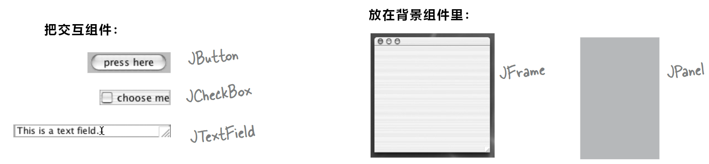
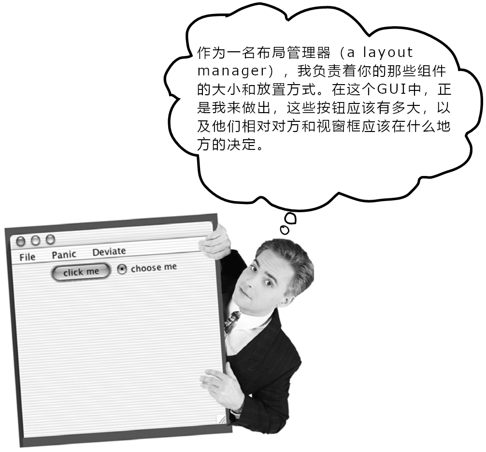
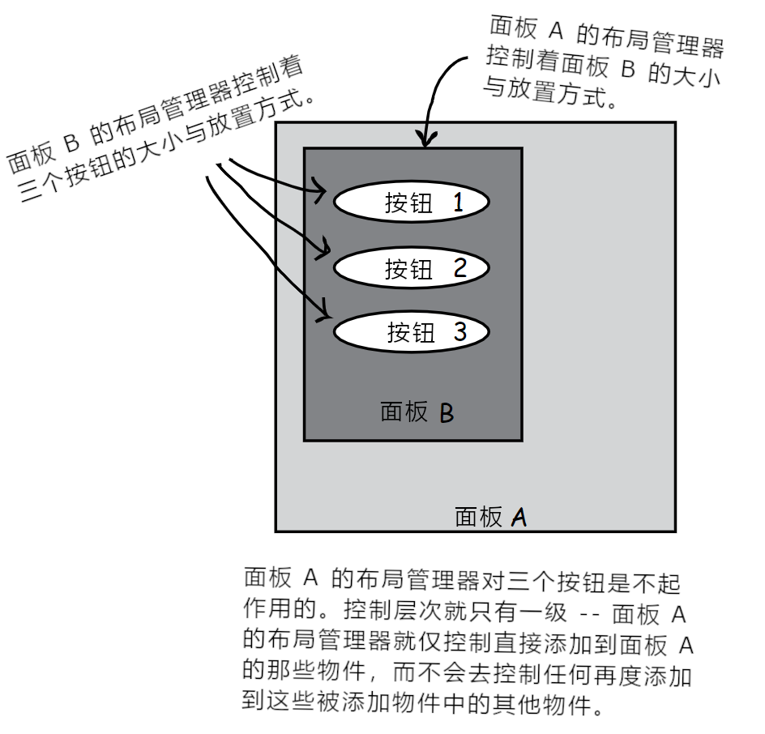
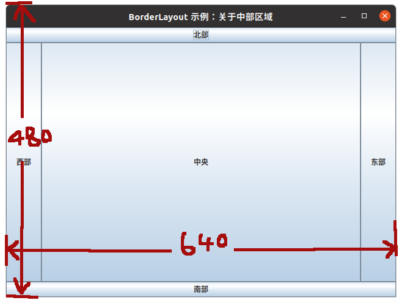
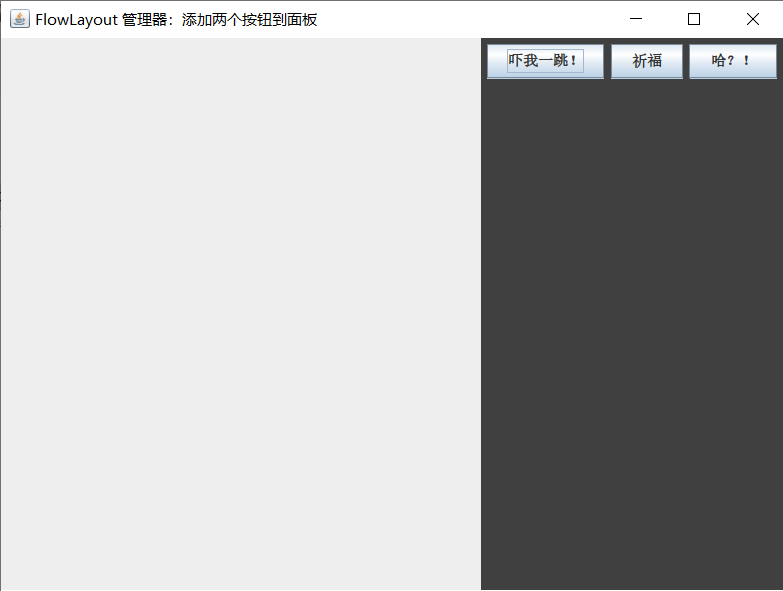
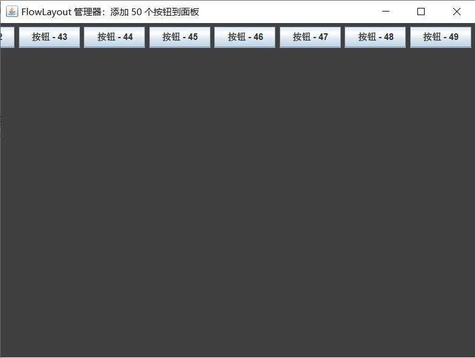
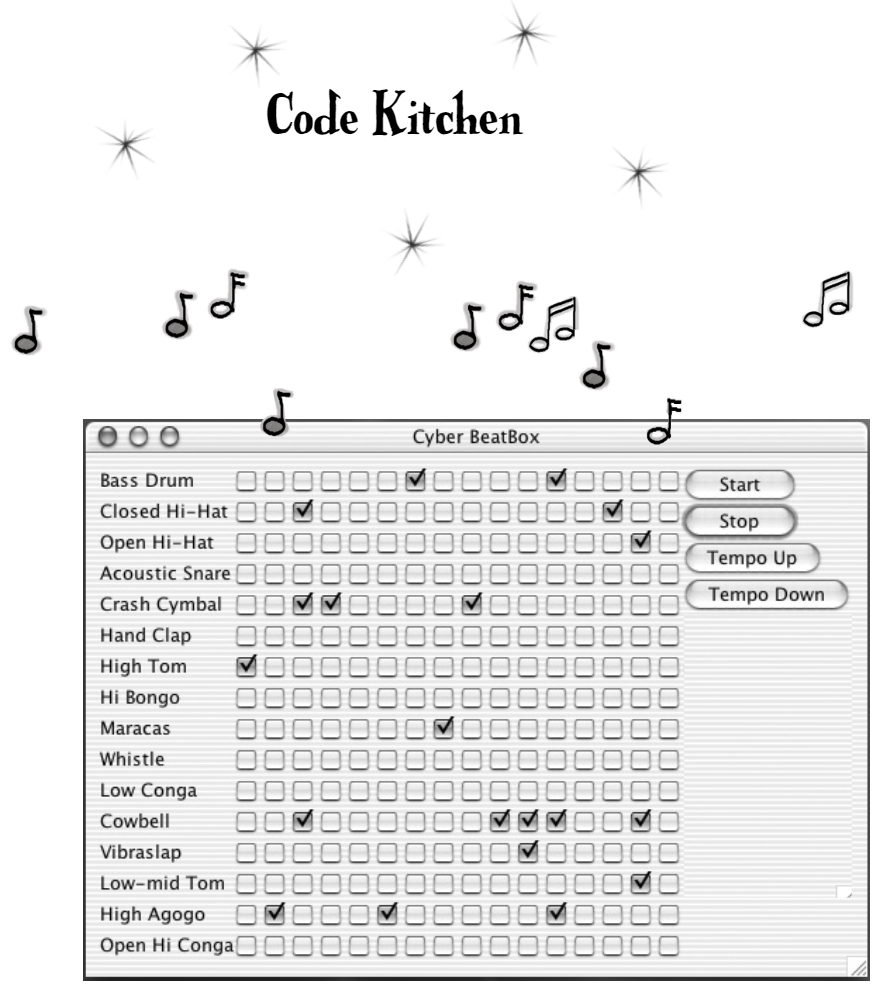

# 运用 `Swing`: 在 `Swing` 上工作

***Using `Swing`: Work on Your `Swing`*


*图 1 - 运用 `Swing`: 在 `Swing` 上做事：题图*

**`Swing` 很简单**。除非真的关心物件最终在屏幕上所处位置（**`Swing` is easy**. Unless you actually *care* where things end up on the screen）。`Swing` 代码 *看起来* 不难，但在对其进行编译、运行，最后看到其效果时，就会想，“嘿，那东西可不应该在那儿呀。” 正是那些让 `Swing` 代码写起来容易的因素，使得`Swing`难于掌控 -- 那就是**布局管理器（Layout Manager）**。布局管理器的那些对象，控制着 Java GUI 中众多小部件的大小与位置。布局管理器替我们干了许许多多的事情，然而结果却并不会总是让我们满意。在想要两同样大小的按钮时，得到的两个按钮并不一样大。在希望文本字段的长度为三英寸时，会得到九英寸长的文本字段。要不就只有一英寸长。希望这个文本字段在标签部件旁边，得到的却是在便签部件下边。但只需稍加努力，就可以让布局管理器服从咱们的意愿。在这一章中，就要在 `Swing` 上下功夫，且除了布局管理器外，还会学到更多的 GUI 小部件。这里会构造处他们，让后把他们显示出来（在选定的区域），进而在程序中运用他们。

## 关于`Swing` 的那些组件

**`Swing` components**

对于先前一直讲的小部件（*widget*），其实更准确的叫法应该是***组件（Component）***。就是那些放到GUI中的 *物件（things）*。也即是 *用户所见到并与之交互的那些东西*。文本字段、按钮、滚动清单、单选按钮等等，这些全都是组件。事实上他们都扩展了 `javax.swing.JComponent`类。

> **小部件从技术上讲就是 `Swing` 组件。几乎所有可吸附在 GUI 中的东西，都扩展自 `javax.swing.JComponent` 类**。

### 组件可以嵌套

**Components can be nested**

在 `Swing` 中，差不多 *所有* 组件都具备驻留其他组件的能力（In `Swing`, virtually *all* components are capable of holding other components）。也就是说，*几近能够把任意组件都吸附到其他任意组件中*。然而在大多数时候，都只会把 *用户界面* 的那些组件，比如按钮与清单，添加到一些 *背景* 组件，比如视窗框及面板等中去。不过将比如面板放到按钮中，也是 *有可能* 的，这只是有些奇怪，同时也不会带来任何可用性上的增强。

除开 `JFrame` 这个例外，其他的 *交互性（interactive）* 组件与 *背景（background）*  组件之间的区别，就是有意为之的了。而比如说对于 `JPanel`，则常常被用作目的为组织其他组件的背景，但即便是 `JPanel`，仍然可以是交互性的。就跟其他组件一样，也可以对`JPanel`的那些事件，比如鼠标点击和键盘按键等进行注册。

**构造GUI的四个步骤（复习）**：

1) 构造一个视窗（一个 `JFrame`）

```java
JFrame frame = new JFrame("新视窗");
```

2) 构造一个组件（按钮、文本字段等等）

```java
JButton button = new JButton("点我");
```

3) 将这个组件添加到这个视窗框

```java
frame.getContentPane().add(BorderLayout.EAST, button);
```

4) 把他显示出来（给到视窗框一个大小，并令其可见）

```java
frame.setSize(300, 300);
frame.setVisible(true);
```



*图 2 - 构造Java GUI 的步骤*

## 关于布局管理器

**Layout Managers**

布局管理器是与几乎总是 *背景* 组件的特定组件，联系在一起的Java 对象。布局管理器控制着包含在与其联系在一起组件中的那些组件（A layout manager is a Java object associated with a particular component, almost always a *background* component. The layout manager controls the components contained *within* the component the layout manager is associated with）。也就是说，在某个视窗框驻留了一个面板，同时那个面板又驻留着一个按钮时，那么面板的布局管理器就控制着按钮的大小和放置方式，而视窗框的布局管理器，则控制着面板的大小与放置方式。而这里的按钮，则与视窗框和面板不同，就不需要布局管理器，因为他并没有驻留其他组件。



*图 4 - 关于布局管理器*


在某个面板驻留了五个物件时，即便这五个物件都有着他们各自的布局管理器，这五个物件的大小与位置，仍是由这个面板的布局管理器控制的。在面板的五个物件依次又包含 *其他* 物件时，那么这些 *其他* 物件，就会根据驻留他们的物件布局管理器，来摆放。

在提及 *驻留*（*hold*） 时，其实就是 *添加*（*add*） 的意思，就比如“由于使用了下面的语句，从而某个按钮被添加到了某个面板，因此就说某个面板 *驻留* 着一个按钮”：

```java
myPanel.add(button);
```

布局管理器有着数种样式，同时各个背景组件可以有着各自的布局管理器。在构建某种布局时，布局管理器有着他们各自要遵循的策略（Layout managers come in several flavors, and each background component can have its own layout manager. Layout managers have their own policies to follow when building a layout）。比如，一直布局管理器就会坚持让面板中的各个组件保持大小一致，并以网格方式进行排布；而另一种则会让这些面板中的各个组件选择他自己的大小，却是纵向堆叠起来的。下面就是一个嵌套式布局的示例：

```java
JPanel panelA = new JPanel();
JPanel panelB = new JPanel();

panelB.add(new JButton("按钮1"));
panelB.add(new JButton("按钮2"));
panelB.add(new JButton("按钮3"));

panelA.add(panelB);
```



*图 3 - 组件嵌套及其布局管理器作用范围*

## 布局管理器的决策依据

**How does the layout manager decide**?

不同布局管理器有着不同的排布组件策略（比如以网格形式排布、令到各个组件大小相同，或者纵向堆叠等等）。不过这些正被排布的组件，在排布策略上，也是有着一些小小的发言权的。一般来讲，对某个背景组件的布局过程，差不多就是下面这样的：

**一个布局场景**：

1) 构造一个面板并把三个按钮添加给他；

2) 面板的布局管理器询问各个按钮，他们各自想要多大（The panel's layout manager asks each button how big that button prefers to be）；

3) 面板的布局管理器运用其策略来判定是否需要全部、部分还是完全不依照这些按钮的诉求；

4) 把面板添加到视窗框；

5) 视窗框的布局管理器询问面板想要多大；

6) 视窗框的布局管理器运用他的布局策略，来判定是否需要全部、部分还是完全不依照面板的诉求。


*图 5 - 布局管理器的运作方式*

### 不同布局管理器有着不同策略

**Different layout managers have different policies**

一些布局管理器会依照所布局组件想要的大小。比如有按钮想要 30 像素 x 50 像素大小，那么这就是布局管理器分配给他的大小。另一些布局管理器则只会部分依照所布局组件的首选大小。比如有按钮想要 30 像素 x 50 像素时，该按钮将会是 30 像素高，而宽度则会与其背景 *面板* 的宽度相同。还有其他一些布局管理器，只会参考所布局组件中 *最大的* 那个，并令到面板中的其余组件与最大的那个同样大小。某些情况下，布局管理器的工作会变得极度复杂，而大多数时候，只有在了解了布局管理器的策略时，才能搞清楚那个布局管理器将做些什么（In some cases, the work of the layout manager can get very complex, but most of the time you can figure out what the layout manager will probably do, once you get to know that layout manager's policies）。

## 三大布局管理器：边框、流与盒子

**The Big Three layout managers: border, flow and box**

### `BorderLayout`

`BorderLayout` 管理器将背景组件划分为五个区域。对于每个区域，仅可添加一个组件到由一个`BorderLayer`管理器控制的背景。由此管理器排布的组件，通常不会有他们所选的大小。**`BorderLayout` 是视窗框默认的布局管理器**！（A `BorderLayout` manager divides a background component into five regions. You can add only one component per region to a background controlled by a `BorderLayout` manager. Components laid out by this manager usually don't get to have their prefered size. **`BorderLayout` is the default layout manager for a frame**!）


*图 6 - `BorderLayout` 布局管理器图示*

### `FlowLayout`

`FlowLayout` 管理器的行事方式，就好比文字处理器，不同之处就在于他处理的是组件，而不是文字处理器中的单词。每个组件都有他想要的大小，同时这些组件按照添加的先后顺序，从左到右排列起来，期间还开启了“自动换行”。因此在出现放不下某个组件的情况时，这个组件就会自动落到布局的下一“行”去。**`FlowLayout`是面板的默认布局管理器**！


*图 7 - `FlowLayout`布局管理器的图示*

### `BoxLayout`

`BoxLayout` 管理器与 `FlowLayout` 类似的地方在于，各个组件都会获得自己想要的大小，组件按照添加的先后顺序放置。与 `FlowLayout` 的不同之处在于，`BoxLayout`管理器可将所布局的组件，进行竖直方向上的堆叠（或水平方向，不过通常只关心竖直方向）。`BoxLayout`与`FlowLayout`相似，不过与 `FlowLayout`的自动"组件换行"不同，可以插入某种程度上称之为“组件回车键”的东西，然后 **强制** 组件开启新行（It's like a `FlowLayout` but instead of having automatic 'component wrapping', you can insert a sort of 'component return key' and **force** the components to start a new line）。


*图 8 - `BoxLayout` 布局管理器图示*

### `BorderLayout`关注五个区域：东西南北中

**`BorderLayout` cares about five regions: east, west, north, south, and center**

**下面把一个按钮添加到东部区域**：

```java
package com.xfoss.learningJava;

import javax.swing.*;
// BorderLayout 是在 java.awt 包里头的
import java.awt.*;

public class Button1 {
    public static void main (String[] args) {
        Button1 gui = new Button1 ();
        gui.go();
    }

    public void go () {
        JFrame f = new JFrame ("BorderLayout 示例：一个放在东部区域的按钮");
        f.setDefaultCloseOperation(JFrame.EXIT_ON_CLOSE);
        JButton btn = new JButton ("点我");

        // 这行语句就指定了放置区域
        f.getContentPane().add(BorderLayout.EAST, btn);
        f.setSize(640, 480);
        f.setVisible(true);
    }
}
```


*图 9 - `BorderLayout` 示例一：把一个按钮放在东部区域*

### 脑力锻炼

- `BorderLayout` 管理器是怎样判定按钮的大小的（How did the `BorderLayout` manager come up with this size for the button）?

- 此布局管理器考虑了哪些因素（What are the factors the layout manager has to consider）？

- 这个按钮为什么没有更宽或更高（Why isn't it wider or taller）？

### 观察一下在给到按钮更多字符时会发生什么......

**Watch what happens when we give the button more characters...**

```java
public void go () {
    JFrame f = new JFrame ("BorderLayout 示例：一个放在东部区域的按钮");
    f.setDefaultCloseOperation(JFrame.EXIT_ON_CLOSE);
    // 这里只修改了按钮上的文本
    JButton btn = new JButton ("因为你愿意所以点我，表示确定你真的要点我");

    f.getContentPane().add(BorderLayout.EAST, btn);
    f.setSize(640, 480);
    f.setVisible(true);
}
```


*图 10 - `BorderLayout` 管理器判定所布局组件大小影响因素测试*

- **`BorderLayout` manager**: 首先，我会询问按钮他自己喜好的大小。
- **`Button` 对象**：现在我有了很多个字，那么我就倾向于要60像素宽，25像素高。
- **`BorderLayout` manager**: 由于按钮是在边框布局的东部区域，那么我就会依照他所选的宽度。但是我不会关心他有多高；这个按钮将会与视窗框一样高，因为这是我的策略。
- **`Button` 对象**：`：（` 下次就就要和 `FlowLayout` 在一起，那样的话我就会得到想要的一切了。

**再试试把按钮放在北部区域**：

**Let's try a button in the NORTH region**

```java
public void go () {
    JFrame f = new JFrame ("BorderLayout 示例：放在北部区域的按钮");
    f.setDefaultCloseOperation(JFrame.EXIT_ON_CLOSE);
    JButton btn = new JButton ("因为你愿意所以点我，表示确定你真的要点我");

    // 注意这里的 NORTH
    f.getContentPane().add(BorderLayout.NORTH, btn);
    f.setSize(640, 480);
    f.setVisible(true);
}
```


*图 11 - `BorderLayout` 布局：把按钮放在北部区域*


**现在让按钮去请求要 *更高一些***

**Now let's make the button ask to be *taller***

> 该怎样实现呢？按钮已经尽可能的宽了 -- 跟视窗框一样宽。不过还是可以通过给与他内部文字更大的字体，来令到按钮更高一些。

```java
public void go () {
    JFrame f = new JFrame ("BorderLayout 示例：通过Button类的setFont()，让按钮变得更高");
    f.setDefaultCloseOperation(JFrame.EXIT_ON_CLOSE);

    JButton btn = new JButton ("因为你愿意所以点我，表示确定你真的要点我");
    // 较大的字体，就会强制视窗框给按钮高度分配更多空间
    Font bigFont = new Font("STXingkai", Font.BOLD, 32);
    btn.setFont(bigFont);

    f.getContentPane().add(BorderLayout.NORTH, btn);
    f.setSize(640, 480);
    f.setVisible(true);
}
```


*图 12 - `BorderLayout`管理器：通过运用`Button`类的`setFont()`方法，让按钮变得更高*

> 宽度仍保持不变，但现在的按钮更高了。北部的那个区域被拉伸，以适配按钮新的优先高度（The north region stretched to accomodate the button's new preferred height）。


*图 13 - `BorderLayout` 管理器*

**中部区域得到了剩下的空间**！

（除了一种稍后会看到的特殊情况）

**The center region gets whatever's left**!

(except in one special case we'll look later)

```java
public void go () {
    JFrame f = new JFrame ("BorderLayout 示例：关于中部区域");
    f.setDefaultCloseOperation(JFrame.EXIT_ON_CLOSE);

    JButton btnEast = new JButton ("东部");
    JButton btnWest = new JButton ("西部");
    JButton btnNorth = new JButton ("北部");
    JButton btnSouth = new JButton ("南部");
    JButton btnCenter = new JButton ("中央");

    f.getContentPane().add(BorderLayout.EAST, btnEast);
    f.getContentPane().add(BorderLayout.WEST, btnWest);
    f.getContentPane().add(BorderLayout.NORTH, btnNorth);
    f.getContentPane().add(BorderLayout.SOUTH, btnSouth);
    f.getContentPane().add(BorderLayout.CENTER, btnCenter);

    f.setSize(640, 480);
    f.setVisible(true);
}
```


*图 14 - `BorderLayout` 管理器：关于中央区域（Windows 10）*



*图 15 - `BorderLayout` 管理器：关于中央区域（Ubuntu 20.04 LTS）*

> 在把物件放入到北部或南部区域时，物件就会占据整个视窗框的宽度，这样的话东部和西部的物件，就不会有原来北部和南部区域空着的时候那么高了。
>
> 基于视窗框大小（这段代码就是 300 x 300 像素点），中央区域中的那些组件，获得剩下的那些空间。
>
> 东部与西部区域的那些组件，将得到他们所选的宽度。
>
> 北部与南部区域的组件，得到他们选定的高度。

### `FlowLayout` 关心的是组件流：自左往右、自上往下，以组件添加的顺序一一排布

**`FlowLayout` cares about the flow of the components: left to right, top to bottom, in the order they were added**.


**将一个面板添加到东部区域**：

`JPanel`的布局管理器默认是 `FlowLayout`。在将面板添加到视窗框时，面板的大小和放置方式，仍然受 `BorderLayout` 管理的控制。不过 *面板内部* 的所有东西（也就是通过调用 `panel.add(aComponent)`添加到面板的那些组件），则是受 `FlowLayout` 管理器的控制了。这里将从放入一个面板到视窗框东部区域中开始，后面就会把物件添加到面板。

```java
package com.xfoss.learningJava;

import javax.swing.*;
import java.awt.*;

public class Panel1 {
    public static void main (String[] args) {
        Panel1 gui = new Panel1();
        gui.go();
    }

    public void go () {
        JFrame f = new JFrame("FlowLayout 管理器：从添加一个面板到视窗框的东部区域开始");
        f.setDefaultCloseOperation(JFrame.EXIT_ON_CLOSE);

        JPanel p = new JPanel();
        // 这里把面板做成灰色，从而可以看到面板在视窗框的哪里
        p.setBackground(Color.darkGray);
        
        f.getContentPane().add(BorderLayout.EAST, p);
        f.setSize(640, 480);
        f.setVisible(true);
    }
}
```


*图 16 - `FlowLayout` 管理器：从把一个面板添加到视窗框的东部区域开始*

**把一个按钮添加到面板**：

```java
public void go () {
    JFrame f = new JFrame("FlowLayout 管理器：添加一个按钮到面板");
    f.setDefaultCloseOperation(JFrame.EXIT_ON_CLOSE);

    JPanel p = new JPanel();
    p.setBackground(Color.darkGray);

    JButton btn = new JButton("吓我一跳！");
    
    // 把按钮添加到面板，并把面板添加到视窗框。面板的布局
    // 管理器（FlowLayout）控制着按钮，而视窗框的布局管理
    // 器（BorderLayout）控制着面板。
    p.add(btn);
    f.getContentPane().add(BorderLayout.EAST, p);

    f.setSize(640, 480);
    f.setVisible(true);
}
```


*图 17 - `FlowLayout` 管理器：再添加一个按钮到面板里*

> 这时面板变宽了！而由于面板使用的流布局，从而按钮同时得到了他的宽度与高度，还有按钮是面板（而非视窗框）的组成部分。


*图 18 - `BorderLayout` 与 `FlowLayout`*

**把两个按钮添加到面板，会怎样呢？**

```java
public void go () {
    JFrame f = new JFrame("FlowLayout 管理器：添加两个按钮到面板");
    f.setDefaultCloseOperation(JFrame.EXIT_ON_CLOSE);

    JPanel p = new JPanel();
    p.setBackground(Color.darkGray);

    // 这里构造两个按钮
    JButton btn = new JButton("吓我一跳！");
    JButton btnTwo = new JButton("祈福");
    //把这两个按钮都添加到面板
    p.add(btn);
    p.add(btnTwo);
    
    f.getContentPane().add(BorderLayout.EAST, p);
    f.setSize(640, 480);
    f.setVisible(true);
}
```


*图 19 - `FlowLayout` 管理器：添加两个按钮*

> 这里想要的是这两个按钮堆叠起来。
>
> 然而面板为适应这两个并排起来，而再次变宽了。
>
> 注意这里的“祈福”按钮要比“吓我一跳！”按钮要小一些......那就是流式布局运作的方式了。按钮只会获得他所需的大小（而没有多余的空间）。

### 小练习

在把上面的代码修改为：

```java
public void go () {
    JFrame f = new JFrame("FlowLayout 管理器：添加两个按钮到面板");
    f.setDefaultCloseOperation(JFrame.EXIT_ON_CLOSE);

    JPanel p = new JPanel();
    p.setBackground(Color.darkGray);

    JButton btn = new JButton("吓我一跳！");
    JButton btnTwo = new JButton("祈福");
    JButton btnThree = new JButton("哈？！");
    p.add(btn);
    p.add(btnTwo);
    p.add(btnThree);
    
    f.getContentPane().add(BorderLayout.EAST, p);
    f.setSize(640, 480);
    f.setVisible(true);
}
```

后，得到的窗口如下所示：




*图 20 - 三个按钮的情形*

**添加 50 个按钮到面板的情况**：

```java
public void go () {
    JFrame f = new JFrame("FlowLayout 管理器：添加 50 个按钮到面板");
    f.setDefaultCloseOperation(JFrame.EXIT_ON_CLOSE);

    JPanel p = new JPanel();
    p.setBackground(Color.darkGray);

    for (int t = 0; t < 50; t++) {
        JButton btn = new JButton(String.format("按钮 - %s", t));
        p.add(btn);
    }
    
    f.getContentPane().add(BorderLayout.EAST, p);
    f.setSize(640, 480);
    f.setVisible(true);
}
```




*图 21 - 添加 50 个按钮到面板*

> 注：这个例子可以看出，`FlowLayout` 只是单纯的从左往右一一排布他所布局的组件。暂时并未“自动换行”。


但若把 `f.getContentPane().add(BorderLayout.EAST, p)` 改为 `f.getContentPane().add(BorderLayout.CENTER, p)`，就会得到：


*图 21-1 `FlowLayout` 管理器下的自动换行*

### `BoxLayout`来补救！

**就是有空间来让他所布局的那些组件挨着一一放置，`BoxLayout`仍会让这些组件堆叠起来**。

**`BoxLayout` to the rescue**!

**It keeps components stacked, event if there's room to put them side by side**.

**与 `FlowLayout` 不同，就算仍有空间来在水平方向上摆放组件，`BoxLayout` 仍可强制一个 "新行"， 来令到组件换到下一行去**。

**Unlike `FlowLayout`, `BoxLayout` can force a 'new line' to make the components wrap to the next line, even if there's room for them to fit horizontally**.

不过现在就必须把面板的布局管理器从 `FlowLayout` 修改为 `BoxLayout`。

```java
public void go () {
    JFrame f = new JFrame("BoxLayout 管理器：把面板的布局管理器从默认的 FlowLayout 修改为 BoxLayout");
    f.setDefaultCloseOperation(JFrame.EXIT_ON_CLOSE);

    JPanel p = new JPanel();
    p.setBackground(Color.darkGray);
    
    // 把布局管理器修改为 BoxLayout 的一个新实例
    //
    // BoxLayout 的构造器，需要知道他要布局的组件（即这个面板）
    // 以及使用哪个轴（这里使用垂直堆叠的 Y_AXIS ）
    p.setLayout(new BoxLayout(p, BoxLayout.Y_AXIS));

    JButton btn = new JButton ("吓我一跳！");
    JButton btnTwo = new JButton ("祈福");
    p.add(btn);
    p.add(btnTwo);
    
    f.getContentPane().add(BorderLayout.EAST, p);
    f.setSize(640, 480);
    f.setVisible(true);
}
```


*图 22 - `BoxLayout`管理器：修改面板的布局管理器为 `BoxLayout`*

> 请留意因为面板现在不需要去适应水平方向上并排的两个按钮，所以他又变窄了。那么面板就告诉视窗框，他只需要那个最大的“吓我一跳！”按钮大小的空间。

## 答疑

- **怎么不直接把交互性组件（比如这里的按钮），像添加到面板上那样，直接添加到视窗框呢**？

> 由于在将物件呈现在屏幕上的过程中，到`JFrame`这里，属于至关重要的节点，因此 `JFrame` 具有特殊性。与所有`Swing`组件都是纯 Java 代码不同之处在于，为了访问到显示器，`JFrame`就必须要去与底层 OS 系统连接起来。可把内容窗格当作一个处于 `JFrame` 之上的 100% 纯 Java 层。或者在把 `JFrame` 当作窗框的时候，把内容窗格当作......窗户玻璃。知道窗户的窗格把。还甚至可以用 `JPanel` 去与内容窗格互换，来将自己的 `JPanel` 作为视窗框的内容窗格，这样写就可以（A `JFrame` is special because it's where the rubber meets the road in making something appear on the screen. While all your `Swing` components are pure Java, a `JFrame` has to connect to the underlying OS in order to access the display. Think of the content pane as a 100% pure Java layer that sits on *top* of the `JFrame`. Or think of it as though `JFrame` is the window frame and the content pane is the...glass. You know, the window *pane*. And you can even swap the content pane with your own `JPanel`, to make your `JPanel` the frame's content pane）：

```java
myFrame.setContentPane(myPanel);
```


- **可以修改视窗框的布局管理器吗？我想要在视窗框上使用流式布局，而不是默认的边框布局，会怎样呢**？

> 要实现这些，最简单的办法，就是构造一个面板，在这个面板中按照想要的样子去构建GUI，然后运用上一个答案中的方法，把这个面板设置为视窗框的内容窗格（就不会用到视窗框的默认内容窗格了）。


- **对于这些添加到布局组件（视窗框、面板）上的交互性组件，若需要不同的所选大小，该怎样做呢？交互性组件有 `setSize()`方法吗**？

> 是的，交互性小部件是有这个 `setSize()` 方法的，然而布局管理器只会忽视之。组件的 *优先大小（preferred size）* 与我们想要的大小，二者之间是有差异的。优先大小（preferred size）基于组件实际 *所需* 的大小（由组件自己决断）。布局管理器调用的是组件的 `getPreferredSize()` 方法，而这个方法并不会去理会那个先前在组件上调用的 `setSize()`方法。

- **就不能把物件放在自己想要地方吗？可以把布局管理器关掉吗**？

> 当然可以。基于单个的布局组件，是可以调用 `setLayout(null)` 方法的，随后就由自己去把确切的屏幕位置坐标进行硬编码吧。长远来看，还是使用布局管理器更容易一点（Yep. On a component by component basis, you can call `setLayout(null)` and then it's up to you to hard-code the excat screen locations and dimensions. In the long run, though, it's almost always easier to use layout managers）。

## 重点

- 布局管理器控制着嵌套在其他组件中的那些组件的大小及位置（Layout managers control the size and location of components nested within other components）;
- 在将组件添加到另一组件（这样的组件有时被成为 *背景* 组件，不过那并不是技术上的区别）时，被添加的这些组件，是受那个背景组件的布局管理器控制的；
- 布局管理器在做出布局决定之前，会询问他所布局的那些组件的优先大小。依据自己的策略，他可能会依照全部、部分，或不依照所布局组件的期望；
- `BorderLayout` 管理器运行把组件添加到他的五个区域之一。在添加组件时，必须使用下面的语法，对区域进行指定：

```java
add(BorderLayout.EAST, panel);
```

- 在 `BorderLayout` 管理器控制下，位处北部与南部两个区域的组件，会得到他们自己优先高度，但得不到宽度。而在东部与西部的组件，则得到他们自己优先的宽度，而得不到高度。在中央区域的组件，将获得其他部分剩下了的空间（除非使用了 `pack()` 方法）。
- `pack()` 方法就如同那些组件的热缩膜；他用到中央组件的完整优先大小，然后将中心用作起点，来确定视窗框的大小，并基于其他区域中的东西，来构建出其余部分（The `pack()` method is like shrink-wrap for the components; it uses the full preferred size of the center component, then determines the size of the frame using the center as a starting point, building the rest based on what's in the other regions）；
- `FlowLayout` 会把他所布局的组件，从做往右、自顶向下，以这些组件添加的顺序进行放置，并只在这些组件无法水平排布时，开启新行（`FlowLayout` places components left to right, top to bottom, in the order they were added, wrapping to a new line of components only when the components won't fit horizontally）；
- `FlowLayout` 给到组件长和宽两个维度上组件自己的优先大小；
- 即使所布局的组件可以一一并排，`BoxLayout` 也允许将组件纵向堆叠起来。与 `FlowLayout` 类似，`BoxLayout`也使用所布局组件的长和宽两个维度的优先大小；
- 视窗框的默认布局管理器是`BorderLayout`；面板的默认布局管理器是 `FlowLayout`；
- 在想要面板使用有别于流式布局之外的其他布局管理器时，就必须调用面板上的 `setLayout()` 方法。

## 运用 `Swing` 的那些组件

**Play with `Swing` components**

在依据了解了布局管理器的基础后，就可以尝试几个最常用的组件了：文本字段、滚动式文本区、勾选框和清单等。这里并不会给出这些组件的完整API文档，而只提到几个入门所需的方法。

### `JTextField`

```java
package com.xfoss.learningJava;

import javax.swing.*;
import java.awt.*;

public class SwingComponentsDemo {
    public static void main (String[] args) {
        SwingComponentsDemo gui = new SwingComponentsDemo ();
        gui.go();
    }

    public void go () {
        JFrame f = new JFrame ("Swing 常用组件演示：JLabel 与 JTextField");
        f.setDefaultCloseOperation (JFrame.EXIT_ON_CLOSE);

        JPanel p = new JPanel ();
        f.setContentPane(p);

        JLabel l = new JLabel ("你的姓名");
        p.add(l);
        JTextField txtField = new JTextField(20);
        p.add(txtField);

        f.setSize(640, 480);
        f.setVisible(true);
    }
}
```


*图 24 - `Swing` 常用组件演示：`JLabel` 与 `JTextField`*

**构造器**

```java
// JTextField 组件的构造器显然是有多个过载方法的
//
// 传入数字时，表示文本字段有多少个字符宽，而非多少个像素宽
// 这定义了文本字段的优先宽度
// 
// 传入一个字符串时，就是文本字段的默认文本
//
// 两个都传入时（此时必须字符串在前，数字在后），分别表示各自的意义
JTextField field = new JTextField(20);
JTextField field = new JTextField("你的姓名");
JTextField field = new JTextField("你的姓名", 20);
```

**使用方法**：

1) 从 `JTextField` 实例获取文本

```java
System.out.println(field.getText());
```

2) 放入文本

```java
field.setText("内容");
// 这行语句清空该字段
field.setText("");
```

3) 在用户按下回车时获取到一个 `ActionEvent`

```java
// 若真的想要在用户每次按键时听到，那还可以对按键事件进行注册
field.addActionListener(myActionListener);
```

4) 选择/高亮字段中的文本

```java
field.selectAll();
```

5) 将光标放回到该文本字段（这样用户才可以开始输入）

```java
filed.requestFocus();
```

### `JTextArea`

与 `JTextField` 不同之处在于，`JTextArea`可以有多行文本。由于`JTextArea`在开箱即用的情况下并不带有滚动条或自动换行，因此构造一个 `JTextArea` 需要一点配置。要让某个`JTextArea`滚动，那么就要把他附着在一个 `ScrollPane`中。`ScrollPane`是个真正喜欢滚动的对象，还会照顾到文本区的滚动需求。

**构造器**

```java
// 显然 JTextArea 的构造器也是过载了的
// 
// 这里的 10 表示 10 行（设置了优先的高度）
// 20 表示 20 列（对优先宽度进行设置）
JTextArea text = new JTextArea(10, 20);
JTextArea text = new JTextArea("关于你......", 10, 20);
```

**用法**：

1) 令其只有纵向的滚动条

```java
// 构造一个 JScrollPane 并给到那个要滚动的文本区
JScrollPane scroller = new JScrollPane(text);
// 开启自动换行
text.setLineWrap(true);

// 告诉滚动窗格仅使用一个纵向的滚动条
scroller.setVerticalScollBarPolicy(ScrollPaneConstants.VERICAL_SCROLLBAR_ALWAYS);
scroller.setHorizontalScollBarPolicy(ScrollPaneConstants.HORIZONTAL_SCROLLBAR_NEVER);

// 重要！！是把文本区给到滚动窗格（经由滚动窗格的构造器），随后
// 把滚动窗格添加到面板。不是直接把文本区添加到面板！
panel.add(scroller);
```

2) 替换文本区中的文本

```java
text.setText("并非所有失踪的人都在流浪");
```

3) 往文本区中的文本追加内容

```java
text.append("按钮已被点击");
```

4) 选择/高亮显示文本区中的文本

```java
text.selectAll();
```

5) 把光标放回文本区（这样用户就可以开始输入）

```java
text.requestFocus();
```

**`JTextArea`示例**

```java
package com.xfoss.learningJava;

import javax.swing.*;
import java.awt.*;
import java.awt.event.*;

public class TextAreaDemo {
    JTextArea text;

    public static void main(String[] args) {
        TextAreaDemo gui = new TextAreaDemo();
        gui.go();
    }

    public void go () {
        JFrame f = new JFrame("JTextArea 演示");
        f.setDefaultCloseOperation(JFrame.EXIT_ON_CLOSE);

        JPanel p = new JPanel();
        JButton btn = new JButton("点一下就好");
        btn.addActionListener(new btnActionListener());

        text = new JTextArea("示例内容\n", 10, 20);
        text.setLineWrap(true);

        JScrollPane scroller = new JScrollPane(text);
        scroller.setVerticalScrollBarPolicy(ScrollPaneConstants.VERTICAL_SCROLLBAR_ALWAYS);
        scroller.setHorizontalScrollBarPolicy(ScrollPaneConstants.HORIZONTAL_SCROLLBAR_NEVER);
        p.add(scroller);

        f.getContentPane().add(BorderLayout.CENTER, p);
        f.getContentPane().add(BorderLayout.SOUTH, btn);
        f.setSize(640, 480);
        f.setVisible(true);
    }

    class btnActionListener implements ActionListener {
        public void actionPerformed (ActionEvent ev) {
            text.append("按钮已被点击\n");
            System.out.format("文本区内容为：\n%s", text.getText());
        }
    }
}
```


*图 25 - `JTextArea`示例效果*


### `JCheckBox`

**构造器**

```java
JCheckBox check = new JCheckBox("前往 11 层");
```

**用法**

1) 监听某个条目的事件（在该条目被勾选或取消勾选时）

```java
check.addItemListener(this);
```

2) 处理事件（并搞清楚该条目是否被勾选）

```java
public void itemStateChanged (ItemEvent ev){
    String onOrOff = "off";
    if (check.isSelected()) onOrOff = "on";
    System.out.format("勾选框是 %s", onOrOff);
}
```

3) 以代码方式勾选或取消勾选条目

```java
check.setSelected(true);
check.setSelected(false);
```

- **布局管理器带来的麻烦，与他们的价值相比，难道不是更多吗？如果必须要面对这些麻烦，那还不如直接对物件的大小与所在坐标硬编码呢**。


> 从某种布局管理器得到想要的准确布局，可能是个挑战。然而想想布局管理器为我们所做的事情。就算那些要找出物件应该位处屏幕上何处这样简单的任务，也会较为复杂的吧。比如布局管理器就会考虑让多个组件重叠有序。也就是说，布局管理器知道怎样去管理组件之间的空间（以及组件与视窗框之间的空间）。当然这也可以自己去完成，不过在想要这些组件更紧凑时呢？或许可以手动把组件妥善放置起来，然而这样做也就只对JVM来说会好一些（You might get them placed just right, by hand, but that's only good for your JVM）!
>
> 为何这样说呢？因为这些组件在不同平台之间会有些许不同，尤其是在这些组件使用所在平台原生的“外观与体验”时。比如按钮斜面等一些细节就会有这样的差别，在一个平台上会整齐排列，而另一个平台则会突然挤在一起。
>
> 然而这些都还不是布局管理器最重要的地方。想想在用户缩放视窗的时候！或者GUI是动态的，有组件会出现和离去的情况。在每次视窗大小调整或背景组件的内容发生改变时，都要对所有组件的布局进行更新......那会要老命的！

### `JList`


*图 26 - `JList` Demo*


**构造器**

```java
// JList 构造器会接收一个任意对象类型的数组。这些对象类型一定非得要是字符串，但不论
// 什么对象类型，在清单上出现的，将都会是一个字符的表示（JList constructor takes an array
// of any object type. They don't have to be Strings, but a String representation will
// appear in the list）。
String [] listEntries = {"apple", "banana", "carriot", "donut", "fish", "egg", "grapes"};
JList<String> l = new JList<String>(listEntries);
```


**用法**

1) 令到其有个垂直的滚动条

```java
// 这就跟 JTextArea 一样 -- 构造一个 JScrollPane（并给他清单）
// 随后把这个滚动区域（而非这个清单）添加到面板
JScrollPane scroller = new JScrollPane(list);
scroller.setVerticalScrollBarPolicy(ScrollPaneConstants.VERTICAL_SCROLLBAR_ALWAYS);
scroller.setHorizontalScrollBarPolicy(ScrollPaneConstants.HORIZONTAL_SCROLLBAR_NEVER);

panel.add(scroller);
```

2) 设置滚动前显示的行数

```java
list.setVisibleRowCount(4);
```

3) 限制用户一次选择一个物件

```java
list.setSelectionMode(ListSelectionModel.SINGLE_SELECTION);
```

4) 对清单选择事件进行注册

```java
list.addListSelectionListener(this);
```

5) 对事件进行处理（找出清单中哪个物件被选中）

```java
public void valueChanged(ListSelectionEvent lse) {
    // 若不加入这个 if 条件测试，那么就会收到这个
    // 事件两次
    if (!lse.getValueIsAdjusting()) {
        // getSelectedValue() 方法返回的其实是一个对象。清单
        // 并不止于字符串对象。
        String selection = (String) list.getSelectedValue();
        System.out.println(selection);
    }
}
```

## 代码厨房



*图 27 - 第 13 章代码厨房配图*

此部分是可选的。这里在构造完整版的 `BeatBox`，GUI及全部的东西。在保存对象那一章，将学习怎样去保存与恢复鼓的各种模式（编曲）。最后在网络通信那一章（“构造连接”），就会把 `BeatBox` 做成一个可工作的聊天客户端。


### 构造 `BeatBox`

下面是这个版本的 `BeatBox` 的完整代码清单，有用于开始、停止及修改速度的那些按钮（This is the full code listing for this version of the `BeatBox`, with buttons for starting, stopping, and changing the tempo）。此清单是完整的，并且是重复注释的，而下面就是个概述：

1) 构造一个有着 256 个开始都是未勾选单选框（`JCheckBox`）、16个用于表示乐器名字的标签（`JLabel`），以及四个按钮的 GUI；

2) 对四个按钮都注册一个 `ActionListener`。由于这里还不准备动态修改声音编排模式（即在用户勾选某个单选框时，立即反应出来），所以对于单个的单选框，并不需要事件收听者。而是在用户点击“开始”按钮时，才去对全部256个单选框跑一遍，来取得他们的状态，并构造出一个 MIDI 音轨；

3) 建立起一个包含获取音序器（`Sequencer`）、构造序列（`Sequence`）及创建音轨的MIDI 系统（在这之前就已经完成了）。这里将使用到 Java 5.0 中才引入的一个音序器方法，`setLoopCount()`。这个方法允许我们指定某个序列循环多少次。这里还会用到序列的快慢因子，来提升或降低序列的速度，并在循环回访中维持新的速度（We're also using the sequence's tempo factor to adjust the tempo up or down, and maintain the new tempo from one iteration of the loop to the next）。

4) 在用户点击 “开始” 时，就会开始真正的动作。“开始”按钮的事件处理方法调用 `buildTrackAndStart()` 方法。在那个方法中，将对全部 256 个单选框都跑一遍（每次一行，单个乐器的全部16拍），来获取这些单选框的状态，随后使用这些信息来构建出一个 MIDI 音轨（使用前一章中用到的那个方便的 `makeEvent()` 方法）。在音轨构建好了之后，就启动音序器（the sequencer），音序器将一直演奏（因为设置了循环演奏）直到用户点击了“停止”按钮。


```java
package com.xfoss.BeatBox;

import java.awt.*;
import javax.swing.*;
import javax.sound.midi.*;
import java.util.*;
import java.awt.event.*;
// 导入 java.net 包的目的，是为了使用下面的 URL 类型
import java.net.*;

public class BeatBox {
    JPanel mainPanel;
    // 这里是把那些单选框存储在一个 ArrayList 中
    ArrayList<JCheckBox> checkBoxList;
    Sequencer s;
    Sequence seq;
    Track t;
    JFrame f;
    JLabel tempoLabel = null;

    // 这些是乐器的名字，这里把他们当作一个字符串数组的，用于构建
    // GUI 的那些标签（每行一条）
    String [] instrumentNames = {"贝斯鼓（低音鼓）", "闭镲（闭合击镲）",
        "空心钹（开音踩钹）", "小鼓（军鼓）", "双面钹（强音钹）", "拍手（拍掌声）",
        "高音鼓（高音桶鼓）", "高音圆鼓（高音小鼓）", "沙锤（沙铃）", "口哨", "低音手鼓",
        "牛铃（牛颈铃）", "颤音叉", "中低音桶鼓", "高音撞铃",
        "开音高音手鼓"};

    // 这些表示了各种真实鼓的“按键”。鼓通道就如同钢琴一样，只是钢琴上各个“琴键”
    // 是为某种不同的鼓而已。因此数字 ‘35’ 就是贝斯鼓的按键，而 ‘42’ 则是高音钹的
    // 按键。
    int [] instruments = {35, 42, 46, 38, 49, 39, 50, 60, 70, 72, 64, 56, 58, 47, 67, 63};

    public static void main (String[] args) {
        new BeatBox().buildGUI();
    }

    public void buildGUI () {
        f = new JFrame("赛博 BeatBox");

        // 这里给视窗加上一个 ico 图标，为了兼容性使用的是 PNG 图片
        // 
        // 其中用到的图片，作为与代码分离的措施，放在 src/main 目录的
        // resources 文件夹下的 images 目录里
        //
        // build.gradle.kts 构建配置文件中，有语句将这些 resources 
        // 拷贝到打包的jar中
        URL icoURI = getClass().getResource("/images/ico.png");
        ImageIcon ico = new ImageIcon(icoURI);
        f.setIconImage(ico.getImage());
        f.setDefaultCloseOperation(JFrame.EXIT_ON_CLOSE);

        BorderLayout l = new BorderLayout();
        JPanel bg = new JPanel(l);
        // 这里创建了一个“空白边框（EmptyBorder）”对象（并调用 JPanel 的
        // setBorder() 方法，设置到 bg 上），给到面板各个边缘和放置的
        // 组件之间的一个外边距。看起来颇具美感。
        bg.setBorder(BorderFactory.createEmptyBorder(10, 10, 10, 10));

        // 后面就没什么特别的了，只是很多的 GUI 组件。
        // 其中大部分在之前就已经看到过了。
        checkBoxList = new ArrayList<JCheckBox> ();
        Box btnBox = new Box(BoxLayout.Y_AXIS);

        JButton btnS = new JButton("开始▶");
        btnS.addActionListener(new StartListener());
        btnBox.add(btnS);

        JButton btnStop = new JButton("停止◾");
        btnStop.addActionListener(new StopListener());
        btnBox.add(btnStop);

        btnBox.add(Box.createHorizontalStrut(5));
        btnBox.add(new JSeparator(SwingConstants.VERTICAL));
        btnBox.add(Box.createHorizontalStrut(5));

        JButton btnUpTempo = new JButton("加速>>");
        btnUpTempo.addActionListener(new UpTempoListener());
        btnBox.add(btnUpTempo);

        JButton btnDownTempo = new JButton("减慢<<");
        btnDownTempo.addActionListener(new DownTempoListener());
        btnBox.add(btnDownTempo);

        tempoLabel = new JLabel(String.format("速度因子：%.2f", 1.00f)); 
        btnBox.add(tempoLabel);

        Box nameBox = new Box(BoxLayout.Y_AXIS);
        for (int i = 0; i < 16; i++) {
            nameBox.add(new Label(instrumentNames[i]));
        }

        bg.add(BorderLayout.EAST, btnBox);
        bg.add(BorderLayout.WEST, nameBox);

        // 还是些建立 GUI 的代码。并无不同之处。
        f.getContentPane().add(bg);

        GridLayout g = new GridLayout(16, 16);
        g.setVgap(1);
        g.setHgap(2);
        mainPanel = new JPanel(g);
        bg.add(BorderLayout.CENTER, mainPanel);

        // 这里构造出那些单选框，将他们设置为‘false’（从而使得他们
        // 保持未被勾选），然后将他们添加到那个 ArrayList 以及 GUI
        // 面板上。
        for (int i = 0; i < 256; i++) {
            JCheckBox c = new JCheckBox();
            c.setSelected(false);
            checkBoxList.add(c);
            mainPanel.add(c);
        }

        setUpMidi();

        f.setBounds(50, 50, 640, 480);
        f.pack();
        f.setVisible(true);
    }

    // 这里是常见的用于获取音序器（the Sequencer）、MIDI序列（the Sequence）
    // 以及MIDI音轨（the Track），从而建立起 MIDI 的代码。
    public void setUpMidi () {
        try {
            s = MidiSystem.getSequencer();
            s.open();
            seq = new Sequence(Sequence.PPQ, 4);
            t = seq.createTrack();
            s.setTempoInBPM(120);
        } catch (Exception e) {e.printStackTrace();}
    }

    // 这里是全部事情发生的地方！正是在这里把单选框的状态，转换成
    // MIDI 事件，并把这些MIDI事件添加到MIDI音轨。
    public void buildTrackAndStart () {
        // 这里将会构造一个有16个元素的数组，来保存一种具体
        // 乐器 16 个节拍的各个取值。若该种乐器即将在那个节拍
        // 上奏乐时，那么那个节拍所在的值，就会是此种乐器的按键编号。
        // 若在那个节拍上该种乐器不会奏乐，那么在该节拍上就会放入一个零。
        int [] trackList = null;

        // 对原有的音轨进行处理，并构造一个全新的音轨。
        seq.deleteTrack(t);
        t = seq.createTrack();

        // 这个循环是对 16 行进行的（即：那些贝斯鼓、Congo等等）
        for (int i = 0; i < 16; i++){
            trackList = new int[16];

            // 对乐器的‘按键’编号进行设置。表示当前是何种乐器（贝斯、Hi-Hat等
            // 数组 instruments 保存了各个乐器的真实 MIDI 编号。
            int key = instruments[i];

            // 这个循环是对这一行的 16 个节拍进行的
            for (int j = 0; j < 16; j++) {

                JCheckBox jc = checkBoxList.get(j + 16*i);
                // 在这个节拍上的单选框是勾选了的吗？若被勾选，那么就把
                // 此乐器的按键编号放入数组该节拍对应的槽中（该槽位（the slot）就
                // 表示了这个节拍）。否则就表示该乐器在这个节拍不应奏乐，因此就要
                // 把这个槽位设置为零。
                if (jc.isSelected()) {
                    trackList[j] = key;
                } else {
                    trackList[j] = 0;
                }
            }

            // 对于当前乐器，以及整个16拍，进行MIDI事件的构造并将这些MIDI事件
            // 添加到 MIDI 音轨上。
            makeTracks(trackList);
            t.add(makeEvent(176, 1, 127, 0, 16));
        }

        // 这里总是要确保在第16拍处有必须有一个事件。否则 BeatBox app就不会
        // 在重新回放前跑满完整的 16 拍（We always want to make sure that there
        // IS an event for beat 16(it goes 0 to 15). Otherwise, the BeatBox might
        // not go the full 16 beats before it starts over）。
        t.add(makeEvent(192, 9, 1, 0, 15));
        try {
            s.setSequence(seq);
            // 这里 Sequencer 的 setLoopCount() 方法，预先指定循环次数，或者
            // 像这里这样，持续不停的循环下去。
            s.setLoopCount(Sequencer.LOOP_CONTINUOUSLY);
            // 这里就开始演奏上面的编排了。
            s.start();
            s.setTempoInBPM(120);
        } catch(Exception e) {e.printStackTrace();}
    }

    // 第一个内部类，这些内部类都是按钮的事件收听者。并无特别之处。
    class StartListener implements ActionListener {
        public void actionPerformed(ActionEvent ev) {
            buildTrackAndStart();
        }
    }

    // 其他的那些内部类。
    class StopListener implements ActionListener {
        public void actionPerformed(ActionEvent ev) {
            s.stop();
        }
    }

    class UpTempoListener implements ActionListener {
        public void actionPerformed(ActionEvent ev) {
            // 速度因子（The Tempo Factor） 通过所提供的速度因数
            // (the factor provided) 对音序器的速度进行调节。默认的
            // 速度因数为 1.0，那么这里就是每点击一次，纠正 +/- 3%
            s.setTempoFactor(s.getTempoFactor() + 0.03f);
            tempoLabel.setText(String.format("速度因子：%.2f", s.getTempoFactor()));
        }
    }

    class DownTempoListener implements ActionListener {
        public void actionPerformed(ActionEvent ev) {
            s.setTempoFactor(s.getTempoFactor() - 0.03f);
            tempoLabel.setText(String.format("速度因子：%.2f", s.getTempoFactor()));
        }
    }

    // 这个方法每次给一种乐器的全部 16 个节拍构造MIDI事件。
    // 那么他就应获取到每个乐器的一个 int[] 数组，该数组的各个索引
    // 下要么是乐器的按键编号，否则就会是0。在某个索引下的值为零时
    // 该乐器就认为不会在那个节拍上奏乐。否则就要构造一个事件并把
    // 所构造的事件添加到音轨上。
    public void makeTracks(int [] list) {
        for(int i = 0; i < 16; i++) {
            int k = list[i];

            if(k != 0) {
                t.add(makeEvent(144, 9, k, 100, i));
                t.add(makeEvent(128, 8, k, 100, i+1));
            }
        }
    }

    // 这个方法实际上是上一章中的那个工具方法。并无新意。
    public MidiEvent makeEvent(int comd, int chan, int one, int two, int tick){
        MidiEvent ev = null;
        try {
            ShortMessage a = new ShortMessage();
            a.setMessage(comd, chan, one, two);
            ev = new MidiEvent(a, tick);
        } catch (Exception e) {e.printStackTrace();}
        return ev;
    }
}
```


*图 28 - `BeatBox` app 第一版*
