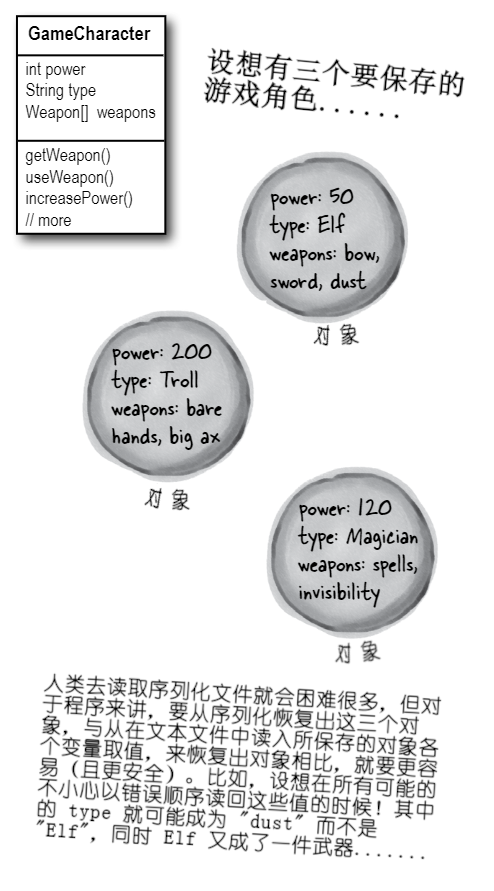
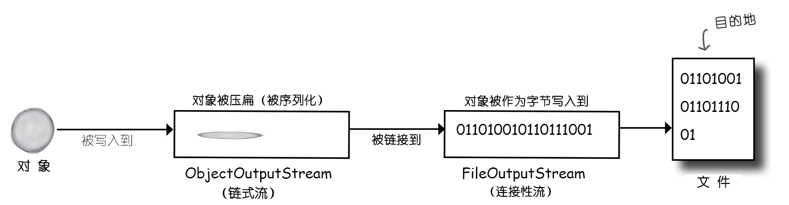
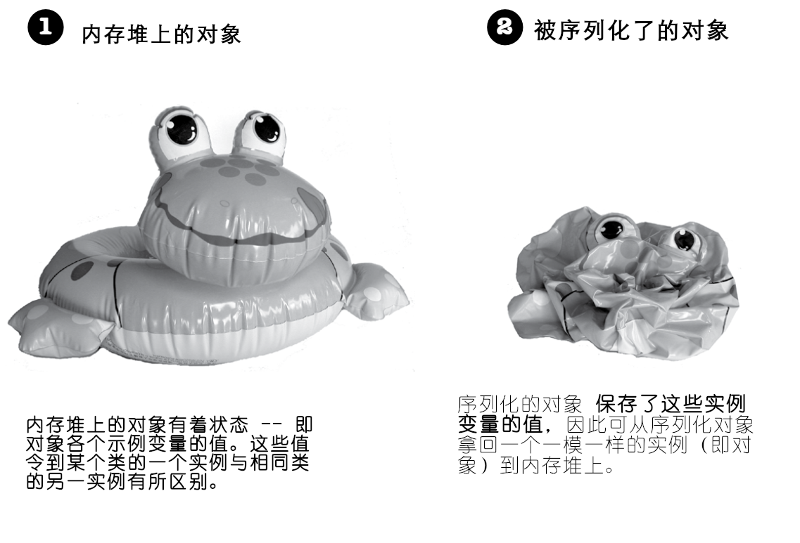
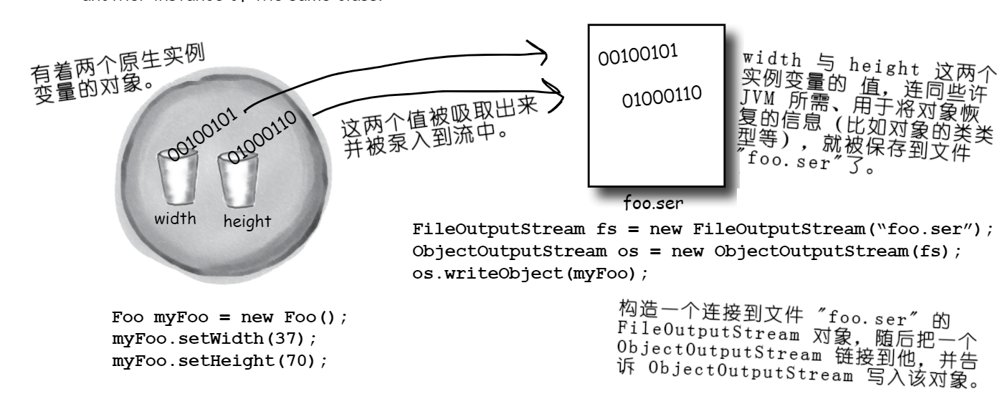
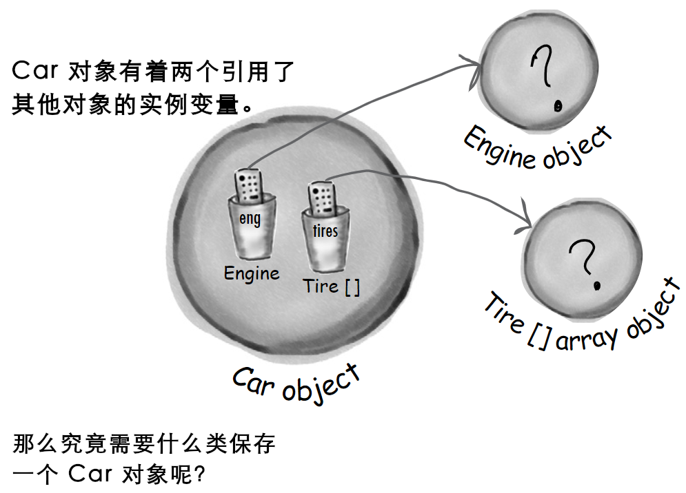
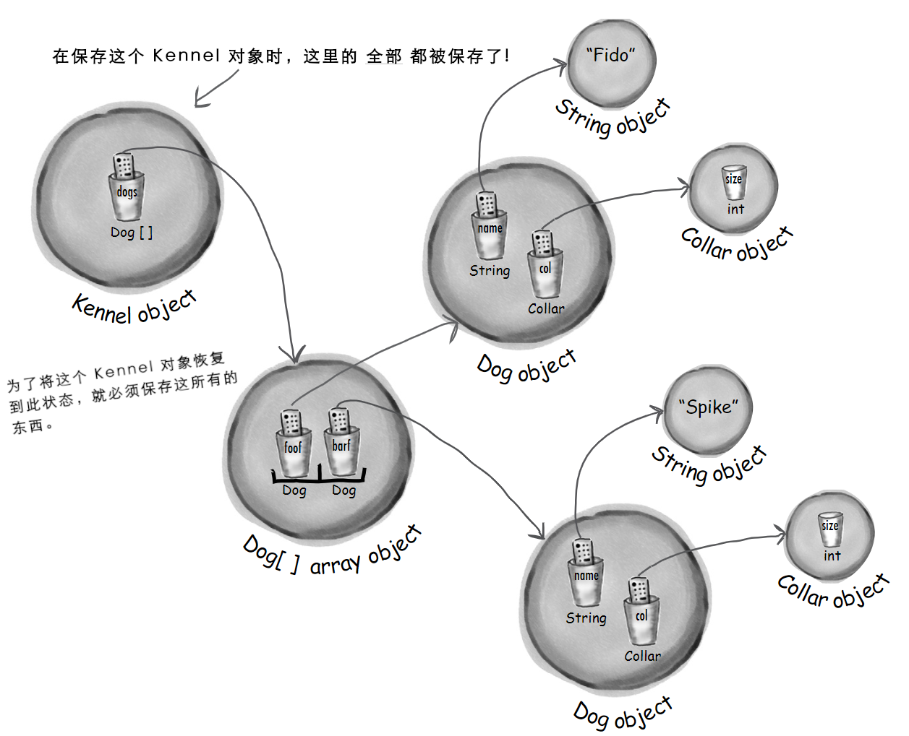
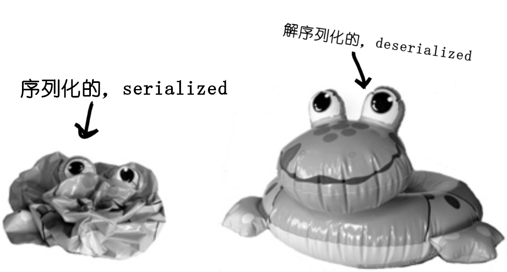
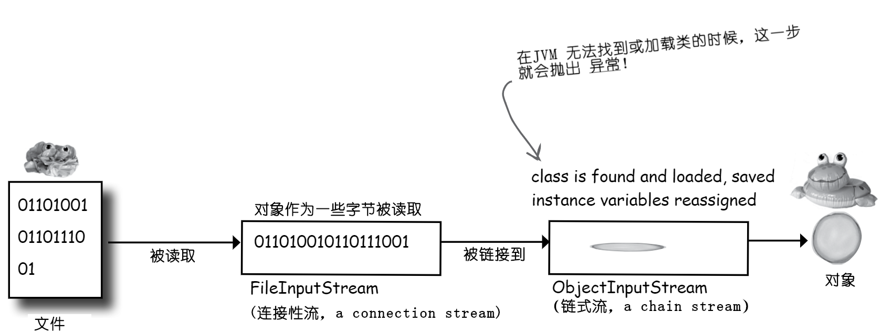
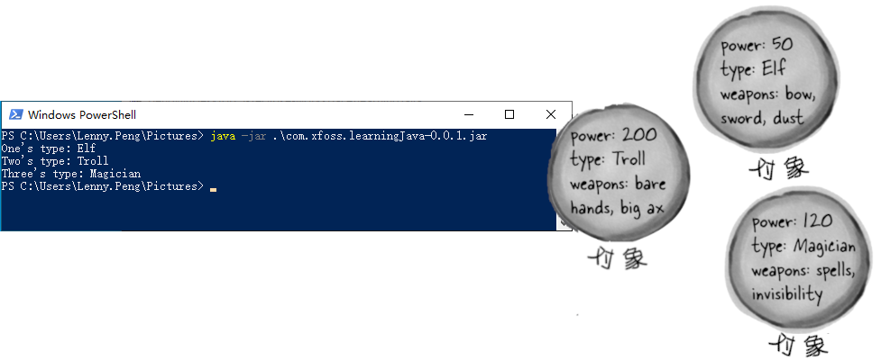

# 对象序列化与文件 `I/O`: 对象的保存

**serialization and file `I/O`: Saving Objects**


*图  1 - 第14章题图*

**对象可被放气或充气（Objects can be flattened and inflated）**。对象具有状态和行为。关于对象的那些 *行为*，是存活在 *类* 中，而 *状态* 则是存活在各个单独 *对象* 中的（*Behavior* lives in the *class*, but *state* lives within each individual *object*）。那么在对对象状态进行保存时，会发生什么呢？比如在编写某个游戏时，就会需要一个特性来保存/恢复游戏。又比如在编写某个创建图表的app时，就需要一个保存/打开文件的特性。在程序需要保存状态时，*可以笨办法来完成*，对各个对象进行询问，然后费力地将各个示例变量的值，以某种自创格式，写到一个文件。或者，**可以轻松的面向对象方式完成** -- 简单地将对象本身冻干/压平/持久化/脱水，然后再通过重组/填充/恢复/注水，来取回对象。不过 *某些时候* 仍然需要以笨办法来完成对象状态的保存，尤其是app保存的文件必定会被其他非Java语言的 app 读取的时候，所以本章会对这两种保存对象状态的方式加以审视（If your program needs to save state, *you can do it the hard way*, interrogating each object, then painstakingly writing the value of each instance variable to a file, in a format you create. Or, **you can do it the easy OO way** -- you simply freeze-dry/flatten/persist/dehydrate the object itself, and reconstitue/inflate/restore/rehydrate it to get it back. But you'll still have to do it the hard way *sometimes*, especially when the file your app saves has to be read by some other non-Java application, so we'll look at both in this chapter）。

## 对节拍进行捕获

**Capture the Beat**

现在 *构造* 好了完美的音乐曲目。那么就要把这个曲目 *存储* 起来。当然可以拿张纸然后摘抄下来，不过这里是要做成点击 ***保存*** 按钮的方式（或者从“文件”菜单中选择“保存”）。接着就要提供一个名称，选取某个目录，并确保这首优美的曲子，不会因为系统蓝屏司机而丢失（You could grab a piece of paper and start scribbling it down, but instead you hit the ***Save*** button(or choose Save from the File menu). Then you give it a name, pick a directory, and exhale knowing that your masterpiece won't go out the window with the blue screen of death）。

对于保存Java 程序状态来说，有很多个选项，至于具体选用何种选项，将取决于计划怎样去 *使用* 所保存的状态（You have lots of options for how to save the state of your Java program, and what you choose will probably depend on how you plan to *use* the saved state）。本章要检视的几种选项如下所示。

**在数据只会被生成数据的 Java 程式使用到时（If your data will be used by only the Java program that generated it）**：

1) **运用对象序列化**

**Use *serialization***

对留存了被压扁（序列化的）对象的一个文件进行写入。随后程序就从这个文件读取这些序列化的对象，并将他们充实回到活生生的、有呼吸的、存在于内存堆的对象（Write a file that holds flattened(serialized) objects. Then have your program read the serialized objects from the file and inflate them back into living, breathing, heap-inhabiting objects）。

**在数据会被其他程序使用到时**：

2) **写入 *普通文本* 文件**

**Write *a plain text* file**

写入到一个带有分隔符，从而可被其他程序解析的文件。比如就可以写入到一个由制表符分隔的、可被电子表格或数据库应用使用的文件（Write a file, with delimiters that other programs can parse. For example, a tab-delimited file that a spreadsheet or database application can use）。

当然并非只有这两个选项。可以所选的任意格式来保存数据。除了往文件中写入字符，还可以将数据写为字节（Instead of writing characters, for example, you can write your data as bytes）。还可以把那些 Java 原生值当作 Java 原生值来写入文件 -- 对于整数、长整数、布尔值等原生值类型，是有相应方法来写入文件的。但不管使用何种方法来保存数据，文件`I/O`的基本技巧总是不变的：把一些数据写入到 *某个东西（something）*，而通常这某个东西要么是磁盘上的文件、要么就是来自网络连接的流（But regardless of the method you use, the fundamental `I/O` techniques are pretty much the same: write some data to *something*, and usually that something is either a file on disk or a stream coming from a network connection）。读取数据则是同样的过程，只是反过来而已：从磁盘上的文件或某个网络连接，读取到一些数据。同时本章所讨论的内容，是在未使用到某种具体数据库时，所涉及的数据保存。

## 对状态进行保存

**Saving State**

设想有这么一个程序，比方说，一个奇幻冒险游戏，需要与玩家进行多次会话才能完成。随着游戏的进展，游戏中的角色变得愈加强大、弱小、灵巧等等，并会收集（或丢失）各种武器。那么就肯定不愿意每次启动游戏都又从头开始玩 -- 那样你的游戏角色就永远不会在某次激烈战斗中有最佳状态。那么就需要一种保存游戏角色状态的方式，以及在继续游戏时对状态进行恢复的方式。而由于作为游戏程序的编写者，就会希望整个保存与恢复，应该尽可能是容易实现（且简单明了）。

1) 选项一

**把这三个序列化的游戏角色写到某个文件**

创建出一个文件，并写入三个序列化角色对象。这个文件在作为文本进行读取时，并无任何意义：

```console
 ̈ÌsrGameCharacter 
 ̈%gê8MÛIpowerLjava/lang/
 String;[weaponst[Ljava/lang/
 String;xp2tlfur[Ljava.lang.String;≠“VÁ
 È{Gxptbowtswordtdustsq~»tTrolluq~tb
 are handstbig axsq~xtMagicianuq~tspe
 llstinvisibility
 ```

 2) 选项二

 **写入普通文本文件**

 创建出一个文件，并写入三行文本，每行一个游戏角色，用逗号分隔角色状态的各个部分：

 ```console
 50,Elf,bow, sword,dust
 200,Troll,bare hands,big ax
 120,Magician,spells,invisibility
 ```

 


*图 2 - 对象存储图解*

## 把序列化对象写到某个文件

以下就是将对象进行序列化（保存）的步骤（Here are the steps for serializing(saving) an object）。不用纠结于把这些步骤都记住；本章后续会深入讲解。

1) **构造一个 *`FileOutputStream`* 对象**

```java
// 构造出一个 FileOutputStream 对象。FileOutputStream 知道怎样去
// 连接（并创建出）一个文件。
// 
// 若这个 “MyGame.ser” 文件不存在，那么他就会被自动创建出来。
FileOutputStream fileStream = new FileOutputStream("MyGame.ser");
```

2) **构造一个 *`ObjectOutputStream` 对象***

```java
// ObjectOutputStream 实现对象写到文件，但他无法直接连接到
// 文件。他需要喂入一个“helper”。这实际上就是把一个流“链接”
// 到另一个上（This is actually called 'chaining' one stream
// to another）。
ObjectOutputStream oStream = new ObjectOutputStream(fileStream);
```

3) **写入对象**

```java
// 对这些由 characterOne, Two, Three 所表示的对象进行序列化操作
// 并将他们写到文件 “MyGame.ser” 中。
oStream.writeObject(characterOne);
oStream.writeObject(characterTwo);
oStream.writeObject(characterThree);
```

4) **关闭 `ObjectOutputStream`**

```java
// 关闭了顶部的流，就会关闭其下所有的其他流，因此 `FileOutputStream` 
// （及那个文件）就会自动关闭。
oStream.close();
```

**在各种流中，数据从一处往另一处移动（Data moves in streams from one place to another）**。

Java 的 `I/O` API，有着各种表示到诸如文件或网络套接字这类目的与源的连接，以及将那些只有被链接到其他流才会工作的流 ***链接*** 起来的 *连接性* 流（The Java `I/O` API has ***connection*** streams, that represent connections to destinations and sources such as files or network sockets, and ***chain*** streams that work only if chained to other streams）。

通常，要至少同时钩起两个流流，才能完成有用的事情 -- *一个* 表示连接，而 *另一个* 则是要调用到他的方法。为什么是两个呢？因为 *连接* 流通常都是很低级别的。就拿 `FileOutputStream`（就是一个连接流）来说，就有写入 *字节* 的一些方法。但这里并不想要写入 *字节*！这里要的是写入 *对象*，因此就需要一个高级别的 *链接* 流（Often, it takes at least two streams hooked together to do something useful -- *one* to represent the connection and *another* to call methods on. Why two? Because *connection* streams are usually too low-level. `FileOutputStream`(a connection stream), for example, has methods for writing *bytes*. But we don't want to write *bytes*! We want to write *objects*, so we need a higher-level *chain* stream）。

好，那么又为什么不只要精准完成所需的单个流呢？一个实现对象写入并同时将对象转换成字节的流？这就要考虑良好的面向对象了。每个类做好 *一件* 事情。`FileOutputStream` 就是把字节写入到文件。`ObjectOutputStream` 就是把对象转换成可写入到流的数据。所以这里构造一个 `FileOutputStream` 来实现到文件的写入，并在 `FileOutputStream` 末尾钩起一个 `ObjectOutputStream`（一个链接流）。在调用`ObjectOutputStream`上的 `writeObject()` 方法时，对象就被泵入到流中，随后就移动到 `FileOutputStream`，在那里最终被作为一些字节，写到某个文件。

不同连接与链接流组合的混搭能力，赋予到我们惊人的灵活性！若强制要求使用仅仅 *单个* 的流类，那么就会受 API 设计者们的支配，就会希望他们能考虑到咱们所期望的所有功能。然而有了流链接特性，就可以组装出自己 *定制* 的各种流链（The ability to mix and match different combinations of connection and chain streams gives you tremendous flexibility! If you were forced to use only a *single* stream class, you'd be at the mercy of the API designers, hoping they'd thought of *everything* you might ever want to do. But with chaining, you can patch together your own *custom* chains）。



*图 3 - Java对象写入文件过程*

## 在对象被序列化时，到底发生了什么？

**What really happens to an object when it's serialized**?



*图 4 - 图解存活对象与序列化对象的区别*



*图 5 - Java保存对象实例*

### 然而对象状态 *究竟是* 个什么呢？到底需要保存什么呢？

**But what exactly *IS* an object's state? What needs to be saved**?

现在就开始变得有趣起来了。要保存 *原生* 值 `37` 与 `70` 是相当容易。但如果对象有着一个是对象 *引用* 的实例变量呢？某个对象有着五个的对象引用的实例变量又会怎样呢？如果这些对象实例变量本身又有实例变量的话，又会怎样呢（Easy enough to save the *primitive* values `37` and `70`. But what if an object has an instance variable that's an object *reference*? What about an object that has five instance variables that are object references? What if those object instance variables themselves have instance variables）？

请想想。对象的什么部分，是潜在唯一的？试想一下为了获得一个与所保存对象一致的对象，究竟需要恢复的是什么。当然对象将有着不同的内存位置，然而对于这一点我们并不关心。这里所关心的，全是在内存堆上得出的结果，将获取到一个与对象被保存时有着相同状态的一个内存堆上的存活对象。

## 脑力锻炼



*图 6 - 如何保存带有到其他对象引用变量的对象*

必须要怎样保存 `Car` 对象，才能从 `Car` 副本中恢复到其原先的状态？

试想一下要保存 `Car` 对象会需要些什么 -- 以及怎样去保存他。

同时在 `Engine` 对象又有着到 `Carburetor` 对象的引用时，会怎样呢？以及在 `Tire []` 这个数组对象中又有着什么呢？

**在某个对象被序列化时，自其实例变量引用到的全部对象同时被实例化。这些被引用对象引用到的对象亦被实例化。这些被引用到的对象所引用的对象，亦被实例化......而最妙的地方就是，这些都是自动发生的**！

这个 `Kennel` 对象有着一个到 `Dog []` 数组对象的引用。而 `Dog []` 中留存了对两个 `Dog` 对象的引用。每个 `Dog` 对象留存了到一个字符串及一个 `Collar` 对象的引用。字符串对象有着一个字符集合，同时 `Collar` 对象有着一个整数。




*图 7 - 对象保存时涉及实例变量为对象引用的情形*

> **序列化保存了完整的 *对象图面（object graph）*。自所保存对象开始，全部的实例变量引用到对象，都会被序列化**。

## 在希望所编写的类可被序列化时，就要实现 `Serializable` 接口

**If you want your class to be serializable, implement `Serializable`**

由于 `Serializable` 接口没有要实现的方法，因此又被称作 *标记* 或者说 *标签* 接口（The `Serializable` interface is known as a *marker* or *tag* interface, because the interface doesn't have any methods to implement）。 其唯一目的，就是通告实现了他的类，是 *可被序列化的（serializable）*。也就是说，`Serializable` 类型的类，可通过序列化机制加以保存（In other words, objects of that type are saveable through the serialization mechanism）。在有超类是可序列化的类时，那么其子类将自动成为可序列化类，即使其子类并未显示声明 *`implements Serializable`*。（这也是接口一贯的 *运作* 方式。在某个类的超类 `IS-A` `Serializable`时，那么这个类同样是 `Serializable`的）。

```java
// 这里传递给 writeObject() 方法的参数，必须 实现了 Serializable
// 接口，否则在运行时就会失败
objectOutputStream.writeObject(myBox);
```

--

```java
package com.xfoss.learningJava;

// 接口 Serializable 是在 java.io 包中，因此要需要这个 import 语句
import java.io.*;

// 虽然没有要实现的方法，但在写下这里的 "implements Serializable"
// 时，就等于告诉了JVM，“可对这种类型的对象进行序列化。”
public class Box implements Serializable {

    // 这两个值将会被保存起来
    private int width;
    private int height;

    public void setWidth (int w) {
        width = w;
    }

    public void setHeight (int h) {
        height = h;
    }

    public static void main (String[] args) {
        Box box = new Box();
        box.setWidth(50);
        box.setHeight(20);

        // I/O 操作可能抛出异常。
        try {
            // 若存在一个名为“Box.ser”的文件，那么就连接到这个文件。而若不
            // 存在，就构造一个新的名为 “Box.ser” 的文件。
            FileOutputStream fStream = new FileOutputStream("Box.ser");
            // 构造一个链接到连接流 FileOutputStream 的 ObjectOutputStream 对象
            // 让他写入对象 box。
            ObjectOutputStream oStream = new ObjectOutputStream(fStream);
            oStream.writeObject(box);
            oStream.close();
        } catch (Exception ex) {ex.printStackTrace();}
    }
}
```

运行这段代码将创建出一个 `Box.ser` 的文件，其内容为：

```console
¬ísrcom.xfoss.learningJava.Boxý	¼%~FHIheightIwidthxp2
```

以后不管运行多少次，`Box.ser` 的内容都不会改变。

## 序列化就是全部，或者全无。

**Serialization is all or nothing**.

**设想一下如果对象的某些状态没有正确保存，会发生什么呢**？


*图 8 - 序列化对象恢复的风险*

**要么整个的对象图面被正确序列化，但凡有一个差错，那么就算作序列化失败（Either the entire object graph is serialized correctly or serialization fails）**。

**在对一个 `Pond` 对象进行序列化时，若他 `Duck` 实例变量拒绝被实例化（因为没有对 `Serializable` 接口进行实现），那么就无法实例化这个 `Pond` 对象**。

```java
package com.xfoss.learningJava;

import java.io.*;

// Pond 的对象，可被序列化
public class Pond implements Serializable {
    // 类 Pond 有一个实例变量，是到一个 Duck 
    // 对象的引用。
    private Duck duck = new Duck();
    
    public static void main (String[] args) {
        Pond pond = new Pond();

        try {
            FileOutputStream fStream = new FileOutputStream("Pond.ser");
            ObjectOutputStream oStream = new ObjectOutputStream(fStream);

            // 在对 pond （一个 Pond 的对象）进行序列化时，该对象
            // 的 Duck 实例变量会自动被序列化。
            oStream.writeObject(pond);
            oStream.close();
        } catch (Exception ex) { ex.printStackTrace(); }
    }
}

// 然而！！Duck（在 com.xfoss.learningJava.UseADuck中声明） 并
// 不是可序列化的！Duck 类并没有实现 Serializable, 因此在对
// Pond 对象进行序列化时，由于该 Pond 对象的 Duck 实例变量
// 无法被保存，而失败。
```

将报出以下错误：

```console
Quack... My size is 32, my number is 1
java.io.NotSerializableException: com.xfoss.learningJava.Duck
        at java.base/java.io.ObjectOutputStream.writeObject0(ObjectOutputStream.java:1185)
        at java.base/java.io.ObjectOutputStream.defaultWriteFields(ObjectOutputStream.java:1553)
        at java.base/java.io.ObjectOutputStream.writeSerialData(ObjectOutputStream.java:1510)
        at java.base/java.io.ObjectOutputStream.writeOrdinaryObject(ObjectOutputStream.java:1433)
        at java.base/java.io.ObjectOutputStream.writeObject0(ObjectOutputStream.java:1179)
        at java.base/java.io.ObjectOutputStream.writeObject(ObjectOutputStream.java:349)
        at com.xfoss.learningJava.Pond.main(Pond.java:15)
```


*图 9 - 非 `Serializable` 对象无法被序列化的麻烦*

**在实例变量无法（或不应）被保存时，就要把他标记为 *瞬态* 实例变量（Mark an instance variable as *transient* if it can't (or shouldn't) be saved）**。

若希望某个实例变量跳过对象的序列化过程，那么就要使用 `transient` 关键字，对该变量进行标记。

```java
import java.net.*;

class Chat implements Serializable {
    // 关键字 transient, 说的是 “在序列化期间不要
    // 保存这个变量，只要跳过他就好。”
    transient String currentID;

    // 在序列化期间，变量 userName 将被保存为该对象
    // 的一部分。
    String userName;

    // 其他代码
}
```

在有着一个因为本身不是可序列化，而无法被保存的实例变量时，就可以使用 `transient` 关键字对那个变量进行标记，从而序列化过程就会精准地跳过他。

**然而一个变量无法被序列化的原因又究竟为何呢**？其中可能简单地就是，那个类的设计者仅仅是 *忘了* 把其构造为对 `Serializable` 接口进行实现。或者由于对象依赖于一些特定于运行时信息，因此就直接无法保存。虽然 Java 类库中绝大多数物件都是可序列化的，但对于诸如网络连接、线程或文件对象等物件，是无法保存的。这些物件，全都依赖于（特定于）某种特别运行时 “体验”。也就是说，这些对象是以专为所编在程序，在特定平台上、在特定的JVM中的一次特定运行，而进行初始化的。一旦程序关闭，就没有了将这些物件，以任何有意义的方式，再复活过来的办法；这些对象，每次都要从头创建出来（So why would a variable not be seralizable? It could be that the class designer simply *forgot* to make the class implement `Serializable`. Or it might be because the object relies on runtime-specific information that simply can't be saved. Although most things in the Java class libraries are serializable, you can't save things like network connections, threads, or file systems. They're all dependent on (and specific to) a particular runtime 'experience'. In other words, they're instantiated in a way that's unique to a particular run of your program, on a particular platform, in a particular JVM. Once the program shuts down, there's no way to bring those thins back to life in any meaningful way; they have to be created from scratch each time）。

## 答疑

- **既然序列化如此重要，那为何不是全部类都默认可序列化呢？为何类 `Object` 没有实现 `Serializable` 接口，这样所有子类就自动地可被序列化了呀**？

> 尽管绝大多数类都会，且都应对 `Serializable` 接口进行实现，不过仍然可以选择选择不予实现此接口。对于所设计的类，必须逐一审视，在是否要通过实现 `Serializable` 来 “开启” 序列化功能上，作出慎重决定。那么首先，如果序列化作为默认了，又该怎样把他关掉呢？**接口就意味着功能，而非功能的消减（Interfaces indicate functionality, not a *lack* of functionality）**，那么如果这样来告诉外部世界某个对象无法保存：`implements NonSerializable`，多态机制模型就会无法正确运作了。


- **究竟为何要编写一个不可序列化的类**？

> 编写不可序列化类的理由极少，比如在不希望某个口令对象被存储起来地方，如果将其编写为可序列化对象而被保存了起来，那么就会有着安全问题。有比如在有着某个由于其关键实例变量就是不可序列化的他们本身，而保存起来没什么意义的类时，那么这个时候如果再把他们构造为可序列化的类，就没有什么有用处，多此一举了（There are very few reasons, but you might, for example, have a security issue where you don't want a password object stored. Or you might have an object that makes no sense to save, because its key instance variables are themselves not serializable, so there's no useful way for you to make your class serializable）。


- **在所使用的类不是可序列化的，又没有什么好的理由去来让这个类不可序列化（仅仅由于这个类的设计者忘记给这个类实现 `Serializable` 接口，或由于其设计者的愚蠢），那么可以对这个“不良”的类进行子类化，从而将子类构造为可序列化的吗**？

> 当然可以！在类本身为可扩展时（即非 `final`），就可以构造一个可序列化子类，并只要在那些期望那个超类类型的地方，用这个子类去替换即可。（请记住，多态机制是允许这样做的。）不过这又提出了另一个有趣的问题：超类不可序列化究竟意味着什么呢？

- **你所提到的：从不可序列化类构造出可序列化类，意味着什么**？

> 这里就要先看看在类解序列化时，会发生什么，（后面很快就会讨论到这个问题）。简而言之，在对象被解序列化且对象的超类为不可序列化的情况下，那么其超类的构造器就会运行，从而创建出那种类型的一个对象来。在没有让某个类成为不可序列化类的适当理由的情况下，那么构造一个可序列化的子类，将是一种良好的做法（In a nutshell, when an object is deserialized and its superclass is not serializable, the superclass constructor will run just as though a new object of that type were bebing created. If there's no decent reason for a class to not be serializable, make a serializable subclass might be a good solution）。

- **噢！我是不是发现了了不起的东西......只要使某个变量成为“瞬态（`transient`）”，就意味着在序列化过程中该变量的值被跳过。那么这个瞬态变量究竟发生了什么？这里通过将不可序列化实例变量构造为瞬态变量的方式，解决了实例变量不可序列化问题，然而在将其所属对象复活时，难道就不再需要那个瞬态变量了吗？也就是说，难道整个序列化操作的目的，不就是保留对象的状态吗**？

> 是的，这确实是个问题，不过幸运的是，有办法解决这个问题。在对某个对象进行序列化操作时，不论瞬态引用实例变量在保存时的值为何，他们都将将恢复到 `null`。这就意味着连接到那个特定实例变量的整个对象图面，都不会被保存。显然，这样处理会有坏处，因为可能需要那个变量为非空值（Yes, this is an issue, but fortunately there's a solution. If you serialize an object, a transient reference instance variable will be brought back as `null`, regardless of the value it had at the time it was saved. That means the entire object graph connected to that particular instance variable won't be saved. This could be bad, obviously, because you probably need a `non-null` value for that variable）。
>
> 这个时候就有两个选项：
>
> 1) 在将对象恢复过来时，将那个 `null` 的实例变量，重新初始化回某种默认状态。在所解序列化的对象不依赖特定值的那个瞬态变量时，这种做法是可行的。也就是比如对于`Dog`对象，带有一个 `Collar` 的属性，就比较重要，而或许所有的 `Collar` 对象都是同样的，那么在给到所有复活过来的 `Dog` 一个全新的 `Collar`，就无关紧要；没有人会知道其中的差别（When the object is brought back, reinitialize that `null` instance variable back to some default state. This works if your deseralized object isn't dependent on a particular value for that transient variable. In other words, it might be important that the `Dog` have a `Collar`, but perhaps all `Collar` objects are the same so it doesn't matter if you give the resurrected `Dog` a brand new `Collar`; nobody will know the difference）。
>
> 2) 在瞬态变量的取值确实至关重要时（比如每个 `Dog` 对象的瞬态变量 `Collar` 的颜色与式样都不相同），那么就需要对 `Collar` 的关键属性值进行保存，并在复活 `Dog` 对象时，使用这些关键属性值来再造一个与原先一致的全新 `Collar` 对象出来。

- **若对象图面中的两个对象引用变量，指向了相同对象，这个时候会怎样呢？比如说，在 `Kennel` 中有两个不同的 `Cat` 对象引用变量，但这两个`Cat`引用变量都是同一具体对象的引用。那么那个具体`Cat`对象会被保存两次吗？我倒希望不会**。 

> 非常棒的问题！Java的序列化特性是足够聪明的，可以了解到图面中那两个对象是同样的。在图面中有两个同样对象时，那么就只有其中一个会被保存，而在解序列化过程中，所有到那个对象引用，都会被恢复出来。

## 解序列化：恢复对象

**Deserialization: restoring an object**



*图 10 - 序列化对象与解序列化对象*

给对象进行序列化的关键，就是在往后某一天，与不同JVM的“运行”里（甚至在不同于对象被序列化时所运行的同一JVM里），可以把对象恢复到其原本状态。解序列化与序列化十分相像，只是过程相反。

1) **构造一个 `FileInputStream`**

```java
// 构造一个 FileInputStream 对象。这里的 FileInputStream 就
// 知道怎样去连接上要给既有的文件。
//
// 在文件 "MyGame.ser" 不存在时，将得到一个异常。
FileInputStream fileStream = new FileInputStream("MyGame.ser");
```

2) **构造一个 `ObjectInputStream`**

```java
// ObjectInputStream 允许读取对象，但他无法直接连接到某个
// 文件。他需要被链接到一个连接性流，这个示例中就是链接到
// 的一个 FileInputStream。
ObjectInputStream os = new ObjectInputStream(fileStream)
```

3) **读取那些对象**

```java
// 在每次写下 readObject() 方法时，就获得了流中的下一个
// 对象。因此将以这些对象被写入的同样顺序，把这些对象读取
// 回来。若尝试读取多于写入的对象时，就会得到一个大大的异常。
Object one = os.readObject();
Object two = os.readObject();
Object three = os.readObject();
```

4) **对读取到的这些对象，进行类型强制转换**

```java
// readObject() 方法的返回值是类型 Object 的（就跟
// ArrayList那里的情况一样），因此就必须将其强制
// 转换回所知的真实类型。
GameCharacter elf = (GameCharacter) one;
GameCharacter troll = (GameCharacter) two;
GameCharacter magician = (GameCharacter) three;
```

5) **关闭 `ObjectInputStream`**

```java
// 关闭了顶部的流也就关闭了其下的那些流，因此 FileInputStream
// （以及那个文件）就会自动关闭。
os.close();
```

### 解序列化期间发生了什么？

**What happens during deserialization**?

在对象被解序列化时，JVM尝试通过在内存堆上构造一个新的、与对象在被序列化时有着同样状态的对象，来把对象复活过来。当然，这是排除了那些瞬态变量的，那些瞬态变量要么以`null`值（对于那些对象的引用变量）再现，要么以默认原生值再现。



*图 11 - 对象解序列化的过程*

1) 从流 **读取到** 对象；

2) JVM推断出对象的 **类类型**（通过序列化的对象中存储的信息，The JVM determines (through info stored with the serialized object) the object's **class type**）；

3) JVM 尝试 **找到并加载** 该对象的 **类**。若 JVM 无法找到并/或加载该类，那么 JVM 就会抛出一个异常，同时解序列化宣告失败（The JVM attempts to **find and load** the object's **class**. If the JVM can't find and/or load the class, the JVM throws an exception and the deserialization fails）；

4) 在内存堆上，一个新的对象被分配到空间，但 **被序列化对象的构造器并 *不会* 运行**！显然，若该构造器运行，就会把那个对象的状态，恢复到其原本的“新”状态，不过这并不是这里所想要的。这里要的时对象被恢复到他被序列化时所具有的状态，而不是他最开始被创建出时的状态（A new object is given space on the heap, but the **serialized object's constructor doess NOT run**! Obviously, if the constructor ran, it would restore the state of the object back to its original 'new' state, and that's not what we want. We want the object to be restored to the state it had *when it was serialized*, not when it was first created）;

5) 若该对象在其继承树往上的某处，有着一个不可序列化类，那么随着这个不可序列化类之上的其他全部构造器的运行（即使这些往上的类是可序列化的）， **那个不可序列化类的构造器也将运行起来**。一旦构造器链式运行起来，就无法停止了，这就意味着从第一个不可序列化类开始的所有超类，都会重新初始化出他们的状态（If the object has a non-serializable class somewhere up its inheritance tree, the **constructor for that non-serializable class will runn** along with any constructors above that(even if they're serializable). Once the constructor chaining begins, you can't stop it, which means all superclasses, beginning with the first non-serializable one, will reinitialize their state）;

6) 对象的 **那些实例变量，都被赋予到来自序列化状态时的值**。那些瞬态变量，被赋予对象引用变量的默认值 `null`，以及原生类型下相应的默认值（`0`、`false`等等）。

## 答疑

- **为何类没有作为对象的一部分，被保存起来？那样的话，就不存在类不会被找到的问题了**。

> 确实，Java/JVM 的设计者们原本可以让序列化特性以那种方式运作。不过那样会造成巨大的浪费和开销。相比于运用序列化特性，将对象写到本地硬盘上的某个文件这种不是那么拮据的操作，那么通过序列化特性而通过网络来发送对象，就会困难得多。若把类绑定到各个被序列化（可传送）的对象，那么对带宽的要求就要比现在大得多（Sure, they could have made serialization work that way. But what a tremendous waste and overhead. And while it might not be such a hardship when you're using serialization is also used to send objects over a network connection. If a class was bundled with each serialized (shippable) object, bandwidth would become a much larger problem than it already is）。
>
> 然而对于那些被序列化来透过网络传输的对象，实际上有着一种，可将此种序列化对象 “盖戳上” 一个，表示在何处可以找到他的类的URL的机制。这个机制在 Java 的远程方法调用中有运用到，从而可以将序列化对象，作为方法参数的一部分进行传送，这个时候如果接收到的调用的JVM没有这个类，那么JVM就可以使用该URL，来从网络获取到这个类并进行加载，此过程全部是自动进行的。（在第 17 章将讨论到RMI，For objects serialized to ship over a network, though, there actually is a mechanism where the serialized object can be 'stamped' with a URL for where its class can be found. This is used in Java's Remote Method Invocation(RMI) so that you can send a serialized object as part of, say, a method argument, and if the JVM receiving the call doesn't have the class, it can use the URL to fetch the class from the network and load it, all automatically. (We'll talk about RMI in chapter 17.)）

- **那些静态变量呢？他们会被序列化吗**？

> 不会。请记住，静态就表示“每个类一个”，而不是“每个对象一个”。静态变量不被保存，且在某个对象被解序列化时，该对象的类 *当前* 有什么静态变量，那么该对象就会有什么静态变量。谨记：不要构造那些对动态改变的静态变量有依赖的可序列化对象！那样的话在恢复出对象时，就会出现与原先不一致的情况（Nope. Remember, static means "one per class" not "one per object". Static variables are not saved, and when an object is deserialized, it will have whatever static variable its calss *currently* has. The moral: don't make serializable objects dependent on a dynamically-changing static variable! It might not be the same when the object comes back）。

## 游戏角色的保存与恢复

**Saving and restoring the game characters**

```java

package com.xfoss.learningJava;

import java.io.*;
import com.xfoss.Utils.*;

public class GameSaverTest {
    public static void main (String[] args) {
        // 构造一些角色......
        GameCharacter one = new GameCharacter(50, "Elf", new String[] {"bow", "sword", "dust"});
        GameCharacter two = new GameCharacter(200, "Troll", new String[] {"bare hands", "big ax"});
        GameCharacter three = new GameCharacter(120, "Magician", new String[] {"spells", "invisibility"});

        XPlatformThings th = new XPlatformThings();
        String dataDir = th.getWorkingDir("learningJava");

        File dir = new File(dataDir);
        if(!dir.exists()) dir.mkdirs();
        
        String serFile = String.format("%s/GameCharacter.ser", dataDir);

        // 设想对这些角色进行操作的代码，可能改变这些角色的状态
        try {
            ObjectOutputStream os = new ObjectOutputStream(new FileOutputStream(serFile));
            os.writeObject(one);
            os.writeObject(two);
            os.writeObject(three);
            os.close();
        } catch (IOException ex) {ex.printStackTrace();}

        // 这里把这些角色设置为 null, 这样就无法在内存堆上访问到这些对象了
        one = null;
        two = null;
        three = null;

        try {
            // 现在从文件把这些角色读取回来......
            ObjectInputStream is = new ObjectInputStream(new FileInputStream(serFile));
            GameCharacter oneRestore = (GameCharacter) is.readObject();
            GameCharacter twoRestore = (GameCharacter) is.readObject();
            GameCharacter threeRestore = (GameCharacter) is.readObject();
            is.close();

            // 检查一下这样的保存与读取是否可行。
            System.out.format("One's type: %s\n", oneRestore.getType());
            System.out.format("Two's type: %s\n", twoRestore.getType());
            System.out.format("Three's type: %s\n", threeRestore.getType());
        } catch (Exception ex) {ex.printStackTrace();}
    }
}
```



*图 12 - 对象序列化实例运行效果*

### 类 `GameCharacter`

```java
// 这是一个简单的仅用于测试序列化操作的类，同时这里也并没有一个
// 真正的游戏，不过实现游戏的过程，可以自己去完成。
package com.xfoss.learningJava;

import java.io.*;

public class GameCharacter implements Serializable {
    int power;
    String type;
    String [] weapons;

    public GameCharacter (int p, String t, String [] w) {
        power = p;
        type = t;
        weapons = w;
    }

    public int getPower () {
        return power;
    }

    public String getType () {
        return type;
    }

    public String getWeapons () {
        String weaponList = "";

        for (int i = 0; i < weapons.length; i++) {
            String.format("%s %s", weaponList, weapons[i]);
        }

        return weaponList;
    }
}
```

## 对象序列化的重点

**Object Serialization, BULLET POINTS**

- 通过将对象序列化，可保存对象的状态；
- 要序列化某个对象，就需要一个 `ObjectOutputStream`（来自 `java.io`包） 对象；
- 流要么是连接流，要么是链式流；
- 连接流可表示到源或目的地，典型的就是某个文件、网络套接字，或控制台，的一个连接；
- 链式流无法连接到源或目的地，而必须链接到连接（或其他）流；
- 要将对象序列化到文件，就要构造一个 `FileOutputStream` 对象，并将这个对象链接进入一个 `ObjectOutputStream`;
- 调用 `ObjectOutputStream` 对象上的 *`writeObject(theObject)`* 方法，来对这个 `theObject` 进行序列化。这里无需调用 `FileOutputStream` 上的那些方法；
- 对象要被序列化，就必须实现 `Serializable` 接口。在该类的超类实现了 `Serializable`，那么进行这个子类没有特别声明 *implements Serializable*，也自动成为可被序列化；
- 在对象被序列化时，他的整个对象图面都被序列化了。那就意味着被该序列化对象的那些实例变量所引用的全部对象，以及这些被引用对象所应用的全部对象......等等都被序列化了；
- 若图面中有任何对象不可被序列化，那么在运行时就会抛出异常，除非指向这个不可序列化对象的实例变量被跳过；
- 若希望序列化操作跳过某个变量，使用关键字 `transient` 标记这个变量即可。这个被 `transient` 关键字标记过的变量，将被恢复到 `null` （对于对象引用变量），或默认值（对于原生类型变量）；
- 在解序列化过程中，对象图面中所有对象的类，必须对JVM可用；
- 读取对象（使用 `readObject()` 方法）是以所读取的那些对象原先写入的顺序读出；
- `readObject()` 方法返回值类型为 `Object` 类型，因此解序列化出的对象，必须被强制转换（`cast`）到他们真实类型；
- 静态变量不会被序列化！将静态变量作为特定对象状态的一部分进行保存没有意义，因为那种类型的所有对象，都共享着仅仅这一个值 -- 就是类中的那个；

## 写入一个字符串到文本文件

**Writing a `String` to a `Text` File**

经由序列化特性保存对象，是在某个Java程序的不同运行之间，进行数据保存与恢复的最容易方式（Saving objects, through serialization, is the easiest way to save and restore data between runnings of a Java program）。不过有时候仍需要把数据保存到普通老式文本文件。设想有Java程序必须把数据，写入到某个其他（极有可能为非Java的）程序需要读取的简单文本文件。比如说，有这样一个Java编写的、获取用户输入到浏览器的表单数据的小服务程序（a servlet），并把这些表单数据，写入到一个其他程序也会加载到某个电子表单进而加以分析的文本文件。

写入文本数据（实际上是一个字符串），跟写入对象类似，只是写入的是一个字符串而不再是对象，还有使用的是 `FileWriter`而不是`FileOutputStream`（并且也不是链接到 `ObjectOutputStream`的）。


*图 13 - 以文本文件方式保存对象数据*

**要写入序列化对象**：

```java
objectOutputStream.writeObject(someObject);
```

**而要写入一个字符串**：

```java
fileWriter.write("My first String to save");
```

```java
// 这里需要 java.io 包来提供到 FileWriter 类
import java.io.*;

class WriteAFile {
    public static void main (String[] args) {
        // 所以 I/O 操作，都必须在一个 try/catch 代码块中。其中的
        // 全部操作都能抛出 IOException 异常！！
        try {
            // 如果这个 “Foo.txt” 文件不存在，FileWriter就会创建他。
            FileWriter writer = new FileWriter("Foo.txt");
            
            // write() 方法取的是一个字符串参数
            writer.write("hello foo!");

            // 在完成写入后要关闭这个 FileWriter 对象！
            writer.close();
        } catch (IOException ex) {
            ex.printStackTrace();
        }
    }
}
```

## 文本文件示例：`e-Flashcards`

**Text File Example: `e-Flashcards`**

还记得上学时用过的那些学习卡片（flashcards）吗？那种卡片一面有个问题，背后就是问题的答案。虽然这些学习卡片对于掌握理解某些内容没有帮助，但用于简单操练和死记硬背，他们是无可比拟的。*尤其是在必须把某个事实刻入脑中的时候*。同时这样的卡牌，用于益智猜谜竞赛中也非常棒。

**接下来就要构造以恶有三个类的电子版卡牌**：

1) 类`QuizCardBuilder`，用于一套电子卡牌的创建及存储的一个简单创作工具；

2) 类 `QuizCardPlayer`，一个可加载进一套电子卡牌，并给用户玩这套卡牌的回放引擎；

3) 类`QuizCard`，一个表示卡牌数据的简单类。这里会贯穿卡牌构建器与卡牌播放器的代码，而把 `QuizCard`类留给读者自己取构造，使用下表：

| `QuizCard` |
| :--- |
| `QuizCard(q, a)` |
| `question` <br /> `answer` |
| `getQuestion()` <br /> `getAnswer()` |
