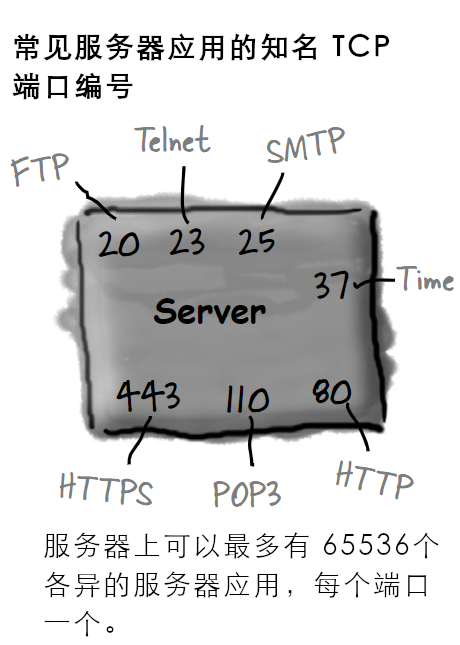
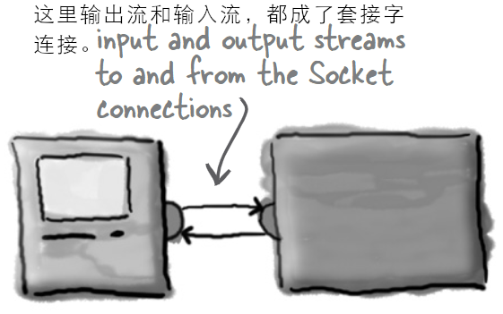
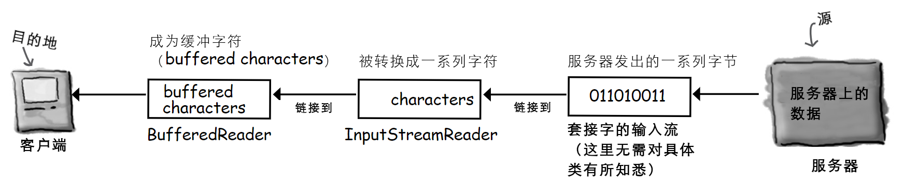
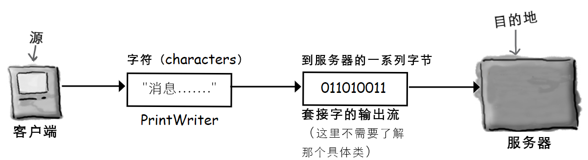
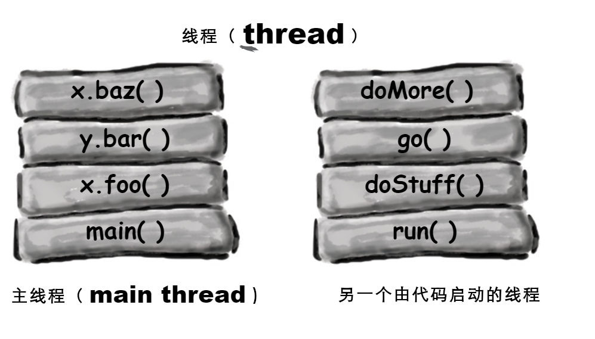
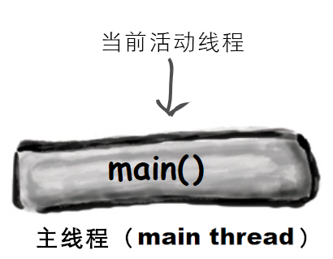
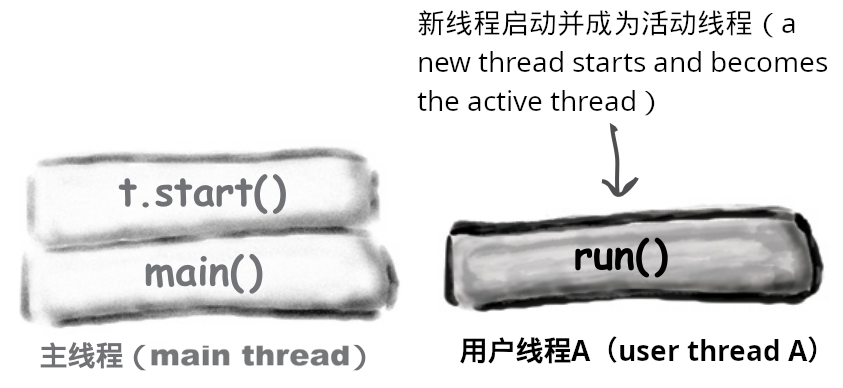
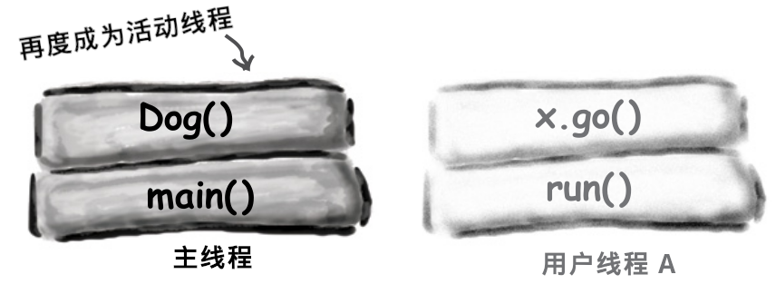
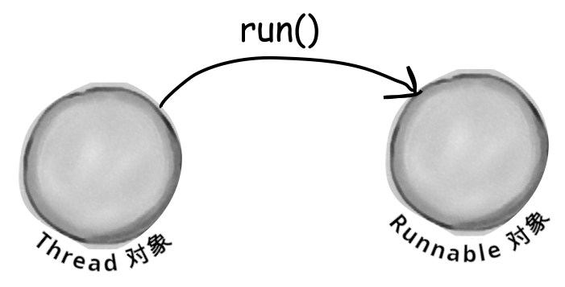

# 联网与线程：构造连接

**Networking and threads: Make a Connection**

**要与外部世界连通**。Java程序是能够触及另一台机器上程序的。而且不难触及。`java.net`库中的众多类，负责全部低级别网络通信细节。采用 Java 的众多益处之一，就是透过网络来发送和接收数据，就跟普通 `I/O` 操作一样，些许不同之处在于，位于 `I/O` 操作链末端有着不同的连接性流。在获得了一个 `BufferedReader`后，就可以 *读取* 数据了。而 `BufferedReader`是不会在乎数据是从文件还是从以太网线上来的。本章将使用套接字来连接到外界（And the `BufferedReader` couldn't care less if the data came out of a file or flew down an ethernet cable. In this chapter we'll connect to the outside world with sockets）。这里会构造 *客户端* 套接字。也会构造 *服务器* 套接字。这里会构造 *客户端* 与 *服务器*。同时还会让二者互相对话。在本章完成之前，就会有一个功能完整、多线程的聊天客户端。对了，这里提到了 *多线程*，那么就 *即将* 学到怎样在与 Bob 对话的同时，还要听 Suzy 讲话的诀窍。

## 实时 `BeatBox` 聊天室应用

**Real-time `BeatBox` Chat**


*图 1 - 具备网络通信与线程特性之后的 `BeatBox` 应用*

现在是在计算机游戏上工作了。玩家和队友一起，为游戏的各个部分制作声音素材。运用一个 *聊天室* 版的 `BeatBox` 应用，团队就可以协同工作 -- 可把一个节拍编排与一条消息一起发出，然后`BeatBox`聊天室中的所有人就会收到这条消息以及与消息一起发出的节拍编排。因此就不光要 *读取* 其他参与者的消息，还要可通过直接点击接收消息区中的某条消息，来加载并 *演奏出* 一个节拍编排。

在本章将了解到，要构造一个这样的聊天客户端需要些什么。甚至还会了解到一点有关构造聊天 *服务器* 的知识。为后面代码厨房的目的，这里将保留完整的 `BeatBox` 聊天室，不过在本章中 *将* 编写一个 `LudicrouslySimpleChatClient` 应用，以及一个用于发送和接收文本消息的非常简单的聊天服务器。


*图 2 - `SimpleChatClient` 应用*

## 聊天程序概览

**Chat Program Overview**


*图 3 - `SimpleChat`应用概览*

### 工作原理

**How it Works**:

1) **客户端连接到服务器**

**Client connects to the server**


*图 4 - `SimpleChat`应用原理（一）- 客户端连接到服务器*


2) **服务器构造一个连接，并将该客户端加入到参与者清单**

**The server makes a connection and adds the client to the list of participants**


*图 5 - `SimpleChat`应用原理（二） - 服务器构造一个连接，并将该客户端加入到参与者清单*


3) **另一客户端进行连接**

**Another client connects**


*图 6 - `SimpleChat`应用原理（三） - 另一客户端进行连接*


4) **客户端 A 发送一条消息给聊天服务**


*图 7 - `SimpleChat`应用原理（四） - 客户端 A 发送一条消息给聊天服务*

5) **服务器将该条消息，发布给所有参与者（包括原本的发送者）**


*图 8 - `SimpleChat`应用原理（五） - 该条消息被发布到全体参与者*

## 建立连接、发送数据，与数据接收

**Connecting, Sending, and Receiving**

为了让 `SimpleChat` 客户端运作，必须掌握以下三件事：

1) 如何建立客户端与服务器之间最开始的 **连接**（How to establish the initial **connection** between the client and server）；
2) 如何把消息 **发送给** 服务器（How to **send** messages *to* the server）；
3) 如何从服务器 **接收** 消息（How to **receive** messages *from* the server）。

这些事项要能运行起来，就必须要有大量底层的操作要实现（There's a lot of low-level stuff that has to happen for these things to work）。不过值得庆幸的是，Java 的网络通信包 API （`java.net`）让这一切，都变成了小菜一碟。因此相比于网络通信与 `I/O` 代码，看到的更多的是 GUI 代码。

而且这还不是全部。

`SimpleChat`客户端中潜在的另一个到目前为止尚未遇到的问题，就是在同一时间进行两件事情。连接的建立是一次性的操作（要么成功要么失败）。然而在那之后，聊天室参与者就要 *发送传出消息*，并 **同时** *接收* 来自其他参与者的 *传入消息*。嗯...这就要花点心思，不过很快就会接触到这个问题。

1) **连接（Connect）**

经由建立起一个 **套接字（Socket）** 连接，客户端连接到服务器。


*图 9 - `SimpleChat`客户端连接到服务器*

2) **发送（Send）**

客户端将消息 **发送** 给服务器。


*图 10 - `SimpleChat`客户端将消息发送给服务器*


3) **接收（Receive）**

客户端从服务器 **获取到** 消息。


*图 11 - `SimpleChat`客户端从服务器获取到消息*

## 构造网络套接字连接

**Make a network Socket connection**

要连接到另一台机器，就需要一个套接字连接。套接字（`java.net.Socket`）是一个表示两台机器之间网络连接的对象（A Socket(`java.net.Socket`) is an object that represents a network connection between two machines）。何为连接？即两台机器之间的一种 *关系（relationship）*，其中 *两个软件相互有了解（two pieces of software know about each other）*。更为重要的是，这两个软件知道怎样互相 *通信（communication）*。换句话说，他们知道如何将一系列的 *二进制位* 发送给对方。

好在这里不会关注那些底层细节，这是由于这些低级别细节，是在 “网络通信栈” 中的更底层处处理的（We don't care about the low-level details, thankfully, because they're handled at a much lower place in the 'networking stack'）。若对于“网络通信栈”一无所知，那么也无需担心他。那只是一种关于信息（一系列二进制位）从运行在某种OS上的JVM中的Java程序，到物理实体硬件（比如以太网线），到另一机器后又从物理硬件到Java程序中，所必须经历的多个层的说法。必须 *有人* 来处理这些全部繁重工作（If you don't know what the 'networking stack' is, don't worry about it. It's just a way of looking at the layers that information (bits) must travel throught to get from a Java program running in a JVM on some OS, to physical hardware(ethernet cables, for example), and back again on some other machine. *Somebody* has to take care of all the dirty details）。不过那不是咱们Java程序员要做的。处理这些底层网络通信的，正是那些特定于OS的软件，以及Java的网络通信API。真正要担心的，是那些高级别的东西 -- 构造出那个 *甚为* 高级别的对象 -- 从而就变得惊人的简单了。准备好了吗？

> 要构造一个 `Socket` 连接，就需要知道有关服务器的 **两件事**：服务器是谁，以及运行在哪个端口上。
>
> 换句话说，
>
> 即 **IP 地址和 TCP 端口编号**。


```java
// '196.164.1.103' 是服务器的 IP 地址
//
// '5000' 是 TCP 端口号
Socket chatSocket = new Socket("196.164.1.103", 5000);
```


*图 12 - Java网络通信套接字的构造原理*

**`Socket` 连接是指两台机器有着对方的信息，包括网络位置（即 IP 地址）以及 TCP 端口（A `Socket` connection means the two machines have information about each other, including network location(IP address) and TCP port）**。

**所谓 TCP 端口，无非是一个编号，一个 16 位的、区分服务器上特定程序的数字（A TCP port is just a number. A 16-bit number that identifies a specific program on the server）。**

互联网 Web（HTTP） 服务器运行在端口 `80`。那就是一项标准。在获取到一台远程登录（Telnet）服务器时，那么就是运行在端口 `23`上。至于 FTP？则为 `20`。POP3 邮件服务器？是 `110`。SMTP？为`25`。时间服务器位于 `37`。只需把端口编号当作唯一识别符就可以了。这些端口编号，表示的都是到运行在服务器上特定软件的逻辑连接（Think of port numbers as unique identifiers. They represents a logical connection to a particular piece of software running on the server）。就是这样子。对于这些端口编号，在物理机器外壳上无论如何也是找不到的。但要记住一点，服务器上有总共 `65536`个端口编号（`0 ~ 65535`）。那么显然这些端口编号不是表示物理设备上可以插入接头的地方。这些编号都只是表示某个应用的一个数字而已。

但若没有这些端口编号，那么服务器就没有办法知道客户端要连接到哪个应用了。而由于各个应用可能有着他自己独特的协议，那么可以设想一下若没有这些标识符，会有多大麻烦。比如在 Web 浏览器落在了 POP3 的邮件服务器，而不是 HTTP服务器上时，会发生什么呢？此时邮件服务器就不知道怎么去解析 HTTP 请求了！同时就算邮件服务器知道怎样区解析 HTTP请求，POP3 服务器也对如何去对HTTP请求进行服务一无所知。



*图 13 - 关于网络通信中的端口编号*

**从 `0` 到 `1023` 的 TCP 端口编号，被保留给那些知名服务。在自己的服务器程序中请勿使用他们<sup>*</sup>！**

**这里所编写的聊天室服务器使用了端口 `5000`。所选用的就是 `1024` 与 `65535` 之间的一个数字**。

> <sup>*</sup> 当然也 *可以* 使用 `0` ~ `1023` 中的某个端口编号，不过你工作地方的系统管理员可能会杀了你。

## 答疑

- **该怎么知道要与其会话的服务器程序的端口编号呢（How do you know the port number of the server program you want to talk to）**？

> 这取决于那个服务器程序是否是那些知名服务（well-known services）之一。在要连接某个知名服务，比如上面提到的那些（HTTP、SMTP、FTP等待）时，那么在互联网上就能找到他们的端口编号（Google 一下 “Well-Known TCP Port”）。或者问一下你隔壁的系统管理员同事。
>
> 但在服务器程序并非这些知名服务时，那么就需要问一下部署该项服务的那个人了。通常某人编写了一项网络服务，且他/她又希望有人来为这个网络服务编写客户端时，那么他就会把此项服务的 IP 地址、端口号以及协议公布出来。比如在给一个名为 `GO` 的游戏服务器编写客户端时，就可以访问某个 `GO` 服务器站点，从而找到有关如何为那个特定`GO`游戏服务器编写客户端的信息。


- **在单个端口上可以运行多个的程序吗？也就是说，同一台服务器上的两个应用，可以有着同样的端口号吗**？

> 不行！在尝试将某个程序绑定到一个已在使用中的端口时，就会收到一个 `BindException` 异常。而将某个程序 *绑定* 到某个端口，就意味着启动某个服务器应用，并告诉这个应用在特定端口上运行。老调重弹，在本章后面的服务器部分，会了解到更多有关此方面的内容。


*图 14 - 理解IP地址与端口号*


### 脑力锻炼

好，现在有了一个 `Socket` 连接。客户端与服务器都知道了对方的 IP 地址和 TCP 端口编号。那么现在又该怎么办呢？该怎样透过那个连接进行通讯呢？也就是说，怎样将一系列的二进制位，从一个地方移动到另一个地方呢？请设想一下有哪些类型的消息，要有这个客户端来发送与接收。


*图 15 - 思考题：聊天室客户端与服务器之间如何进行会话*


## 使用 `BufferedReader` 从套接字读取数据

**To read data from a `Socket`, use a `BufferedReader`**

要透过`Socket`连接来进行通信，就要用到流。常规的那些老式 `I/O` 流，就如同上一章中用到的那些。Java中最酷特性之一，就是大部分的 `I/O` 工作，都不会关心高级别链式流具体连接到的何种连接性流（One of the coolest features in Java is that most of your `I/O` work won't care what your high-level chain stream is actually connected to）。也就是说，可就像之前写入文件时那样使用 `BufferedReader`，不同之处在于这里所采用的连接性流，是连接到一个 *套接字（`Socket`）*，而不再是之前的 *文件（`File`）*！




*图 16 - Java网络通信中的输入与输出流，都是套接字连接*


1) **构造一个到服务器的 `Socket` 连接**

**Make a `Socket` connection to the server**

```java
// '127.0.0.1' 是 “localhost”，也就是此代码
// 运行所在的机器的 IP 地址。在单台、独立机器上对客户端
// 和服务器进行测试时，可使用这个 IP 地址。
//
// 而这个端口号，之前就讲过，5000是这里聊天服务器
// 的端口号。
Socket chatSocket = new Socket("127.0.0.1", 5000);
```

2) **构造一个链接到这个套接字底层（连接性）输入流的 `InputStreamReader`**

**Make an `InputStreamReader` chained to the `Socket`'s low-level (connection) input stream**

```java
// InputStreamReader 是底层字节流（就比如这里的从套接字获取
// 到的那个），与高级别字符流（如同后面那个作为链式流顶部的
// `BufferedReader`）之间的“桥梁”
// 
// 这里只须从该套接字请求一个输入流即可！所获取到的，就是
// 一个低级别的连接性流，不过这里只要将其链接到某个对文本
// 更加友好的东西上（All we have to do is ASK the socket for
// an input stream! It's a low-level connection stream, but we're
// just gonna chain it to something more text-friendly）。
InputStreamReader stream = new InputStreamReader(chatSocket.getInputStream());
```

3) **构造一个 `BufferedReader`然后读取就是了**！

**Make a `BufferedReader` and read**!

```java
// 把这个 BufferedReader 链接到 InputStreamReader （他又
// 是链接到那个从套接字获得的底层连接性流的）。
BufferedReader reader = new BufferedReader(stream);
String message = reader.readLine();
```




*图 17 - 从网络通信套接字读取数据的流链条*


## 使用 `PrintWriter`往套接字写数据

**To write data to a `Socket`, use a `PrintWriter`**

在最后一章用到的并不是`PrintWriter`，那里用了 `BufferedWriter`。虽然这里有选择，不过在一次写一个字符串时，`PrintWriter`就是标准选择。同时也会认识到，`PrintWriter`中的两个关键方法，`print()`与`println()`，就如同先前 `System.out`中的两个一样。

1) **构造一个到服务器的 `Socket` 连接**

**Make a `Socket` connection to the server**

```java
// 此部分与先前从套接字读取数据时一样 -- 要写到
// 服务器，仍必须连接到服务器。
Socket chatSocket = new Socket("127.0.0.1", 5000);
```


2) **构造一个链接到套接字底层（连接性）输出流的 `PrintWriter`**

**Make a `PrintWriter` chained to the `Socket`'s low-level(connection) output stream**

```java
// InputStreamReader 扮演了字符数据与从套接字低级别输出流获取到
// 的字节之间的桥梁。通过将 PrintWriter 链接到套接字的输出流，就可以
// 将字符串写到套接字连接了（PrintWriter acts as its own bridge
// between character data and the bytes it gets from the Socket's
// low-level output stream. By chaining a PrintWriter to the Socket's
// output stream, we can write Strings to the Socket connection）。
//
// 这个套接字给到一个低级别连接性流，同时这里通过将这个连接性流
// 交给 PrintWriter 的构造器，而把这个连接性流链接到
// 新构造的 PrintWriter。
PrintWriter writer = new PrintWriter(chatSocket.getOutputStream());
```


3) **写（`print`）下一些内容**

**Write(`print`) something**

```java
// println() 会在他发送的东西末尾加一个另起一行（'/n'）
writer.println("要发送的消息");
// print() 不会添加那个另起一行（'/n'）
writer.print("另一条消息");
```




*图 18 - 往套接字写入数据的流链条*


## `DailyAdviceClient` 程序

**The `DailyAdviceClient`**

在开始构建 `SimpleChat` app前，先来做一个较小的东西。`AdviceGuy`是一个提供实用、励志的一些提示的服务器程序，从而让我们度过漫长编写代码的日子。

这里要构建的是一个 `AdviceGuy`程序的客户端，他在每次连接服务器时，从服务器拉取一条消息。

你还等什么呢，若没有这个 app，没人知道你会失去些什么机会。

1） **连接**

**Connect**

客户端连接到服务器，并从他获取到一个输入流（Client connects to the server and gets an input stream from it）。


*图 19 - `AdviceGuy` app 建立连接*


2) **读取**

**Read**

客户端从服务器读取一条消息（Client reads a message from the server）。


*图 20 - `AdviceGuy` app 读取消息*


### `DailyAdviceClient` 的代码

**`DailyAdviceClient` code**

这个程序构造一个 `Socket`，并构造一个 `BufferedReader`（有着其他流的辅助），进而从服务器应用（即运行在端口`4242`的那个）读取单行文本。

```java
package com.xfoss.AdviceGuy;

import java.io.*;
// 类 Socket 是在 java.net 包中
import java.net.*;

public class DailyAdviceClient {
    public DailyAdviceClient () {
        // 这里有很多会出错的代码
        try {
            // 构造一个到位于此代码运行所在的同一主机
            // （即 'localhost'）、端口 4242 上程序的套接字连接
            Socket s = new Socket("127.0.0.1", 4242);

            // 这里 InputStreamReader 构造函数的第二个参数，指定了字符串
            // 编码，表示 InputStreamReader 的构造函数是过载的。
            // 若不加入这个参数，当服务器和客户端运行在不同平台时
            // 会出现乱码。
            InputStreamReader streamReader = new InputStreamReader(s.getInputStream(), "UTF-8");
            // 把一个 BufferedReader 链接到一个 InputStreamReader
            // 这个 InputStreamReader 又是链接到来自套接字的输入流
            BufferedReader reader = new BufferedReader(streamReader);

            // 这个 readLine() 与之前用到的、链接到文件的
            // BufferedReader 时的那个一模一样。也就是说在
            // 调用 BufferedReader 的某个方法时，读取器（the reader）
            // 是不知道或不关心字符是从何处而来的。
            String advice = reader.readLine();
            System.out.format("今日宜：%s\n", advice);

            reader.close();
        } catch (IOException ex) {
            ex.printStackTrace();
        }
    }

    public static void main(String[] args) {
        new DailyAdviceClient();
    }
}
```


### 编写一个简单的服务器

**Writing a simple server**

那么编写一个服务器应用需要用到哪些东西呢？只需要一对套接字就行。是的，一对就是 *两个*。一个 `ServerSocket`，等待客户端的那些请求（在客户端构造新的 `Socket()` 时），还要一个普通的老式 `Socket` 套接字，用于与客户端进行通信。

**服务器工作原理（How it works）**:

1) 服务器应用在某个特定端口上，构造一个 `ServerSocket`

```java
ServerSocket serverSock = new ServerSocket(4242);
```

这行语句就启动了服务器应用收听那些目的为端口`4242`、进入的客户端请求（This starts the server application listening for client requests coming in for port `4242`）。


*图 21 - 服务器应用构造一个 `ServerSocket`*


2) 客户端构造一个到服务器应用的 `Socket` 连接

**Client makes a `Socket` connection to the server application**

```java
Socket sock = new Socket("190.165.1.103", 4242);
```

客户端了解 IP 地址以及端口号（是由将改服务器app配置在那个端口上的人公布或给到编写客户端的人）


*图 22 - 客户端构造一个连接到服务器应用的 `Socket`*


3) 服务器构造一个新的、与此客户端通信的 `Socket`

**Server makes a new `Socket` to communicate with this client**

```java
Socket sock = serverSock.accept();
```

在等待某个客户端 `Socket` 连接期间，这个`accept()`方法会阻塞（即闲在那里）。在有客户端最终尝试进行连接时，该方法就会返回一个知道怎样与客户端进行通信（即知道 *客户端* 的 IP地址和端口号），的普通老式套接字（在某个 *不同* 的端口上）。这个 `Socket`是在不同于 `ServerSocket` 的端口上的，因此 `ServerSocket` 才可以回去继续等待其他客户端的连接（The `accept()` method blocks(just sits there) while it's waiting for a client `Socket` connection. When a client finally tries to connect, the method returns a plain old `Socket` (on a *different* port) that knows how to communicate with the client(i.e., knows the *client*'s IP address and port number). The `Socket` is on a different port than the `ServerSocket`, so that the `ServerSocket` can go back to waiting for other clients）。


*图 23 - 服务器程序构造一个新的、与客户端通信的 `Socket`*


### `DailyAdviceServer` 程序代码

**`DailyAdviceServer` code**

```java
package com.xfoss.AdviceGuy;

// 要记得这些导入
import java.io.*;
import java.net.*;

public class DailyAdviceServer {
    // 日常劝解来自这个数组
    // （请记住，这些字符串是由编码编辑器包装起来的单词。绝不要在字符串
    // 中间敲入回车（remember, these Strings were word-wrapped by 
    // the code editor. Never hit return in the middle of a String）！）
    String[] adviceList = {
        "少食多餐", 
        "买些紧身牛仔裤。他们不会让你看起来显胖。", 
        "一个字：不合适",
        "就今天而言，要诚实，告诉你的老板你的真实想法。",
        "对于这个发型，你应该三思而后行"
        };

    public DailyAdviceServer () {
        try {
            // 这里的 ServerSocket 对象，令到此服务器应用在该
            // 代码运行所在机器的端口 4242 上，“收听” 那些
            // 客户端请求。
            ServerSocket serverSock = new ServerSocket(4242);

            // 服务器进入到一个永久循环，等待（并服务）那些
            // 客户端请求。
            while (true) {
                // 这个 accept() 方法将会阻塞（即处于空闲状态），直到
                // 有请求进来，并在有请求进来时返回一个用于与
                // 客户端通信的 `Socket`（在某个匿名端口）
                //
                // the accept method blocks (just sits there) until
                // a request comes in, and then the method returns 
                // a Socket(on some anonymous port) for communicating
                // with the client
                Socket sock = serverSock.accept();

                // 此时就要是由这个到客户端的套接字连接，来构造一个
                // PrintWriter，并把一个字符串的劝解消息，发送给他（println()）
                // 而由于完成了这个客户端的请求，所以随后就要关闭这个套接字。
                //
                // now we use the Socket connection to the client to make a 
                // PrintWriter and send it (println()) a String advice message
                // Then we close the Socket because we're done with this client.
                //
                // PrintWriter writer = new PrintWriter(sock.getOutputStream());
                // 这里进行了修改，加入了字符串编码，解决服务器与客户端运行于
                // 不同 OS 下时乱码问题。
                PrintWriter writer = new PrintWriter(new OutputStreamWriter(sock.getOutputStream(), "UTF-8"));
                String advice = getAdvice();
                writer.println(advice);
                writer.close();
                System.out.println(advice);
            }
        } catch (IOException ex) {
            ex.printStackTrace();
        }
    }

    private String getAdvice() {
        int random = (int) (Math.random() * adviceList.length);
        return adviceList[random];
    }

    public static void main (String[] args) {new DailyAdviceServer();}
}
```

### 脑力锻炼

**服务器怎样知道他与客户端如何通信**？

客户端知悉服务器的 IP 地址与端口编号，然而服务器又是怎样能构造一个跟客户端的套接字连接（进而构造输入和输出流）呢？

请思考一下服务器怎样/于何时/何处获悉到客户端的知识的（Think about how/when/where the server gets knowledge about the client）。


## 答疑

- **上面的算命服务器代码，有个非常严重的问题 -- 看起来他只能一次处理一个客户端**！

> 是的，说的没错。在没有完成当前客户端请求，进而开始那个无限循环（正是在这个无限循环里，服务器的 `accept()` 调用会处于空闲，等待客户端请求进入，在请求进入时，服务器构造一个跟新客户端的套接字，完成请求处理后就又开始另一个迭代和等待）的下一次迭代之前，这个服务器是无法接受另一客户端请求的（Yes, that's right. It can't accept a request from a client until it has finished with the current client and started the next iteration of the infinite loop(where it sits at the `accept()` call until a request comes in, at which time it makes a Socket with the new client and starts the process over again)）。


- **我还是换个说法吧：怎样才能构造一个可以同时并发地处理多个客户端的服务器？？？好比说现在这个服务器，*绝对不能* 当作一个聊天服务器**。

> 呃，那并不难，真的。使用一些单独线程，然后把各个新客户端套接字交给这些线程即可。这里正要掌握怎么实现线程和并发特性呢（Ah, that's simple, really. Use separate threads, and give each new client `Socket` to a new thread. We're just about to learn how to do that）！

## 重点

- 客户端和服务器应用透过套接字连接进行通信（Client and server applications communicate over a `Socket` connection）；
- 套接字表示两个应用之间的连接，两个应用可运行在同一台机器，亦可运行在不同机器上；
- 客户端必须知道服务器应用的IP地址（或域名）与TCP端口好；
- TCP端口是个指派给特定服务器应用的16位无符号数。TCP端口号实现不同客户端连接到同一台机器，而与运行在那台机器上的不同应用进行通信；
- 从 `0` 到 `1023` 的端口号，保留用于那些 “知名服务（well-known services）”，包括 HTTP、FTP、SMTP等待；
- 客户端通过构造服务器套接字，连接到服务器；

```java
Socket s = new Socket("127.0.0.1", 4200);
```

- 一旦连接成功，客户端就可以从那个套接字获取到输入与输出流。从套接字获取到的输入输出流，都是底层的 “连接性” 流；

```java
sock.getInputStream();
sock.getOutputStream();
```

- 要从服务器读取文本数据，就要创建 `BufferedReader`，将其链接到一个 `InputStreamReader`，而 `InputStreamReader`又链接到来自套接字的输入流；
- `InputStreamReader`是一个取得字节序列，然后转换为文本（字符）数据的 “桥接性” 流。主要用作高级别 `BufferedReader` 与底层套接字的输入流的中间链（`InputStreamReader` is a 'bridge' stream that takes in bytes and converts them to text(character) data. It's used primarily to act as the middle chain between the high-level `BufferedReader` and the low-level `Socket` input stream）；
- 要向服务器写数据，就要创建直接链接到套接字输出流的 `PrintWriter`对象。调用其 `print()` 或 `println()` 方法，来将字符串发送给服务器；
- 服务器会用到在特定端口号上等待客户端请求的 `ServerSocket`；
- 在 `ServerSocket` 收到请求时，`ServerSocket`就会通过构造跟客户端的套接字连接，而 “受理” 这个请求。

## 编写 `ChatClient`

**Writing a `ChatClient`**

这里将通过两阶段，来编写 `ChatClient`。首先要构造一个把消息发送给服务器，但尚不会读取其他聊天室参与者发出消息的仅发送版本（一个对完整聊天室概念的激动人心又神秘的曲解，First we'll make a send-only version that sends messages to the server but doesn't get to read any of the messages from other paritcipants(an exciting and mysterious twist to the whole chat room concept)）。

随后就会实现完善的聊天方式，而构造一个兼具聊条消息发送 *与* 接收的 `ChatClient`。

### 第一版：仅发送

**Version One: send-only**


*图 24 - `LudicrouslySimpleChatClient`聊天室客户端第一版*

**代码大纲**

```java
public class SimpleChatClientA extends JFrame {
    JTextField outgoing;
    PrintWriter writer;
    Socket sock;

    public SimleChatClientA () {
        // SimpleChatClientA 类构造函数
        // 构造 GUI 及在发送按钮上注册事件收听者
        // 调用下面的 setUpNetworking() 方法
    }

    private void setUpNetworking () {
        // 构造一个 Socket 对象，随后构造一个 PrintWriter 对象
        // 将 PrintWriter 指派给实例变量 writer
    }

    public class SendButtonListener implements ActionListener {
        public void actionPerformed (ActionEvent ev) {
            // 从文本字段获取文本，并
            // 使用 writer 实例变量（即一个 PrintWriter 对象），把
            // 获取到的文本发送给服务器
        }
    }
}
```

```java
package com.xfoss.SimpleChat;

// 各种流（java.io）、套接字（java.net）及GUI等得各种导入
import java.io.*;
import java.net.*;
import javax.swing.*;
import java.awt.*;
import java.awt.event.*;

public class SimpleChatClientA extends JFrame {

    JTextField outgoing;
    PrintWriter writer;
    Socket sock;

    public SimpleChatClientA () {
        // 这里只是构建 GUI，没有什么新东西，且不涉及到网络通信
        // 或 I/O 操作
        super("搞笑的简单聊天客户端");
        setDefaultCloseOperation(JFrame.EXIT_ON_CLOSE);

        JPanel mainPanel = new JPanel();

        outgoing = new JTextField(20);

        JButton sendButton = new JButton("发送");
        sendButton.addActionListener(new SendButtonListener());

        mainPanel.add(outgoing);
        mainPanel.add(sendButton);

        getContentPane().add(BorderLayout.CENTER, mainPanel);

        setUpNetworking();

        setSize(640, 480);
        setVisible(true);

        addWindowListener(new WindowAdapter(){
            public void windowClosing(WindowEvent winEvt) {
                if(writer != null) writer.close();
                System.exit(0);
            }
        });
    }

    // 此时完成具体写入。请记住，这里的 writer 对象，链接的是来自
    // Socket 对象的输出流，因此不能何时执行 println() 方法，都会
    // 透过网络抵达服务器！
    //
    // Now we actually do the writing. Remember, the writer is chained
    // to the output stream from the Socket, so whenever we do a println()
    // it goes over the network to the server!
    public class SendButtonListener implements ActionListener {
        public void actionPerformed (ActionEvent ev) {
            try {
                writer.println(outgoing.getText());
                writer.flush();
            } catch (Exception ex) {ex.printStackTrace();}

            outgoing.setText("");
            outgoing.requestFocus();
        }
    }

    private void setUpNetworking () {
        try {
            // 由于用的是 localhost ，因此可以在一台机器上测试客户端
            // 和服务器。
            // 
            // 这里就是构造 Socket 与 PrintWriter （这个 setUpNetworking() 
            // 方法，是在刚刚显示出该 app 的 GUI 界面后，从类 SimpleChatClientA 
            // 构造器调用）。
            sock = new Socket("127.0.0.1", 5000);
            writer = new PrintWriter(new OutputStreamWriter(sock.getOutputStream(), "UTF-8"));
            System.out.println("网络通信已建立");
        } catch (IOException ex) {ex.printStackTrace();}
    }
}
```

> **若现在就想尝试运行，那么就要输入本章末尾处的已编写好的服务器代码。现在一个终端启动服务器，接着用另一个终端启动这个客户端即可**。


### 版本二：发送与接收

**Version Two: send and receive**


*图 25 - 具备发送和接收功能的 `SimpleChatClient` app*

**大问题：怎样从服务器获取消息**？

应该不难；建立起网络通讯时，就要同时构造一个输入流（应该是个`BufferedReader`）。随后使用 `readLine()`读取消息。


**更大的问题：何时从服务器获取消息**？

**Bigger Question: WHEN do you get messages from the server**?

请思考一下这个问题。有哪些选项？

1) **选项一：每隔20秒轮询一次服务器（Option One: Poll the server every 20 seconds）**

**优点（Pros）**: 是的，这是可行的。

**弊端（Cons）**：服务器怎么知道客户端已经收到的消息与尚未收到的消息？服务器就不得不把消息存储起来，而不是在每次收到消息后只要分发并忘却。并且为什么间隔是20秒？这样的延迟对可用性有影响，而如果降低这个延迟值，又会带来对服务器不必要冲击。这个选项效率底下（The server would have to store the messages, rather than just doing a distribute-and-forget each time it gets one. And why 20 seconds? A delay like this affects usability, but as you reduce the delay, you risk hitting your server needlessly. Inefficient）。

2) **选项二：在用户每次发送消息时从服务器读入一些东西（Option Two: Read something in from the server each time the user sends a message）**。

**优点（Pros）**: 可行，很容易。

**弊端（Cons）**：笨办法。为什么要选择这样的任意时间去查收那些消息？如果用户一直潜水不发送任何消息会怎样呢？


3) **选项三：在服务器发出消息后立即读取消息（Option Three: Read messages as soon as they're sent from the server）**。

**优点（Pros）**: 最为高效，最佳可用性。

**弊端（Cons）**: 怎样在同一时间完成两件事情？应该把代码放在何处？这就会涉及到某处的一个一直等待着从服务器读取的循环。然而这个循环应该放在哪里呢？在启动了 GUI后，就只有在GUI部件发出事件后，程序才有动作了，其他情况下程序是不会有任何动作的（How do you do two things at the same time? Where would you put this code? You'd need a loop somewhere that was always waiting to read from the server. But where would that go? Once you launch the GUI, nothing happens until an event is fired by a GUI component）。

> **在 Java 中，真的可以一边走路一边嚼口香糖**。


**你肯定明白从现在开始就要采行选项三了吧**。

这里要的是持续运行对来自服务消息进行检查，而又 *不会对用户与 GUI 交互能力造成干扰* 的东西（We want something to run continuously, checking for messages from the server, but *without interrupting the user's ability to interact with the GUI*）！那么在用户开心地输入消息，或者在众多传入消息中愉悦地滚动翻阅的同时，所需要的就是 *这美好场景背后*，有代码去持续读取来自服务器的新输入。

这就意味着这里最终需要一个新线程。一个新的、独立的栈（That means we finally need a new thread. A new, separate stack）。

这里要让在前面那个仅发送版（版本一）中完成的所有工作，还以同样方式运作，与此同时伴随一个新的 **进程（process）** 来读取来自服务器的信息，并将读取到的信息显示在传入文本区。

好吧，也不尽然是这样子的。除非计算机上有多个处理器，否则各个新 Java 线程也并非真正是运行在操作系统上的单独进程。不过这些新 Java 线程 *给人的感觉*，就跟独立进程一样（Well, not quite. Unless you have multiple processors on your computer, each new Java thread is not actually a separate process running on the OS. But it almost *feels* as though it is）。

## Java中的多线程技术

**Multithreading in Java**

Java在其语言结构中，就内置了多线程技术。同时构造一个新执行线程十分简单（Java has multiple threading built right into the fabric of the language. And it's a snap to make a new thread of execution）：

```java
Thread t = new Thread();
t.start();
```

这就完了。通过创建新的 `Thread` *对象*，就启动了一个单独的、有着自己独有调用栈的 *执行线程*（That's it. By creating a new `Thread` *object*, you've launched a separate *thread of execution*, with its very own call stack）。

**然而这里有个问题（Except for one problem）**。

上面的线程实际上什么也不会 *做*，因此可以说这个线程一出生就几乎“死了”。在线程死去时，他的新栈也会消失。故事结束（That thread doesn't actually *do* anything, so the thread "dies" virtually the instant it's born. When a thread dies, its new stack disappears again. End of story）。

因此这里缺失了一项关键组件 -- 线程的 *作业*。也就是说，这里需要打算让独立线程去运行的那些代码（So we're missing one key component -- the thread's *job*. In other words, we need the code that you want to have run by separate thread）。

Java 中的多线程技术，意味着这里必须同时要了解 *线程* 及由该线程所 *运行* 的 *作业*（Multiple threading in Java means we have to look at both the *thread* and the *job* that's *run* by the thread）。与此同时这里还会了解 `java.lang` 包中的 `Thread` 类。（请记住，`java.lang`无需手动导入、已被隐式导入，同时这个包中有着Java这门语言的一些最有基础的类，包括`String`及`System`等。）

### Java有着多线程特性，却只有一个`Thread`类

**Java has multiple threads but only on `Thread` class**

对于 *线程（thread）*，既可以讲作带小写字母 ‘t’ 的 `thread`，同时也可讲作带大写字母 ‘T’ 的 `Thread`。在讲到 `thread`，时，讲的是一条独立的执行线。也就是一个单独调用栈。而在讲到 `Thread`时，请想想 Java 的命名约定。Java 里以大写字母开头的都是些什么？都是些类和接口。那么在此情形下，`Thread`就是 `java.lang` 包中的一个类。而`Thread`对象表示的，就是一条 *执行线*；在每次想要启动一条新的执行线时，都会创建一个 `Thread` 类的实例。

> **一个线程就是一条单独 “执行线”**。也即是一个单独的调用栈。
>
> **而`Thread` 则是表示某个线程的 Java 类**。
>
> **要构造一个线程，就要构造一个 `Thread` 对象**。



*图 26 - 关于线程*

线程是一条独立的执行线（A thread(lower-case 't') is a separate thread of execution）。意思是一个单独调用栈。每个Java应用都会启动一个主线程 -- 那个把 `main()` 方法放在栈底部的线程。JVM负责主线程的启动（以及一些JVM选定的其他线程，包括垃圾回收线程等）。作为Java程序员，可编写代码来启动自己的其他线程。


*图 27 - 类`Thread`*

`Thread` （带大写字母 `T`）是表示执行线程的一个类。有着用于启动线程、将一个线程与另一线程结合以及将线程置于睡眠状态等方法。（类`Thread`有着其他一些方法；这三个不过是这里需要用到关键方法）。

### 具有多个调用栈指的是什么？

**What does it mean to have more than one call stack**?

有了多个调用栈，就能得到同时发生多个事情的 *样子*。实际只有真正多处理器系统，才能真正地一次完成多个事情，而在Java多线程特性下，就可以 *出现* 同时完成多个事情。也就是说，代码执行可极为迅速地在多个调用栈之间前后移动，以至于这所有栈是在同时执行。请记住，Java只是运行在所在操作系统上的一个进程。因此首先，Java *本身* 就必须是操作系统上的 “当前正在执行的进程”。然而一旦Java得到他的执行轮次，JVM会利用这个执行轮次来 *运行什么* 呢？哪些字节码会执行呢？当然是位于当前正在执行栈顶部的那些！而就在 100 毫秒期间，当前执行代码就可能切换到一个 *不同* 栈的 *不同* 方法（With more than one call stack, you get the *appearance* of having multiple things happen at the same time. In reality, only a true multiprocessor system can actually do more than one thing at a time, but with Java threads, it can *appear* that you're doing several things simultaneously. In other words, execution can move back and forth between stacks so rapidly that you feel as though all stacks are executing at the same time. Remember, Java is just a process running os your underlying OS. So first, Java *itself* has to be 'the currently executing process' on the OS. But once Java gets its turn to execute, exactly *what* does the JVM *run*? Which bytecodes execute? Whatever is on the top of the currently-running stack! And in `100` milliseconds, the currently executing code might switch to a *different* method on a *different* stack）。

线程必须完成的事情中有一项，就是保持对线程栈上当前正在执行语句（所在方法）的跟踪（One of the things a thread must do is keep track of which statement(of which method) is currently executing on the thread's stack）。

线程工作原理看起来差不多是这样的：

1) **JVM 调用 `main()` 方法**

```java
public static void main(String[] args) {
    ...
}
```



*图 28 - 主进程*

2) `main()` 启动一个新线程。在新线程开始运行的同时，主线程被临时冻结（`main()` starts a new thread. The main thread is temporarily frozen while the new thread starts running）。

```java
// 很快就会学到这里的 Runnable 对象 r 是什么意思。
Runnable r = new MyThreadJob();
Thread t = new Thread(t);
t.start();
Dog d = new Dog();
```



*图 29 - 主线程启动一个新的线程*


3) JVM 在新线程（用户线程A）与原本的主线程直接不断切换，直到两个线程执行完毕。




*图 30 - 进入多线程执行阶段，在全部线程栈运行完毕之前，JVM于这些栈之间不断切换*


### 怎样启动一个新线程

**How to launch a new thread**

1) **构造一个 `Runnable` 对象（即该新线程的作业）**

```java
Runnable treadJob = new MyRunnable();
```


*图 31 - 构造一个`Runnable` 对象*

`Runnable` 是一个接口，后面马上就会学到。将会编写一个对 `Runnable` 接口进行实现的类，而正是在这个类中，去定义某个线程要执行的任务工作。也就是那些要在线程的新调用栈上运行的那个方法（`Runnable` is an interface you'll learn about on the next page. You'll write a class that implements the `Runnable` interface, and that class is where you'll define the work that a thread will perform. In other words, the method that will be run from the thread's new call stack）。


2) **构造一个`Thread` 对象（即工具人线程）并把一个`Runnable`对象（即作业）交给他（Make a `Thread` object(the worker) and give tit a `Runnable`(the job)）**

```java
Thread myThread = new Thread(threadJob);
```


*图 32 - 以这个`Runnable`对象做参数，构造一个`Thread`对象*

将上面构造的新`Runnable`对象传递给 `Thread` 类构造器。这就告诉了新的`Thread`对象，要将哪个方法放在新执行栈 的底部 -- 当然是那个 `Runnable` 对象的 `run()` 方法。


3) **启动该线程（Start the `Thread`）**

```java
myThread.start();
```

在调用该`Thread`对象的`start()`方法前，什么也不会发生。对此方法的调用，正是由一个`Thread`实例，向一条新执行线程转变的时间点。在新线程启动起来时，新线程就取得那个`Runnable`对象的`run()`方法，并将其放在新线程栈的底部（Nothing happens until you call the `Thread`'s `start()` method. That's when you go from having just a `Thread` instance to having a new thread of execution. When the new thread starts up, it takes the `Runnable` object's `run()` method and puts it on the bottom of the new thread's stack）。



*图 33 - 启动线程*


### 每个`Thread`对象都需要一项要执行的作业。即一个要放到新线程栈上的方法。

**Every `Thread` needs a job t do. A method to puton the new thread stack**.

> **`Runnable`对象之于`Thread`对象，就好比某项作业任务之于一名工人。`Runnable`对象就是线程要运行的作业（`Runnable` is to a `Thread` what a job is to a worker. A `Runnable` is the job a thread is supposed to run）。**
>
> **`Runnable`对象保存着那个将要放到新线程执行栈底部的方法：`run()`（A `Runnable` holds the method that goes on the bottom of the new thread's stack: `run()`）**。

`Thread`对象需要作业。在现场启动起来时，线程就会运行一项作业。而那项作业，实际上就是去到新线程执行栈上的第一个方法，且作业务必总是一个看起来像这样的方法：

```java
// 接口 Runnable 只定义了一个方法，那就是 public void run()
// （请记住，由于他是个接口，因此这个方法是 public 的，与
// 这里的是否像这样输入代码无关。）
//
// The Runnable interface defines only one method,
// public void run(). (Remember, it's an interface so the 
// method is public regardless of whether you type it in that
// way.)
public void run () {
    // 将被新线程运行的代码
}
```
