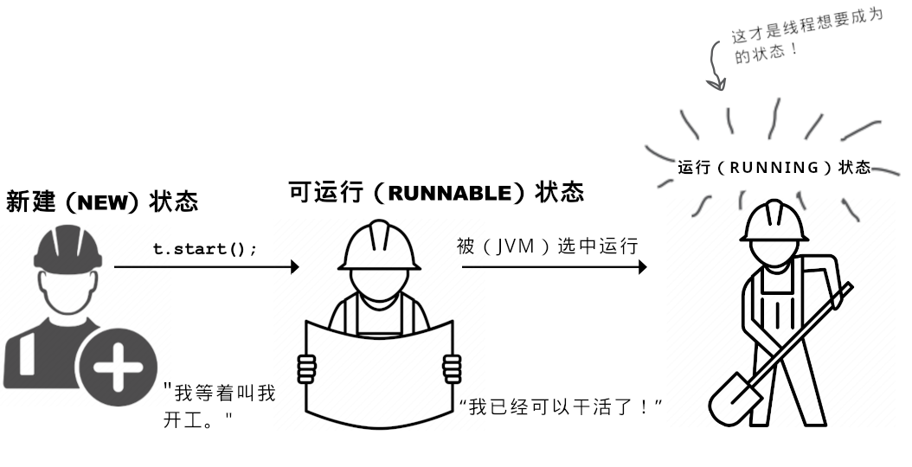
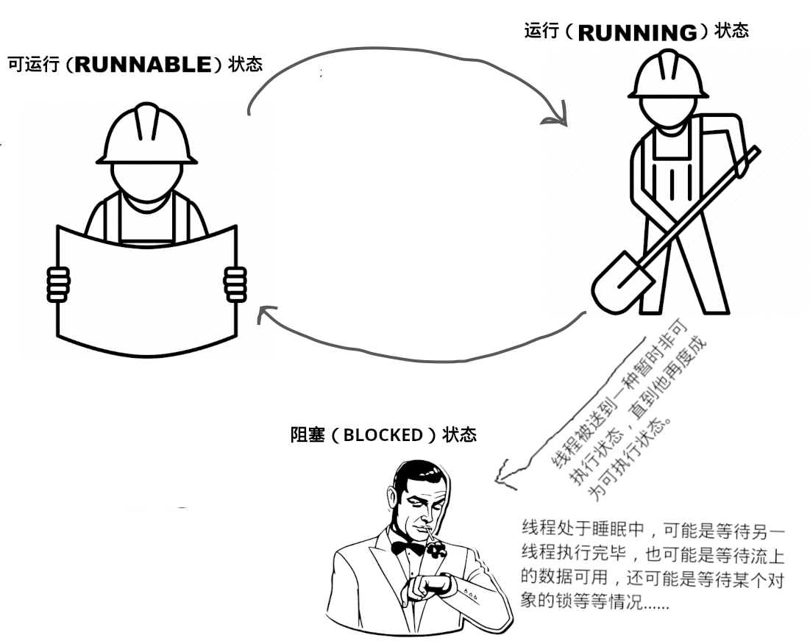
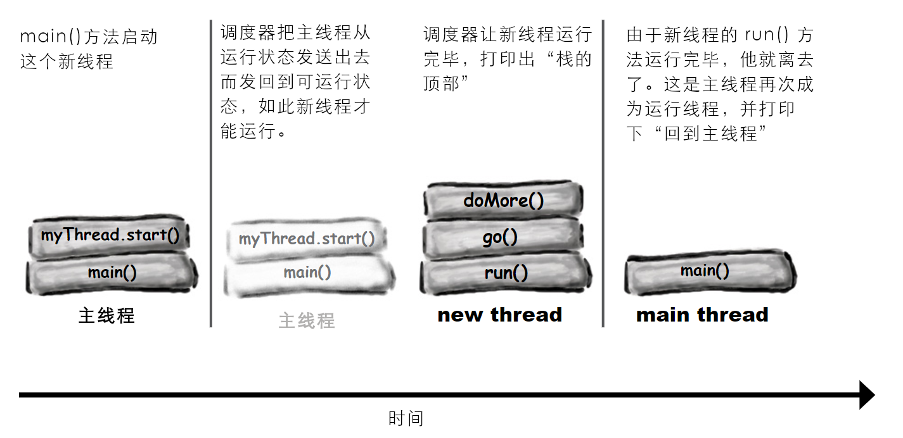
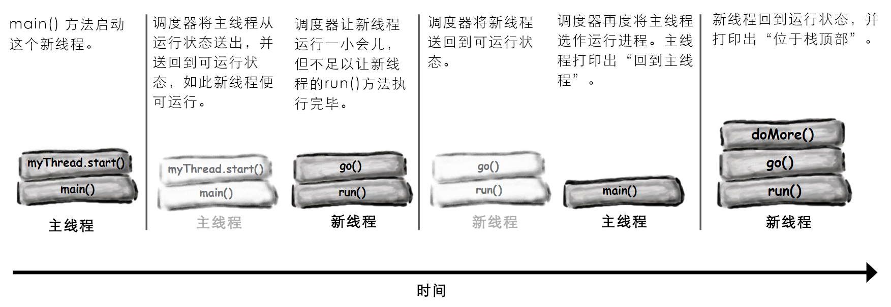
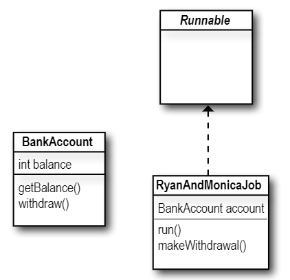

# 联网与线程：构造连接

**Networking and threads: Make a Connection**

**要与外部世界连通**。Java程序是能够触及另一台机器上程序的。而且不难触及。`java.net`库中的众多类，负责全部低级别网络通信细节。采用 Java 的众多益处之一，就是透过网络来发送和接收数据，就跟普通 `I/O` 操作一样，些许不同之处在于，位于 `I/O` 操作链末端有着不同的连接性流。在获得了一个 `BufferedReader`后，就可以 *读取* 数据了。而 `BufferedReader`是不会在乎数据是从文件还是从以太网线上来的。本章将使用套接字来连接到外界（And the `BufferedReader` couldn't care less if the data came out of a file or flew down an ethernet cable. In this chapter we'll connect to the outside world with sockets）。这里会构造 *客户端* 套接字。也会构造 *服务器* 套接字。这里会构造 *客户端* 与 *服务器*。同时还会让二者互相对话。在本章完成之前，就会有一个功能完整、多线程的聊天客户端。对了，这里提到了 *多线程*，那么就 *即将* 学到怎样在与 Bob 对话的同时，还要听 Suzy 讲话的诀窍。

## 实时 `BeatBox` 聊天室应用

**Real-time `BeatBox` Chat**


*图 1 - 具备网络通信与线程特性之后的 `BeatBox` 应用*

现在是在计算机游戏上工作了。玩家和队友一起，为游戏的各个部分制作声音素材。运用一个 *聊天室* 版的 `BeatBox` 应用，团队就可以协同工作 -- 可把一个节拍编排与一条消息一起发出，然后`BeatBox`聊天室中的所有人就会收到这条消息以及与消息一起发出的节拍编排。因此就不光要 *读取* 其他参与者的消息，还要可通过直接点击接收消息区中的某条消息，来加载并 *演奏出* 一个节拍编排。

在本章将了解到，要构造一个这样的聊天客户端需要些什么。甚至还会了解到一点有关构造聊天 *服务器* 的知识。为后面代码厨房的目的，这里将保留完整的 `BeatBox` 聊天室，不过在本章中 *将* 编写一个 `LudicrouslySimpleChatClient` 应用，以及一个用于发送和接收文本消息的非常简单的聊天服务器。


*图 2 - `SimpleChatClient` 应用*

## 聊天程序概览

**Chat Program Overview**


*图 3 - `SimpleChat`应用概览*

### 工作原理

**How it Works**:

1) **客户端连接到服务器**

**Client connects to the server**


*图 4 - `SimpleChat`应用原理（一）- 客户端连接到服务器*


2) **服务器构造一个连接，并将该客户端加入到参与者清单**

**The server makes a connection and adds the client to the list of participants**


*图 5 - `SimpleChat`应用原理（二） - 服务器构造一个连接，并将该客户端加入到参与者清单*


3) **另一客户端进行连接**

**Another client connects**


*图 6 - `SimpleChat`应用原理（三） - 另一客户端进行连接*


4) **客户端 A 发送一条消息给聊天服务**


*图 7 - `SimpleChat`应用原理（四） - 客户端 A 发送一条消息给聊天服务*

5) **服务器将该条消息，发布给所有参与者（包括原本的发送者）**


*图 8 - `SimpleChat`应用原理（五） - 该条消息被发布到全体参与者*

## 建立连接、发送数据，与数据接收

**Connecting, Sending, and Receiving**

为了让 `SimpleChat` 客户端运作，必须掌握以下三件事：

1) 如何建立客户端与服务器之间最开始的 **连接**（How to establish the initial **connection** between the client and server）；
2) 如何把消息 **发送给** 服务器（How to **send** messages *to* the server）；
3) 如何从服务器 **接收** 消息（How to **receive** messages *from* the server）。

这些事项要能运行起来，就必须要有大量底层的操作要实现（There's a lot of low-level stuff that has to happen for these things to work）。不过值得庆幸的是，Java 的网络通信包 API （`java.net`）让这一切，都变成了小菜一碟。因此相比于网络通信与 `I/O` 代码，看到的更多的是 GUI 代码。

而且这还不是全部。

`SimpleChat`客户端中潜在的另一个到目前为止尚未遇到的问题，就是在同一时间进行两件事情。连接的建立是一次性的操作（要么成功要么失败）。然而在那之后，聊天室参与者就要 *发送传出消息*，并 **同时** *接收* 来自其他参与者的 *传入消息*。嗯...这就要花点心思，不过很快就会接触到这个问题。

1) **连接（Connect）**

经由建立起一个 **套接字（Socket）** 连接，客户端连接到服务器。


*图 9 - `SimpleChat`客户端连接到服务器*

2) **发送（Send）**

客户端将消息 **发送** 给服务器。


*图 10 - `SimpleChat`客户端将消息发送给服务器*


3) **接收（Receive）**

客户端从服务器 **获取到** 消息。


*图 11 - `SimpleChat`客户端从服务器获取到消息*

## 构造网络套接字连接

**Make a network Socket connection**

要连接到另一台机器，就需要一个套接字连接。套接字（`java.net.Socket`）是一个表示两台机器之间网络连接的对象（A Socket(`java.net.Socket`) is an object that represents a network connection between two machines）。何为连接？即两台机器之间的一种 *关系（relationship）*，其中 *两个软件相互有了解（two pieces of software know about each other）*。更为重要的是，这两个软件知道怎样互相 *通信（communication）*。换句话说，他们知道如何将一系列的 *二进制位* 发送给对方。

好在这里不会关注那些底层细节，这是由于这些低级别细节，是在 “网络通信栈” 中的更底层处处理的（We don't care about the low-level details, thankfully, because they're handled at a much lower place in the 'networking stack'）。若对于“网络通信栈”一无所知，那么也无需担心他。那只是一种关于信息（一系列二进制位）从运行在某种OS上的JVM中的Java程序，到物理实体硬件（比如以太网线），到另一机器后又从物理硬件到Java程序中，所必须经历的多个层的说法。必须 *有人* 来处理这些全部繁重工作（If you don't know what the 'networking stack' is, don't worry about it. It's just a way of looking at the layers that information (bits) must travel throught to get from a Java program running in a JVM on some OS, to physical hardware(ethernet cables, for example), and back again on some other machine. *Somebody* has to take care of all the dirty details）。不过那不是咱们Java程序员要做的。处理这些底层网络通信的，正是那些特定于OS的软件，以及Java的网络通信API。真正要担心的，是那些高级别的东西 -- 构造出那个 *甚为* 高级别的对象 -- 从而就变得惊人的简单了。准备好了吗？

> 要构造一个 `Socket` 连接，就需要知道有关服务器的 **两件事**：服务器是谁，以及运行在哪个端口上。
>
> 换句话说，
>
> 即 **IP 地址和 TCP 端口编号**。


```java
// '196.164.1.103' 是服务器的 IP 地址
//
// '5000' 是 TCP 端口号
Socket chatSocket = new Socket("196.164.1.103", 5000);
```


*图 12 - Java网络通信套接字的构造原理*

**`Socket` 连接是指两台机器有着对方的信息，包括网络位置（即 IP 地址）以及 TCP 端口（A `Socket` connection means the two machines have information about each other, including network location(IP address) and TCP port）**。

**所谓 TCP 端口，无非是一个编号，一个 16 位的、区分服务器上特定程序的数字（A TCP port is just a number. A 16-bit number that identifies a specific program on the server）。**

互联网 Web（HTTP） 服务器运行在端口 `80`。那就是一项标准。在获取到一台远程登录（Telnet）服务器时，那么就是运行在端口 `23`上。至于 FTP？则为 `20`。POP3 邮件服务器？是 `110`。SMTP？为`25`。时间服务器位于 `37`。只需把端口编号当作唯一识别符就可以了。这些端口编号，表示的都是到运行在服务器上特定软件的逻辑连接（Think of port numbers as unique identifiers. They represents a logical connection to a particular piece of software running on the server）。就是这样子。对于这些端口编号，在物理机器外壳上无论如何也是找不到的。但要记住一点，服务器上有总共 `65536`个端口编号（`0 ~ 65535`）。那么显然这些端口编号不是表示物理设备上可以插入接头的地方。这些编号都只是表示某个应用的一个数字而已。

但若没有这些端口编号，那么服务器就没有办法知道客户端要连接到哪个应用了。而由于各个应用可能有着他自己独特的协议，那么可以设想一下若没有这些标识符，会有多大麻烦。比如在 Web 浏览器落在了 POP3 的邮件服务器，而不是 HTTP服务器上时，会发生什么呢？此时邮件服务器就不知道怎么去解析 HTTP 请求了！同时就算邮件服务器知道怎样区解析 HTTP请求，POP3 服务器也对如何去对HTTP请求进行服务一无所知。


*图 13 - 关于网络通信中的端口编号*

**从 `0` 到 `1023` 的 TCP 端口编号，被保留给那些知名服务。在自己的服务器程序中请勿使用他们<sup>*</sup>！**

**这里所编写的聊天室服务器使用了端口 `5000`。所选用的就是 `1024` 与 `65535` 之间的一个数字**。

> <sup>*</sup> 当然也 *可以* 使用 `0` ~ `1023` 中的某个端口编号，不过你工作地方的系统管理员可能会杀了你。

## 答疑

- **该怎么知道要与其会话的服务器程序的端口编号呢（How do you know the port number of the server program you want to talk to）**？

> 这取决于那个服务器程序是否是那些知名服务（well-known services）之一。在要连接某个知名服务，比如上面提到的那些（HTTP、SMTP、FTP等待）时，那么在互联网上就能找到他们的端口编号（Google 一下 “Well-Known TCP Port”）。或者问一下你隔壁的系统管理员同事。
>
> 但在服务器程序并非这些知名服务时，那么就需要问一下部署该项服务的那个人了。通常某人编写了一项网络服务，且他/她又希望有人来为这个网络服务编写客户端时，那么他就会把此项服务的 IP 地址、端口号以及协议公布出来。比如在给一个名为 `GO` 的游戏服务器编写客户端时，就可以访问某个 `GO` 服务器站点，从而找到有关如何为那个特定`GO`游戏服务器编写客户端的信息。


- **在单个端口上可以运行多个的程序吗？也就是说，同一台服务器上的两个应用，可以有着同样的端口号吗**？

> 不行！在尝试将某个程序绑定到一个已在使用中的端口时，就会收到一个 `BindException` 异常。而将某个程序 *绑定* 到某个端口，就意味着启动某个服务器应用，并告诉这个应用在特定端口上运行。老调重弹，在本章后面的服务器部分，会了解到更多有关此方面的内容。


*图 14 - 理解IP地址与端口号*


### 脑力锻炼

好，现在有了一个 `Socket` 连接。客户端与服务器都知道了对方的 IP 地址和 TCP 端口编号。那么现在又该怎么办呢？该怎样透过那个连接进行通讯呢？也就是说，怎样将一系列的二进制位，从一个地方移动到另一个地方呢？请设想一下有哪些类型的消息，要有这个客户端来发送与接收。


*图 15 - 思考题：聊天室客户端与服务器之间如何进行会话*


## 使用 `BufferedReader` 从套接字读取数据

**To read data from a `Socket`, use a `BufferedReader`**

要透过`Socket`连接来进行通信，就要用到流。常规的那些老式 `I/O` 流，就如同上一章中用到的那些。Java中最酷特性之一，就是大部分的 `I/O` 工作，都不会关心高级别链式流具体连接到的何种连接性流（One of the coolest features in Java is that most of your `I/O` work won't care what your high-level chain stream is actually connected to）。也就是说，可就像之前写入文件时那样使用 `BufferedReader`，不同之处在于这里所采用的连接性流，是连接到一个 *套接字（`Socket`）*，而不再是之前的 *文件（`File`）*！


*图 16 - Java网络通信中的输入与输出流，都是套接字连接*


1) **构造一个到服务器的 `Socket` 连接**

**Make a `Socket` connection to the server**

```java
// '127.0.0.1' 是 “localhost”，也就是此代码
// 运行所在的机器的 IP 地址。在单台、独立机器上对客户端
// 和服务器进行测试时，可使用这个 IP 地址。
//
// 而这个端口号，之前就讲过，5000是这里聊天服务器
// 的端口号。
Socket chatSocket = new Socket("127.0.0.1", 5000);
```

2) **构造一个链接到这个套接字底层（连接性）输入流的 `InputStreamReader`**

**Make an `InputStreamReader` chained to the `Socket`'s low-level (connection) input stream**

```java
// InputStreamReader 是底层字节流（就比如这里的从套接字获取
// 到的那个），与高级别字符流（如同后面那个作为链式流顶部的
// `BufferedReader`）之间的“桥梁”
// 
// 这里只须从该套接字请求一个输入流即可！所获取到的，就是
// 一个低级别的连接性流，不过这里只要将其链接到某个对文本
// 更加友好的东西上（All we have to do is ASK the socket for
// an input stream! It's a low-level connection stream, but we're
// just gonna chain it to something more text-friendly）。
InputStreamReader stream = new InputStreamReader(chatSocket.getInputStream());
```

3) **构造一个 `BufferedReader`然后读取就是了**！

**Make a `BufferedReader` and read**!

```java
// 把这个 BufferedReader 链接到 InputStreamReader （他又
// 是链接到那个从套接字获得的底层连接性流的）。
BufferedReader reader = new BufferedReader(stream);
String message = reader.readLine();
```


*图 17 - 从网络通信套接字读取数据的流链条*


## 使用 `PrintWriter`往套接字写数据

**To write data to a `Socket`, use a `PrintWriter`**

在最后一章用到的并不是`PrintWriter`，那里用了 `BufferedWriter`。虽然这里有选择，不过在一次写一个字符串时，`PrintWriter`就是标准选择。同时也会认识到，`PrintWriter`中的两个关键方法，`print()`与`println()`，就如同先前 `System.out`中的两个一样。

1) **构造一个到服务器的 `Socket` 连接**

**Make a `Socket` connection to the server**

```java
// 此部分与先前从套接字读取数据时一样 -- 要写到
// 服务器，仍必须连接到服务器。
Socket chatSocket = new Socket("127.0.0.1", 5000);
```


2) **构造一个链接到套接字底层（连接性）输出流的 `PrintWriter`**

**Make a `PrintWriter` chained to the `Socket`'s low-level(connection) output stream**

```java
// InputStreamReader 扮演了字符数据与从套接字低级别输出流获取到
// 的字节之间的桥梁。通过将 PrintWriter 链接到套接字的输出流，就可以
// 将字符串写到套接字连接了（PrintWriter acts as its own bridge
// between character data and the bytes it gets from the Socket's
// low-level output stream. By chaining a PrintWriter to the Socket's
// output stream, we can write Strings to the Socket connection）。
//
// 这个套接字给到一个低级别连接性流，同时这里通过将这个连接性流
// 交给 PrintWriter 的构造器，而把这个连接性流链接到
// 新构造的 PrintWriter。
PrintWriter writer = new PrintWriter(chatSocket.getOutputStream());
```


3) **写（`print`）下一些内容**

**Write(`print`) something**

```java
// println() 会在他发送的东西末尾加一个另起一行（'/n'）
writer.println("要发送的消息");
// print() 不会添加那个另起一行（'/n'）
writer.print("另一条消息");
```


*图 18 - 往套接字写入数据的流链条*


## `DailyAdviceClient` 程序

**The `DailyAdviceClient`**

在开始构建 `SimpleChat` app前，先来做一个较小的东西。`AdviceGuy`是一个提供实用、励志的一些提示的服务器程序，从而让我们度过漫长编写代码的日子。

这里要构建的是一个 `AdviceGuy`程序的客户端，他在每次连接服务器时，从服务器拉取一条消息。

你还等什么呢，若没有这个 app，没人知道你会失去些什么机会。

1） **连接**

**Connect**

客户端连接到服务器，并从他获取到一个输入流（Client connects to the server and gets an input stream from it）。


*图 19 - `AdviceGuy` app 建立连接*


2) **读取**

**Read**

客户端从服务器读取一条消息（Client reads a message from the server）。


*图 20 - `AdviceGuy` app 读取消息*


### `DailyAdviceClient` 的代码

**`DailyAdviceClient` code**

这个程序构造一个 `Socket`，并构造一个 `BufferedReader`（有着其他流的辅助），进而从服务器应用（即运行在端口`4242`的那个）读取单行文本。

```java
package com.xfoss.AdviceGuy;

import java.io.*;
// 类 Socket 是在 java.net 包中
import java.net.*;

public class DailyAdviceClient {
    public DailyAdviceClient () {
        // 这里有很多会出错的代码
        try {
            // 构造一个到位于此代码运行所在的同一主机
            // （即 'localhost'）、端口 4242 上程序的套接字连接
            Socket s = new Socket("127.0.0.1", 4242);

            // 这里 InputStreamReader 构造函数的第二个参数，指定了字符串
            // 编码，表示 InputStreamReader 的构造函数是过载的。
            // 若不加入这个参数，当服务器和客户端运行在不同平台时
            // 会出现乱码。
            InputStreamReader streamReader = new InputStreamReader(s.getInputStream(), "UTF-8");
            // 把一个 BufferedReader 链接到一个 InputStreamReader
            // 这个 InputStreamReader 又是链接到来自套接字的输入流
            BufferedReader reader = new BufferedReader(streamReader);

            // 这个 readLine() 与之前用到的、链接到文件的
            // BufferedReader 时的那个一模一样。也就是说在
            // 调用 BufferedReader 的某个方法时，读取器（the reader）
            // 是不知道或不关心字符是从何处而来的。
            String advice = reader.readLine();
            System.out.format("今日宜：%s\n", advice);

            reader.close();
        } catch (IOException ex) {
            ex.printStackTrace();
        }
    }

    public static void main(String[] args) {
        new DailyAdviceClient();
    }
}
```


### 编写一个简单的服务器

**Writing a simple server**

那么编写一个服务器应用需要用到哪些东西呢？只需要一对套接字就行。是的，一对就是 *两个*。一个 `ServerSocket`，等待客户端的那些请求（在客户端构造新的 `Socket()` 时），还要一个普通的老式 `Socket` 套接字，用于与客户端进行通信。

**服务器工作原理（How it works）**:

1) 服务器应用在某个特定端口上，构造一个 `ServerSocket`

```java
ServerSocket serverSock = new ServerSocket(4242);
```

这行语句就启动了服务器应用收听那些目的为端口`4242`、进入的客户端请求（This starts the server application listening for client requests coming in for port `4242`）。


*图 21 - 服务器应用构造一个 `ServerSocket`*


2) 客户端构造一个到服务器应用的 `Socket` 连接

**Client makes a `Socket` connection to the server application**

```java
Socket sock = new Socket("190.165.1.103", 4242);
```

客户端了解 IP 地址以及端口号（是由将改服务器app配置在那个端口上的人公布或给到编写客户端的人）


*图 22 - 客户端构造一个连接到服务器应用的 `Socket`*


3) 服务器构造一个新的、与此客户端通信的 `Socket`

**Server makes a new `Socket` to communicate with this client**

```java
Socket sock = serverSock.accept();
```

在等待某个客户端 `Socket` 连接期间，这个`accept()`方法会阻塞（即闲在那里）。在有客户端最终尝试进行连接时，该方法就会返回一个知道怎样与客户端进行通信（即知道 *客户端* 的 IP地址和端口号），的普通老式套接字（在某个 *不同* 的端口上）。这个 `Socket`是在不同于 `ServerSocket` 的端口上的，因此 `ServerSocket` 才可以回去继续等待其他客户端的连接（The `accept()` method blocks(just sits there) while it's waiting for a client `Socket` connection. When a client finally tries to connect, the method returns a plain old `Socket` (on a *different* port) that knows how to communicate with the client(i.e., knows the *client*'s IP address and port number). The `Socket` is on a different port than the `ServerSocket`, so that the `ServerSocket` can go back to waiting for other clients）。


*图 23 - 服务器程序构造一个新的、与客户端通信的 `Socket`*


### `DailyAdviceServer` 程序代码

**`DailyAdviceServer` code**

```java
package com.xfoss.AdviceGuy;

// 要记得这些导入
import java.io.*;
import java.net.*;

public class DailyAdviceServer {
    // 日常劝解来自这个数组
    // （请记住，这些字符串是由编码编辑器包装起来的单词。绝不要在字符串
    // 中间敲入回车（remember, these Strings were word-wrapped by 
    // the code editor. Never hit return in the middle of a String）！）
    String[] adviceList = {
        "少食多餐", 
        "买些紧身牛仔裤。他们不会让你看起来显胖。", 
        "一个字：不合适",
        "就今天而言，要诚实，告诉你的老板你的真实想法。",
        "对于这个发型，你应该三思而后行"
        };

    public DailyAdviceServer () {
        try {
            // 这里的 ServerSocket 对象，令到此服务器应用在该
            // 代码运行所在机器的端口 4242 上，“收听” 那些
            // 客户端请求。
            ServerSocket serverSock = new ServerSocket(4242);

            // 服务器进入到一个永久循环，等待（并服务）那些
            // 客户端请求。
            while (true) {
                // 这个 accept() 方法将会阻塞（即处于空闲状态），直到
                // 有请求进来，并在有请求进来时返回一个用于与
                // 客户端通信的 `Socket`（在某个匿名端口）
                //
                // the accept method blocks (just sits there) until
                // a request comes in, and then the method returns 
                // a Socket(on some anonymous port) for communicating
                // with the client
                Socket sock = serverSock.accept();

                // 此时就要是由这个到客户端的套接字连接，来构造一个
                // PrintWriter，并把一个字符串的劝解消息，发送给他（println()）
                // 而由于完成了这个客户端的请求，所以随后就要关闭这个套接字。
                //
                // now we use the Socket connection to the client to make a 
                // PrintWriter and send it (println()) a String advice message
                // Then we close the Socket because we're done with this client.
                //
                // PrintWriter writer = new PrintWriter(sock.getOutputStream());
                // 这里进行了修改，加入了字符串编码，解决服务器与客户端运行于
                // 不同 OS 下时乱码问题。
                PrintWriter writer = new PrintWriter(new OutputStreamWriter(sock.getOutputStream(), "UTF-8"));
                String advice = getAdvice();
                writer.println(advice);
                writer.close();
                System.out.println(advice);
            }
        } catch (IOException ex) {
            ex.printStackTrace();
        }
    }

    private String getAdvice() {
        int random = (int) (Math.random() * adviceList.length);
        return adviceList[random];
    }

    public static void main (String[] args) {new DailyAdviceServer();}
}
```

### 脑力锻炼

**服务器怎样知道他与客户端如何通信**？

客户端知悉服务器的 IP 地址与端口编号，然而服务器又是怎样能构造一个跟客户端的套接字连接（进而构造输入和输出流）呢？

请思考一下服务器怎样/于何时/何处获悉到客户端的知识的（Think about how/when/where the server gets knowledge about the client）。


## 答疑

- **上面的算命服务器代码，有个非常严重的问题 -- 看起来他只能一次处理一个客户端**！

> 是的，说的没错。在没有完成当前客户端请求，进而开始那个无限循环（正是在这个无限循环里，服务器的 `accept()` 调用会处于空闲，等待客户端请求进入，在请求进入时，服务器构造一个跟新客户端的套接字，完成请求处理后就又开始另一个迭代和等待）的下一次迭代之前，这个服务器是无法接受另一客户端请求的（Yes, that's right. It can't accept a request from a client until it has finished with the current client and started the next iteration of the infinite loop(where it sits at the `accept()` call until a request comes in, at which time it makes a Socket with the new client and starts the process over again)）。


- **我还是换个说法吧：怎样才能构造一个可以同时并发地处理多个客户端的服务器？？？好比说现在这个服务器，*绝对不能* 当作一个聊天服务器**。

> 呃，那并不难，真的。使用一些单独线程，然后把各个新客户端套接字交给这些线程即可。这里正要掌握怎么实现线程和并发特性呢（Ah, that's simple, really. Use separate threads, and give each new client `Socket` to a new thread. We're just about to learn how to do that）！

## 重点

- 客户端和服务器应用透过套接字连接进行通信（Client and server applications communicate over a `Socket` connection）；
- 套接字表示两个应用之间的连接，两个应用可运行在同一台机器，亦可运行在不同机器上；
- 客户端必须知道服务器应用的IP地址（或域名）与TCP端口好；
- TCP端口是个指派给特定服务器应用的16位无符号数。TCP端口号实现不同客户端连接到同一台机器，而与运行在那台机器上的不同应用进行通信；
- 从 `0` 到 `1023` 的端口号，保留用于那些 “知名服务（well-known services）”，包括 HTTP、FTP、SMTP等待；
- 客户端通过构造服务器套接字，连接到服务器；

```java
Socket s = new Socket("127.0.0.1", 4200);
```

- 一旦连接成功，客户端就可以从那个套接字获取到输入与输出流。从套接字获取到的输入输出流，都是底层的 “连接性” 流；

```java
sock.getInputStream();
sock.getOutputStream();
```

- 要从服务器读取文本数据，就要创建 `BufferedReader`，将其链接到一个 `InputStreamReader`，而 `InputStreamReader`又链接到来自套接字的输入流；
- `InputStreamReader`是一个取得字节序列，然后转换为文本（字符）数据的 “桥接性” 流。主要用作高级别 `BufferedReader` 与底层套接字的输入流的中间链（`InputStreamReader` is a 'bridge' stream that takes in bytes and converts them to text(character) data. It's used primarily to act as the middle chain between the high-level `BufferedReader` and the low-level `Socket` input stream）；
- 要向服务器写数据，就要创建直接链接到套接字输出流的 `PrintWriter`对象。调用其 `print()` 或 `println()` 方法，来将字符串发送给服务器；
- 服务器会用到在特定端口号上等待客户端请求的 `ServerSocket`；
- 在 `ServerSocket` 收到请求时，`ServerSocket`就会通过构造跟客户端的套接字连接，而 “受理” 这个请求。

## 编写 `ChatClient`

**Writing a `ChatClient`**

这里将通过两阶段，来编写 `ChatClient`。首先要构造一个把消息发送给服务器，但尚不会读取其他聊天室参与者发出消息的仅发送版本（一个对完整聊天室概念的激动人心又神秘的曲解，First we'll make a send-only version that sends messages to the server but doesn't get to read any of the messages from other paritcipants(an exciting and mysterious twist to the whole chat room concept)）。

随后就会实现完善的聊天方式，而构造一个兼具聊条消息发送 *与* 接收的 `ChatClient`。

### 第一版：仅发送

**Version One: send-only**


*图 24 - `LudicrouslySimpleChatClient`聊天室客户端第一版*

**代码大纲**

```java
public class SimpleChatClientA extends JFrame {
    JTextField outgoing;
    PrintWriter writer;
    Socket sock;

    public SimleChatClientA () {
        // SimpleChatClientA 类构造函数
        // 构造 GUI 及在发送按钮上注册事件收听者
        // 调用下面的 setUpNetworking() 方法
    }

    private void setUpNetworking () {
        // 构造一个 Socket 对象，随后构造一个 PrintWriter 对象
        // 将 PrintWriter 指派给实例变量 writer
    }

    public class SendButtonListener implements ActionListener {
        public void actionPerformed (ActionEvent ev) {
            // 从文本字段获取文本，并
            // 使用 writer 实例变量（即一个 PrintWriter 对象），把
            // 获取到的文本发送给服务器
        }
    }
}
```

```java
package com.xfoss.SimpleChat;

// 各种流（java.io）、套接字（java.net）及GUI等得各种导入
import java.io.*;
import java.net.*;
import javax.swing.*;
import java.awt.*;
import java.awt.event.*;

public class SimpleChatClientA extends JFrame {

    JTextField outgoing;
    PrintWriter writer;
    Socket sock;

    public SimpleChatClientA () {
        // 这里只是构建 GUI，没有什么新东西，且不涉及到网络通信
        // 或 I/O 操作
        super("搞笑的简单聊天客户端");
        setDefaultCloseOperation(JFrame.EXIT_ON_CLOSE);

        JPanel mainPanel = new JPanel();

        outgoing = new JTextField(20);

        JButton sendButton = new JButton("发送");
        sendButton.addActionListener(new SendButtonListener());

        mainPanel.add(outgoing);
        mainPanel.add(sendButton);

        getContentPane().add(BorderLayout.CENTER, mainPanel);

        setUpNetworking();

        setSize(640, 480);
        setVisible(true);

        addWindowListener(new WindowAdapter(){
            public void windowClosing(WindowEvent winEvt) {
                if(writer != null) writer.close();
                System.exit(0);
            }
        });
    }

    // 此时完成具体写入。请记住，这里的 writer 对象，链接的是来自
    // Socket 对象的输出流，因此不能何时执行 println() 方法，都会
    // 透过网络抵达服务器！
    //
    // Now we actually do the writing. Remember, the writer is chained
    // to the output stream from the Socket, so whenever we do a println()
    // it goes over the network to the server!
    public class SendButtonListener implements ActionListener {
        public void actionPerformed (ActionEvent ev) {
            try {
                writer.println(outgoing.getText());
                writer.flush();
            } catch (Exception ex) {ex.printStackTrace();}

            outgoing.setText("");
            outgoing.requestFocus();
        }
    }

    private void setUpNetworking () {
        try {
            // 由于用的是 localhost ，因此可以在一台机器上测试客户端
            // 和服务器。
            // 
            // 这里就是构造 Socket 与 PrintWriter （这个 setUpNetworking() 
            // 方法，是在刚刚显示出该 app 的 GUI 界面后，从类 SimpleChatClientA 
            // 构造器调用）。
            sock = new Socket("127.0.0.1", 5000);
            writer = new PrintWriter(new OutputStreamWriter(sock.getOutputStream(), "UTF-8"));
            System.out.println("网络通信已建立");
        } catch (IOException ex) {ex.printStackTrace();}
    }
}
```

> **若现在就想尝试运行，那么就要输入本章末尾处的已编写好的服务器代码。现在一个终端启动服务器，接着用另一个终端启动这个客户端即可**。


### 版本二：发送与接收

**Version Two: send and receive**


*图 25 - 具备发送和接收功能的 `SimpleChatClient` app*

**大问题：怎样从服务器获取消息**？

应该不难；建立起网络通讯时，就要同时构造一个输入流（应该是个`BufferedReader`）。随后使用 `readLine()`读取消息。


**更大的问题：何时从服务器获取消息**？

**Bigger Question: WHEN do you get messages from the server**?

请思考一下这个问题。有哪些选项？

1) **选项一：每隔20秒轮询一次服务器（Option One: Poll the server every 20 seconds）**

**优点（Pros）**: 是的，这是可行的。

**弊端（Cons）**：服务器怎么知道客户端已经收到的消息与尚未收到的消息？服务器就不得不把消息存储起来，而不是在每次收到消息后只要分发并忘却。并且为什么间隔是20秒？这样的延迟对可用性有影响，而如果降低这个延迟值，又会带来对服务器不必要冲击。这个选项效率底下（The server would have to store the messages, rather than just doing a distribute-and-forget each time it gets one. And why 20 seconds? A delay like this affects usability, but as you reduce the delay, you risk hitting your server needlessly. Inefficient）。

2) **选项二：在用户每次发送消息时从服务器读入一些东西（Option Two: Read something in from the server each time the user sends a message）**。

**优点（Pros）**: 可行，很容易。

**弊端（Cons）**：笨办法。为什么要选择这样的任意时间去查收那些消息？如果用户一直潜水不发送任何消息会怎样呢？


3) **选项三：在服务器发出消息后立即读取消息（Option Three: Read messages as soon as they're sent from the server）**。

**优点（Pros）**: 最为高效，最佳可用性。

**弊端（Cons）**: 怎样在同一时间完成两件事情？应该把代码放在何处？这就会涉及到某处的一个一直等待着从服务器读取的循环。然而这个循环应该放在哪里呢？在启动了 GUI后，就只有在GUI部件发出事件后，程序才有动作了，其他情况下程序是不会有任何动作的（How do you do two things at the same time? Where would you put this code? You'd need a loop somewhere that was always waiting to read from the server. But where would that go? Once you launch the GUI, nothing happens until an event is fired by a GUI component）。

> **在 Java 中，真的可以一边走路一边嚼口香糖**。


**你肯定明白从现在开始就要采行选项三了吧**。

这里要的是持续运行对来自服务消息进行检查，而又 *不会对用户与 GUI 交互能力造成干扰* 的东西（We want something to run continuously, checking for messages from the server, but *without interrupting the user's ability to interact with the GUI*）！那么在用户开心地输入消息，或者在众多传入消息中愉悦地滚动翻阅的同时，所需要的就是 *这美好场景背后*，有代码去持续读取来自服务器的新输入。

这就意味着这里最终需要一个新线程。一个新的、独立的栈（That means we finally need a new thread. A new, separate stack）。

这里要让在前面那个仅发送版（版本一）中完成的所有工作，还以同样方式运作，与此同时伴随一个新的 **进程（process）** 来读取来自服务器的信息，并将读取到的信息显示在传入文本区。

好吧，也不尽然是这样子的。除非计算机上有多个处理器，否则各个新 Java 线程也并非真正是运行在操作系统上的单独进程。不过这些新 Java 线程 *给人的感觉*，就跟独立进程一样（Well, not quite. Unless you have multiple processors on your computer, each new Java thread is not actually a separate process running on the OS. But it almost *feels* as though it is）。

## Java中的多线程技术

**Multithreading in Java**

Java在其语言结构中，就内置了多线程技术。同时构造一个新执行线程十分简单（Java has multiple threading built right into the fabric of the language. And it's a snap to make a new thread of execution）：

```java
Thread t = new Thread();
t.start();
```

这就完了。通过创建新的 `Thread` *对象*，就启动了一个单独的、有着自己独有调用栈的 *执行线程*（That's it. By creating a new `Thread` *object*, you've launched a separate *thread of execution*, with its very own call stack）。

**然而这里有个问题（Except for one problem）**。

上面的线程实际上什么也不会 *做*，因此可以说这个线程一出生就几乎“死了”。在线程死去时，他的新栈也会消失。故事结束（That thread doesn't actually *do* anything, so the thread "dies" virtually the instant it's born. When a thread dies, its new stack disappears again. End of story）。

因此这里缺失了一项关键组件 -- 线程的 *作业*。也就是说，这里需要打算让独立线程去运行的那些代码（So we're missing one key component -- the thread's *job*. In other words, we need the code that you want to have run by separate thread）。

Java 中的多线程技术，意味着这里必须同时要了解 *线程* 及由该线程所 *运行* 的 *作业*（Multiple threading in Java means we have to look at both the *thread* and the *job* that's *run* by the thread）。与此同时这里还会了解 `java.lang` 包中的 `Thread` 类。（请记住，`java.lang`无需手动导入、已被隐式导入，同时这个包中有着Java这门语言的一些最有基础的类，包括`String`及`System`等。）

### Java有着多线程特性，却只有一个`Thread`类

**Java has multiple threads but only on `Thread` class**

对于 *线程（thread）*，既可以讲作带小写字母 ‘t’ 的 `thread`，同时也可讲作带大写字母 ‘T’ 的 `Thread`。在讲到 `thread`，时，讲的是一条独立的执行线。也就是一个单独调用栈。而在讲到 `Thread`时，请想想 Java 的命名约定。Java 里以大写字母开头的都是些什么？都是些类和接口。那么在此情形下，`Thread`就是 `java.lang` 包中的一个类。而`Thread`对象表示的，就是一条 *执行线*；在每次想要启动一条新的执行线时，都会创建一个 `Thread` 类的实例。

> **一个线程就是一条单独 “执行线”**。也即是一个单独的调用栈。
>
> **而`Thread` 则是表示某个线程的 Java 类**。
>
> **要构造一个线程，就要构造一个 `Thread` 对象**。


*图 26 - 关于线程*

线程是一条独立的执行线（A thread(lower-case 't') is a separate thread of execution）。意思是一个单独调用栈。每个Java应用都会启动一个主线程 -- 那个把 `main()` 方法放在栈底部的线程。JVM负责主线程的启动（以及一些JVM选定的其他线程，包括垃圾回收线程等）。作为Java程序员，可编写代码来启动自己的其他线程。


*图 27 - 类`Thread`*

`Thread` （带大写字母 `T`）是表示执行线程的一个类。有着用于启动线程、将一个线程与另一线程结合以及将线程置于睡眠状态等方法。（类`Thread`有着其他一些方法；这三个不过是这里需要用到关键方法）。

### 具有多个调用栈指的是什么？

**What does it mean to have more than one call stack**?

有了多个调用栈，就能得到同时发生多个事情的 *样子*。实际只有真正多处理器系统，才能真正地一次完成多个事情，而在Java多线程特性下，就可以 *出现* 同时完成多个事情。也就是说，代码执行可极为迅速地在多个调用栈之间前后移动，以至于这所有栈是在同时执行。请记住，Java只是运行在所在操作系统上的一个进程。因此首先，Java *本身* 就必须是操作系统上的 “当前正在执行的进程”。然而一旦Java得到他的执行轮次，JVM会利用这个执行轮次来 *运行什么* 呢？哪些字节码会执行呢？当然是位于当前正在执行栈顶部的那些！而就在 100 毫秒期间，当前执行代码就可能切换到一个 *不同* 栈的 *不同* 方法（With more than one call stack, you get the *appearance* of having multiple things happen at the same time. In reality, only a true multiprocessor system can actually do more than one thing at a time, but with Java threads, it can *appear* that you're doing several things simultaneously. In other words, execution can move back and forth between stacks so rapidly that you feel as though all stacks are executing at the same time. Remember, Java is just a process running os your underlying OS. So first, Java *itself* has to be 'the currently executing process' on the OS. But once Java gets its turn to execute, exactly *what* does the JVM *run*? Which bytecodes execute? Whatever is on the top of the currently-running stack! And in `100` milliseconds, the currently executing code might switch to a *different* method on a *different* stack）。

线程必须完成的事情中有一项，就是保持对线程栈上当前正在执行语句（所在方法）的跟踪（One of the things a thread must do is keep track of which statement(of which method) is currently executing on the thread's stack）。

线程工作原理看起来差不多是这样的：

1) **JVM 调用 `main()` 方法**

```java
public static void main(String[] args) {
    ...
}
```


*图 28 - 主进程*

2) `main()` 启动一个新线程。在新线程开始运行的同时，主线程被临时冻结（`main()` starts a new thread. The main thread is temporarily frozen while the new thread starts running）。

```java
// 很快就会学到这里的 Runnable 对象 r 是什么意思。
Runnable r = new MyThreadJob();
Thread t = new Thread(t);
t.start();
Dog d = new Dog();
```


*图 29 - 主线程启动一个新的线程*


3) JVM 在新线程（用户线程A）与原本的主线程直接不断切换，直到两个线程执行完毕。


*图 30 - 进入多线程执行阶段，在全部线程栈运行完毕之前，JVM于这些栈之间不断切换*


### 怎样启动一个新线程

**How to launch a new thread**

1) **构造一个 `Runnable` 对象（即该新线程的作业）**

```java
Runnable treadJob = new MyRunnable();
```


*图 31 - 构造一个`Runnable` 对象*

`Runnable` 是一个接口，后面马上就会学到。将会编写一个对 `Runnable` 接口进行实现的类，而正是在这个类中，去定义某个线程要执行的任务工作。也就是那些要在线程的新调用栈上运行的那个方法（`Runnable` is an interface you'll learn about on the next page. You'll write a class that implements the `Runnable` interface, and that class is where you'll define the work that a thread will perform. In other words, the method that will be run from the thread's new call stack）。


2) **构造一个`Thread` 对象（即工具人线程）并把一个`Runnable`对象（即作业）交给他（Make a `Thread` object(the worker) and give tit a `Runnable`(the job)）**

```java
Thread myThread = new Thread(threadJob);
```


*图 32 - 以这个`Runnable`对象做参数，构造一个`Thread`对象*

将上面构造的新`Runnable`对象传递给 `Thread` 类构造器。这就告诉了新的`Thread`对象，要将哪个方法放在新执行栈 的底部 -- 当然是那个 `Runnable` 对象的 `run()` 方法。


3) **启动该线程（Start the `Thread`）**

```java
myThread.start();
```

在调用该`Thread`对象的`start()`方法前，什么也不会发生。对此方法的调用，正是由一个`Thread`实例，向一条新执行线程转变的时间点。在新线程启动起来时，新线程就取得那个`Runnable`对象的`run()`方法，并将其放在新线程栈的底部（Nothing happens until you call the `Thread`'s `start()` method. That's when you go from having just a `Thread` instance to having a new thread of execution. When the new thread starts up, it takes the `Runnable` object's `run()` method and puts it on the bottom of the new thread's stack）。


*图 33 - 启动线程*


### 每个`Thread`对象都需要一项要执行的作业。即一个要放到新线程栈上的方法。

**Every `Thread` needs a job t do. A method to puton the new thread stack**.

> **`Runnable`对象之于`Thread`对象，就好比某项作业任务之于一名工人。`Runnable`对象就是线程要运行的作业（`Runnable` is to a `Thread` what a job is to a worker. A `Runnable` is the job a thread is supposed to run）。**
>
> **`Runnable`对象保存着那个将要放到新线程执行栈底部的方法：`run()`（A `Runnable` holds the method that goes on the bottom of the new thread's stack: `run()`）**。

`Thread`对象需要作业。在现场启动起来时，线程就会运行一项作业。而那项作业，实际上就是去到新线程执行栈上的第一个方法，且作业务必总是一个看起来像这样的方法：

```java
// 接口 Runnable 只定义了一个方法，那就是 public void run()
// （请记住，由于他是个接口，因此这个方法是 public 的，与
// 这里的是否像这样输入代码无关。）
//
// The Runnable interface defines only one method,
// public void run(). (Remember, it's an interface so the 
// method is public regardless of whether you type it in that
// way.)
public void run () {
    // 将被新线程运行的代码
}
```

线程怎样知道该放那个方法在执行栈的底部呢？因为`Runnable`接口定义了合约。因为`Runnable`是个接口。线程作业可被定义在任何的实现了`Runnable`接口的类里头。线程仅关心传递给`Threa`类构造器的，十一个实现了`Runnable`接口的类的对象（How does the thread know which method to put at the bottom of the stack? Because `Runnable` defines a contract. Because `Runnable` is an interface. A thread's job can be defined in any class that implements the `Runnable` interface. The thread cares only that you pass the `Thread` cnstructor an object of a class that implements `Runnable`）。

在将`Runnable`类型对象传递给`Thread`构造器时，真的就只是给予了那个`Thread`对象，一种抵达`run()`方法的方式。实在给予那个`Thread`对象其要执行的作业（When you pass a `Runnable` to a `Thread` constructor, you're really just giving the `Thread` a way to get to a `run()` method. You're giving the `Thread` its job to do）。

### 要构造线程的作业，就要实现`Runnable`接口

**To mke a job for your thread, implement the `Runnable` interface**

```java
// Runnable 是在 java.lang 包中，因此无需导入。
public class MyRunnable implements Runnable {
    private String incomingMessage;

    public MyRunnable (String message) {
        incomingMessage = message;
    }

    // Runnable只有一个要实现的方法：
    // public void run() （不带参数）
    // 这就是放置线程将要运行作业方法的地方。这也是那个
    // 位于新执行栈底部的方法。
    public void run () {
        go();
    }

    public void go () {
        doMore ();
    }

    public void doMore () {
        System.out.format("这是执行栈的顶部, 收到主线程传入的消息：%s\n", incomingMessage);
    }
}

class ThreadTester {
    public static void main (String[] args) {
        Runnable threadJob = new MyRunnable("你好，用户线程！");
        // 将新构造的Runnable实例，传入到这个
        // 新 Thread 构造器。这就告诉线程，把什么样的
        // 方法放在新执行栈的底部。也就是新执行栈将运行的
        // 第一个方法。
        Thread myThread = new Thread(threadJob);

        // 在没有调用这个 Thread 实例上的 start() 方法前，不会
        // 得到新的执行线程。在启动线程前，线程还不成其为线程。
        // 在启动 Thread 实例之前，他就跟其他的对象一样，
        // 只是个 Tread 的实例，而不会有任何真实的 “线程特征”（
        // Before that, it's just a Thread instance, like any 
        // other object, but it won't have any real 'threadness'）。
        myThread.start();

        System.out.println("回到主线程");
    }
}
```

> **注**: 这段代码演示了：1、构造新线程；2、在构造新线程时，主线程往用户线程传递数据；3、Java 中主类可以不是显式 `public` 的类，或者说一个 `.java`文件中只能有一个`public`类的情况下，其他非显式`public`的类，也可作为Java的主类，作为`jar`包的执行进入点。


*图 34 - 示例代码的执行栈图解*

上面代码的输出，如下所示：

```console
$java -jar learningJava/build/libs/com.xfoss.learningJava-0.0.1.jar
回到主线程
线程栈的顶部，收到主线程的消息：你好，用户线程！
```

### 脑力锻炼

在运行 `ThreadTester` 类时，为什么会有上面这样的输出？

### 新线程的三种状态

**The three state of a new thread**

```java
Threed t = new Thread(r);
```



*图 35 - 线程的三种状态*

**新构建（NEW）状态**

```java
Thread t = new Thread(r);
```

线程已被创建但未被启动。也就是说，已经有了一个`Thread`对象，但还没有 *执行线*（A `Thread` instance has been created but not started. In other words, there is a `Thread` *object*, but no *thread of execution*）。


**可运行（RUNNABLE）状态**

```java
t.start();
```

在启动这个线程时，他便进入到可运行状态。这意味着该线程准备好了运行，只是在等待着他被选作执行的时机。这个时候，就有了此线程的调用栈了（When you start the thread, it moves into the runnable state. This means the thread is ready to run and just waiting for its Big Change to be selected for execution. At this point, there is a new call stack for this thread）。


**运行（RUNNING）状态**

这是所有线程渴望的状态！成为被选中的那个线程。那个当前运行线程。而只有JVM的线程调度器，才能做出决定。有时可人为对该决定 *施加影响*，但无法强制某个线程从可运行状态转换成运行状态。在运行状态，线程（且 **只有** 这个线程）有着活动的调用栈，同时该调用栈顶部的那个方法在执行（This is the state all thread lust after! To be The Chosen One. The Currently Running Thread. Only the JVM thread scheduler can make that decision. You can sometimes *influence* that decision, but you cannot force a thread to move from runnable to running. In the running state, a thread (and ONLY this thread) has an active call stack, and the method on the top of the stack is executing）。

**然而关于线程状态，还有更多的东西。一旦线程成为可运行状态，他就可以在可运行状态（runnable）、运行状态（running），以及一些其他状态：*临时非可运行状态（temporarily not runnable）*（也叫做“阻塞状态（blocked）”） 之间交互变化**。


### 典型的可运行/运行状态循环

**Typical runnable/running loop**

典型情况下，JVM线程调度器选出某个线程来运行，并在随后将其踢回，而让另一线程有时机运行，如此线程是在可运行状态与运行状态直接来回切换的（Typically, a thread moves back and forth between runnable and running, as the JVM thread scheduler selects a thread to run and then kicks it bak out so another thread gets a chance）。


*图 36 - 典型状况下线程从可运行状态与运行状态之间变换*


### 线程可被置为暂时非可运行状态

**A thread can be made temporarily not-runnable**



*图 37 - 线程的阻塞状态*

因为各种不同原因，线程调度器可将运行状态线程，移入到阻塞状态。比如线程可能正在执行从套接字输入流读取数据的代码，但套接字输入流上现在并没有要读取的数据。那么调度器就会将该线程从运行状态移除，知道要读取的数据可用为止。或者线程正在执行的代码，告诉线程要将他自己置入睡眠状态（`sleep()`）。抑或可能由于在尝试调用某个对象上的方法，而那个对象却被“锁了起来”，因此该线程就处于等待状态。在这种情况下，直到所调用对象的锁，被持有这个锁的线程释放之前，等待中的线程，是无法继续执行的（The thread schedular can move a running thread into a blocked state, for a variety of reasons. For example, the thread might be executing code to read from a `Socket` input stream, but there isn't any data to read. The schedular will move the thread out of the running state until something becomes available. Or the executing code might have told the thread to put itself to sleep(`sleep()`). Or the thread might be waiting because it tried to call a method on an object, and that object was 'locked'. In that case, the thread can't continue until the object's lock is freed by the thread that has it）。

所有上述的情形（以及其他情形），都会导致线程成为临时非可运行状态（All of those conditions(and more) cause a thread to become temporarily not-runnable）。


## 进程调度器

**The Thread Schedular**

线程调度器就谁将从可运行状态迁往运行状态，与何时（及在何种条件下）某个线程离开运行状态等事情，做出一切决定。调度器决定谁会运行，与运行多长时间，以及在调度器决定把某些线程从当前运行状态踢出去时，这些线程前往何处（The thread schedular makes all the decisions about who moves from runnable to running, and about when(and under what circumstances) a thread leaves the running state. The schedular decides who runs, and for how long, and where the threads go when the scheduler decides to kick them out of the currently-running state）。

编程者无法对调度器施加控制。调度器上并无调用方法的API。最重要的时，并无调度的任何保证！（虽然有那么几个 *近乎* 保证的东西，但就算这些也是毫无头绪的。）（You can't control the scheduler. There is no API for calling methods on the scheduler. Most importantly, there are no guarantees about scheduling! (There are a few *almost*-guarantees, but even those are a little fuzzy.)）

在处理线程调度器时，底线就是：***不用把程序的正确运行，建立在调度器以某种特定方式运作的基础上***！对于不同JVM，此调度器的实现是各异的，即使在同一台机器上运行同样的程序，都能给出不同的运行结果。新手Java程序员最糟糕的问题，就是在单台机器上测试他们的多线程程序，并错误地假定线程调度器会一致以那种方式运作，而不考虑程序会在何处运行（The bottom line is this: ***do not base your program's correctness on the scheduler working in a particular way***! The scheduler implementations are different for different JVM's, and even running the same program on the same machine can give you different results. One of the worst mistakes new Java programmers make is to test their multi-threaded program on a single machine, and assume the thread scheduler will always work that way, regardless of where the program runs）。

而这到底对“一次编写各处运行”意味着什么呢？这意味着要编写独立于平台Java代码，那么所编写的多线程程序，就必须在不管线程调度器 *怎样* 行事，都要能工作。那就是说不能对，比如，调度器确保所有线程都能在运行状态上得到良好的、绝对公平的执行机会，有所依赖。尽管如今几乎不会有这样的情况发生：程序运行在一个有着这样说的调度器JVM上，“好的，五号线程，现在你可以执行了，在我仍管事的时候，你可以一直执行，直到你的 `run()` 方法执行完毕而结束为止”（So what does this mean for write-one-run-anywhere? It means that to write platform-independent Java code, your multi-threaded program must work no matter *how* the thread scheduler behaves. That means that you can't be dependent on, for example, the scheduler making sure all the threads take nice, perfectly fair and equal turns at the running state. Although highly unlikely today, your program might end up running on a JVM with a scheduler that says: "Ok thread five, you're up, and as far as I'm concerned, you can stay here until you're done, when your `run()` method completes"）。


*图 38 - 工作中的线程调度器*

> **线程调度器就谁运行谁不运行做出所有决定。他通常会让线程们有着良好的队列。然而对此并无保证。线程调度器可能会让一个线程心满意足地运行的同时，而让其他线程饱受“饥饿”之苦（The thread scheduler makes all the decisions about who runs and who doesn't. He usually makes the threads take turns, nicely. But there's no guarantee about that. He might let one thread run to its heart's content while the other threads 'starve'）**。

这些东西的秘诀，几乎都在于 *睡眠*。对的，就是 *睡眠*。将某个线程置于睡眠中，即使几个毫秒的时间，就可以强制当前正在运行的线程离开运行状态，因此而给到另一线程运行的机会。`Thread`的静态方法 `sleep()`，有着 *一项* 明确的保证：在休眠时间超时之前，休眠中的线程，是不会成为当前运行线程的。比如，在告诉了线程休眠两秒（`2000`毫秒）后，那么在两秒钟时间过去之前，那个线程就绝不可能再度成为运行线程（The secret to almost everything is *sleep*. That's right, *sleep*. Putting a thread to sleep, even for a few milliseconds, forces the currently-running thread to leave the running state, thus giving another thread a chance to run. The `Thread`'s `sleep()` method does come with *one* guarantee: a sleeping thread will *not* become the currently-running thread before the length of its sleep time has expired. For example, if you tell your thread to sleep for two seconds (`2000` milliseconds), that thread can never become the running thread again until sometime *after* the two seconds have passed）。

### 关于调度器不可预测的示例

> 此示例即上面的 `MyRunable` 程序，经测试，在 `jdk11` 下输出实际上是恒定的。故在此省略。


### 为何会有不同的输出？

**How did we end up with different results**?

**有时程序像这样运行（Sometimes it runs like this）**:




*图 39 - 线程执行顺序之一*

**而有时他会这样运行**：



## 答疑

- **之前曾看到过一些没有使用单个 `Runnable` 实现，而是只构造了一个`Thread`子类并重写了`Thread`得 `run()` 方法的示例。那样的话，在构造新线程时，就相当于调用了 `Thread` 的无参数构造器（I've seen examples that don't use a separate `Runnable` implementation, but instead just make a subclass of `Thread` and override the `Thread`'s `run()` method. That way, you call the `Thread`'s no-arg constructor when you make the new thread）**；

```java
Thread t = new Thread(); // 没有 Runnable
```

> 是的，这是另一种构造自己的线程的方式，不过请从面向对象角度来思考这个问题。子类化操作的目的何在？请记住这里讲的是两个不同的事情 -- 类 `Thread` 与线程的 *作业（job）*。从面向对象视角来看，这二者有着完全不同的性质，且属于不同的类。在打算对类 `Thread` 进行子类化/扩展时，唯一目的就是要构造一个新的且更具体的`Thread`。也就是说，在将 `Thread` 当作工作者（worker）时，除非需要更具体的 *工作者（worker）* 行为，那么就请不要对 `Thread` 进行扩展。而在仅需要某个新 *作业* 由工作线程去运行时，就要对 `Runnable` 接口，在一个单独的、特定于*作业（job）* （而非特定于 *工作线程*） 的类中进行实现（Yes, that *is* another way of making your own thread, but think about it from an OO perspective. What's the purpose of subclassing? Remember that we're talking about two different things here -- the `Thread` and the thread's *job*. From an OO view, those two are very separate activities, and belong in separate classes. The only time you want to subclass/extend the `Thread` class, is if you are making a new and more specific type of `Thread`. In other words, if you think of the `Thread` as the worker, don't extend the `Thread` class unless you need more specific *worker* behaviors. But if all you need is a new *job* to be run by a `Thread`/worker, then implement `Runnable` in a separate, *job*-specific (not *worker*-specific) class）。
>
> 这是个设计问题，而非性能或语言问题。对`Thread`进行子类化，以及重写 `run()` 方法，是完全合法的，但这样做只有在极少的情况下，才是不错的主意（This is a design issue and not a performance or language issue. It's perfectly legal to subclass `Thread` and override the `run()` method, but it's rarely a good idea）。

- **可以重用某个`Thread`对象吗？就是可以交给他一项新的作业，然后通过再次调用 `start()` 方法来重启他吗**？

> 不行。一旦线程的 `run()`方法执行完毕，那么这个线程就再也不能被重启了。事实上，线程在那个时间点就过渡到一种还不曾讲到的状态 -- ***死亡（dead）*** 状态。在死亡状态，线程已经完成他的 `run()` 方法，且绝不可能被重启。那个`Thread`对象可能仍在内存堆上，作为一个存活的对象，可调用其另外的方法（只有一些适当的方法），然而这个`Thread`对象已经永远失去了他的 “线程性质”。也就是说，已经没有了单独的调用栈，同事这个 `Thread` 对象也不在是一个 *线程（thread）*了。这个时候他就仅仅是个对象，与其他对象别无二致（No. Once a thread's `run()` method has completed, the thread can never be restarted. In fact, at that point the thread moves into a state we haven't talked about -- ***dead***. In the dead state, the thread has finished its `run()` method and can never be restarted. The `Thread` object might still be on the heap, as a living object that you can call other methods(if appropriate), but the `Thread` object has permanently lost its 'threadness'. In other words, there is no longer a separate call stack, and the `Thread` object is no longer a *thread*. It's just an object, at that point, like all other objects）。
>
> 然而，是有一些构造线程池的设计模式的，在这样的设计模式下，就可以持续使用`Thread`对象来完成不同作业。但不是通过调用死亡线程上的 `restaring()` 方法来完成的（But, there are design patterns for making a pool of threads that you can keep using to perform different jobs. But you don't do it by `restarting()` a dead thread）。


## 重点知识

- Java中带小写字母 `t` 的 `thread`，指的是一条单独的执行线（A thread with a lower-case 't' is a separate thread of execution）；
- Java 中所有线程都有自己的调用栈（Every thread in Java has its own call stack）；
- 带大写字母`T`的 `Thread`，指的是类 `java.lang.Thread`。而`Thread`对象，则表示一条执行线；
- `Thread`对象需要一项去完成的作业。而`Thread`对象的作业，是某个实现了`Runnable`接口的东西；
- `Runnable`接口只有一个方法，那就是`run()`方法。这个方法会去往新调用栈的底部。也就是说，这是在新线程中第一个运行的方法；
- 要启动新线程，就需要将一个`Runnable`类型的对象，传递给类`Thread`的构造器；
- 在已经实例化出一个 `Thread`对象，而尚未调用该对象的 `start()` 方法时，线程是在一种 新建（NEW） 状态中的；
- 在启动了某个线程（通过调用这个 `Thread` 对象的 `start()` 方法）时，就创建出了一个新栈，这个新栈的底部，就是 `Runnable` 类型对象的 `run()` 方法。这个线程现在处于 可运行（RUNNABLE） 状态，等待着被 JVM 选去运行；
- 在 JVM 的线程调度器将某个线程选中去作为当前运行线程时，这个线程就被成为 运行中的 线程。在单个处理器的机器上，某个时刻只能有一个当前运行线程；
- 有的时候线程可从 运行（RUNNING）状态，被移动到 阻塞（临时非可运行，BLOCKING，temporarily non-runnable）状态。线程可能由于等待来自某个流的数据，或由于已进入睡眠，抑或由于等待某个对象的锁，而进入阻塞状态；
- 线程调度是不保证以某种特定方式去运作的，因此就无法确定线程们会良好地排队。通过将线程间歇地置入睡眠状态，可对调度排队施加影响（Thread scheduling is not guaranteted to work in any particular way, so you cannot be certain that threads will take turns nicely. You can help influence turn-taking by putting your threads to sleep periodically）。

### 将线程置为睡眠状态

**Putting a thread to sleep**

帮助线程获取运行机会的最佳方式之一，就是将这些线程定期置于睡眠状态。需要做的仅是调用静态的`sleep()`方法，传递给他以毫秒计算的睡眠时长（One of the best ways to help your threads take turns is to put them to sleep periodically. All you need to do is call the static `sleep()` method, passing it the sleep duration, in milliseconds）。

比如：

```java
Thread.sleep(2000);
```

就好将某个线程从运行状态敲出去，然后让其保持在可运行状态之外两秒钟。这样在至少两秒钟时间过去之前，这个线程是无法再度成为运行线程的（will knock a thread out of the running state, and keep it out of the runnable state for two seconds. The thread *can't* become the running thread again until after at least two seconds have passed）。

有点遗憾的是，这个 `sleep()` 方法会抛出一个 `InterruptedException` 异常，这是一个受检查的异常，因此所有对 `sleep()` 的调用，都必须封装在 `try/catch` 代码块（或被声明出来）。因此一个真正的 `sleep()` 调用，看起来是这样的：

```java
try {
    Thread.sleep(2000);
} catch (InterruptedException ex) {ex.printStackTrace();}
```

线程几乎是绝不会被睡眠中断的；这个异常是在 API 中，为了支持线程通信的机制，而这种机制在现实中几乎不会被用到。不过仍必须遵从异常处理或声明的原则，因此就需要习惯将这个 `sleep()` 方法，封装在 `try/catch` 中（Your thread will probably *never* be interrupted from sleep; the exception is in the API to support a thread communication mechanism that almost nobody uses in the Real World. But, you still have to obey the handle or declare law, so you need to get used to wrapping your `sleep()` calls in a `try/catch`）。

> **在要确保其他线程获得运行时机时，就把某个线程置于睡眠状态（Put your thread to sleep if you want to be sure that other threads get a chance to run）**。
>
> **在线程苏醒时，他回到的总是可运行状态，并等待着线程调度器将其选去再度运行（When the thread wakes up, it always goes back to the runnable state and waits for the thread scheduler to choose it to run again）**。

既然已经清楚在指定的时长 *之前* 线程不会苏醒，那么在 “计时器” 超时后的某个时刻，线程就可能会醒过来吗？答案是可能会也可能不会。这并不重要，真的，因为在线程苏醒时，***总是会回到可运行状态***！线程在指定时间不会自动苏醒并成为当前运行线程。在线程苏醒时，线程仍然是受线程调度器支配的。现在对于那些对分时要求不怎么苛刻的应用，以及那些仅有少数几个线程的应用，其中的线程差不多再苏醒时就会准时（也就是在设定的2000毫秒过后）继续其运行状态。但仍然不能把我们的程序押注在这种可能性上（Now you know that your thread won't wake up *before* the specified duration, but is it possible that it will wake up some time *after* the 'timer' has expired? Yes and no. It doesn't matter, really, because when the thread wakes up, ***it always goes back to the runnable state***! The thread won't automatically wake up at the designated time and become the currently-running thread. When a thread wakes up, the thread is once again at the mercy of the thread scheduler. Now, for applications that don't require perfect timing, and that have only a few threads, it might appear as though the thread wakes up and resumes running right on schedule(say, after the `2000` milliseconds). But don't be your program on it）。

### 运用睡眠来令到程序更可预测

**Using sleep to make our program more predictable**

还记得先前那个在每次运行时都会给出不同结果的示例吧（注：实际上那个示例不会）？请回顾并对代码和样本输出加以研究。有的时候主线程必须等待那个新线程执行完毕（并打印出“位于栈顶部”），而另一些时候新线程在他执行完毕之前会被送回到可运行状态，而允许主线程回来执行并打印出“回到主线程”。那么该怎样来修复这种不确定性呢？请停下来思考一下，然后回答这个问题：“在那个地方可以放入一个`sleep()`的调用，从而确保始终在打印出‘位于栈的顶部’之前，先打印出‘回到主线程’”（Remember our earlier example that kept giving us different results each time we ran it? Look back and study the code and the sample output. Sometimes main had to wait until the new thread finished(and printed "top o' the stack"), while other times the new thread would be sent back to runnable before tit was finished, allowing the main thread to come back in and print out "back in main". How can we fix this? Stop for a moment and answer this question: "Where can you put a `sleep()` call, to make sure the 'back in main' always prints before 'top o' the stack'"）？

在你得出答案前，这里会等待（当然答案不止一个）。

想到答案了吗？

```java
package com.xfoss.learningJava;

public class MyRunnable implements Runnable {
    private String incomingMessage;

    public MyRunnable (String message) {
        incomingMessage = message;
    }

    public void run () {
        go();
    }

    public void go () {
        doMore();
    }

    public void doMore () {
    
        // 在这里调用 sleep() 将强制新线程离开当前运行状态！
        try {
            Thread.sleep(2000);
        } catch (InterruptedException ex) {ex.printStackTrace();}

        // 主线程将再次成为当前运行线程，并打印出 “回到主线程”。随后
        // 在到这条语句打印出“线程栈的顶部......”之前，就会有个
        // 暂停（大概两秒钟时间）了
        System.out.format("线程栈的顶部，收到主线程的消息：%s\n", incomingMessage);
    }
}

class ThreadTester {
    public static void main (String[] args) {
        Runnable threadJob = new MyRunnable("你好，用户线程！");
        Thread myThread = new Thread(threadJob);

        myThread.start();

        System.out.println("回到主线程");
    }
}
```

## 构造并启动两个线程

**Making and starting two threads**

线程是有名称的。可给线程取一个自己选择的名字，或者可以接收线程的默认名称。然而关于线程名称的有趣一面在于，可使用他们来了解哪个线程是在运行中。下面的示例，启动了两个线程。两个线程的作业相同：运行一个循环，每次迭代时打印出当前运行线程的名称（Threads have names. You can give your threads a name of your choosing, or you can accept their default names. But the cool thing about names is that you can use them to tell which thread is running. The following example starts two threads. Each thread has the same job: run in a loop, printing the currently-running thread's name with each iteration）。

```java
package com.xfoss.learningJava;

public class RunThreads implements Runnable {
    private Thread alpha;
    private Thread beta;

    public RunThreads () {
        // 构造两个线程，他们有着同样的 Runnable 实例（
        // 即同样的作业 -- 接下来会讲到更多有关 “两个线程与一个
        // Runnable 作业”这种情况）。
        alpha = new Thread(RunThreads.this);
        beta = new Thread(RunThreads.this);

        // 给这两个线程取名字。
        alpha.setName("Alpha thread");
        beta.setName("Beta thread");
        
        // 启动这两个线程。
        alpha.start();
        beta.start();
    }

    public static void main (String[] args) {
        // 这里构造了一个 Runnable 类型的实例。
        new RunThreads();
    }

    public void run () {
        // 两个线程都会贯通行这个循环，每次迭代
        // 都会打印出线程的名称。
        for (int i = 0; i < 5; i++) {
            String threadName = Thread.currentThread().getName();
            System.out.format("%s is running.\n", threadName);
        }
    }
}
```

经测试（重复运行 20 遍），上面的代码，运行的结果均为：

```console
$ java -jar build/libs/com.xfoss.learningJava-0.0.1.jar 
Alpha thread is running.
Alpha thread is running.
Alpha thread is running.
Alpha thread is running.
Alpha thread is running.
Beta thread is running.
Beta thread is running.
Beta thread is running.
Beta thread is running.
Beta thread is running.
```

将上面的 `RunThreads` 修改为下面这样：

```java
package com.xfoss.learningJava;

public class RunThreads implements Runnable {
    private Thread alpha;
    private Thread beta;

    public RunThreads () {
        // 构造两个线程，他们有着同样的 Runnable 实例（
        // 即同样的作业 -- 接下来会讲到更多有关 “两个线程与一个
        // Runnable 作业”这种情况）。
        alpha = new Thread(RunThreads.this);
        beta = new Thread(RunThreads.this);

        // 给这两个线程取名字。
        alpha.setName("Alpha thread");
        beta.setName("Beta thread");
        
        // 启动这两个线程。
        alpha.start();
        beta.start();
    }

    public static void main (String[] args) {
        // 这里构造了一个 Runnable 类型的实例。
        new RunThreads();
    }

    public void run () {
        for (int i = 0; i < 5; i++) {

            try {
                Thread.sleep(50);
            } catch (InterruptedException ex) {ex.printStackTrace();}

            String threadName = Thread.currentThread().getName();
            System.out.format("%s is running.\n", threadName);
        }
    }
}
```


运行结果就变成：

```console
$ java -jar build/libs/com.xfoss.learningJava-0.0.1.jar 
Alpha thread is running.
Beta thread is running.
Beta thread is running.
Alpha thread is running.
Beta thread is running.
Alpha thread is running.
Beta thread is running.
Alpha thread is running.
Beta thread is running.
Alpha thread is running.
```

```console
$ java -jar build/libs/com.xfoss.learningJava-0.0.1.jar 
Alpha thread is running.
Beta thread is running.
Alpha thread is running.
Beta thread is running.
Alpha thread is running.
Beta thread is running.
Alpha thread is running.
Beta thread is running.
Alpha thread is running.
Beta thread is running.
```

```console
$ java -jar build/libs/com.xfoss.learningJava-0.0.1.jar 
Alpha thread is running.
Beta thread is running.
Beta thread is running.
Alpha thread is running.
Alpha thread is running.
Beta thread is running.
Alpha thread is running.
Beta thread is running.
Alpha thread is running.
Beta thread is running.
```

可以看出，输出结果具有不确定性了。

### 将发生什么？

**What will happen**?

这两个线程会依次运行吗？会看到线程名称交替出现吗？线程切换有多频繁？循环的每次迭代都会切换吗？还是在五次循环迭代后会发生线程切换？

答案当然是已知的：*对这些我们一无所知*！这些都取决于调度器。且在指定OS上，以指定JVM，在指定CPU上，每次运行仍会得到极为不同的结果。

在 OS X 10.2（`Jaguar`）下运行此程序，在五次或五次循环迭代以内，线程 Alpha 就会运行完毕，随后线程 Beta 运行完毕。在不同的此程序执行时，这种结果将极为一致。虽然没有保证，但会极为一致。

但在执行到25次或更多的循环迭代时，情况就开始摇摆不定了。线程 Alpha 可能在还没有执行完 25 次循环迭代时，线程调度器就会将其送回到可执行状态，以让线程 Beta 有机会运行（But when you up the loop to 25 or more iterations, things start to wobble. The Alpha thread might not get to complete all 25 iterations before the scheduler sends it back to runnable to let the Beta thread have a chance）。


## 多个流程难道不精彩么？

**Aren't threads wonderful**?

**嗯，是的。（在有多个流程时）存在着一个目前为止尚未揭示的一面。多个线程会导致并发 “问题”（Um, yes. There IS a dark side. Threads can lead to concurrency 'issues'）**。

并发问题导致竞争情形。而竞争情形会导致数据不一致。数据不一致又导致恐惧......你知道接下来会是什么情况了（Concurrency issues lead to race conditions. Race conditions lead to data corruption. Data corruption leads to fear...you know the rest）。

然而这一切都归结于一种潜在的致命场景：两个以上的线程，对同一个对象的 *数据* 进行访问。也就是执行在两个不同线程栈上的一些方法，都在调用, 比如说，内存堆上同一对象的读取器或设置器（It all comes down to one potentially deadly scenario: two or more threads have access to a single object's *data*. In other words, methods executing on two different stacks are both calling, says, getters or setters on a single object on the heap）。

这整个就是“左右手互博”的混乱局面。两个线程丝毫不在意对方，欢快地执行着他们各自的那些方法，他们两都以为自己是那个真正的线程。然而他们不知道的是这里有那么一个重要的事情。在他们各自欢快运行之后，在某个线程不在运行中，而处于可运行状态（或阻塞状态）时，这个线程就基本上被线程调度器打入昏迷状态。而当这个线程再度成为当前运行线程是，他是不知道他曾停下来过的（It's a whole 'left-hand-doesn't-know-what-the-right-hand-is-doing thing. Two threads, without a care in the world, humming along executing their methods, each thread thinking that he is the One True Thread. The only one that matters. After all, when a thread is not running, and in runnable(or blocked) it's essentially knocked unconscious. When it becomes the currently-running thread again, it doesn't know that it ever stopped）。

### 陷入麻烦中的婚姻

**这两口子还有救吗**？

***接下来，请观看一节非常特别的 Dr. Steve 秀（Next, on a very special Dr. Steve Show）***

[转载自第 42 集（Transcript from episode #42）]

欢迎来到斯蒂夫博士秀场。

今天的故事，是完全围绕两口子闹掰的两大原因 -- 管钱和睡觉，而展开的（We've got a story today that's centered around the top two reasons why couple split up -- finances and sleep）。

今天的问题夫妻，是 Ryan 和 Monica, 他们睡一张床，把钱放在一起。如果找不到法子，他俩也就长久不下去了。问题是啥？就是那个很悠久的 “两人一个银行账户”的事情。

Monica 是这么跟我讲的：

“Ryan 和我商量好了，谁也不要透支这个银行账户。所以就有这样的手续，不管谁要取钱，都要事先检查一下账户余额。这本来就是个简单的事情。可是突然我们俩都透支了，还被扣了透支费！

我觉得这是不可能的发生的，我觉得我两的手续没有问题。然而下面的事情还是发生了：

Ryan有次需要取 $50，所以他检查了账户余额，看到账户里有 $100。这当然没有问题，他就即将取钱了。**但是这个时候他睡着了**！

就在他睡着的时候，我来了，现在我要取 $100。于是我检查了余额，发现有 $100（因为 Ryan 还在睡觉而没有取出他的 $50），那么我就想，取 $100 没有问题。因此就把那 $100 取出来了，到这里还是没毛病。可是在 Ryan 醒来后，继续了他的取钱，这个时候突然间我们就透支了！他甚至不知道他曾睡着过，所以他就在没有再次检查账户余额的情况下，直接完成了他取钱这个事。你一定得帮帮我们啊，斯蒂夫博士”！

有办法吗？他们就这样完了吗？这里没办法让 Ryan 不睡觉，不过可以确保在 Ryan 醒来之前，不让 Monica 去动银行账户吗？

在切进广告期间，请花点时间来思考这个问题。

### Ryan 与 Monica 问题的代码实现

**The Ryan and Monica problem, in code**

下面的示例，展示了在 *两个* 线程共用 *同一个* 对象时，所发生的事情（The following example show what can happen when *two* threads(Ryan and Monica) share a *single* object(the bank account)）。

该代码有两个类，`BankAccoutn` 与 `MonicaAndRyanJob`，类 `MonicaAndRyanJob` 实现了 `Runnable`，并表示 Ryan 与 Monica 俩都具备的行为 -- 检查账户余额并进行取款操作。然而显然，两个线程在检查余额和真正取钱 *之间*，会睡过去的。

类`MonicaAndRyanJob`有个类型为 `BankAccount`的实例变量，表示他们共用的账户。



*图 41 - Ryan和Monica问题代码实现的设计*

此代码工作原理如下：

1) **构造一个 `RyanAndMonicaJob`的实例**

类`RyanAndMonicaJob`是 `Runnable`（即要执行的作业）的，同时 Monica 和 Ryan 都进行同样的事（检查余额与取钱），因此这里只需要一个实例。

```java
RyanAndMonicaJob theJob = new RyanAndMonicaJob();
```

2) **以这同样的 `Runnable` 实例（即上面那个 `RyanAndMonicaJob`实例），构造两个线程**

```java
Thread one = new Thread(theJob);
Thread two = new Thread(theJob);
```

3) **分别对这两个线程进行命名和启动**

```java
one.setName("Ryan");
two.setName("Monica");

one.start();
two.start();
```

4） **同时对两个线程执行他们的 `run()` 方法加以观察**（检查余额并取钱）

一个线程代表 Ryan, 另一个表示 Monica。两个线程都持续对余额进行检查，并随后取出一笔钱，不过只有在不透支的情况下才支取！

```java
if (accout.getBalance() >= amount) {
    try {
        Thread.sleep(500);
    } catch (InterruptedException ex) {ex.printStackTrace();}
}
```

**在方法 `run()` 里头，完成 Ryan 和 Monica 正要做的 -- 检查账户余额，并在有足够钱的情况下，取出一笔钱**。

**这样处理应该可以保护到免受透支的问题**。

**除非......Ryan 和 Monica 在检查完余额后、在完成账户支取前，总是会睡过去**。


### Ryan和Monica 示例

**The Ryan and Monica example**

```java
package com.xfoss.learningJava;

class BankAccount {
    // 账户以余额 100 块开始。
    private int balance = 100;

    public int getBalance () {
        return balance;
    }

    public void withdraw (int amount) {
        balance = balance - amount;
    }
}

public class RyanAndMonicaJob implements Runnable {
    // 只有一个 RyanAndMonicaJob 的实例。这就意味着只有一个
    // 银行账户的实例。两个线程都将对这个账户进行操作。
    private BankAccount account = new BankAccount ();

    // 这是 RyanAndMonicaJob 的构造函数。
    public RyanAndMonicaJob () {
        // 构造两个线程，把同样的这个 Runnable 作业交给这两个
        // 线程。这就意味着两个线程都将对这个Runnable类型类
        // 中的账户实例进行操作。
        Thread one = new Thread(RyanAndMonicaJob.this);
        Thread two = new Thread(RyanAndMonicaJob.this);

        one.setName("Ryan");
        two.setName("Monica");

        one.start();
        two.start();
    }

    public static void main (String[] args) {
        new RyanAndMonicaJob();
    }

    public void run () {
        // 在这个 run() 方法中，线程会遍历循环，并尝试在
        // 每次迭代中对银行账户进行支取。在每次支取后，会
        // 再次检查余额，看账户是否已经透支。
        for (int x = 0; x < 10; x++) {
            int random;

            while (true) {
                double mathRandom = Math.random();

                if ( mathRandom < 0.1) continue;
                else {
                    random = (int) (mathRandom * 10);
                    break;
                }
            }

            makeWithdrawal(random*10);
            if (account.getBalance() < 0) {
                System.out.format("账户已透支！余额为 %d\n", accout.getBalance());
                break;
            }
        }
    }

    private void makeWithdrawal (int amount) {

        String currentThread = Thread.currentThread().getName();

        System.out.format("%s 即将进行支取，数额为 %d, 此时余额为 %d\n", 
                currentThread, amount, account.getBalance());

        // 检查余额，在余额不足以进行支取时，只打印一条消息。而有
        // 足够支取的余额时，进入睡眠，随后在醒过来并完成支取，就
        // 跟上面 Ryan 做的那样。
        if (account.getBalance() >= amount){

            try {
                System.out.format("%s 即将睡过去\n", currentThread);

                Thread.sleep(500);
            } catch (InterruptedException ex) {ex.printStackTrace();}

            System.out.format("%s 醒过来了\n", currentThread);

            account.withdraw(amount);
            System.out.format("%s 完成了支取，支出数额 %d, 此时账户余额为 %d\n", 
                    currentThread, amount, account.getBalance());
        }
        else {
            // 程序中放了很多 System.out.format 语句，为的是可以看到在程序
            // 运行时都发生了些什么。
            System.out.format("抱歉，%s, 已经余额不足\n", currentThread);
        }
    }
}
```

该程序某次运行的输出为：

```console
$java -jar build/libs/com.xfoss.learningJava-0.0.1.jar                         ✔ 
Monica 即将进行支取，数额为 80, 此时余额为 100
Ryan 即将进行支取，数额为 30, 此时余额为 100
Ryan 即将睡过去
Monica 即将睡过去
Ryan 醒过来了
Monica 醒过来了
Monica 完成了支取，支出数额 80, 此时账户余额为 -10
Ryan 完成了支取，支出数额 30, 此时账户余额为 70
账户已透支！余额为 -10
账户已透支！余额为 -10
```

**方法 makeWithdrawal() 始终会在支取一边款项之前，对余额进行检查，然而还是透支了账户**。

**这是一种情形**：

Ryan 查看了余额，发现有足够的钱，然后睡了过去。

与此同时，Monica 来了，并查看了余额。她也发现账户里有足够的钱。她不知到Ryan要醒过来并完成支取。

Monica 睡了过去。

Ryan 醒了，并完成了支取。

Monica 醒了，并完成了支取。这里就有个大问题了！在Monica查看余额和取出一笔钱的期间，Ryan 醒过来了并从账户里取走了钱。

**Monica 之前对账户的检查，是无效的，这是由于Ryan虽然完成了对账户余额的检查，但Monica 检查的时间，还是在Ryan取钱的过程中（Monica's check of the account was not valid, because Ryan had already checked and was still in the middle of making a withdrawal）**。

那么在 Ryan 醒过来并完成他的支取事务之前，Monica就必须停止触及银行账户。相反在 Monica 醒过来之前，Ryan也必须停止触及银行账户。


### 他们需要一把账户访问的锁！

**They need a lock for account access**!

**该锁像这样运作**：

1） 存在一把与银行账户事务（检查余额并支取款项）关联的锁。锁只有一把钥匙，在没有人要访问银行账户的时候，锁与钥匙是在一起的。


*图 42 - 事务锁的初始状态*


2) 在 Ryan 打算访问银行账户时（去查看余额及支取款项），他就要锁上那把锁并把钥匙揣在自己兜里。现在，在Ryan交出钥匙前，就没有人可以对该账户进行访问了。


*图 43 - 给事务锁上锁*


3) **在Ryan完成有关银行账户事务的操作之前，他都是把这把钥匙揣在兜里的**。此时他有着唯一的那把钥匙，因此在 Ryan 解锁账户并退还钥匙之前，Monica 就无法对银行账户（或支票簿）进行访问。

现在，就算Ryan在查看了余额后睡着了，他也得到了在他醒过来后余额与他检查时保持一致的保证，这正是由于他在睡着时，保留着事务锁的钥匙！


*图 44 - 事务锁的释放*


### 这里就需要 `makeWithdrawal()`方法以类似原子的方式运行。⚛️

**We need the `makeWithdrawal()` method to run as one *atomic* thing**.⚛️

这里需要确保一旦某个线程进入了 `makeWithdrawal()`方法，就要允许这个线程，在其他线程可以进入这个方法之前，执行完这个方法（We need to make sure that once a thread enters the `makeWithdrawal()` method, *it must be allowed to finish the method* before any other thread can enter）。

也就是说，这里需要确保一旦某个线程已检查了账户余额，那么那个线程就会被保证，*在其他线程可以检查账户余额之前*，此线程能够醒过来并完成支取（In other words, we need to make sure that once a thread has checked the account balance, that thread has a guarantee that it can wake up and finish the withdrawal *before any other thread can check the account balance*）！

那么就要使用关键字 `synchronized`，来对方法加以修改，如此在某个时刻，就只有一个线程可以方法这个方法了（Use the `synchronized` keyword to modify a method so that only one thread at a time can access it）。


*图 45 - 关键字`synchronized`*

**关键字`synchronized`表示，线程为了访问这些同步代码，是需要一把钥匙的（The `synchronized` keyword means that a thread needs a key in order to access the synchronized code）**。

**为了对数据（好比这里的银行账户）进行保护，就要将对数据进行操作的那些方法，进行同步化处理**。

这就是对银行账户施加保护的措施！不是把锁安在银行账户本身之上；而是给操作银行账户的事务加上锁。这样的话，某个线程就要去完成整个事务，就算线程执行到方法的一半睡了过去，也要有始有终（That's how you protect the bank account! You don't put a lock on the bank accout itself; you lock the method that does the banking transaction. That way, one thread gets to complete the whole transaction, start to finish, even if that thread falls asleep in the middle of the method）！

那么问题来了，既然没有给银行账户加锁，那到底锁了什么呢？是那个方法吗？还是那个 `Runnable` 对象？还是线程本身？

接下来会讨论整个问题。从代码上看，这是很简单的 -- 只需将 `synchronized` 修饰符，加到方法声明即可：

```java
private synchronized void makeWithdrawal (int amount) {

    String currentThread = Thread.currentThread().getName();

    System.out.format("---------\n%s 即将进行支取，支取数额为 %d\n", 
            currentThread, amount, account.getBalance());

    if (account.getBalance() >= amount){
        try {
            System.out.format("%s 即将睡过去\n", currentThread);

            Thread.sleep(500);
        } catch (InterruptedException ex) {ex.printStackTrace();}

        System.out.format("%s 醒过来了\n", currentThread);

        account.withdraw(amount);
        System.out.format("%s 完成了支取，支出数额 %d, 此时账户余额为 %d\n", 
                currentThread, amount, account.getBalance());
    }
    else {
        System.out.format("抱歉，%s, 已经余额不足, 余额为：%d\n", currentThread, account.getBalance());
    }
}
```

（致那些精通物理的本书读者朋友：是的，此处使用 “原子” 一词的惯例，并未反应整个亚原子的粒子事物。当在线程及事务语境下讲到“原子”时，就要做牛顿，而不是爱因斯坦。嘿，这可不是 写这本书的人 的约定。真要由“我们”来约定的话，就要用海森堡不确定原理，来描述任何与线程相关的东西了。）

### 运用对象锁

**Using an object's lock**

每个对象都有一把锁。多数时候，那把锁都是开着的，同时可设想对象旁边始终有那么一把钥匙在那里。这些对象锁，只会在有着同步方法时，才生效。在某个对象有着一个或多个同步方法时，*线程就只有在可以获取到这个对象的锁时，才能进入到同步方法*（Every object has a lock. Most of the time, the lock is unlocked, and you can imagine a virtual key sitting with it. Object locks come into play only when there are synchronized methods. When an object has one or more sychronized methods, *a thread can enter a synchronized method only if the thread can get the key to the object's lock*）！

这些锁不是基于每个 *方法* 的，他们是基于每个 *对象* 的。在某个对象有两个同步方法时，也不是简单表明不可以让两个线程同时进入同一方法。而是表示不能让两个线程，同时进入这两个同步方法的 *任意一个* （The locks are not per *method*, they are per *object*. If an object has two synchronized methods, it does not simply mean that you can't have two threads entering *any* of the synchronized methods）。

请设想一下这个情况。在有着多个可以潜在对某个对象的多个实例变量，进行操作的方法时，那么全部这些方法，都需要使用 `synchronized` 保护起来（Think about it. If you have multiple methods that can potentially act on an object's instance variables, all those methods need to be protected with `synchronized`）。

同步的目的，是要保护重要数据。但请记住，锁住的并非时数据本身，是将那些要 *存取* 数据的方法，进行了同步化改造（The goal of synchronization is to protect critical data. But remember, you don't lock the data itself, you synchronize the methods that *access* that data）。


*图 46 - 关于对象的锁(object's lock)*

> **每个 Java 对象都有一把锁。一把锁也仅有一把钥匙**。
>
> **多数时候，对象锁都是开着的，也没有人在乎他开着**。
>
> **而在对象有了一些同步方法时，线程就只有在可以拿到对象锁的钥匙时，才能进入到这些同步方法之一中去执行了**。也就是说，只有在另一方法不再持有那把钥匙的时候。

那么在某个线程自底往上贯穿其调用栈（从线程作业的那个 `run()` 方法开始），而突然碰到一个同步化方法时，会发生什么呢？这个时候线程就会意识到，他需要在进入这个同步化方法前，获取那个对象的钥匙。他会查找那把钥匙（这都是由JVM处理的；Java中没有访问对象锁的API），并在钥匙可用时，线程就会抓取到钥匙而进入到那个同步方法。

而在这个时间点之前，线程就会挂起，
