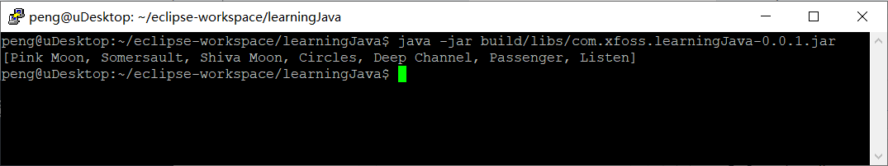
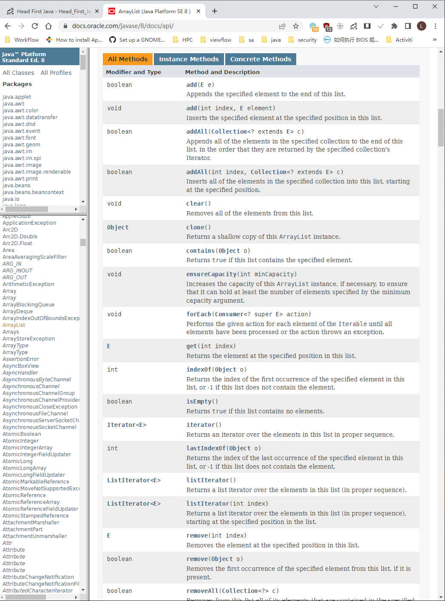
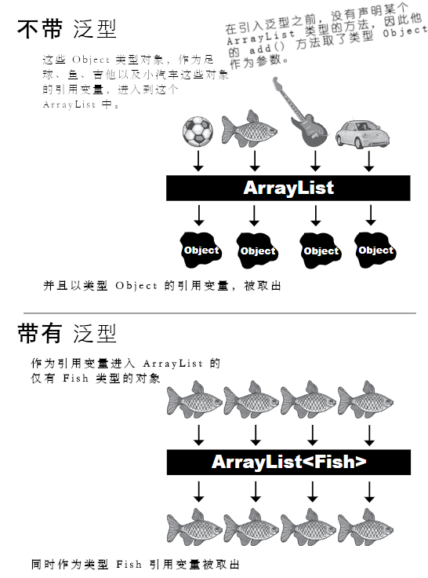
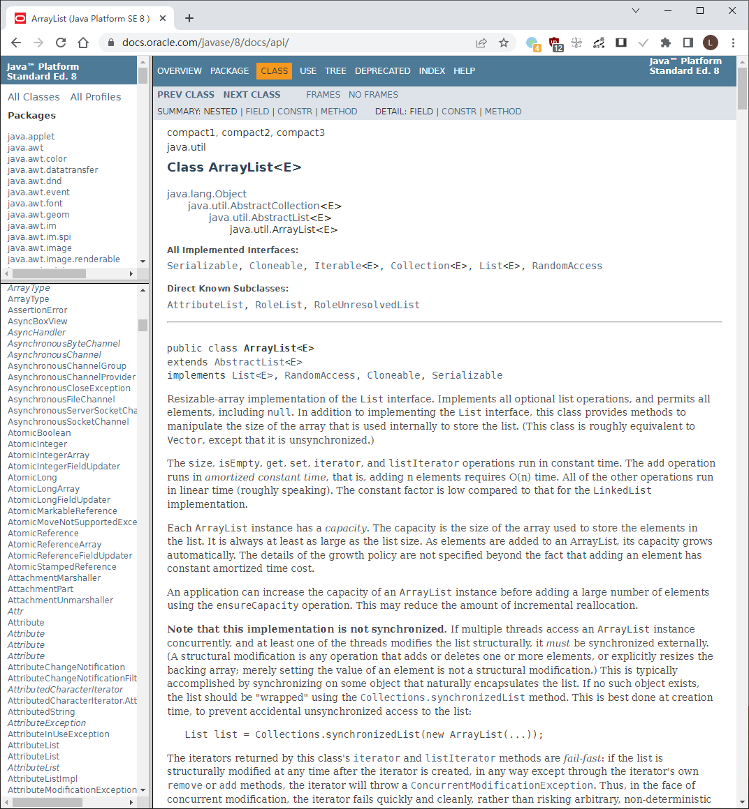
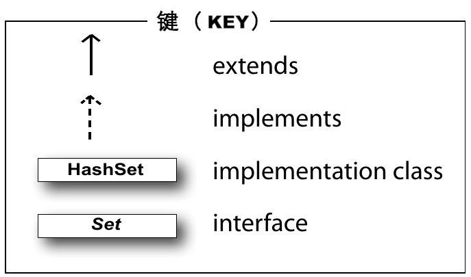
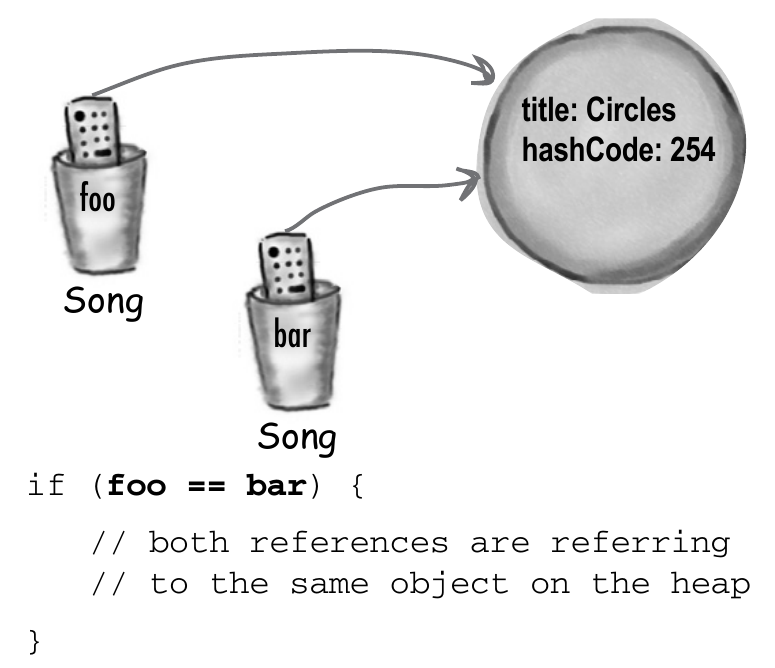

# 集合与泛型：数据结构

**Collections and Generics: Data Structure**

**在 Java 里头，排序就是小菜一碟**。无需编写自己的排序算法，就有了收集与操纵数据的全部工具（除非在阅读本章时，正坐在计算机科学101, CS 101 课程的教室里，那么在我们Java程序员简单地调用一个Java API中方法时，你就要去编写那个排序方法了）。Java 的集合框架，有着一种几乎全部需要完成事情的数据结构（The Java Collections Framework has a data structure that should work for virtually anything you'll ever need to do）。想要有个可轻易持续地往其上添加的清单吗？想要通过名字来找到某个物件吗？想要创建一个可自动排除所有重复项目的清单吗？要按照对你背后捅刀次数，对你的同事们排个序吗？把你的宠物，按照他们掌握的把戏排个序怎么样？本章就是关于这些的......

## 追踪自动唱机上歌曲流行度

**Tracking song popularity on your jukebox**

恭喜你获得了新的任务--管理楼氏餐厅的自动唱机系统。这自动唱机里头，本身并没有Java，不过在每次有人点播了一首歌时，歌曲数据就会被追加到一个简单的文本文件。

你的任务，就是对这个数据进行管理，从而跟踪到歌曲流行度，生成一些报告，进而修改那些播放清单。这里并非要编写整个的 app -- 别的一些软件开放者/侍应生也会参与进来，你所要负责的，仅是对整个Java app内的数据加以管理和排序。而由于楼老板抵触数据库，因此数据是严格来说是个内存中的数据集（an in-memory data collection）。所得到的全部，就是那个自动唱机持续添加数据的文件。你的任务，就是从那里取得数据。

先前我们已经掌握了怎样读取和解析该文件，并且到目前位置，都是将数据保管在一个 `ArrayList` 中的。

**#1 挑战**

**对这些歌曲，按照字母顺序排序**


在某个文件中，有着一个歌曲的清单，其中各行分别表示一首歌曲，且歌曲标题与艺人，是以正斜杠分开的。那么对这样的行进行解析，进而把全部歌曲放入到一个 `ArrayList` 里头就简单了。


*图 1 - SongList.txt*

> *这就是那个自动点唱机设备所写入的文件。这里的代码必须读取整个文件，随后对歌曲数据进行操作*。

老板只对歌曲标题感兴趣，因此现在就可以简单地构造一个只有歌曲标题的清单就行。

然而会发现整个清单不是以字母顺序的......这里可以做点什么呢？

我们知道对于一个 `ArrayList` 来说，那些元素保持着将其插入到清单中的顺序，那么把这些元素放入到 `ArrayList` 中，就不会留意到他们的字母排序的，除非......`ArrayList`类中，有着一个`sort()`方法。

**下面就是到目前为止，不带排序的样子**：

```java
package com.xfoss.CollectionAndGenerics;

import java.util.*;
import java.io.*;
import com.xfoss.Utils.XPlatformThings;

public class JukeBox1 {

    // 这里将把那些歌曲标题保管在一个字符串的 ArrayList 中。
    ArrayList<String> songList = new ArrayList<String> ();

    String wDir = XPlatformThings.getWorkingDir("learningJava");

    // 启动加载文件并打印那个 songList 的 ArrayList 的构造函数。
    public JukeBox1 () {
        getSongs();
        System.out.println(songList);
    }

    public static void main(String[] args){
        new JukeBox1();
    }

    // 这里并无什么特别之处......只是读取文件并针对各行调用 addSong() 方法。
    void getSongs() {
        try {
            File file = new File(String.format("%s/SongList.txt", wDir));
            BufferedReader reader = new BufferedReader(new FileReader(file));
            String line = null;
            while ((line = reader.readLine()) != null) {
                addSong(line);
            }
        } catch (IOException ex) {ex.printStackTrace();}
    }

    // 这个 addSong 方法就如同 I/O 章中 QuizCard 一样 -- 运用 split() 方法
    // 将行（有着歌曲标题与艺人）拆开为两个片段（令牌）。
    void addSong(String lineToParse) {
        String [] tokens = lineToParse.split("/");
        // 这里只要歌曲标题，因此只将第一个令牌添加到 songList（即那个 ArrayList）。
        songList.add(tokens[0]);
    }
}
```




*图 2 - JukeBox1*

> *songList 会以这些歌曲标题被添加到这个 `ArrayList` （其中的顺序与这些歌曲在原始文本文件中的顺序相同）的顺序，打印出这些歌曲标题*。
>
> 显然这不是以字母顺序排序的！

### 然而类 `ArrayList` 并没有`sort()` 方法！

在检视 `ArrayList` 时，看起来那里是没有任何有关排序的方法。即便往上检索他的继承树也毫无助益--明显 ***在 `ArrayList` 上是无法调用到某个排序方法的***。



*图 3 - Java API - ArrayList*

> *`ArrayList` 有着很多方法，不过却没有可用于排序的*......


### `ArrayList` 并非唯一的集合

**`ArrayList` is not the only collection**

> *我的确见到过一个名为 `TreeSet` 的集合类......并且文档讲到这个集合类保持着排序后的数据。我就想知道是不是应该使用`TreeSet`而非`ArrayList`......（I do see a collection class called `TreeSet`...and the docs say that it keeps your data sorted. I wonder if I should be using a `TreeSet` instead of an `ArrayList`...）*


虽然`ArrayList`是在今后会用到最多的集合类，对于特殊情形，还是有一些其他的集合类。其中一些关键集合类，包括以下几个：

> *请不要急于去了解别的那些集合类。稍后会涉及到更多的细节*。


- **`TreeSet`**

    让元素保持排序并防止重复（Keeps the elements sorted and prevents duplicates）。

- **`HashMap`**

    实现了名称/值对方式的元素存储与访问（Let you store and access elements as name/value pairs）。

- **`LinkedList`**

    令到诸如栈与队列等数据结构的创建容易起来（Make it easy to create structures like stacks or queues）。

- **`HashSet`**

    去除集合中的重复，同时对于给定元素，可快速在集合中找出来（Prevents duplicates in the collection, and given an element, can find that element in the collection quickly）。

- **`LinkedHashMap`**

    与常规 `HashMap` 类似，但他可以记住其中元素（名/值对）插入的顺序，也可以被配置为记住那些最近被访问过元素的顺序（Like a regular `HashMap`, except it can remember the order in which elements(name/value pairs) were inserted, or it can be configured to remember the order in which elements were last accessed）。 


### 可以使用`TreeSet`......，也可以使用`Collections.sort()方法`


在将全部字符串（即那些歌曲标题）放入到一个 **`TreeSet`** 而非 `ArrayList`中时，这些字符串就会自动以正确位置，即字母顺序着地。之后无论何时打印出这个清单，这些元素都会始终以字母顺序输出。

在需要一个 *集合（set）*（接下来就会讲到什么是集合），或可以肯定清单必须 *始终* 保持字母排序时，这样处理是相当不错的。

不过在别的情况下，在不需要清单保持排序时，相比这样的需求，使用`TreeSet`就显得有些代价高昂 -- ***在每次往`TreeSet`插入元素时，`TreeSet`都必须花时间去找出应在何处插入这个元素***。而使用 `ArrayList`，由于新元素只会在清单末尾加入，那么元素插入就可以快得让人窒息。


*图 4 - Java API `java.util.Collections`*

> *嗯......在 `Collections` 类中确实有个 `sort()` 方法。他会取得一个 `List`，同时由于`ArrayList`实现了 `List` 接口，因此 `ArrayList` `IS-A` `List`。归功于多态机制，就可以将`ArrayList`传递给声明了取得 `List` 的方法*。
>
> *请注意*：这并非是一个真正的 `Collections` 类的API文档；这里通过省略有关泛型（the generic type, 将在本章后面讲到）的信息，而对其进行了简化。


### 答疑

- **不是可以把元素添加到`ArrayList`的特定索引处，而不是他的末尾的吗 -- 确实有一个过载的`add()`方法，连同要添加的元素一道，还取得一个整型参数呢。那么这样就不会比直接插入到清单末尾更慢吗**？

> 是的，在 `ArrayList` 末尾插入元素，在其他地方是要慢一些的。因此使用过载的`add(index, element)` 方法，就不如调用 `add(element)` -- 这会把添加的元素放在清单末尾，这样来得快。然而在大部分用到`ArrayList`的时候，是无需将某个元素放在指定索引处的。


- **我看见那里有一个 `LinkedList` 类，那么是不是使用 `LinkedList`，就可以更好地实现在清单中间插入元素呢？至少我还记得大学时学过的数据结构课**......

> 是的，讲得不错。在从清单中中间插入或移除元素时，`LinkedList`要快一些，然而对于大多数应用，除非是在处理 *巨量* 的元素，那么往 `LinkedList` 与 `ArrayList` 的中间插入的区别，通常不足以纳入考量。后面很快就会深入了解 `LinkedList` 类。

### 把`Collections.sort()` 方法添加到 `JukeBox` 代码


> **`Collections.sort()` 方法，会将字符串清单，以字母顺序进行排序**。

```java
package com.xfoss.CollectionAndGenerics;

import java.util.*;
import java.io.*;
import com.xfoss.Utils.XPlatformThings;

public class JukeBox1 {
    ArrayList<String> songList = new ArrayList<String> ();
    String wDir = XPlatformThings.getWorkingDir("learningJava");

    public JukeBox1 () {
        getSongs();
        System.out.println(songList);

        // 对静态类 `Collections` 的 `sort()` 方法进行调用，并
        // 再次打印处这个清单。这第二个打印输出，就是以字母顺序的了！
        Collections.sort(songList);
        System.out.println(songList);
    }

    public static void main(String[] args){
        new JukeBox1();
    }

    void getSongs() {
        try {
            File file = new File(String.format("%s/SongList.txt", wDir));
            BufferedReader reader = new BufferedReader(new FileReader(file));
            String line = null;
            while ((line = reader.readLine()) != null) {
                addSong(line);
            }
        } catch (IOException ex) {ex.printStackTrace();}
    }

    void addSong(String lineToParse) {
        String [] tokens = lineToParse.split("/");
        songList.add(tokens[0]);
    }
}
```


*图 5 - 加入了 `Collections.sort()` 方法后的 `JukeBox1` 程序*


### 然而现在需要的是 `Song` 对象，而不是那些简单的字符串

现在老板想要清单中的那些具体 `Song` 类实例，而不仅仅是一些字符串，那么每个 `Song` 就要有更多的数据了。新的自动点唱机装置输出了更多的信息，那么这次这个文件就会有 *四个* 片段（令牌），而不再仅仅两个了。

类 `Song` 是相当简单的，仅有一个感兴趣的特性 -- 一个重写了的 `toString()` 方法。请记住，这个 `toString()`方法，是在类 `Object` 中定义的，因此Java 中的每个类，都继承了这个方法。同事由于在打印某个对象（`System.out.println(anObject)`）时，会调用到这个对象上的 `toString()` 方法，因此就应该对其进行重写，来打印出一些比起默认唯一识别符代码，更具可读性的东西。在打印某个歌曲对象清单时，将调用到各个 `Song` 对象上的这个 `toString()` 方法。

```java
class Song {

    // 这四个实例变量表示文件中的四个歌曲属性。
    private String title;
    private String artist;
    private String rating;
    private String bpm;

    // 这些变量都是在新的 Song 对象被创建时，在构造器中设置的。
    Song (String t, String a, String r, String b) {
        title = t;
        artist = a;
        rating = r;
        bpm = b;
    }

    // 这些是四个属性的获取器方法。
    public String getTitle () {
        return title;
    }

    public String getArtist () {
        return artist;
    }

    public String getRating () {
        return rating;
    }

    public String getBpm () {
        return bpm;
    }

    // 由于在执行 System.out.println(aSongObject)时，希望看到歌曲标题，因此
    //  这里重写了 toString() 方法。在执行 System.out.println(aListOfSongs) 
    //  时，就会调用清单中各个元素的这个 toString() 方法。
    public String toString () {
        return title;
    }
}
```

### 将 `JukeBox` 代码修改为使用 `Song` 对象而非那些字符串

代码只会修改很少 -- 文件 I/O 代码还是一样，且解析代码也一样（`String.split()`静态方法），这次不一样的，是每行/每首歌曲将有 *四个* 令牌，同时全部四个都将用于构造一个新的 `Song` 对象。同时理所应当的这个 `ArrayList` 将是类型 `<Song>` 而非 `<String>` 了。


```java
package com.xfoss.CollectionAndGenerics;

import java.util.*;
import java.io.*;
import com.xfoss.Utils.XPlatformThings;

public class JukeBox3 {

    // 这里将这个 ArrayList 从 String 修改为了 Song 对象。
    ArrayList<Song> songList = new ArrayList<Song> ();
    String wDir = XPlatformThings.getWorkingDir("learningJava");

    public JukeBox3 () {
        getSongs();
        System.out.println(songList);

        Collections.sort(songList);
        System.out.println(songList);
    }

    public static void main(String[] args){
        new JukeBox3();
    }

    void getSongs() {
        try {
            File file = new File(String.format("%s/SongListMore.txt", wDir));
            BufferedReader reader = new BufferedReader(new FileReader(file));
            String line = null;
            while ((line = reader.readLine()) != null) {
                addSong(line);
            }
        } catch (IOException ex) {ex.printStackTrace();}
    }

    void addSong(String lineToParse) {

        // 这里使用四个令牌（也就是歌曲文件中这一行的四个信息片段）创建
        // 出一个新的 Song 对象，并将该 Song 对象添加到那个清单。
        String [] tokens = lineToParse.split("/");

        Song nextSong = new Song(tokens[0], tokens[1], tokens[2], tokens[3]);
        songList.add(nextSong);
    }
}
```


### 然而这代码不会被编译出来！


```console
/home/peng/eclipse-workspace/learningJava/src/main/java/com/xfoss/CollectionAndGenerics/JukeBox3.java:17:
    error: no suitable method found for sort(ArrayList<Song>)
           Collections.sort(songList);
                      ^
       method Collections.<T#1>sort(List<T#1>) is not applicable
         (inference variable T#1 has incompatible bounds
           equality constraints: Song
           lower bounds: Comparable<? super T#1>)
       method Collections.<T#2>sort(List<T#2>,Comparator<? super T#2>) is not applicable
         (cannot infer type-variable(s) T#2
           (actual and formal argument lists differ in length))
  where T#1,T#2 are type-variables:
    T#1 extends Comparable<? super T#1> declared in method <T#1>sort(List<T#1>)
    T#2 extends Object declared in method <T#2>sort(List<T#2>,Comparator<? super T#2>)
Note: Some input files use unchecked or unsafe operations.
```

某个地方出错了......那个 `Collections` 类明明是有个取`List` 做参数的 `sort()` 方法的。

`ArrayList` 确实是一个 `List`，因为 `ArrayList` 实现了接口 `List`，那么......这代码 *应该* 跑起来的。

***然而这代码并没有跑起来***!

编译器说，他无法找到适当的、取一个 `ArrayList<Song>` 作参数的 `sort` 方法，那么或许是这个 `sort()` 方法不喜欢一个 `Song`对象构成的 `ArrayList`？不过这个 `Collections.sort()` 方法又并不介意一个 `ArrayList<String>`，那么 `Song` 与 `String` 之间，到底有什么重要的区别呢？是什么差异导致了编译器的失败呢？

当然你或许已经想到，“排序的 *依据* 到底是什么？” 这个 `sort` 方法是怎样知道，是什么造成一个 `Song` 大于 另一`Song` 对象的？显然在希望歌曲标题作为判断这些歌曲排序方式时，就需要某种方式，来告知这个 `sort` 方法，他需要使用标题，而非比如说每分钟的拍数（the beats per minute, bpm）。

关于这点，正是这里接下来几页要讨论的问题，不过首先，让我们搞清楚，为何编译器甚至不会允许将一个 `Song` 的 `ArrayList` 传递给这个 `sort()` 方法。


### `Collections.sort()` 方法的声明


*图 6 - Java API `Collections.sort()`*

> *WTF? 我都不知道该怎么去看这个方法声明。他讲了 `sort()` 要取一个 `List<T>` 的参数，然而 `T` 是个啥？还有在返回值类型前那一大坨又是啥*？


从 API 文档（找找 `java.util.Collections` 类，然后滚动 `sort()` 方法），似乎这个 `sort()` 方法声明得...... *有些奇怪*。或者至少不同于先前见到的任何一个。

那是因为，这个 `sort()` 方法（连同Java中整个集合框架中的其他东西），重度运用了 *泛型（generics）*。不论何时，但凡在 Java 源码或文档中，见到某个东西带有尖括号，那就意味着泛型 -- 一个添加到 Java 5.0 版本中的特性。因此在搞清楚为何可以对 `ArrayList` 中的字符串对象进行排序，而无法对 `Song` 对象的`ArrayList` 进行排序之前，这里就不得不掌握如何去理解文档。

## 泛型意味着更好的类型安全

**Generics means more type-safety**


这里就会讲到这个 -- *我们所写的全部涉及到泛型的代码，实际上都将是有关集合的代码（virtually all of the code you write that deals with generics will be collection-related code）*。虽然泛型可以其他一些方式使用，但泛型的要点，是可以写出类型安全的集合。也就是那些可以令到编译器阻止我们把一个 `Dog` 对象，放入到一个 `Duck` 清单里去的代码。

> **注**：*关于 Collection 与 Set 的区别，请参考 [What is the difference between a set and a collection in Java?](https://www.quora.com/What-is-the-difference-between-a-set-and-a-collection-in-Java)*

在泛型之前（即在 Java 5.0 之前），由于所有集合实现，都被声明为保存类型 `Object`，因此编译器不会在乎放入到某个集合的为何物。那时可将 *任何东西* 都放入到所有 `ArrayList`；这就好比所有 `ArrayList` 都被声明为了 `ArrayList<Object>`。

> **有了泛型，就可以创建类型安全的集合，其中在编译时，而不是运行时就可以发现更多的问题**。
>
> **若没有泛型，那么编译器会痛快地允许将 `Pumpkin` 放入到本被假定为仅保管 `Cat` 对象的 `ArrayList`**。



*图 7 - 没有泛型与带有泛型的对比*

> *现在有了泛型，就只能将 `Fish` 对象放入到这个 `ArrayList<Fish>` 中，因此那些从这个清单中取出的对象，就是些`Fish` 引用变量了。不必担心有人会把一个 `Volkswagen` 放在那里面，或者担心从那里取出的对象，不会确实是个兼容 `Fish` 的引用变量*。

### 了解泛型

**Learning generics**

关于泛型，有很多需要掌握的东西，对于大多数程序员，则只需要了解下面三个：

1) 创建一些泛化类的实例（creating instances of generified classess, 比如 `ArrayList`）

`new ArrayList<Song> ()`

在构造一个 `ArrayList` 时，就必须告诉这个 `ArrayList` 类型的变量，这个清单中将允许的对象类型，这就跟原先那些普通数组一样。

2) 声明并赋值一些泛型的变量（declaring and assigning variables of generic types）

`List<Song> songList = new ArrayList<Song> ()`

多态机制与泛型到底是怎样一起生效的呢？在有着一个 `ArrayList<Animal>` 的引用变量时，可以将一个 `ArrayList<Dog>` 的变量赋值给他吗？对于一个 `List<Animal>` 的引用变量又如何呢？可以将一个 `ArrayList<Animal>` 对象，赋值给他吗？接下来就会看到.......

3) 声明（及触发）那些取泛型作参数的方法（declaring(and invoking) methods that take generic types）

```java
void foo(List<Song> list)
x.foo(songList)
```

> ***注***：关于 call 与 invoke 的区别，请参考：[what is the difference between 'call' and 'invoke'?](https://www.quora.com/What-is-the-difference-between-call-and-invoke)

在有着某个取一个参数，即 `Animal` 类型对象的 `ArrayList` 的方法时，到底那意味着什么呢？可否传递给这个方法一个 `Dog` 类型对象的 `ArrayList` 呢？后面就会讨论到与先前那种取老式普通数组作参数的方法相比，一些微妙而棘手的问题。

（这实际上与上面第二点相同，但这正好说明多态与泛型在一起时的重要性。）


## 运用泛型类（using generic CLASSES）

由于 `ArrayList` 是这里最常用到的泛化类型，那么这里将以他的文档开始。要注意到泛化类的以下两个关键点：

1) 这个 *类* 的声明（The *class* declaration）

2) 那些实现元素添加的 *方法* 的声明（The *method* declarations that let you add elements）




*图 8 - Java API - ArrayList*


### 理解 `ArrayList` 的文档

（或者说，这里 `E` 的真正意义为何？）


> **请将这里的 “E”，当作 “希望这个集合所保留与返回的元素类型”。（E 就是元素 Element 中的 E。）**
>
> **Think of "E" as a stand-in for "the type of element you want this collection to hold and return." (<ins>E</ins> is for <ins>E</ins>lement.)**

```java
// 这个 “E” 是在声明和创建某个 ArrayList 时，所用到具体
// 类型的占位符。
public class ArrayList<E>
// ArrayList 是 AbstractList 的一个子类，因此不论指定了
// 何种类型给这个 ArrayList, 都会自动用到类型 AbstractList 上。
extends AbstractList<E>
// 这个类型（即 <E> 的取值）同时将成为 List 接口的类型。
implements List<E>, RandomAccess, Cloneable, Serializable {
    // 这里是重点！这里的 “E” 决定了所能添加到这个 ArrayList
    // 的物件类别。
    public boolean add (E o)
    // 其他代码
}
```

这个 `E` 表示用于创建 `ArrayList` 实例的类型，在见到 `ArralyList` 文档中的 `E` 时，就可以暗自将其查找/替换为用于初始化 `ArrayList` 的那个 `<type>`。

那么那个新的 `ArrayList<Song>` 就表示，在所有用到 `E` 的方法或变量声明中的 `E` 成为了 `Song`。


### 在 `ArrayList` 下使用类型参数

**Using type parameters with `ArrayList`**

这段代码：

```java
ArrayList<String> thisList = new ArrayList<String>
```

意味着 `ArrayList`:

```java
public class ArrayList<E> extends AbstractList<E> ... {

    public boolean add(E o) {...}
    // 其他代码
}
```

是被编译器这样来对待的：

```java
public class ArrayList<String> extends AbstractList<String> ... {

    public boolean add(String o) {...}
    // 其他代码
}
```

也就是说，这里的 `E` 被那个在创建该 `ArrayList` 时所使用的 *具体* 类型（也被称为 *类型参数（type parameter）*）取代了。同时也是为何`ArrayList`的`add()` 方法不会允许将除了与这个 `E` 类型兼容的引用变量类型变量的对象之外，其他任何对象加以添加的原因。因此在构造了一个 `ArrayList<String>` 时，这个`add()`方法，突然间就变成了 `add(String o)`。在创建了类型为 `Dog` 的 `ArrayList` 时，那个 `add()` 就突然成为了 `add(Dog o)`。


### 答疑

- **这里就只能放一个 `E` 吗？因为 `sort` 的文档还使用了 `T`......**

> 只要是合法的 Java 标识符，都可以使用。那就意味着所有可用于方法或变量名称的东西，都会用作类型参数（a type parameter）。不过有个约定，就是要使用单个字母（那么就应该使用单个字母），同时进一步的约定，就是除非专门编写了一个集合类，那么在使用 `E` 来表示 “集合将保留元素的类型”的地方，就要使用 `T`（You can use anything that's a legal Java identifier. That means anything that you could use for a method or variable name will work as a type parameter. But the convention is to use a single letter(so that's what you shold use), and a further convention is to use `T` unless you're specifically writing a collection calss, where you'd use `E` to represent the "type of the Element the collection will hold"）。

### 运用泛型方法

**Using generic METHODS**

泛型 *类* 意味着 *类的声明* 包含了类型参数。而泛型 *方法*，表示方法声明在他的签名中，用到了一个类型参数（A generic *class* means that the *class declaration* includes a type parameter. A generic *method* means that the method declaration uses a type parameter in its signature）。

在方法中使用类型参数的几种不同方式：

1) 使用在类声明中定义的类型参数（using a type parameter defined in the class declaration）

```java
public class ArrayList<E> extends AbstractList<E> ... {
    // 之所以可以在这里使用 "E", 完全是因为这个 "E" 已经作为
    // 这个类的一部分被定义了。
    public boolean add(E o)
}
```

在声明类的某个类型参数时，就可以像使用某个 *具体* 类或接口类型那样，在任意地方使用这个类型了。于方法参数中声明的类型，就会被那个在初始化这个类时用到的类型所取代（When you declare a type parameter for the class, you can simply use that type any place that you'd use a *real* class or interface type. The type declared in the method argument is essentially replaced with the type you use when you instantiate the class）。

2) 使用未在类声明中定义的某个类型参数（using a type parameter that was NOT defined in the class declaration）


```java
// 后面方法参数中之所以可以使用 <T>，是由于前面在方法声明中
// 声明过 “T”。
public <T extends Animal> void takeThing (ArrayList<T> list)
```

在类本身未用到类型参数时，仍然可以通过在一个相当不寻常的（不过仍然可行）的地方 -- *在返回值类型之前*，声明一个类型参数，从而给某个方法指定一个类型参数。上面这个方法，表示那个 `T` 可以是 “任何的`Animal`类型”（If the class itself doesn't use a type parameter, you can still specify one for a method, by declaring it in a really unusual(but available) space -- *before the return type*. This method says that `T` can be "any type of `Animal`"）。

### 这里有点玄乎了......

**Here's where it gets weird...**


> *等下......这里一定有什么问题。既然可以取一个 `Animal` 的清单作参数，那么为什么不直接用 `ArrayList<Animal>` 呢？直接用 `takeThing(ArrayList<Animal> list)` 有什么问题*？
>
> *Wait...that can't be right. If you can take a list of `Animal`, why don't you just SAY that? what's wrong with just `takeThing(ArrayList<Animal> list)`*?

这个：

```java
public <T extends Animal> void takeThing(ArrayList<T> list)
```

与下面这个 **并不** 一样：

```java
public void takeThing(ArrayList<Animal> list)
```

这两个都是合法的，但他们是 *不一样的*！

第一个，其中的 `<T extends Animal>` 是方法声明的组成部分，表示了所有声明了类型为 `Animal` 或 `Animal`的子类型（比如`Dog` 或 `Cat`） 的 `ArrayList`, 都是合法的。那么就可以使用 `ArrayList<Dog>`、`ArrayList<Cat` 或 `ArrayList<Animal`，来运行上面的那个方法。

然而......对于下面的那个方法，其中的方法参数（`ArrayList<Animal>`）则表示，*只有* `ArrayList<Animal>` 是合法的。也就是说，相比于头个版本取任何`Animal`类型（`Animal`、`Dog`、`Cat`等待）的 `ArrayList`，这第二个版本，就 *只会* 取类型为 `Animal` 的 `ArrayList`。不能取 `ArrayList<Dog>`，或 `ArrayList<Cat>`，只能是 `ArrayList<Animal>`。

同时这似乎确实会破坏多态机制的要素。在本章结束时再回头来看仔细回顾到这一点，就会更加清楚分明。至于现在，请记住由于此刻仍在致力于搞清楚怎样对那个 `SongList` 进行排序，而这又将我们带入了对有着奇怪的泛型声明 `sort()` 方法文档的审视，因此对于泛型与多态机制的关系，还只是点到为止的（And yes, it does appare to voilate the point of polymorphism. But it will become clare when we revisit this in detail at the end of the chapter. For now, remember that we're only looking at this because we're still trying to figure out how to `sort()` that `SongList`, and that led us into looking at the API for the `sort()` method, which had this strange generic type declaration）。

***此刻来讲，所要明白的，仅是上面那个版本是合法的，同时那意味着可将一个作为`Animal`或任何的`Animal`子类型的`ArrayList`传入进去***。

那么现在就要回到那个 `sort()` 方法了......


### 还记得前面中断的地方吧......

> *这仍然解释不了为什么那个 `sort` 方法在 `Song` 的 `ArrayList` 上失效，而在 `String` 的 `ArrayList` 上没有问题*......

### 重新审视这个 `sort()` 方法

那么就来试着读读这个 `sort()` 方法的文档，找出为何他对字符串清单排序没有问题，而不能对 `Song` 对象清单进行排序。看起来答案似乎是......


*图 9 - Java API - `Collections.sort()`*

**`sort()` 方法只能接收那些是 `Comparable` 对象的清单**。

**`Song` 不是 `Comparable` 的子类型，因此就不能对 `Song` 清单进行 `sort()`**。

**至少现在是不行的**......

```java
// 这里返回值前面声明的泛型参数，表示 “T” 必须是类型 Comparable。
//
// 请暂时忽略这里的 <? super T>。若真要问这是是什么，那么他表示
// Comparable 类的类型参数，必须是类型 T，或 T 的一个子类型。
//
// 后面的那个 <T>，表示了 sort 函数仅可传入一个使用了参数化的、“对Comparable
// 进行了扩展”的类型的清单（或清单的子类型，比如ArrayList）
public static <T extends Comparable<? super T>> void sort(List<T> list)
```

> *嗯......我刚查看了一下 `String` 的文档，发现 `String` 并没有 *扩展* `Comparable` -- 他 *实现了* `Comparable`。*
>
> **`Comparable` 是个接口*。因此如果写 `T extends Comparable` 简直就是胡说八道*。


*图 10 - Java API - `String`*

### 在泛型语境下，“扩展” 指的是 “扩展或实现”

**In generics, `extends` means "`extends` or `implements`"**

Java 工程师们必须要给到一种在参数化类型上施加约束的方式，从而才能对这个参数化类型加以限制，比如仅那些 `Animal` 的子类。然而还会需要将某个类型，约束到仅允许实现了某个特定接口的那些类。因此，就会存在这样的情形，其中需要一种语法，来让上述两种条件生效--继承与实现。也就是说，一种可以同时工作于 *扩展* 和 *实现* 语法（The Java engineers had to give you a way to put a constaint on a parameterized type, so that you can restrict it to, say, only subclasses of `Animal`. But you also need to constrain a type to allow only classes that implement a particular inteface. So here's a situation where we need one kind of syntax to work for both situations -- inheritance and implementation. In other words, that works for both `extends` and `implements`）。

而胜出的词语就是...... `extends`。不过他所表达的真正意思是 `is-a`，且不管他右边的类型是接口还是类，`extends`都是有效的（And the winning word was... `extends`. But it really means `is-a`, and works regardless of whether the type on the right is an interface or a class）。

> ***在泛型中，关键字`extends`的意思就是 `is-a`，并同时对类和接口生效***。
>
> ***In generics, the keyword `extends` really means `is-a`, and works for BOTH classes and interfaces***.

```java
// Comparable 是个接口，因此这里实际上应该读作，“T 必须是一个实现
// 了 Comparable 接口的类型”。
//
// extends 右边的那个，具体是个类还是接口并不重要......这里总是要写
// extends。
public static <T extends Comparable<? super T>> void sort(List<T> list)
```

### 答疑

- **为啥 Java 工程师们不造一个新关键字，`is`**?

> 由于往语言添加一个新关键字，破坏了以较早版本编写Java代码，因此这样做是件相当大的事情。请设想一下 -- 可能使用了一个变量`is`（本书中确实使用了这个变量来表示输入流）。而由于将关键字用作代码标识符是不被允许的，那就意味着在这个关键字成为保留字之前，全部将其用作变量标识符的那些代码，就会失效。因此只要 Sun 公司的工程师有机会重用一个既有关键字，就比如这里的 `extends`，他们通常会选择重用这个既有关键字。然而这些工程师有时候别无选择......
>
> 少数（极少）关键字就已被添加到这门语言了，比如在 Java 1.4 中的 `assert` 及 Java 1.5 中的 `enum`（附录就会讲到`enum`）。而这样做并不会破坏人们的代码，尽管有时会选择 *新* 版本的Java来编译和运行，那么这些代码就会跟较旧版本的Java下表现得一样。通过在命令行给编译器或JVM传递一个特别参数，比如，“是的，是的，我知道这是 Java 1.4，但请假装成 1.3， 因为在我的代码中使用了名为 *assert* 的变量，我之所以这样写，是因为你们这些Java工程师早先说这样写是没问题的......”，就可以实现此目的。
>
> （可通过在命令行敲入 `javac` （对于编译器）或 `java` （对于 JVM），其后不带任何东西，来检查这样的命令参数是否可用，随后就可以看到一个可用选项清单。关于这些 `javac` 及 `java` 命令的参数选项，在后面的部署章节会涉及。）

### 终于知道哪里错了......那个 `Song` 类需要实现 `Comparable`

只有在 `Song` 类实现了 `Comparable` 时，才能把那个 `ArrayList<Song>` 传递给那个 `sort()` 方法，这是由于 `sort()` 方法被声明的方式决定的。快速查看一下 API 文档，就会发现 `Comparable` 接口是相当简单的，只有一个方法要实现：

```java
// java.lang.Comparable
public interface Comparable <T> {
 int compareTo(T o);
}
```

而这个`compareTo()`方法的文档，又讲到：

```console
Returns:

a negative integer, zero, or a positive integer as this object is less than, equal to, or greater than the specified object.
```

> **关键在于：到底是什么让一首歌曲小于、等于，或者大于另一首歌曲**？
>
> **在没有搞清楚这个问题之前，是无法实现这个 `Comparable` 接口的**。


看起来似乎这个 `compareTo()` 方法将在某个 `Song` 对象上调用，将另一个对象的索引，传递给那个 `Song` 对象。运行`compareTo()`方法的那个对象，必须得出传递给他的那个`Song`，在清单中是要排在他自己前面、后面，还是与他一样的位置。

现在首要工作，就是确定是什么使得一首歌曲高于另一歌曲，然后实现这个`compareTo()`方法来反应这一点。负数（任何负数）意味着被传递的 `Song` 对象高于运行此方法的`Song`对象。返回一个正数，则表明运行此方法的`Song`对象，高于传递给`compareTo()`方法的`Song`对象。返回零意味着这两个`Song`对象相等（至少在排序上来说是相等的......但不表示他们是同样的对象）。或许，有着两首标题相同的歌曲呢。

（后面就会看到，这将带来非常多的可能......Which brings up a whole different can of worms we'll look at later...）


> 动手写代码
> 请写下你的想法和实现这个将按照歌曲标题，对这些`Song`对象进行排序的`compareTo()` 方法伪代码（或者更佳的是写出具体代码）。
>
> 提示：在循着正轨的情形下，代码将少于 3 行！

### 新的、改进过的、可比较的 `Song` 类

**The new, improved, comparable `Song` class**

 这里决定希望以歌曲标题来排序，你们就要将 `compareTo()`方法实现为，把传递给这个方法的`Song`的标题，与运行这个`compareTo()`方法的`Song`对象的标题进行比较。也就是说，运行这个方法的`Song`对象必须判断出他的标题，与该方法参数的`Song`对象标题相比起来如何。

 嗯......既然这个`Collections.sort()`方法在`String`类型的清单上是生效的，那么就知道 `String` 类一定是清楚字母排序的。我们又知道 `String` 类有一个 `compareTo()` 方法，那为什么不调用这个方法呢？那样的话，就可以简单地拿一个歌曲标题的字符串，将其自己和另一个歌曲标题比较就行了，还避开了比较，或者说字母排序算法呢！

```java
// 通常前一个 Song 与 Comparable<T> 中的 Song 是匹配的......这里
// 指定了实现 Comparable 接口类可与之比较的类型。
//
// 这表示为排序目的， Song 对象可与其他 Song 对象比较。
class Song implements Comparable<Song> {

    private String title;
    private String artist;
    private String rating;
    private String bpm;

    Song (String t, String a, String r, String b) {
        title = t;
        artist = a;
        rating = r;
        bpm = b;
    }

    // Collections.sort() 方法，会将一个 Song 对象，发送给 compareTo()
    // 方法，来查看那个 Song 对象与运行这个方法的 Song 相比会怎样。
    //
    // 很简单！由于知道 String 有一个 compareTo() 方法，因此
    // 这里只要把比较工作，传递给歌曲标题的 String 对象即可。
    public int compareTo(Song s) {
        return title.compareTo(s.getTitle());
    }

    public String getTitle () {
        return title;
    }

    public String getArtist () {
        return artist;
    }

    public String getRating () {
        return rating;
    }

    public String getBpm () {
        return bpm;
    }

    public String toString () {
        return String.format("%s - %s", title, rating);
    }
}
```

现在，这个 `JukeBox3` 程序就工作了。他会打印出这个清单，随后调用 `Collections.sort()`，这个方法会将这些歌曲，按照歌曲标题的字母顺序排序。


*图 11 - 新的、改进后的可比较`Song`类*

### 这里能够对清单排序了，然而......

有了个新问题 -- 楼老板要的是这个歌曲清单的两种不同视图，一个以歌曲标题排序，一个以歌曲的艺人排序！

但是在令到集合元素可比较（通过让`Song`类实现 `Comparable` 接口）时，只有一次机会来实现那个`compareTo()`方法。那么能做些什么呢？

糟糕的做法，就是可以在 `Song` 类里头使用一个标志变量（a flag variable），然后在 `compareTo()` 中执行一个 `if` 测试，并根据这个标志变量是被设置为使用歌曲标题，还是歌曲艺人进行比较，而给出不同结果。

然而那是个可怕又脆弱的办法，并且有更佳的做法。在希望对同一事物按多种方式排序时，有API内建的东西来实现此目的。

**来再看看 `Collections` 类的文档。那里有另外一个过载的`sort()`方法（a overloaded `sort()` method） -- 这个会取一个 `Comparator` 类型的参数**。


```java
public static <T> void sort(List<T> list, Comparator<? super T> c)
```

> *这个 `sort()` 方法，是过载来取得一个叫做 `Comparator` 的参数的*。
>
> 提醒一下：请想想该怎样得到/构造出一个可对这些歌曲按照艺人而非歌曲标题进行排序的 `Comparator` 来。


### 使用定制的 `Comparator`

清单中的元素，可将其 *自身* 与他类型的另一元素，使用他的`compareTo()`方法以某种方式进行比较。但 `Comparator` 相对于这个元素的类型，是外部的东西--`Comparator`是个单独类。那么想要构造多少个 `Comparator` 类都可以！要以歌曲艺人来比较歌曲？那么就构造一个`ArtistComparator`类。要按照每分钟节拍数来比较？就构造一个 `BPMComparator`类。

```java
// java.util.Comparator
public interface Comparator<T> {
    int compare(T o1, T o2);
}
```

> ***在将一个 `Comparator` 传递给这个 `sort()` 方法时，排序就由这个`Comparator`，而不是元素本书的 `compareTo()` 方法来确定了***。

然后只需调用那个过载的、取 `List` 及帮助将清单中物件进行排序的 `sort()` 就可以了。

取了 `Comparator` 参数的 `sort()` 方法，在将那些元素进行排序时，将使用这个 `Comparator` 参数，而不是元素本身的 `compareTo()` 方法。也就是说，在`sort()`方法获得了一个 `Comparator`时，这个方法就不会 *调用（call）* 那些清单中元素的 `compareTo()` 方法了。相反，这个`sort()`方法，会 *运行（invoke）* `Comparator` 上的 **`compare()`** 方法。

因此，有下面的规则：

- **运行单个参数的 `sort(List o)` 方法，表示清单元素的 `compareTo()` 方法决定了排序顺序。因此清单中那些元素，必须要实现 `Comparable` 接口**。

- **运行过载的 `sort(List o, Comparator c)`** 表示清单元素的`compareTo()`方法不会被调用，而将使用这个 `Comparator` 的 `compare()` 方法。那就意味着清单中的元素，没有必要取实现 `Comparable` 接口***。

### 答疑

- **那么这意味着在某个类没有实现 `Comparable`，且没有源代码的情况下，仍然可以通过构造一个 `Comparator`，将这个类类型的物件进行排序了吗**？

> 对的，可以那样做。另一个选项（在可行的情况下）则是对这个类进行子类化，而让子类去实现 `Comparable` 接口。


- **那为什么不是 *每个* 类都实现 `Comparable` 接口**？

> 你真的以为 *万事万物* 皆可排序？在有着一些不以任何自然方式排序的元素类型时，这个时候如果实现了 `Comparable` 接口，那么就会误导别的程序员了。且由于某位程序员可以他自己的定制 `Comparator`，来以他选择的方式加以比较，所以即使没有实现 `Comparable`接口，也不会有什么大的风险。

### 将 `JukeBox` 更新为使用 `Comparator`

这个代码中完成了三个新东西：

1) 创建了一个实现 `Comparator` 的内部类（进而因此那个`compare()`方法会完成之前由`compareTo()`方法完成的工作）；

2) 构造了这个 `Comparator` 内部类的实例；

3) 调用了那个过载的 `sort()` 方法，同时给到他歌曲清单与这个 `Comparator` 内部类的实例。

请注意：这里还更新了这个 `Song` 类的 `toString()` 方法，以同时打印出歌曲标题与艺人。（不管清单如何排序，新 `toString()` 方法都会打印出 `title: artist`。）


```java
package com.xfoss.CollectionAndGenerics;

import java.util.*;
import java.io.*;
import com.xfoss.Utils.XPlatformThings;

public class JukeBox4 {

    // 这里将这个 ArrayList 从 String 修改为了 Song 对象。
    ArrayList<Song> songList = new ArrayList<Song> ();
    String wDir = XPlatformThings.getWorkingDir("learningJava");

    public JukeBox4 () {
        getSongs();
        System.out.println(songList);

        Collections.sort(songList);
        System.out.println(songList);

        // 这里构造了那个 Comparator 内部类的一个实例。
        ArtistCompare artistCompare = new ArtistCompare();
        // 这里运行了 sort() 方法，传递给他了这个歌曲清单和到上面新的定制
        // Comparator 类型的一个对象。
        Collections.sort(songList, artistCompare);
        System.out.println(songList);
    }

    public static void main(String[] args){
        new JukeBox4();
    }

    // 这里创建了一个新的、实现 Comparator 的内部类（请留意他的类型参数是与即将
    // 比较的 -- 即这个实例中的 Song 的那些对象）是一致的。
    class ArtistCompare implements Comparator<Song> {
        public int compare(Song one, Song two) {
            // 这里的 one.getArtist() 将成为一个字符串（即歌曲艺人）
            //
            // 由于字符串本身已经知道他们该怎样按字母排序，因此这里是
            // 让这两个字符串变量（表示歌曲艺人）执行的具体比较。
            return one.getArtist().compareTo(two.getArtist());
        }
    }

    void getSongs() {
        try {
            File file = new File(String.format("%s/SongListMore.txt", wDir));
            BufferedReader reader = new BufferedReader(new FileReader(file));
            String line = null;
            while ((line = reader.readLine()) != null) {
                addSong(line);
            }
        } catch (IOException ex) {ex.printStackTrace();}
    }

    void addSong(String lineToParse) {

        // 这里使用四个令牌（也就是歌曲文件中这一行的四个信息片段）创建
        // 出一个新的 Song 对象，并将该 Song 对象添加到那个清单。
        String [] tokens = lineToParse.split("/");

        Song nextSong = new Song(tokens[0], tokens[1], tokens[2], tokens[3]);
        songList.add(nextSong);
    }
}
```


*图 12 - `java.util.Comparator` 接口的引入*

> 请注意：通过保留先前在 `Song` 类中的 `compareTo()` 方法，这里仍将按歌曲标题排序作为了默认排序。另一种实现这两种排序的方法，就是同时将歌曲标题排序和艺人排序，以`Comparator`内部类的方式加以实现，从而完全不让 `Song` 去实现 `Comparable`接口。那就意味着全都要使用两参数版本的 `Collections.sort()`。


### 动手写代码


```
package com.xfoss.CollectionAndGenerics;

import java.io.*;
import java.util.*;

public class SortMountains {
    LinkedList<Mountain> mtn = new LinkedList<Mountain> ();

    class NameCompare implements Comparator<Mountain> {
        public int compare (Mountain one, Mountain two) {
            return one.getName().compareTo(two.getName());
        }
    }

    class HeightCompare implements Comparator<Mountain> {
        public int compare (Mountain one, Mountain two) {
            return one.getHeight() - two.getHeight();
        }
    }

    public SortMountains () {
        mtn.add(new Mountain("Longs", 14255));
        mtn.add(new Mountain("艾伯特", 14433));
        mtn.add(new Mountain("玛努恩", 14156));
        mtn.add(new Mountain("Castle", 14265));

        System.out.format("输入的是：\n%s\n", mtn);

        NameCompare nc = new NameCompare();
        Collections.sort(mtn, nc);
        System.out.format("依名称排序：\n%s\n", mtn);

        HeightCompare hc = new HeightCompare();
        Collections.sort(mtn, hc);
        System.out.format("依高度排序：\n%s\n", mtn);
    }

    public static void main (String[] args) {
        new SortMountains();
    }
}

class Mountain {
    private String name;
    private int height;

    public String getName () {
        return name;
    }

    public int getHeight () {
        return height;
    }

    public Mountain (String n, int h) {
        name = n;
        height = h;
    }

    public String toString () {
        return String.format("%s: %d", name, height);
    }
}
```


*图 13 - `SortMountains`*


### 好耶。排序全都工作起来了，不过现在有些重复的元素......

排序已经运作得相当好了，现在已经掌握了怎样同时以 *歌曲标题* （使用那些 `Song` 对象的 `compareTo()` 方法）和 *歌曲艺人*（使用`Comparator`类的 `compare()` 方法）进行排序。然而这里有个之前未曾注意到的、那个自动点唱机文本文件中的新问题 -- ***排序后的清单中包含了重复元素***。

看起来不论同一首歌是否已经被播放（并由此已被写入）到那个文本文件，那台晚餐点唱机都在持续地往那个文件写入。这个 `SongListMore.txt` 的点唱机文件，是已被播放过的全部歌曲的完整记录，并且有可能多次包含了同一首歌曲。

```console
// SongListMore.txt
Pink Moon/Nick Drake/5/80
Somersault/Zero 7/4/84
Shiva Moon/Prem Joshua/6/120
Circles/BT/5/110
爱你一万年/Andy LAU/5/142
Deep Channel/Afro Celts/4/120
Passenger/Headmix/4/100
Listen/Tahiti 80/5/90
Listen/Tahiti 80/5/90
Listen/Tahiti 80/5/90
Circles/BT/5/110
```

> *现在由于自动点唱机正依序持续写入其所播放的每首歌曲，因此这个 `SongListMore` 的文本文件中，就有了重复项目。有人曾决定连续播放了三次 "Listen" 那首歌，接着又播放了 “Circles” 那首早先曾被播放的歌曲*。
>
> *因为有时会需要文本文件的全部信息，因此这里无法改变文本文件被写入的方式。那么就只有对 Java 代码进行修改了*。

## 这里要的是 `Set` 而不再是 `List` 了

从 `Collection` 的API文档，可以找出三个主要的接口，分别是**`List`**、**`Set`** 与 **`Map`**。`ArrayList` 是一种 `List`，但似乎 *`Set`* 才是这里所需要的。

- **清单（LIST）** - 用在顺序为要的时候（when *sequence* matters）

    是那些掌握了 ***索引位置*** 的集合（Collections that know about ***index position***）。

    清单对某个元素在清单中的位置有所掌握。多个元素可引用同一对象（Lists know where something is in the list. You can have more than one element referencing the same object）。


*图 14 - `LIST` 图解*

- **数据集（SET）** - 用在独特性为要的时候（when *uniqueness* matters）

    是那些 ***不允许重复元素出现*** 的集合（Collections tht ***do not allow duplicates***）。

    数据集知道哪些元素已经是在集合中了（`Set`s know whether something is already in the collection）。

    在数据集中，是绝不可能有多个元素对同一对象进行引用的（或者多个元素引用被认为是相等的两个对象 -- 后面就会涉及何为对象相等的概念）。


*图 15 - 数据集 `Set`*

- **映射（MAP）** - 用在要通过键来找到某个物件时（when *finding something by key* matters）

    用到 ***键-值对*** 的集合（Collections that use ***key-value pairs***）。

    映射知悉值是与给定的键关联起来的。两个键可以引用同样的值，但不能有重复的键。尽管这些键通常都是`String` 类类型的名字（因此就可以构造出比如名称/值这样的一些清单），但键也可以是别的对象。


*图 16 - 映射 `Map`*


### `Collection` 的API文档（部分）

请注意虽然 `Map` 接口并没有真正对 `Collection` 接口进行扩展，但`Map`仍被看着是 “集合框架（Collection Frame）”（也被成为“集合API（Collections API）”）的一部分。因此即便映射没有将 `java.util.Collection` 包含在他们的继承树中，他们也仍然是集合。

（请注意：下面的图并非整个的集合 API；还有一些其他的类和接口，不过列出来的是我们最为关心的一些。）


*图 17 - `Collection` 继承树（部分）*




*图 18 - 键（KEY）*


*图 19 - 映射（`Map`）继承树*


### 使用 `HashSet`而不再是 `ArrayList`


这里给 `JukeBox` 程序进行了增补，把这些歌曲放入到一个 `HashSet` 中。（请注意：这里省去了一些 `JukeBox` 的代码，省去的代码可从先前版本中拷出来。而为了更容易的查阅输出，这里也对先前版本的 `Song` 类中的 `toString()` 方法进行了修改，让其只输出歌曲标题，而不再同时输出歌曲标题 *和* 艺人。）


```java
package com.xfoss.CollectionAndGenerics;

import java.util.*;
import java.io.*;
import com.xfoss.Utils.XPlatformThings;

public class JukeBox6 {

    // 这里将这个 ArrayList 从 String 修改为了 Song 对象。
    ArrayList<Song> songList = new ArrayList<Song> ();
    String wDir = XPlatformThings.getWorkingDir("learningJava");

    public JukeBox6 () {
        getSongs();
        System.out.format("原本的 songList: \n%s\n", songList);

        Collections.sort(songList);
        System.out.format("排序后的 songList: \n%s\n", songList);

        // 在这里，创建了一个新的参数化的 HashSet，来存储那些歌曲。
        HashSet<Song> songSet = new HashSet<Song> ();
        // HashSet 有着一个简单的 addAll() 方法，可取得另一集合并运用该
        // 集合来生成这个 HashSet. 他跟每次添加一个`Song`对象是同样得（
        // 只是更简单了）。
        songSet.addAll(songList);
        System.out.format("作为 HashSet 的 songSet: \n%s\n", songSet);
    }

    public static void main(String[] args){
        new JukeBox6();
    }

    class ArtistCompare implements Comparator<Song> {
        public int compare(Song one, Song two) {
            return one.getArtist().compareTo(two.getArtist());
        }
    }

    class TitleCompare implements Comparator<Song> {
        public int compare (Song one, Song two) {
            return one.getTitle().compareTo(two.getTitle());
        }
    }

    void getSongs() {
        try {
            File file = new File(String.format("%s/SongListMore.txt", wDir));
            BufferedReader reader = new BufferedReader(new FileReader(file));
            String line = null;
            while ((line = reader.readLine()) != null) {
                addSong(line);
            }
        } catch (IOException ex) {ex.printStackTrace();}
    }

    void addSong(String lineToParse) {

        // 这里使用四个令牌（也就是歌曲文件中这一行的四个信息片段）创建
        // 出一个新的 Song 对象，并将该 Song 对象添加到那个清单。
        String [] tokens = lineToParse.split("/");

        Song nextSong = new Song(tokens[0], tokens[1], tokens[2], tokens[3]);
        songList.add(nextSong);
    }
}
```


*图 19 - 引入`HashSet`后的 `JukeBox` 运行结果*

> *看来 `Set` 并没有什么帮助啊！这里仍然有那些全部的重复元素*！
>
> （*并且在把那个清单放入到 `HashSet` 中去时，还把顺序给搞没了，尽管后面会再去管这个顺序的事情*......）


### 哪些东西会造成两个对象相等？

**What makes two objects equal**?

首先，就必须要问这个问题 -- 什么会造成两个 `Song` 的引用变量重复？答案就是他们必须是 ***相等的***。这两个引用变量是简单地指向完全是同一个对象？还是两个单独对象只是有着同样 *标题* 而已呢？

这就引出了一个关键的话题：*引用* 等价与 *对象* 等价（*reference* equality vs. *object* equality）。


> **再两个对象 `foo` 和 `bar` 相等时，那么 `foo.equals(bar)` 就一定是 `true`，且 `foo` 和 `bar` 的 `hashCode()` 方法返回值一定会返回同样的值。要让数据集`Set`将两个对象视为重复，那么就必须重写继承自类 `Object` 的 `hashCode()` 和 `equals()` ** 方法，如此就可以让两个不同的对象，被视为相等**。


- **引用变量（Reference）等价**

    **两个引用变量，对应内存堆上一个对象**。

    两个引用了内存堆上同一对象的引用变量，是相等的。这一点无可置疑。当于这两个引用变量上同时调用 **`hashCode()`**，会得到同样结果。在没有重写 `hashCode()` 方法时，这个方法的默认行为（请记住，这个方法是从类 `Object` 继承到的），即为每个对象将获取到一个唯一编号（多数版本的Java，都会给每个对象根据其在内存堆上的内存地址，而指派给各个对象一个哈希编码，因此不会有两个对象有同样的哈希编码）。

    在想要知道两个引用变量是否引用了同一对象时，就要使用 `==` 运算符，这个运算符（请记住）比较的是变量中的二进制位。在两个引用变量都指向同一对象时，他们的二进制位是一致的。



*图 21 - 引用变量（Reference） 相等*

- **对象（Object）等价**

    **两个引用变量，分别指向内存堆上的两个对象，但这两个对象被认为是 *具有等同的意义（meaningfully equivalent）***。

    在希望将两个不同`Song`对象视为相等（比如决定了在两首歌曲同时有着一致的 *标题* 变量时），那么就必须 *同时* 重写从类 `Object` 继承的 **`hashCode()`** 和 **`equals()`** 两个方法。

    就如同上面所讲的，若没有重写 `hashCode()`，那么对象默认行为（来自 `Object` 类）就要给各个对象一个独特的哈希编码值。因此为确保两个等价对象返回同样哈希编码，就必须重写 `hashCode()` 方法。若要在 *两个* 对象上都调用 `equals()`，就还必须重写这个 `equals()` 方法，在传递给他另一对象时，总是让其返回 `true` 。


*图 22 - 对象（Object）相等*


### `HashSet` 检查重复的机制：`hashCode()` 与 `equals()`

在将对象放入到某个 `HashSet` 中时，就会使用该对象的哈希编码值，来判断把这个对象放在该数据集的何处。同时还会将该对象的哈希编码，与当前 `HashSet` 中全部其他对象的哈希编码进行比较，并在没有匹配的哈希编码时，这个 `HashSet` 就假定这个新的对象，不重复。

也就是说，只要那些哈希编码各不相同，那么这个 `HashSet` 就假定这些对象不会相等！

因此就必须重写 `hashCode()`，已确保这些对象，都有相同的值。

然而两个有着同样 `hashCode()` 的对象，却又可能 *不* 相等（稍后就会讨论到这个问题），因此在 `HashSet` 找到两个哈希编码匹配的对象 -- 一个是正要插入的，另一个是已在这个数据集中的 -- 那么这时 `HashSet` 就会调用对象上的 `equals()` 方法之一，来检查这两个哈希编码一致的对象，是否真正 *是* 相等的。

而在他们相等时，`HashSet`就知道，尝试添加的对象是数据集中某个对象的重复，因此这个添加就不会发生了。

此时是收不到异常的，但`HashSet`类型的 `add()` 方法会返回一个布尔值，告知（在关切时）这个新对象是否已被添加。因此如果这个 `add()` 方法返回了 `false`，那么就知道这个新对象，就是数据集中已有的某个对象的重复。


*图 23 - 对象重复检查机制：`hashCode()` 与 `equals()`*


### 重写了 `hashCode()` 与 `equals()` 方法的`Song`类

```java
package com.xfoss.CollectionAndGenerics;

import java.util.*;
import java.io.*;

public class Song implements Comparable<Song> {

    // 这四个实例变量表示文件中的四个歌曲属性。
    private String title;
    private String artist;
    private String rating;
    private String bpm;

    // 这些变量都是在新的 Song 对象被创建时，在构造器中设置的。
    Song (String t, String a, String r, String b) {
        title = t;
        artist = a;
        rating = r;
        bpm = b;
    }

    public int compareTo(Song s) {
        return title.compareTo(s.getTitle());
    }

    // 这些是四个属性的获取器方法。
    public String getTitle () {
        return title;
    }

    public String getArtist () {
        return artist;
    }

    public String getRating () {
        return rating;
    }

    public String getBpm () {
        return bpm;
    }

    // 由于在执行 System.out.println(aSongObject)时，希望看到歌曲标题，因此
    //  这里重写了 toString() 方法。在执行 System.out.println(aListOfSongs) 
    //  时，就会调用清单中各个元素的这个 toString() 方法。
    public String toString () {
        return title;
    }

    // HashSet（或者别的其他会调用到此方法的东西） 会将这里的
    // 参数 Object aSong（），发送给另一 `Song` 对象。
    //
    // 好消息是歌曲标题是个 `String`，而字符串是有一个重写的 equals() 
    // 方法的。因此这里只要询问一个标题，他是否与另外一个标题相等即可。
    public boolean equals(Object aSong) {
        Song s = (Song) aSong;
        return getTitle().equals(s.getTitle());
    }

    // 这里采取了与上面同样的处理......`String` 类已有一个重写的 hashCode() 
    // 方法，因此只要然后在标题上调用的 hashCode() 方法的返回值就行了。请
    // 注意这里的 hashCode() 与 equals() 是如何是要同一个实例变量的。
    public int hashCode () {
        return title.hashCode();
    }
}
```


*图 24 - 修改 `Song` 类后的 `HashSet` 输出*

> *现在修改生效了！在打印输出那个 `HashSet` 时就不再有重复了。但这里并没有再次调用 `sort()` 方法，其在将那个 `ArrayList` 放到 `HashSet` 中时，那个`HashSet`并没有保留排序*。

### Java 对象 `HashCode()` 与 `equals()` 相关的法则

类 `Object` 的API文档，指明了以下必须遵守的法则：

- 在两个对象相等时，那么他们就肯定有着一致的哈希码；
- 两个对象相等时，在二者之一的任何一个上调用 `equals()` 方法，肯定都会返回 `true`。也就是说，`if (a.equals(b)) then (b.equals(a))`；
- 两个对象有着同样哈希码是，他们不必相等。但如果他们相等，那么他们必定有着同样的哈希码；
- 因此，在重写 `equals()` 方法时，就必须重写 `hashCode()`;
- `hashCode()` 的默认行为，是给内存堆上的每个对象生成一个唯一的整数。因此若没有重写类的 `hashCode()`，那么那个类类型下的两个对象，用于不会相等；
- `equals()` 的默认行为，为执行一次 `==` 的比较。也就是说，要测试两个引用变量是否引用了内存堆上的同一个对象。因此在没有重写类中的 `equals()` 方法时，由于引用不同对象的引用变量总会包含不同的二进制位模式，那么这两个引用变量就绝不会被认为是相等的（The default behavior of `equals()` is to do an `==` comparison. In other words, to test whether the two references refer to a single object on the heap. So if you don't override `equals()` in a class, no two objects can EVER be considered equal since references to two different objects will always contain a different bit pattern）；

`a.equals(b)` 必须同时意味着 `a.hashCode() == b.hashCode()`。

但 `a.hashCode() == b.hashCode()` 却并不一定表示 `a.equals(b)`。
