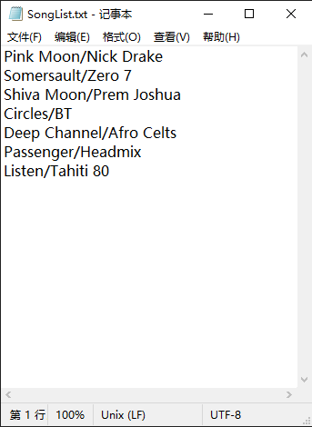

# 集合与泛型：数据结构

**Collections and Generics: Data Structure**

**在 Java 里头，排序就是小菜一碟**。无需编写自己的排序算法，就有了收集与操纵数据的全部工具（除非在阅读本章时，正坐在计算机科学101, CS 101 课程的教室里，那么在我们Java程序员简单地调用一个Java API中方法时，你就要去编写那个排序方法了）。Java 的集合框架，有着一种几乎全部需要完成事情的数据结构（The Java Collections Framework has a data structure that should work for virtually anything you'll ever need to do）。想要有个可轻易持续地往其上添加的清单吗？想要通过名字来找到某个物件吗？想要创建一个可自动排除所有重复项目的清单吗？要按照对你背后捅刀次数，对你的同事们排个序吗？把你的宠物，按照他们掌握的把戏排个序怎么样？本章就是关于这些的......

## 追踪自动唱机上歌曲流行度

**Tracking song popularity on your jukebox**

恭喜你获得了新的任务--管理楼氏餐厅的自动唱机系统。这自动唱机里头，本身并没有Java，不过在每次有人点播了一首歌时，歌曲数据就会被追加到一个简单的文本文件。

你的任务，就是对这个数据进行管理，从而跟踪到歌曲流行度，生成一些报告，进而修改那些播放清单。这里并非要编写整个的 app -- 别的一些软件开放者/侍应生也会参与进来，你所要负责的，仅是对整个Java app内的数据加以管理和排序。而由于楼老板抵触数据库，因此数据是严格来说是个内存中的数据集（an in-memory data collection）。所得到的全部，就是那个自动唱机持续添加数据的文件。你的任务，就是从那里取得数据。

先前我们已经掌握了怎样读取和解析该文件，并且到目前位置，都是将数据存储在一个 `ArrayList` 中的。

**#1 挑战**

**对这些歌曲，按照字母顺序排序**


在某个文件中，有着一个歌曲的清单，其中各行分别表示一首歌曲，且歌曲标题与艺术家，是以正斜杠分开的。那么对这样的行进行解析，进而把全部歌曲放入到一个 `ArrayList` 里头就简单了。



*图 1 - SongList.txt*

> *这就是那个自动点唱机设备所写入的文件。这里的代码必须读取整个文件，随后对歌曲数据进行操作*。

老板只对歌曲标题感兴趣，因此现在就可以简单地构造一个只有歌曲标题的清单就行。

然而会发现整个清单不是以字母顺序的......这里可以做点什么呢？

我们知道对于一个 `ArrayList` 来说，那些元素保持着将其插入到清单中的顺序，那么把这些元素放入到 `ArrayList` 中，就不会留意到他们的字母排序的，除非......`ArrayList`类中，有着一个`sort()`方法。

**下面就是到目前为止，不带排序的样子**：

```java
package com.xfoss.CollectionAndGenerics;

import java.util.*;
import java.io.*;
import com.xfoss.Utils.XPlatformThings;

public class JukeBox1 {

    // 这里将把那些歌曲标题存储在一个字符串的 ArrayList 中。
    ArrayList<String> songList = new ArrayList<String> ();

    String wDir = XPlatformThings.getWorkingDir("learningJava");

    // 启动加载文件并打印那个 songList 的 ArrayList 的构造函数。
    public JukeBox1 () {
        getSongs();
        System.out.println(songList);
    }

    public static void main(String[] args){
        new JukeBox1();
    }

    // 这里并无什么特别之处......只是读取文件并针对各行调用 addSong() 方法。
    void getSongs() {
        try {
            File file = new File(String.format("%s/SongList.txt", wDir));
            BufferedReader reader = new BufferedReader(new FileReader(file));
            String line = null;
            while ((line = reader.readLine()) != null) {
                addSong(line);
            }
        } catch (IOException ex) {ex.printStackTrace();}
    }

    // 这个 addSong 方法就如同 I/O 章中 QuizCard 一样 -- 运用 split() 方法
    // 将行（有着歌曲标题与艺术家）拆开为两个片段（令牌）。
    void addSong(String lineToParse) {
        String [] tokens = lineToParse.split("/");
        // 这里只要歌曲标题，因此只将第一个令牌添加到 songList（即那个 ArrayList）。
        songList.add(tokens[0]);
    }
}
```


*图 2 - JukeBox1*

> *songList 会以这些歌曲标题被添加到这个 `ArrayList` （其中的顺序与这些歌曲在原始文本文件中的顺序相同）的顺序，打印出这些歌曲标题*。
>
> 显然这不是以字母顺序排序的！

### 然而类 `ArrayList` 并没有`sort()` 方法！

在检视 `ArrayList` 时，看起来那里是没有任何有关排序的方法。即便往上检索他的继承树也毫无助益--明显 ***在 `ArrayList` 上是无法调用到某个排序方法的***。


*图 3 - Java API - ArrayList*

> *`ArrayList` 有着很多方法，不过却没有可用于排序的*......


### `ArrayList` 并非唯一的集合

**`ArrayList` is not the only collection**

> *我的确见到过一个名为 `TreeSet` 的集合类......并且文档讲到这个集合类保持着排序后的数据。我就想知道是不是应该使用`TreeSet`而非`ArrayList`......（I do see a collection class called `TreeSet`...and the docs say that it keeps your data sorted. I wonder if I should be using a `TreeSet` instead of an `ArrayList`...）*


虽然`ArrayList`是在今后会用到最多的集合类，对于特殊情形，还是有一些其他的集合类。其中一些关键集合类，包括以下几个：

> *请不要急于去了解别的那些集合类。稍后会涉及到更多的细节*。


- **`TreeSet`**

    让元素保持排序并防止重复（Keeps the elements sorted and prevents duplicates）。

- **`HashMap`**

    实现了名称/值对方式的元素存储与访问（Let you store and access elements as name/value pairs）。

- **`LinkedList`**

    令到诸如栈与队列等数据结构的创建容易起来（Make it easy to create structures like stacks or queues）。

- **`HashSet`**

    去除集合中的重复，同时对于给定元素，可快速在集合中找出来（Prevents duplicates in the collection, and given an element, can find that element in the collection quickly）。

- **`LinkedHashMap`**

    与常规 `HashMap` 类似，但他可以记住其中元素（名/值对）插入的顺序，也可以被配置为记住那些最近被访问过元素的顺序（Like a regular `HashMap`, except it can remember the order in which elements(name/value pairs) were inserted, or it can be configured to remember the order in which elements were last accessed）。 


### 可以使用`TreeSet`......，也可以使用`Collections.sort()方法`


在将全部字符串（即那些歌曲标题）放入到一个 **`TreeSet`** 而非 `ArrayList`中时，这些字符串就会自动以正确位置，即字母顺序着地。之后无论何时打印出这个清单，这些元素都会始终以字母顺序输出。

在需要一个 *集合（set）*（接下来就会讲到什么是集合），或可以肯定清单必须 *始终* 保持字母排序时，这样处理是相当不错的。

不过在别的情况下，在不需要清单保持排序时，相比这样的需求，使用`TreeSet`就显得有些代价高昂 -- ***在每次往`TreeSet`插入元素时，`TreeSet`都必须花时间去找出应在何处插入这个元素***。而使用 `ArrayList`，由于新元素只会在清单末尾加入，那么元素插入就可以快得让人窒息。


*图 4 - Java API `java.util.Collections`*

> *嗯......在 `Collections` 类中确实有个 `sort()` 方法。他会取得一个 `List`，同时由于`ArrayList`实现了 `List` 接口，因此 `ArrayList` `IS-A` `List`。归功于多态机制，就可以将`ArrayList`传递给声明了取得 `List` 的方法*。
>
> *请注意*：这并非是一个真正的 `Collections` 类的API文档；这里通过省略有关泛型（the generic type, 将在本章后面讲到）的信息，而对其进行了简化。


- **不是可以把元素添加到`ArrayList`的特定索引处，而不是他的末尾的吗 -- 确实有一个过载的`add()`方法，连同要添加的元素一道，还取得一个整型参数呢。那么这样就不会比直接插入到清单末尾更慢吗**？

> 是的，在 `ArrayList` 末尾插入元素，在其他地方是要慢一些的。因此使用过载的`add(index, element)` 方法，就不如调用 `add(element)` -- 这会把添加的元素放在清单末尾，这样来得快。然而在大部分用到`ArrayList`的时候，是无需将某个元素放在指定索引处的。


- **我看见那里有一个 `LinkedList` 类，那么是不是使用 `LinkedList`，就可以更好地实现在清单中间插入元素呢？至少我还记得大学时学过的数据结构课**......

> 是的，讲得不错。在从清单中中间插入或移除元素时，`LinkedList`要快一些，然而对于大多数应用，除非是在处理 *巨量* 的元素，那么往 `LinkedList` 与 `ArrayList` 的中间插入的区别，通常不足以纳入考量。后面很快就会深入了解 `LinkedList` 类。

### 把`Collections.sort()` 方法添加到 `JukeBox` 代码


> **`Collections.sort()` 方法，会将字符串清单，以字母顺序进行排序**。

```java
package com.xfoss.CollectionAndGenerics;

import java.util.*;
import java.io.*;
import com.xfoss.Utils.XPlatformThings;

public class JukeBox1 {
    ArrayList<String> songList = new ArrayList<String> ();
    String wDir = XPlatformThings.getWorkingDir("learningJava");

    public JukeBox1 () {
        getSongs();
        System.out.println(songList);

        // 对静态类 `Collections` 的 `sort()` 方法进行调用，并
        // 再次打印处这个清单。这第二个打印输出，就是以字母顺序的了！
        Collections.sort(songList);
        System.out.println(songList);
    }

    public static void main(String[] args){
        new JukeBox1();
    }

    void getSongs() {
        try {
            File file = new File(String.format("%s/SongList.txt", wDir));
            BufferedReader reader = new BufferedReader(new FileReader(file));
            String line = null;
            while ((line = reader.readLine()) != null) {
                addSong(line);
            }
        } catch (IOException ex) {ex.printStackTrace();}
    }

    void addSong(String lineToParse) {
        String [] tokens = lineToParse.split("/");
        songList.add(tokens[0]);
    }
}
```


*图 5 - 加入了 `Collections.sort()` 方法后的 `JukeBox1` 程序*
