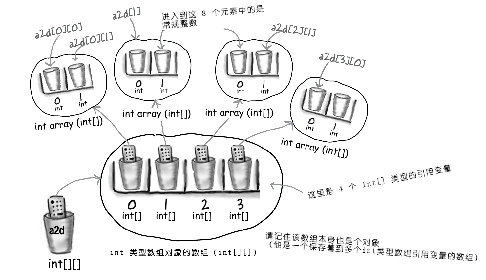

# 附录 A：十个未列入到本书正式章节的题目

**Appendix A: Ten Topics that almost made it into the Real Book**...

> 这里的意思，是还有更多的内容？这本书还没完？


这本书涵盖了很多基础知识，而你也快要学完这本书了。感谢你认真学完本书，不过在你投身于Java编程之前，我们还是希望给你更多的一些准备。对于这个附录，也不可能给到你想要的全部，原本这里通过将字型像素点大小缩减到 `.00003`，而尽力将所有需要掌握的Java知识都包含进来（不是之前那些章节中包含的）。这样是可行的，但那样就没有人能够阅读了。就这样，这里抛弃了很多内容，仅保留了是个最优的方面作为了附录（We covered a lot of ground, and you're almost finished with this book. We'll miss you, but before we let you go, we wouldn't feel right about sending you out into JavaLand without a little more preparation. We can't possibly fit everything you'll need to know into this relatively small appendix. Actually, we *did* originally include everything you need to know about Java(not already covered by the other chapters), by reducing the type point size to `.00003`. It all fit, but nobody could read it. So, we threw most of it away, but kept the best bits for this Top Ten appendix）。

这是本书 *真正的* 结尾了。当然还有一个索引（那也是必读部分）！

## 第10名：位操作

**#10 Bit Manipulation**

### 为何要关注？

**Why do you care**?

前面提到过，一个字节中有8个二进制位，短整型则有16个等待的事实。而在某些场合，可能需要对这些单独的二进制位，进行翻转。比如就可能出现给一台新的、启用了Java的烤面包机编写代码，并意识到由于严重的内存限制，一些确切的烤面包机设置，要在二进制位级别上加以控制。为了易于阅读，下面的代码注释中，仅展示了整数的后八位，而不是其整个的32位。

### 按位非运算符：`~`

**Bitwise NOT operator: `~`**


此运算符对原生值进行 “所有二进制位的翻转”：

```java
int x = 10;     // 其二进制位为 00001010
x = ~x;         // 现在的二进制位为 11110101
```

> **注意**：只有能转化为整型的原生类型，才能做二进制位翻转的非运算。经测试，整型、字符等都可以进行非运算；而逻辑值、浮点数等其他类型则不行（`error: bad operand type float for unary operator '~'`）

接下来的三个运算符，是对两个原生值，在位的基础上按位进行比较，进而返回一个基于这些位的比较的结果（The next three operators compare two primitives on a bit by bit basis, and return a result based on comparing these bits）。后面三个运算符都将用到下面整个示例：

```java
int x = 10;
int y = 6;
```

### 按位与运算符：`&`

**Bitwise AND Operator: `&`**

此运算符会返回一个仅在原先原本的两个二进制位 ***均为*** 开启时，二进制位才开启的值（This operator returns a value whose bits are turned on only if ***both*** bits are turned on）。

```java
int a = x & y; // x 的二进制位为：0000 0010
```

### 按位或运算符：`|`

**Bitwise OR Operator: `|`**

此运算符返回一个仅在两个原本两个二进制位 ***其一*** 为开启时，二进制位才开启的值（This operator returns a value whose bits are turned on only if ***either*** of the original bits are turned on）。

```java
int a = x | y;  // x 的二进制位为：0000 1110
```

### 按位异或运算符：`^`

**Bitwise XOR(exclusive OR) Operator: `^`**

此运算符返回一个仅在原本两个二进制位 ***只有其一*** 开启时，二进制位才开启的值（This operator returns a value whose bits are turned on only if ***exactly one*** of the original bits are turned on）。

```java
int a = x ^ y;  // x 的二进制位为：0000 1100
```

### 移位运算符

**The Shift Operators**

这些运算符取单个的整型原生变量，并对其全部二进制位在某个方向或另一方向上进行移位（或者说滑动）。只要稍加磨砺一下二进制数学技能，就应该知道，*往左* 对二进制位进行移位，就相当于把一个数 *乘以* 了某个二的某个幂次方，而 *往右* 移动二进制位，则相当于把一个数 *除以* 了一个二的某个幂次方（These operators take a single integer primitive and shift(or slide) all of its bits in one direction or another. If you want to dust off your binary math skills, you might realize that shifting bits *left* effectively *multiplies* a number by a power of two, and shifting *right* effectively *divides* a number by a power of two）。

这里将使用下面的示例，来讲解接下来的三个运算符：

```java
int x = -11;    // 二进制位为：1111 1111 1111 1111 1111 1111 1111 0101
```

好吧，好吧，之前一直回避了整个问题，那么现在就来以世界上最简短形式，讲一下负数存储，与 *二进制补码（two's complement）* 的问题。请记住，整型数最左边的那一位，被叫做 *符号位（sign bit）*。Java中负整型数的符号位始终是开启的（即被设置为 `1`）。而正整型数的符号位，则始终是关闭的（`0`）。Java 使用了 *二进制* 补码公式（二补公式）来存储负数。为了采用二进制补码，去改变某个数的符号，就要将这个数的的所有二进制位加以翻转，然后加上 `1`（对于一个字节表示整数来讲，这就意味着要将 `0000 0001`加到翻转后的值），这就是所谓的“二补公式”。

### 向右移位运算符：`>>`

**Right Shift Operator: `>>`**

此运算符将某个数的所有二进制位，往右移动某个确切数目，对于移动后左侧留下的那些空白二进制位，将以原先二进制数最左边的位填充。因此**符号位是不会改变的**：

```java
int y = x >> 2; // 此时二进制位为：1111 1111 1111 1111 1111 1111 1111 1101 -> -3
```

### 无符号向右移位运算符：`>>>`

此运算符与上面的右移运算符类似，但这个运算符会始终以零填充最左边的那些二进制位。因此 **符号就可能会改变**：

```java
int y = x >>> 2;    // 此时二进制位为：0011 1111 1111 1111 1111 1111 1111 1101 -> 1,073,741,821
```

### 向左移位运算符：`<<`

**Left Shift Operator: `<<`**

此运算符与上面的无符号右移运算符类似，不过是往另一方向而已；最右边的那些二进制位是以全零填充的。因此 **符号位可能改变**。

```java
int y = x << 2; // 此时二进制位为：1111 1111 1111 1111 1111 1111 1101 0100 -> -44
```

## 不变性

**Immutability**

### 为何要留意字符串是 `Immutable` 类型的？

**Why do you care that Strings are `Immutable`**?

在Java程序变得大起来时，最后就将不可避免地有着很多很多的 `String` 对象。为了安全目的，以及节省内存的缘故（请记住Java程序可在那些启用了Java的内存极少的移动电话上运行），Java中的字符串是不可更改的。这意味着在下面这样写代码时：

```java
String s = "0";

for (int x = 1; x < 10; x++) {
    s = s + x;
}
```

这实际上进行的是在创建10个`String`对象（他们的值分别是 `0`、`01`、`012` 直到 `0123456789`）。最后的那个 `s` 中指向的是值为`0123456789`的字符串，但是此刻存在着多大 *十个* 的字符串！

无论何时构造一个新的 `String` 对象，JVM 都会将其放入到一个名为 "字符串池（`String` Pool）" 的内存部分（是不是听起来很新奇？）。在字符串池中已经有一个同样值的`String`对象时，JVM就不再会创建一个重复的了，JVM会简单地将其他引用变量指向到这个既有条目。JVM之所以能侥幸做到这点，就是因为字符串具有不变性；引用变量无法修改某个`String`对象的值，是由于有别的引用变量引用了这同一个`String`对象（The JVM can get away with this because Strings are immutable; one reference variable can't change a `String`'s value out from under another reference variable referring to the same things）。

`String`对象池的另一问题在于，垃圾回收器 *无法触及到那里*。因此在此示例中，除非碰巧随后要构造一个，比如说`01234`的`String`对象，那么在那个 `for` 循环中构造的前 9 个字符串，就将在那里白白浪费内存。

### 这样做为何能节省内存？

好吧，若没有用心编写代码，*这种不可变性还是无法节省内存的*！不过在掌握了 `String` 类不可更改能力的原理时，那么就可以利用到不可更改性的有点，从而节省到内存。在势必要进行很多 `String` 对象操作（比如字符串连接等等）时，尽管有另一个类 `StringBuilder`更加适合这样的目的。关于 `StringBuilder`类，后面会有篇幅会讲到。

### 为何要对包装器的不可更改性加以留意？

**Why do you care that Wrappers are `Immutable`**?

之前在涉及到数学计算的那一章，曾讲到包装类的两个主要用途：

- 将原生值加以包装，从而这个原生值可表现为一个对象；
- 一些静态工具方法的使用（比如，`Integer.parseInt()`）。

记住可像下面这样创建一个包装器对象，至关重要：

```java
Integer iWrap = new Integer(42);
```

其中 `iWrap` 就是包装器对象了。他的值将 *始终* 是 `42`。***包装器对象，是没有设置器方法的（There is no setter method for a wrapper object）***。当然，是可以将这个 `iWrap` 引用变量，指向一个 *不同的* 包装器对象的，然而这时就会有 *两个* 对象了。一旦创建出一个包装器对象，那么就没有办法去修改那个对象的 *值* 了！

> **牢牢记住**
>
> *Roses are red, violets are blue*.
>
> ***Strings are immutable, wrappers are too***.


## 断言（Assertions）

关于在开发Java程序的过程中，如何调试的问题，这里尚未涉及。相信大家是在命令行中学习Java语言的，就如同本书一直以来所做的那样。一旦成为了一名Java专业人员，就要决定使用某种集成开发环境了，就可能会用到别的调试工具。在过去的日子里，Java程序员要调试代码时，就会依赖大量贯穿于程序中间的 `System.out.println()` 语句，打印出当前变量的值，及“已达到此处”的消息，来检查流程控制是否正常工作。（第6章中已编写好的代码，就留下了代码中的一些`print`语句。）尔后一旦程序正确工作了，就要挨个地将所有这些 `System.out.println()` 语句再清理掉。这样做是繁琐且易于出错的。而自Java 1.4（即 5.0） 版本开始，程序调试就变得容易得多了。那么答案到底是什么呢？

### 断言（Assertions）

断言就跟吃了兴奋剂的 `System.out.println()`语句一样。把断言添加到代码，就跟加入了 `println` 语句是一样的。Java 5.0 的编译器，假定即将编译的源文件是兼容 5.0 版本的，那么自 Java 5.0 开始，默认就开启了带断言的编译了。

在运行时，若什么也没做，那么添加到代码的那些断言语句，就会被JVM忽略，且不会减慢程序运行。但在告诉了JVM *开启* 那些断言时，在无需修改任何一行代码的情况下，这些断言就将有助于程序调试！

一些人曾抱怨，这必将在生产代码中留下这些断言语句，然而在代码已经部署在现场时，将这些断言语句留下来，会是相当有价值的。在客户遇到问题时，就可以指导他们在开启断言下，运行程序，然后让客户将输出发送过来。而在把这些断言从代码中剥离出来时，就永久失去了这样的选项了。同时保留下断言语句，并没有任何缺点；在断言未被开启时，他们是完全被JVM忽略的，因此并没有任何需要担心的性能问题。

### 怎样让断言发挥作用

**How to make `Assertion`s work**

在任何自认为某个事情 *必定为真* 的地方，加入断言语句。比如：

```java
assert (height > 0);
// 若 height > 0 为真，那么程序将正常继续运行；
// 若为假，那么将抛出一个 AssertionError 异常
```

而通过下面这样写，就可以将更多信息添加到栈轨迹（the stack trace）：

```java
assert (height > 0) : String.format("height = %d weight = %d", height, weight);
```

### 带有断言的编译和运行

**Compiling and running with `Assetion`s**

带有断言的 *编译*，与普通编译一样，不需要特定的命令行选项。

而带有断言的 *运行*：

```console
java -ea TestDrive
```

## 代码块作用域（Block Scope）

在第9章里，曾讲到本地变量，是如何仅伴随驻留在栈上、其被声明所在的方法而存活的（In chapter 9, we talked about how local variables live only as long as the method in which they're declared stays on the stack）。然而一些变量甚至会有着 **更短** 的生命周期。在方法内部，常常会创建一些代码 *块*。虽然之前一直都在这样做，但还不曾特意 *讨论* 过 *代码块* 这个说法。典型的代码块，是出现在方法里面的，且是由花括弧 `{}` 界定出来。后续将见到的一些常见代码块，包括了循环（`for`、`while`）及条件表达式（比如 `if` 语句）等。

来看看这个示例：

```java
//               ↙ 方法代码块的开始
void doStuff () {
    // 作用范围为整个方法的本地变量
    int x = 0;

    //                           ↙ for 循环代码块的开头，同时 y 的作用范围仅限这个 for 循环！
    for (int y = 0; y < 5; y++) {
        // 这里没有问题，x 与 y 都是在作用域
        x = x + y;
//   ↙ 这是 for 循环代码块的结束
    }

    // 哎呀！这不会编译！这里的 y 是超出作用域了！（注意，这是与某些其他语言工作方式所不同的！）
    x = x * y;
}
```

在上个示例中，`y`是个块级变量，是在一个块中被声明的，同时在那个 `for` 循环结束时，`y` 就立即失去了其作用域了。***尽可能地优先使用本地变量而不是实例变量，进而优先使用块级变量而非本地变量，将令到所编写的 Java 程序更具可调试性与扩展性（Your Java programs will be more debuggable and expandable if you use local variables instead of instance variables, and block variables instead of local variables, whenever possible）***。编译器将确保代码编写者没有尝试使用已超出作用范围的变量，因此不必担心运行时崩溃问题。

## 链式调用/运行（Linked Invocations）

由于本书尽量维持语法尽可能简洁和易读，因此本书中用到这个特性的地方很少。但在Java中，是有着许多合法捷径的，这些是在今后肯定会碰到的，尤其是在阅读其他人写的代码的时候。会遇到较为常见的代码结构之一，便是被称作 *链式调用/运行* 的东西。比如：

```java
StringBuffer sb = new StringBuffer ("spring");
sb = sb.delete(3, 6).insert(2, "umme").deleteCharAt(1);
System.out.format("sb = %s", sb);
// 运行结果为：sb = summer
```

在上面代码的第二行，到底发生了什么呢？固然，这是个刻意为之的示例，不过仍需掌握该怎么去解读这些东西。

1) 是从左往右进行处理的；

2) 找出最左边方法调用的结果，此示例中即为 `sb.delete(3, 6)`。在检查了 API 文档中的 `StringBuffer`类后，就会发现这个 `delete()` 方法返回的是一个 `StringBuffer` 对象。运行 `delete()` 方法的结果，是个值为 `spr` 的 `StringBuffer` 对象；

3) 接下来最左边的方法（`insert()`）是在新创建出的 `StringBuffer` 对象 `spr` 上调用的。该方法调用（即 `insert()` 方法）的结果，*同样* 是个 `StringBuffer` 对象（虽然该方法返回值不必与前一方法返回值类型一致），同时随着程序继续运行，所返回的对象又被用于右边的下一方法。理论上，在单个语句中是可以链接任意多想要的方法（虽然很少见到在一个语句中有多余三个链接方法）。若没有这样的链接特性，那么上面的第二行代码，将更具可读性，而看起来像下面这样：

```java
sb = sb.delete(3, 6);
sb = sb.insert(2, "umme");
sb = sb.deleteCharAt(1);
```

但还有一个之前曾见到用过的、更为常见而有用的实例，这里认为应该再次指出来。那就是在 `main()` 方法需要运行主类的一个实例方法，而又不需要保留一个到该类实例的 *引用变量* 时。也就是说，`main()`方法为可以运行此实例的 *方法* 之一，*仅*需要创建该实例即可。

```java
class Foo {
    public static void main (String[] args) {
        // 这里是要调用 go() 方法，而并不在意那个 Foo 的实例，因此就
        // 没有刻意把这个新的 Foo 对象赋值给某个引用变量了。
        new Foo().go();
    }

    void go () {
        // 这里是那些真正想要的......
    }
}
```

## 匿名及静态嵌套类

**Anonymous and Static Nested Classes**

### 嵌套类有着多种形式

**Nested classes come in many flavors**

在本书的 GUI 事件处理章节，开始将内部（嵌套）类用作实现事件收听器接口的一个解决办法。那正是内部类的最常见、最实用及最具可读性的一种形式 -- 其中用到的类，是简单地嵌套在另一包含他们类的花括弧里头的（That's the most common, practical, and readable form of an inner class--where the class is simply nested within the curly braces of another enclosing class）。同时请记住，因为内部类是外部/包覆类的成员，这就意味着为了获取到一个内部类的实例，是需要外部类的一个实例的。

然而，还有一些其他种类的内部类，包括 *静态* 及 *匿名* 的内部类。这里不会涉及到细节性的东西，但这里又不愿让你在看到一些人的代码中，奇怪语法时被震惊到。这是因为在Java语言下所能做的任何事情里头，或许没有什么能比匿名内部类，产生出更加怪模怪样的代码了。不过这里是要从一些更简单的东西开始 -- 静态嵌套类（Because out of virtually anything you can do with the Java language, perhaps nothing produces more bizarre-looking code than anonymous inner classes. But we'll start with something simpler--static nested classes）。

### 静态嵌套类（Static nested classes）

这里已知 `static` 的意思 -- 一些与类，而非特定实例捆绑的东西。而静态嵌套类，除了被关键字 `static` 标记了外，则与那些用于事件收听器的非静态类看起来是差不多的。

```java
package com.xfoss.Appendix;

class FooOuter {
    // 静态嵌套类只是 -- 包含在另一个类中，并用 static 标识符
    // 标记了的类。
    static class BarInner {
        void sayIt () {
            System.out.println("一个静态内部类的方法");
        }
    }
}

public class TestDrive {
    public static void main (String[] args) {
        // 由于静态嵌套类是......静态的，因此就不会用到外部类的实例。而只
        // 使用这个静态嵌套类的名称，这与运行静态方法或访问静态变量的方式
        // 是一致的。
        FooOuter.BarInner foo = new FooOuter.BarInner();
        foo.sayIt();
    }
}
```

### 嵌套与内部类之间的区别

**The difference between *nested* and *inner***

所有定义在别的类作用范围内部的Java类，都被称作是 ***嵌套（nested）*** 类。而不管这个类是匿名的、静态的，还是正常的。只要他是在另一个类里头，那么技术上将，他就是个 *嵌套* 类。但那些 *非静态* 嵌套类，通常被称为是 *内部* 类，也就是本书早先叫做的那样。底线则是：所有内部类都是嵌套类，但并非所有嵌套类都是内部类。

### 匿名内部类

请设想正在编写一些 GUI 代码，而猛然意识到需要某个实现了 `ActionListener` 类的实例。却发现手头并没有一个 `ActionListener` 类型的实例。进而意识到还不曾编写过那种收听器的 *类*。这个时候有两个选择：

1) 在代码中编写一个内部类，也就是前面GUI代码中所做的那种方式，进而对其初始化并将得到的实例，传入到按钮的事件注册（`addActionListener()`）方法；

或者

2) 就在这里，立即创建一个 *匿名* 内部类并对其进行初始化。***明确地就在需要收听器类型对象的地方***。没错，就是在通常要提供到实例的地方，创建类和相应的实例。请稍加思考一下这种做法 -- 那意味着是在通常只传入一个 *实例* 到方法参数的地方，传入了整个的 *类*！

```java
package com.xfoss.Appendix;

import java.awt.event.*;
import javax.swing.*;

public class TestAnon extends JFrame {

    public static void main (String[] args) {
        new TestAnon();
    }

    public TestAnon () {

        // 这里构造了一个视窗框，并添加了一个按钮，现在需要将
        // 一个动作事件收听器注册到整个按钮。只是这里并没有构造
        // 一个实现了 ActionListener 接口的类......
        super("TestAnon");
        setDefaultCloseOperation(JFrame.EXIT_ON_CLOSE);

        JButton btn = new JButton ("点击");
        // 正常情况下是要像下面这样做的--传入一个到某个内部类 -- 一个实现
        // 了 ActionListener 接口（已经 actionPerformed() 方法）的内部类，实例
        // 的引用变量......
        // btn.addActionListener(quitListener);

        // 不过现在传入不再是个引用变量，这里传入的是......整个新类的定义！！
        // 也就是说，这里是在正好需要那个类的地方，直接写出的那个实现了
        // ActionListener 接口的类。这种语法还自动创建了一个该类的实例。
        //
        // 请注意尽管 ActionListener 是个接口，但这里仍是写的 “new ActionListener()” 
        // 而这样是无法构造出 ActionListener 类型的一个实例的！但这种语法真正的意义
        // 在于，“创建一个新的，实现了 ActionListener 接口的类（不带名字），并顺便
        // 在接下来提供到该接口所需的方法实现，即这里的 actionPerformed()”。
        btn.addActionListener(new ActionListener () {
            public void actionPerformed (ActionEvent ev) {
                System.exit(0);
            }
        }); // 整个语句到这里才算结束！

        getContentPane().add(btn);

        setBounds(50, 50, 640, 480);
        pack();
        setVisible(true);
    }
}
```

## 访问级别与访问修饰符（谁看见什么的问题）

**Access Levels and Access Modifiers(Who Sees What)**

Java 语言有着 *四个* 访问 *级别*，以及 *三个* 访问 *修饰符*。之所以只有 *三个* 修饰符，是因为 *默认的那个* （即在不使用任何访问修饰符时所得到的） *即为* 四个访问级别之一。

### 访问级别

（以他们各自限制程度排序，自最少限制到最大限制，in order of how restritive they are, from least to most restrictive）

- `public` <-- `public` 访问级别表示任何地方的任何代码，都可以访问公开物件（这里的“物件”，指的是类、变量、方法、构造器等等）；
- `protected` <-- 除了允许打包外部对`protected`装饰的物件进行子类化，从而对其进行继承外，与默认（不带访问级别修饰符）方式工作完全类似，即同一打包中有着访问权限（`protected` works just like default(code in the same package has access), EXCEPT it also allows subclasses outside the package to inherit the protected thing）；
- `default` <-- `default` 访问级别表示只有与具有`default`物件类在同一打包里头的代码，才能访问到该`default`的物件（`default` access means that only code within the same package as the class with the default thing can access the `default` thing）；
- `private` <-- `private` 访问级别表示只有同一类里头的代码，才能访问到该 `private` 物件。请记住这表示对类是`private`的，而非相对对象。一个 `Dog`对象可以看到另一`Dog`对象的私有成员，但`Cat`对象是无法看到`Dog`对象的私有成员的。


### 访问装饰符（Access modifiers）

```java
public 
protected
private
```

多数时间都将只会用到 `public` 与 `private` 访问级别。

### `public`

对于类、常量（`static final`的变量），与那些要暴露给其他代码的方法（比如访问器和设置器），以及多数的构造器，就要使用 `public` 访问级别装饰符。

### `private`

显然对于全部的实例变量，还有那些不打算外部代码调用到的方法（也就是说，被自己类中 `public` 方法使用的那些方法），请使用 `private` 装饰符。


由于在其他人的代码中会见到另外两个装饰符（`protected`与`default`），因此尽管不大会用到另外两个装饰符（`protected` 与 `default`），还是要知道他们的作用。

### `default` 与 `protected`

**`default`**

`protected` 与 `default` 二者都是捆绑到封包的。默认访问级别比较简单 -- 表示只有 *同一封包里头* 的代码，才能访问带有默认访问级别的代码。那么比如对于某个`default`的类（这表示一个未被显示地声明为 `public` 的类），就只能被与该默认类在同一封包的其他类访问。

然而所谓 *访问* 某个类，到底指的是什么呢？无权访问某个类的代码，甚至连 *想想* 该类都是不允许的（Code that does not have access to a class is not allowed to even *think* aobut the class）。而这里所说的 “想想”，指的是在代码中 *使用到* 整个类。比如，在由于访问限制，而没有对某个类的访问权限时，是不允许对整个类进行初始化，或者甚至不能用这个类来声明变量、参数或返回值类型的。直接就不可以将其敲入到你的代码中！若执意要敲入，那么编译器就会报出错误。

请思考一下深层次的影响 -- 即使一些方法是`public`的，但如果这些方法是在一个默认类中，那么这些 `public` 的方法，也并非真的是 `public` 的了。在没法 `看到` 类的时候，也就无法访问其中的方法了。

那为什么要将访问级别限制到只在同一封包内部呢？通常封包是设计为一组以一种关联集合方式工作的类（Typically, packages are designed as a group of classes that work together as a related set）。这样同一封包中的类，需要访问另一类的代码，就说得通了，同时作为一个封包，仅有少量类和方法暴露给外部世界（即封包外面的代码）。

好吧，这就是 `default` 访问级别了。他是简单的 -- 在某个物件有着 `default` 访问级别时（请记住，这指的就是没有显式访问级别修饰符！），那么就只有与那个 `default` *物件*（类、变量、方法、内部类） 在同一封包里头的代码，才能访问那个 *物件*。


**`protected`**

受保护访问级别，与默认访问级别极为相似，只是有一个例外：*即使子类在所扩展超类封包外部*，这些子类仍运行 *继承* 受保护的物件。这就是了。这就是使用 `protected` 访问级别的全部好处 -- 这种实现了即使在超类所在封包外部的子类，也仍然 *继承到* 该超类包括方法与构造器等的组成部分（Protected access is almost identical to default access, with one exception: it allows subclasses to *inherit* the protected thing, *even if those subclasses are outside the package of the superclass they extend*. That's it. That's *all* `protected` buys you--the ability to let your subclasses be outside your superclass package, yet still *inherit* pieces of the class, including methods and constructors）。

虽然许多开发者都发现，使用 `protected` 的理由极少，不过在一些设计中会用到他，同时终有一天你会发现他正是所要的访问级别。`protected`访问级别有趣的地方之一，就是--与其他访问级别不同--`protected`访问级别只使用于 *继承* 方面。在某个位处封包外部的子类有着到该超类（比如说这个超类有着一个 `protected` 的方法）的一个实例的 *引用变量* 时，那么这个子类是无法使用该超类类型的引用变量，访问到那个受保护方法的（One of the interesting things about `protected` is that--unlike the other access levels--`protected` access applies only to *inheritance*. If a subclass-outside-the-package has a *reference* to an instance of the superclass(the superclass that has, say, a `protected` method), the subclass can't access the protected method using that superclass reference）！该子类要能访问那个方法的唯一途径，就是通过 *继承到* 那个方法。也就是说，位处封包外部的子类，不具有对受保护方法的 *访问权限*，他只是*拥有* 经由继承得来的那个方法。

## `String` 类与 `StringBuffer`/`StringBuilder` 的那些方法

Java API 中最常用到的两个类，分别是 `String` 与 `StringBuffer` （还记得前面的 #9 就提到，`String`都是不可更改的，那么这里的`StringBuffer`/`StringBuilder`在要操作字符串时，要高效得多了）。而自Java 5.0 开始，除非是不常见的、需要线程安全的字符串操作，那么就应使用 `StringBuilder` 而不是 `StringBuffer`。下面是这些类中 **关键** 方法的简要概述：

### *`String` 与 `StringBuffer`/`StringBuilder` 都有的方法*：

```java
char charAt(int index);                 // 在确切位置处是什么字符
int length();                           // 这个字符串对象有多长
String substring(int start, int end);   // 获取此对象的一部分
String toString();                      // 该 String 对象的字符串值是什么
```

### *要连接字符串（to concatenate Strings）*:

```java
String concat(string);                  // 对于 String 类
String append(String);                  // 对于 StringBuffer 与 StringBuilder
```

### *`String`类有这些方法*：

```java
String replace(char old, char new);     // 替换所有出现的某个字符
String substring(int begin, int end);   // 获取某个字符串的一部分
char [] toCharArray();                  // 转化为字符数组
String toLowerCase();                   // 将所有字符转为小写
String toUpperCase();                   // 将所有字符转为大写
String trim();                          // 移除两端的空白字符
String valueOf(char []);                // 从字符数组构造处一个 String 对象
String valueOf(int i);                  // 从某个原生值构造出一个 String 对象，也支持其他类型的原生值
```

### *`StringBuffer`与`StringBuilder`有着的方法*：

```java
StringB... delete(int start, int end);                      // 删除某个部分
StringB... insert(int offset, any primitive or a char[]);   // 插入一些东西
StringB... replace(int start, int end, String s);           // 使用这个字符串替换该部分
StringB... reverse();                                       // 从前往后逆转这个 StringB... 对象
void setCharAt(int index, char ch);                         // 替换指定的字符
```

> *注意*：这里的 `StringB...` 既表示 `StringBuffer` 也表示 `StringBuilder`。


## 多维数组（Multidimensional Arrays）

在多数语言中，在创建一个比如 4x2 的二维数组时，将会设想一个 4 个元素乘以 2 个元素，总共 8 个元素的矩形。然而在Java中，这样的数组实际上将是链接起来的 5 个数组！在Java中，二维数组直接就是个 **数组的数组**（In java, a two dimensional array is simply *an array of arrays*）。（而三维数组，则是个数组的数组的数组，而这里将把三维数组留给你自己去玩。）下面就是其工作原理

```java
int[][] a2d = new int[4][2];
```

根据这个语句，JVM 创建出有 4 个元素的数组。该数组中 *每个的* 元素，实际上都是到某个（新近创建出的）、有着 2 个元素的 `int` 数组的引用变量。



*图 1 - Java中一个二维整型数组的数据结构*

### 多维数组的使用

- 要访问第三个数组中的第二个元素：`int x = a2d[2][1];   // 请记住，索引是基于 0 的！`;
- 要构造一个到这些子数组之一的一维数组引用变量：`int[] copy = a2d[1];`;
- 某个 `2 x 3` 数组的便捷初始化：`int [][] x = {{2, 3, 4}, {7, 8, 9}};`;
- 要构造一个有着不规则尺寸的二维数组（非对齐的、子数组长短不一的）：

```java
int[][] y = new int[2][];   // 仅构造那个长度为 2 的前一个数组
y[0] = new int [3];     // 构造第一个长度为 3 的子数组
y[1] = new int [5];     // 构造第二个长度为 5 的子数组
```

**还有一个排在第一位的、难以搞明白的东西**......

## 枚举（也叫做枚举类型或 `Enums`）

**Enumerations(also called Enumerated Types or Enums)**

本书中曾讲到过一些定义在 API 中的常量，比如，`JFrame.EXIT_ON_CLOSE`。通过将某个变量标记为 `static final`，也可以创建我们自己的常量。然而在某些时候，会打算创建一套常量值，来表示某个变量 ***仅有的*** 有效值（But sometimes you'll want to create a set of constant values to represent the ***only*** valid values for a variable）。那么这套有效值，通常指的就是 *枚举*。在Java 5.0 之前，就只能在Java中进行半成品的枚举创建。而自Java 5.0起，就可以创建出成熟的、将为你的那些使用 Java 5.0 之前版本的朋友羡慕的枚举了。

### 乐队里都有谁（Who's in the band）？

这里假设是在创建一个喜爱乐队的网站，进而是要确保所有评论都被导向到某名特定乐队成员。

### 老式的模仿出一个假的 “enum”:

```
public static final int JERRY = 1;
public static final int BOBBY = 2;
public static final int PHIL = 3;

// 后面的代码

// 我们正希望在此处获取到的 selectedBandMember 有着一个有效值！
if(selectedBandMember == JERRY) {
    // 完成有关JERRY 的事情
}
```

这种技巧好的一面，是他确实令到代码更加容易阅读了。而另一个好苗头，则是甚至无法修改所创建的假冒枚举的值；`JERRY` 将始终为 `1`。这样做负面的地方，就是没有一种轻易或良好的方法，来确保`selectedBandMember`将始终为 `1`、`2`或 `3`。若一些隐藏很深的代码把 `selectedBandMember` 设置为了等于 `812`，那么这代码就会几近崩溃的......

对于这同样情形，使用纯粹的Java 5.0 枚举特性，就不一样了。尽管这是个非常基础的枚举，但大多数枚举通常 *都是* 这样简单的。

### 新的、正牌的 “枚举”：

```java
// 这种类型看起来是不是像个简单的类定义啊？事实证明枚举确实
// 是一种特殊的类。这里创建了一个叫做 “Members" 的枚举类型。
public enum Members { JERRY, BOBBY, PHIL };
// 这个 ”selectedBandMember" 即为类型 “Members" 的，且他只能有
// ”JERRY“、”BOBBY“ 或 ”PHIL” 三个值之一。
public Memebers selectedBandMember;

// 后续代码

// Members.JERRY 这样的语法，是对一个枚举 “实例” 的引用。
// 
// 现在就无需担心selectedBandMember这个变量的值了！
if ( selectedBandMember == Members.JERRY ) {
    // 执行 JERRY 相关的事情
}
```

**用到的`enum`类型，都对 `java.lang.Enum` 类进行了扩展**

在创建某个 `enum` 类型时，（本质上）是在创建一个新类，并且还 ***是在隐式地扩展着 `java.lang.Enum` 类***。是可以在枚举自己的源文件中，将枚举声明为其独有类，当然也可以作为别的类成员而声明（You can declare an enum as its own standalone class, in its own source file, or as a member of another class）。

**在枚举下使用 `if` 与 `switch` 语句**

运用刚才创建出的枚举类型，就可以使用 `if` 或 `switch` 语句，实现代码里的分支（Using the enum we just created, we can perform branches in our code using either `if` or `switch` statement）。还请注意这里既可以使用 `==`，或者 `.equals()` 方法，来对枚举类型实例进行比较。使用 `==` 被认为是更佳风格。

```java
// 将枚举值赋值给枚举类型的变量。
Members n = Members.BOBBY;
// 这两个语句工作正常！会打印出 “Rat Dog"。
if (n.equals(Members.JERRY)) System.out.println("Jerrrrry!");
if (n == Members.BOBBY) System.out.println("Rat Dog");

Members ifName = Members.PHIL;
// 突击测验！输出会是什么呢？
// 答案：¡ʎpᴉssɐƆ dǝǝp oƃ
switch (ifName) {
    case JERRY: System.out.print("make it sing ");
    case PHIL: System.out.print("go deep ");
    case BOBBY: System.out.print("Cassidy! ");
}
```

**类似枚举的真正迷惑人的版本（a really tricked-out version of a silimar enum）**

可将诸如构造器、方法、变量，以及一些叫做常量专用的类代码体等的一大批物件，添加到枚举（You can add a bunch of things to your enum like a constructor, methods, variables, and someting called a constant-specific class body）。虽然他们并不常见，但或许会偶遇到这些语法。

```java
package com.xfoss.Appendix;

public class HfjEnum {
    enum Names {
        // 这里的 “lead guitar” 是个传入到底下声明的构造器
        // 的参数。
        JERRY("lead guitar") { 
            // 花括符中的这些，这些就是叫做“常量专用的类代码体（
            // constant-specific class bodies）” 的东西。在枚举
            // 定义中的基本方法sing() 于JERRY 或 BOBBY 上调用到时，请将
            // 他们想作是对基本枚举方法（也就是那个本示例中的"sing()"
            // 方法）的重写。
            public String sings (){
                return "plaintively";
            }
        },
        BOBBY("rhythm guitar") {
            public String sings () {
                return "hoarsely";
            }
        },
        PHIL("bass");

        private String instrument;

        // 这是该枚举的构造器。对于每个声明的枚举值，他都会运行
        // 一次（本示例中这个构造器会运行三次）。
        Names (String instrument) {
            this.instrument = instrument;
        }

        // 下面两个方法，会在 "main()" 方法中被调用到。
        public String getInstrument () {
            return this.instrument;
        }

        public String sings () {
            return "occasionally";
        }
    }

    public static void main (String[] args) {
        // 所有枚举类型，都带有一个内建的 "values()" 方法，该
        // 方法一般是像下面这样，用在 “for" 循环中的。
        for (Names n : Names.values()) {
            System.out.format("%s, 他的乐器是：%s, 他演唱的是：%s\n", 
                    n, n.getInstrument(), n.sings());
        }
    }
}
```

该程序的运行结果：

```console
$java -jar build/libs/com.xfoss.learningJava-0.0.1.jar
JERRY, 他的乐器是：lead guitar, 他演唱的是：plaintively
BOBBY, 他的乐器是：rhythm guitar, 他演唱的是：hoarsely
PHIL, 他的乐器是：bass, 他演唱的是：occasionally
```

> 请注意，只有在枚举值没有“常量专用类代码体（constant-specific class body）”的时候，才会调用到那个基本的 `sing()` 方法。
