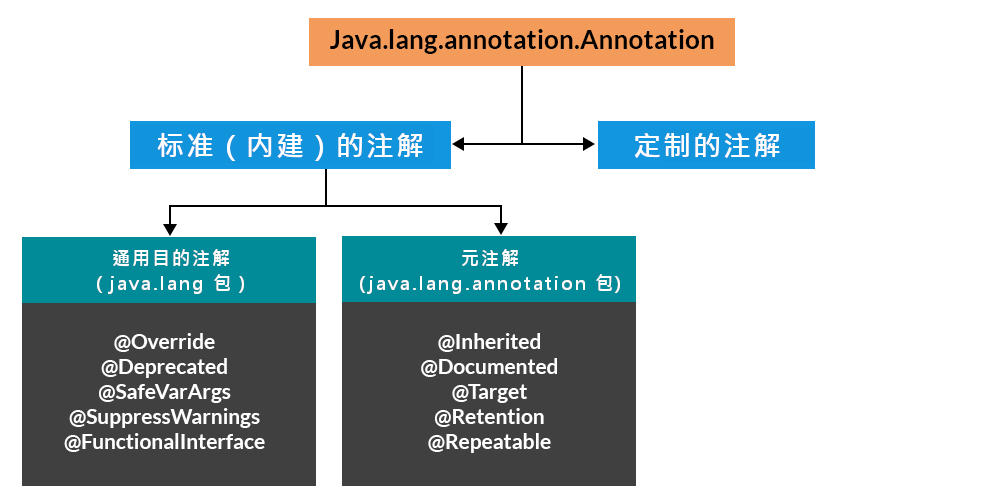
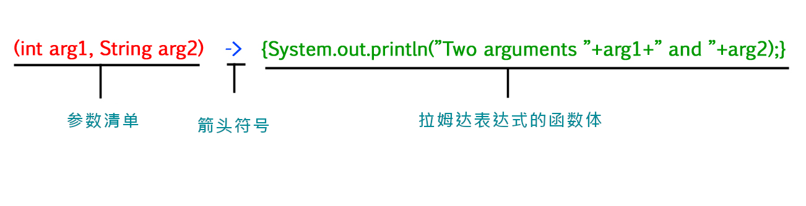

# 附录B：其他特性

## 注解语法

**Annotations**

*注解*，是元数据的一种形式，提供了不作为程序本身部分的、有关程序的一些数据。注解对其所注解代码运作，并未直接影响（*Annotations*, a form of metadata, provide data about a program that is not part of the program itself. Annotations have no direct effect on the operation of the code they annotate）。

注解有着多种用途，这些用途中：

- **为编译器提供信息** -- 编译器可使用注解来探测错误或抑制告警信息（**Information for the compiler** -- Annotations can be used by the compiler to detect errors or suppress warnings）；
- **编译时与部署时的处理** -- 软件工具可对注解信息加以处理，从而生成代码、XML文件等等（**Compile-time and deployment-time processing** -- Software tools can process annotation information to generate code, XML files, and so forth）;
- **运行时的处理** -- 在运行时，可对一些注解进行检查（**Runtime processing** -- Some annotations are available to be examined at runtime）。

本课程解释了：

- [哪些地方可以使用注解语法](#where)、
- 如何运用注解语法、
- [Java 平台以及标准版（Standard Edtion, Java SE API）中有哪些可用的预定义好的注解类型（annotation types）](#predefined-annotation-types)、
- [类型注解如何与可插拔类型系统结合以编写出有着更强类型检查的代码](#type-annotations-and-pluggable-type-systems)，
- [以及怎样去实现重复性注解语法](#repeating-annotations)。

（This lesson explains where annotations can be used, how to apply annotations, what predefined annotation types are available in the Java Platform, Standard Edition(Java SE API), how type annotations can be used in conjuncton with pluggable type systems to write stronger type checking, and how to implement repeating annotations.）

### <a id="annotations-basics"></a>注解语法基础

**Annotations Basics**

#### 注解语法的形式

**The Format of an Annotation**

注解语法的最简单形式，看起来像下面这样：

```java
@Entity
```

这个所在符号字符（`@`），是给编译器表明，接下来的是个注解。在下面的示例中，那个注解的名称为 `Override`:

```java
@Override
void mySuperMethod() {...}
```

注解可以包含 *元素（elements）*，元素可以是具名的或不具名的，同时存在着这些元素的值：

```java
@Author (
    name = "Benjamin Franklin",
    date = "3/27/2003"
)
class myClass {...}
```

或者：

```java
@SuppressWarnings (value = "unchecked")
void myMethod() {...}
```

在仅有一个名为 `value` 的元素时，那么元素名称是可以省略的，就像这样：

```java
@SuppressWarnings ("unchecked")
void myMethod () {...}
```

在注解没有元素时，那么那对括号是可以省略的，就如同在上面的 `Override` 示例中那样。

在同一声明上，使用多个注解也是可能的：

```java
@Author (name = "Jane Doe")
@EBook
class MyClass {...}
```

在若干注解有着同样类型时，此时就叫重复注解（a repeating annotation）：

```java
@Author(name = "Jane Doe")
@Author(name = "John Smith")
class MyClass {...}
```

从 Java SE 8 发布才开始支持重复注解。更多的有关情况，请参考 [重复注解](#repeating-annotations)

注解类型（a Annotation Type）可以是定义在 Java SE API 的 `java.lang` 或 `java.lang.annotation` 包中类型之一。在上面的示例中，`Override`与 `SuppressWarnings`，就是 [预定义的Java 注解（predefined Java annotations）](#predefined-annotation-types)。定义自己的注解类型，也是可能的。前面示例中的 `Author` 与 `EBook` 就属于自定义注解类型。

#### <a id="where"></a>哪些地方可以使用注解语法

可在将注解应用在各种声明上：类、字段、方法，以及其他一些程序元素的声明。当在某个声明上运用了注解语法时，依照约定，每条注解常常占据自己的一行。

自Java SE 8 发布开始，注解语法还可应用到类型的 *运用*。下面是一些示例：

- 应用到类实例的创建表达式：

```java
new @Interned MyObject();
```

- 类型强制转换：

```java
myString = (@NonNull String) str;
```

- `implements` 子语句（`implements` clause）：

```java
class UnmodifioableList<T> implements
    @Readonly List<@Readonly T> {...}
```

- 抛出异常的声明（Thrown exception declarations）：

```java
void monitorTemperature() throws
    @Critical TemperatureException {...}
```

这种形式的注解，叫做 *类型注解（a type annotation）*。有关类型注解的更多信息，请参考 [类型注解与可插拔类型系统（Type Annotations and Pluggable Type Systems）](#type-annotations-and-pluggable-type-systems)。


### 注解类型的声明

**Declaring a Annotation Type**

> **注**：除了 `java.lang` 和 `java.lang.annotations` 包中预定义的注解类型，对应定制注解，均需先声明注解类型，才能使用该注解类型下的注解实例。所有注解类型，都是特殊的接口，类型为 `@interface`。

许多的注解，在代码中都是起到替代注释的作用。

设想某个软件团队，他们在编写所有类的代码体时，传统上都是以提供这些类重要信息的注释开始的：

```java
public class Generation3List extends Generation2List {
    // Author: John Doe
    // Date: 3/17/2002
    // Current revision: 6
    // Last modified: 4/12/2004
    // By: Jane Doe
    // Reviewers: Alice, Bill, Cindy
    
    // 真正的类代码从这里开始
}
```

而要以注解来加入这些同样元数据，就必须首先定义出这个 *注解类型（annotation type）*。定义此注解类型的语法为：

```java
@interface ClassPreamble {
    String author();
    String date();
    int currentVersion() default 1;
    String lastModified() default "N/A";
    String lastModifiedBy() default "N/A";
    // 注意下面这个使用到数组
    String[] reviewers();
}
```

这个注解类型定义，看起来类似于接口定义，其中关键字 `interface` 前面冠以了位处符号（`@`）（当这个位处符号是在注解类型中时，就等于位处`AT`）。所有注解类型，都属于 *接口* 的一种形式，[本课程稍后](Ch08_Interfaces_and_Abstract_Classes.md#interface_rescue)会讲到这一点。此刻还不需要掌握什么是接口。

上面注解定义的代码体，包含了 *注解类型元素（annotation type element）* 的一些声明，这些什么看起来很像是一些方法。请留意这些注解类型元素，可定义一些可选的默认值。

在注解类型定义好之后，带上填入的各个取值，就可以使用那种类型的注解了，如同下面这样：

```java
@ClassPreamble {
    author = "John Doe",
    date = "3/17/2002",
    currentRevision = 6,
    lastModified = "4/12/2004",
    lastModifiedBy = "Jane Doe",
    // 请注意这里的数组注解
    reviewers = {"Alice", "Bob", "Cindy"}
}
public class Generation3List extends Generation2List {
    // 类的代码从这里开始
}
```

> **注意**：为了让 `@ClassPreamble` 中的信息，在 `Javadoc` 所生成的文档中出现，那么就必须以 `@Documented` 注解，来对 `@ClassPreamble` 的定义进行注解（To make the information in `@ClassPreamble` appear in `Javadoc-generated` documentation, you must annote the `@ClassPreamble` definition with the `@Documented` annotation）：

```java
// 为使用 @Documented 注解类型，就要导入该包
import java.lang.annotation.*;

@Documented
@interface ClassPreamble {
    // 那些注解元素的定义
}
```

### <a id="predefined-annotation-types"></a>Java中预定义的注解类型

**Predefined Annotation Types**

在 Java SE API 中，预先定义了一些注解类型。其中一些为Java编译器使用到，另一些是应用到别的注解的。

#### Java语言用到的注解类型

**Annotation Types Used by the Java Language**

在包 `java.lang` 中预定义的注解类型为：`@Deprecated`、`@Override`及 `SuppressWarnings`。

- **`@Deprecated`** `@Deprecated` 注解表明其所标记的元素，是 *已弃用的* 且不应再被使用。在程序使用了带有 `@Deprecated` 注解的方法、类或字段（实例变量）时，编译器就会生成一条告警信息。而在某个元素为已被弃用时，就应像下面这个示例一样，使用 `Javadoc` 的 `@deprecated` 标签，将其在文档中记录下来。在`Javadoc`的注释中，和在注解语法中同时使用位处符号（`@`）的做法，并非巧合：`Javadoc`与注解语法，在概念上是有关联的。同时，请留意`Javadoc`的标签是以小写的 *`d`* 打头的，而注解语法是以大写的 `D` 打头的。

```java
    // 接下来是 Javadoc 的注释
     /**
      * @deprecated
      * 给出了为何这个方法被弃用的解释
      */
     @Deprecated
     static void deprecatedMethod() {}
}
```

> **注意**：[deprecated method not mentioned in javadoc](https://stackoverflow.com/questions/40969698/deprecated-method-not-mentioned-in-javadoc)
> `javadoc`默认只收集 `public` 或 `protected` 元素的文档。

- **`@Override`** `@Override` 注解告诉编译器，该元素是要重写在某个超类中声明的元素。在 [继承与多态机制](Ch07_Inheritance_and_Polymorphism_Better_Living_in_Objectville.md) 中讨论了方法的重写。

```java
// 将方法标记为一个已被重写的超类方法
@Override
int overriddenMethod () {}
```

尽管在重写某个方法时，并不要求使用这个注解，不过这样做可以防止错误发生。在某个以 `@Override` 标记的方法，未能正确重写其超类的某个方法时，编译器就会生成一个错误消息。

- **`@SuppressWarnings`** `@SuppressWarnings` 注解，告诉编译器要抑制一些本来会生成的告警信息。在下面的示例中，使用了某个已被弃用的方法，进而编译器一般会生成一条告警信息。不过在此实例中，由于这个注解，而导致该告警信息被抑制下来了。

```java
// 这里使用了一个已被弃用的方法，并告诉编译器不要生成一条告警消息
@SuppressWarnings ("deprecation")
void useDeprecatedMethod () {
    // 这里的已被弃用告警，就被抑制了
    objectOne.deprecatedMethod();
}
```

所有编译器告警，都是属于某个类别的。Java 语言规范（The Java Language Specification）列出了两个类别：`deprecation` 与 `unchecked`。在碰到那些引入 [泛型](Ch16_Collections_and_Generics_Data_Structure.md) 之前所编写的老旧代码时，其中的 `unchecked` 告警便会出现。要将这多个类别的告警给抑制掉，就要使用下面的语法：

```java
@SuppressWarnings({"unchecked", "deprecation"})
```

- **`@SafeVarargs`** 在对某个方法或构造器应用 `@SafeVarargs` 注解时，就假定了代码不会在其 `varargs` 实参上，执行潜在不安全的操作。在使用了此注解类型时，那些未受检查的、与 `varargs` 有关的告警，就会被抑制（`@SafeVarargs` annotation, when applied to a method or constructor, asserts that the code does not perform potentially unsafe oprations on its `varargs` parameter. When this annotation type is used, unchecked warnings relating to `varargs` are suppressed）。
- **`@FunctionalInterface`** `@FunctionalInterface` 注解，是在 Java SE 8 中引入的，表示其所注解的类型声明，是计划作为Java语言规范中所定义的功能性接口（`@FunctionalInterface` annotation, introduced in Java SE 8, indicates that the type declaration is intended to be a functional interface, as defined by the Java Language Specification）。

#### 适用于其他注解的注解

**Annotations That Apply to Other Annotations**

适用于其他注解的注解，叫做 *元注解（meta-annotations）*。在 `java.lang.annotation` 包中，定义了若干元注解类型。

- **`@Retention`** `@Retention` 注解指定了所标记的那些注解该如何存储（`Retention` annotation specifies how the marked annotation is stored）:
- **`@Documented`** `@Documented` 注解表示不论指定注解在何时被使用到，那些元素都应使用 `Javadoc` 工具以文档化处理。（默认情况下，注解是没有包含在 `Javadoc` 中的。`@Documented` annotation indicates that whenever the specified annotation is used those elements should be documented using the `Javadoc` tool）。有关 `Javadoc` 的更多信息，请参考 [`Javadoc` 工具部分](#javadoc-tool)。
+ **`Target`** `Target` 注解对另一注解进行标记，以限制所标记的注解可适用的Java元素种类。`@Target` 注解，会将以下的一些元素类型，指定为他的取值：

    - `ElementType.ANNOTATION_TYPE` - 被 `@Target` 注解标记的注解可适用于另一注解类型；
    - `ElementType.CONSTRUCTOR` - 被其标记的注解可适用于构造器；
    - `ElementType.FIELD` - 可适用于字段或属性；
    - `ElementType.LOCAL_VARIABLE` - 可适用于本地变量；
    - `ElementType.METHOD` - 可适用于方法级别的注解；
    - `ElementType.PACKAGE` - 可适用于包的声明；
    - `ElementType.PARAMETER` - 可适用于方法的参数；
    - `ElementType.Type` - 可适用于类的任意元素。

- **`@Inherited`** `@Inherited` 注解表示其所标记的注解类型，可从超类继承到（`@Inherited` annotation indicates that the annotation type can be inherited from the super class）。（默认是不可以从超类继承的。）在用户查询某个注解类型，而该类又没有这个类型的注解时，那么就会对这个类的超类查询此注解类型。此注解仅适用于类的声明。
- **`@Repeatable`** `@Repeatable` 注解，是在Java SE 8 中引入的，表示所其所标记的注解，可多次应用到同意声明或类型用途。更多的有关信息，请参阅 [重复注解（Repeating Annotations）](#repeating-annotations)。

### <a id="type-annotations-and-pluggable-type-systems"></a>类型注解与可插拔类型系统

**Type Annotations and Pluggable Type Systems**

在 Java SE 8 发布之前，注解只能适用于声明。而自Java SE 8 发布开始，注解就还可以适用到任何 *类型用途（type use）* 了。这意味着在所有用到类型的地方，都可以使用注解。有用到类型之处的一些示例，包括类实例创建表达式（`new`）、类型转换（casts）、`implements` 子语句，以及 `throws` 子语句等。这种形式的注解，被称为 *类型注解（type annotation）*，在之前的 [注解基础](#annations-basics)那里，给出了几个示例。

之所以创建出这些类型注解，是为了以确保以更强大的类型检查方式，支持对Java程序的分析。Java SE 8发布，并未提供类型检查框架，不过Java SE 8 是允许编写（或下载）作为一个或多个可插拔式模组实现的、与Java 编译器结合使用的类型检查框架的（Type annotations were created to support improved analysis of Java programs way of ensuring stronger type checking. The Java SE 8 release does not provide a type checking framework, but it allows you to write(or download) a type checking framework that is implemented as one or more pluggable modules that are used in conjunction with the Java compiler）。

比如，在想要程序中某个特定变量绝不被赋值 `null`，以期望避免触发 `NullPointerException`。那么就可以编写一个定制的插件，来对此进行检查。随后就要对代码进行修改，来对那个特定变量进行注解，从而表明其绝不会被赋值 `null`。此变量声明看起来将像这样：

```java
@NonNull String str;
```

在编译此代码时，就要在命令行包含进 `NonNull` 模组，那么编译器在探测到潜在问题时，就会打印出告警信息，进而允许对代码加以修改，以避免错误。在纠正了代码而消除了全部告警之后，在程序运行期间这特定错误便不再会出现了。

可使用多个类型检查模组（multiple type-checking modules），其中各个模组对不同类别多维进行检查。这样的话，就可以在Java类型系统之上进行构建，在需要这些特定类型检查的各个时间点、位置，按需添加这些类型检查。

明智地使用类型注解，加上可插拔类型检查器（pluggable type checkers）的存在，那么就可以编写出更加强大又不会出错的代码了。

在许多情形中，是不必编写自己的类型检查模组的。有很多第三方以及完成了这方面的工作。比如，或许会利用到华盛顿大学所创建的检查器框架 `Checker Framework`。该框架就包含了`NonNull` 模组，还有正则表达式模组（a regular module），以及互斥锁（a mutex lock module）。更多有关该检查器框架的信息，请参考 [检查器框架](https://checkerframework.org/)。

### <a id="repeating-annotations"></a>重复注解

**Repeating Annotations**

有些情况下，会希望将同一注解应用到声明或类型运用（a declaration or type use）。自Java SE 8 发布开始，*重复注解* 才支持该特性。

比如正在编写要用到定时器服务，来实现在给定时间或以某个特定时间表，去运行某个方法，类似于 UNIX 的 `cron` 服务的代码。那么就要设置一个定时器，来在一个月的最后一天，及每个周五晚上11点运行一个方法，`doPeriodicCleanup`。那么就要设置定时器运行，创建一个 `@Schedule` 注解，并将其两次应用到 `doPeriodicCleanup` 方法。第一次的使用，指定一个月的最后一天，同时第二次指定周五晚上11点，就跟下面的代码示例一样：

```java
@Schedule(dayOfMoth="last")
@Schedule(dayOfWeek="Fri", hours="23")
public void doPeriodicCleanup() {...}
```

上面这个示例，是将注解应用到方法。可在任何会用到标志注解的地方，对某个注解加以重复。比如，有着一个处理未授权访问异常的类。就可以对这个类注解上一个针对那些管理者的 `@Alert` 的注解，和一个针对系统管理员的 `@Alert`：

```java
@Alert(role="Manager")
@Alert(role="Administrator")
public class UnauthorizedAccessException extends SecurityException {...}
```

由于兼容性的原因，重复注解是被保存在由Java编译器自动生成的 *容器注解（container annotation）* 中的。为了让编译器完成此操作，就要求在代码中包含下面这两个声明。

#### 步骤一、声明一个 `Repeatable` 类型的注解类型

**Step 1: Declare a `Repeatable` Annotation Type**

该注解类型必须被 `@Repeatable` 元注解（the `@Repeatable` meta-annotation）标记。下面的示例定义了一个定制的 `@Schedule` 可重复注解类型：

```java
import java.lang.annotation.Repeatable;

@Repeatable(Schedules.class)
public @interface Schedule {
    String dayOfMonth() default "first";
    String dayOfWeek() default "Mon";
    int hour() default 12;
}
```

那个 `@Repeatable` 元注解的取值，即在括号里的那个，即为Java编译器生成的、用于存储重复性注解的容器注解的类型（The value of the `@Repeatable` meta-annotation, in parentheses, is the type of the container annotation that the Java compiler generates to store repeating annotations）。在此示例中，那个容纳注解类型，即是 `Schedules`，那么重复性的 `@Schedule` 注解，就是存储在一个 `@Schedules` 的注解中的。

在没有首先将某个注解声明未可重复注解的情况下，将同一注解应用到某个声明，就会导致一个编译器错误。

#### 步骤二、声明出那个容纳注解类型

**Step 2: Declare the Containing Annotation Type**

容纳性注解类型，必须有着一个数组类型的 `value` 元素。该数组类型的组件类型，则必须时那个可重复注解类型。这个 `@Schedules` 容纳性类型的声明，就是下面这样：

```java
public @interface Schedules {
    Schedule[] value();
}
```

### 注解的获取

**Retrieving Annotations**

反射式API中，有着多个可用于获取到注解的方法。这些方法返回单个的、譬如`AnnotatedElement.getAnnotation(Class<T>)`这样的注解的表现，与存在 *一个* 这些方法所请求类型注解，而仅返回返回单个注解相比，是不会发生变化的（The behavior of the methods that return a single annotation, such as `AnnotatedElement.getAnnotation(Class<T>)`, are unchanged in that they only return a single annotation if *one* annotation of the requested type is present）。但若存在多个的所请求类型的注解时，那么就可以首先获取到这些注解的容器。这样的话，那些老旧代码会继续工作。在Java SE 8中引入的其他一些方法，则会对容器注解进行全面扫描，从而一次性返回多个注解，就如同 `AnnotatedElement.getAnnotationsByType(Class<T>)`那样。请参考 [`AnnotatedElement`](https://docs.oracle.com/javase/8/docs/api/java/lang/reflect/AnnotatedElement.html) 类规格，以了解有关全部方法的信息。

### 设计上的考量

**Design Considerations**

在设计某个注解类型时，必须考虑到那个类型下注释的 *基数（cardinality）*。目前会用到这个注解 0 次、1 次都是可能的，而在这个注释被标记为了 `@Repeatable` 时，那么就可以多次使用了。同时通过使用 `@Target` 元注解，还可以限制注解可用在何处。比如，即可创建一个可重复的、仅可用在方法及字段上的注解类型。为确保 *用到* 你所设计注解类型注解的程序员，发现他是灵活且强大的，那么就要仔细的加以设计（It is important to design your annotation type carefully to ensure the programmer *using* the annotation finds it to be as flexible and powerful as posssible）。

### 提问与练习：注解

#### 问题❓

1. 下面这个接口什么错了？

    ```java
    public interface House {
        @Deprecated
        public void open();
        public void openFrontDoor();
        public void openBackDoor();
    }
    ```

2. 试想对问题 1 中所给的 `House` 接口的下面这个实现：

    ```java
    public class MyHouse implements House {
        public void open () {}
        public void openFrontDoor () {}
        public void openBackDoor() {}
    }
    ```

    那么在编译这个程序时，由于这里的 `open` 是已被弃用的（在上面的接口中），那么编译器就会产生一条告警消息。该怎样来处理掉那条告警消息呢？

3. 下面的代码在编译时将不会出错吗？为什么不会出错，或者说为什么会出错呢？

    ```java
    public @interface Meal {...}

    @Meal("breakfast", mainDish="cereal")
    @Meal("lunch", mainDish="pizza")
    @Meal("dinner", mainDish="salad")
    public void evaluateDiet() {...}
    ```

#### 练习🏋️

1. 请定义出一个带有元素 `id`、`synopsis`、`engineer` 及 `date`的、用于一项增强请求的注解类型。将其中 `engineer` 与 `date` 的默认值，分别指定为 `unassigned`和`unknown`（define an annotation type for an enhancement request with elements `id`, `synopsis`, `engineer`, and `date`. Specify the default value as `unassigned` for engineer and `unknown` for date）。


<details>
    <summary>答案🙋</summary>

#### 问题

1. __答案__：文档应当体现出为何 `open` 被弃用，以及应当用什么来代替他。比如：

    ```java
    public interface House {
        /**
         * @deprecated 对 open 方法的使用是不鼓励的，请使用
         * openFrontDoor 或 openBackDoor 予以代替。
         *
         */
        @Deprecated
        public void open();
        public void openFrontDoor();
        public void openBackDoor();
    }
    ```

2. __答案__ ：可给 `open` 方法的实现加上弃用注解（you can deprecate the implementation of `open`）：

    ```java
    public class MyHouse implements House {
        // 文档是从接口继承到的。
        @Deprecated
        public void open() {}
        public void openFrontDoor() {}
        public void openBackDoor() {}
    }
    ```

    或者，可抑制告警信息：

    ```java
    public class MyHouse implements House {
        @SuppressWarinings("deprecation")
        public void open() {}
        public void openFrontDoor() {}
        public void openBackDoor() {}
    }
    ```

3. __答案__ ：此代码将编译失败。在JDK 8之前，是不支持可重复注解的。即便是在 JDK 8 中，由于其中的 `Meal` 注解类型，未被定义为可重复，因此该代码仍会编译失败。可通过加上 `@Repeatable` 元注解，并定义一个容器注解类型，来修复这个问题：

    ```java
    public class AnnotationTest {
        public @interface MealContainer {
            Meal[] value();
        }

        @java.lang.annotation.Repeatable(MealContainer.class)
        public @inerface Meal {
            String value();
            String mainDish();
        }

        @Meal(value="早餐", mainDish="麦片")
        @Meal(value="午餐", mainDish="披萨")
        @Meal(value="晚餐", mainDish="沙拉")
        public void evaluateDiet() {}
    }
    ```

#### 练习

1.  __答案__ : 

    ```java
    /**
     * 这里的注释，对这个增强请求
     * （the Request-for-Enhancement, RFE）注解
     * 类型，进行了描述。
     */
    public @interface RequestForEnhancement {
        int id();
        String synopsis();
        String engineer() default "[unassigned]";
        String date() default "[unknown]";
    }
    ```

</details>


## 另一个注解教程

> *引用自*：[Annotations in Java](https://www.geeksforgeeks.org/annotations-in-java/)

注解用于提供程序的补充信息（Annotations are used to provide supplemental information about a program）。

- 注解以 `@` 开头；
- 注解不会改变已编译好的程序的行为；
- 注解帮助将一些 *元数据*（信息）与实例变量、构造器、方法、类等的程序元素关联起来（Annotations help to associate *metadata*(infomation) to the program elements i.e. instance variables, constructors, methods, classes, etc.）；
- 由于注解能够改变编译器对待程序的方式，因此注解并非纯粹的注释。请参阅下面的代码；
- 大体上注解是用于提供额外信息的，因此可作为 XML 与一些 Java 标记性接口的替代。

### Java 中注解的继承层次



*图 1 - Java 注解继承层次*


**实操（Implementation）**：

> ***注意**：由于这里提到了重写（override），但并未进行重写，而是对 `display` 方法进行了过载（overloaded），因此这里会抛出编译器错误*。

```java
// 用于演示注解并非仅仅是代码注释的 Java 程序。

package com.xfoss.Annotations;

// 第一个类
class Base {

    // 方法
    public void display ()
    {
        System.out.println("类 Base 的 display()");
    }
}

// 第二个类
// 是主类（Main Class）
public class Derived extends Base {

    // 对上面那个类中已有的方法进行重写
    @Override public void display (int x)
    {
        // 在调用这个方法时运行的打印语句
        System.out.println("派生的 sisplay()");
    }

    // 第二个方法
    // 这是主驱动类方法（main driver method）
    public static void main (String args[])
    {
        // 在 main() 方法中创建出这个类的对象
        Derived obj = new Derived();

        // 在 main() 方法中调用 display() 方法
        obj.display();
    }
}
```

**输出**:

```console
.../src/main/java/com/xfoss/Annotations/Derived.java:13: error: method does not override or implement a method from a supertype
    @Override public void display(int x)
    ^
    1 error

FAILURE: Build failed with an exception.
```

只需将参数 `(int x)` 移除或移除 `@Override`，程序就会正常编译。

### 注解分类（Categories of Annotations）

如下所示，粗略地划分，有着 5 个类别的注解：

1. 标记型注解（marker Annotations）

2. 单一取值型注解（single value Annotations）

3. 完整注解（full Annotations）

4. 类型注解（type Annotations）

5. 重复型注解（repeating Annotations）

下面将逐一讨论这些类别的注解，并在需要的地方附带上示例代码。

### 类别一：标记型注解

其唯一目的就是对某个声明进行标记。这类注解不包含成员，进而也没有任何数据。因此，他们作为注解而存在就足够了（Thus, its presence as an annotation is sufficient）。由于这类标记型接口不包含成员，那么仅仅确定它是存在还是不存在就已足够。

`@Override` 就是标记型注解的一个例子。

**示例**

```java
@TestAnnotation()
```

### 类别二：单一取值型注解

这类注解仅包含一个成员，进而允许简写形式的对该成员取值的指定（These annotations contain only one member and allow a shorthand form of specifying the value of the member）。在应用到此类型注解时，就只需指定那个成员的值，而无需指定该成员的名称。然而，为了用上这种简写，其成员的名称必须是 `value`。

**示例**

```java
@TestAnnotation("testing")
```

### 类别三： 完整注解

这类注解包含了多个数据成员、名称、取值、成员取值对（These annotations consist of multiple data members, names, values, pairs）。

**示例**

```java
@TestAnnotation(owner="Rahul", value="Class Geeks")
```

### 类别四：类型注解

这类注解可应用到任何用到类型的地方（These annotations can be applied to any place where a type is being used）。比如，可对某个方法的返回值类型进行注解。这些注解在声明时，就已被 `@Target` 注解过了（These are declared annotated with `@Target` annotation）。

**示例**


```java
package com.xfoss.Annotations;

import java.lang.annotation.ElementType;
import java.lang.annotation.Target;

@Target(ElementType.TYPE_USE)
@interface TypeAnnoDemo {}

public class GFG {
    public static void main (String args[])
    {
        @TypeAnnoDemo String string = "我已被某个类型注解给注解过了";
        System.out.println(string);
        abc();
    }

    static @TypeAnnoDemo int abc ()
    {
        System.out.println("此函数的返回值类型已被注解过了");
        return 0;
    }
}
```

**输出**

```console
我已被某个类型注解给注解过了
此函数的返回值类型已被注解过了
```

### 类别五：重复性注解

这类注解可多次应用到单个项目（these are the annotations that can be applied to a single item more than onece）。注解要能够可重复，其所属类型就必须被 `@Repeatable`注解给注解过，而`@Repeatable`则是在 `java.lang.annotation`包中定义的元注解。`@Repeatable`对某个注解类型进行注解时，他的`value`字段指定了被注解的可重复注解类型的 **容器类型（container type）**。而 **容器的指定，是指`value`字段是该可重复注解类型的数组的一个注解（the container is specified as annotation whose `value` field is an array of the repeatable annotation type）**。因此，要创建可重复注解，首先就要创建容器注解，进而将创建出的容器注解类型，作为参数指定给那个 `@Repeatable` 注解（也就是说元注解`@Repeatable` 是有参数的）。

**示例**

```java
package com.xfoss.Annotations;

import java.lang.annotation.*;
import java.lang.reflect.Method;

@Retention(RetentionPolicy.RUNTIME)
@Repeatable(MyRepeatedAnnos.class)
@interface Word
{
    String word() default "Hello";
    int value() default 0;
}

@Retention(RetentionPolicy.RUNTIME)
@interface MyRepeatedAnnos
{
    Word[] value();
}

public class Main {

    // 注意：这里初始化 @Word 类型的注解时：
    //      1. 不能使用非静态实例变量。这个注解的初始化，是属于其
    // 所注解的静态方法 newMethod() 的上下文的；
    //      2. 也不能使用静态实例变量。“element value must be a 
    // constant expression”，因此只能使用静态 final 的常量。
    @Word(word = "First", value = 1)
    @Word(word = "Second", value = 2)
    public static void newMethod()
    {
        Main obj = new Main();

        try {
            Class<?> c = obj.getClass();

            Method m = c.getMethod("newMethod");

            Annotation anno = m.getAnnotation(MyRepeatedAnnos.class);
            System.out.println(anno);
        }
        catch (NoSuchMethodException e) 
        {
            e.printStackTrace();
        }
    }

    public static void main(String[] args) { newMethod(); }
}
```

**输出**

```console
@com.xfoss.Annotations.MyRepeatedAnnos(value={@com.xfoss.Annotations.Word(word="First", value=1), @com.xfoss.Annotations.Word(word="Second", value=2)})
```

### 预定义/标准注解

**Predefined/Standard Annotations**

如同在上面的继承层次图中看到的那样，Java 普遍定义了 7 个内建注解。

- 其中四个是从 `java.lang.annotation` 包导入的：`@Rentention`、`@Documented`、`@Target` 与 `@Inherited`；
- 另外三个包含在 `java.lang` 包中：`@Deprecated`、`@Override` 和 `@SuppressWarnings`。

**注解一：`@Deprecated`**

- 这是个标记型注解。他表明某个声明已作废，而已被更新的形式所取代；
- 在某个元素已被启用时，那么还应同时使用 `Javadoc` 的 [`@deprecated` 标签](http://docs.oracle.com/javase/1.5.0/docs/guide/javadoc/deprecation/deprecation.html#javadoc_tag]；
- `@deprecated` 标签用于文档，而`@Deprecated` 注解则是用于运行时反射（runtime reflection）；
- 在同时使用到 `@deprecated` 标签和 `@Deprecated` 注解时，前者有着更高的优先级。

**示例**

```java
package com.xfoss.Annotations;

public class DeprecatedTest {
    @Deprecated
    public void Display()
    {
        System.out.println("Deprecatedtest display()");
    }

    public static void main(String args[])
    {
        DeprecatedTest d1 = new DeprecatedTest();
        d1.Display();
    }
}
```

**输出**

```console
Deprecatedtest display()
```

> **注**：该程序在编译时，会报出以下错误：

```console
注: .../src/main/java/com/xfoss/Annotations/AnnotationTestDrive.java使用或覆盖了已过时的 API。
```

**注解二：`@Override`**

这是个只能用在方法上的标记型注解。被 `@Override` 注解过的方法，必须对来自超类的某个方法进行重写。若被注解的方法没有这样做，那么就会导致一个编译时错误。使用这个注解来确保某个超类方法真的被重写了，而非简单地被过载（overloaded）。

**示例**

```java
package com.xfoss.Annotations;

class BaseCls
{
    public void Display()
    {
        System.out.println("BaseCls diplay()");
    }

    public static void main(String args[])
    {
        BaseCls t1 = new DerivedCls();
        t1.Display();
    }
}

class DerivedCls extends BaseCls 
{
    @Override
    public void Display()
    {
        System.out.println("DerivedCls display()");
    }
}
```

**输出**

```console
DerivedCls display()
```

**注解三：`@SuppressWarnings`**

使用 `@SuppressWarnings` 注解来告诉编译器，对特定编译器告警加以抑制。通过字符串形式的告警名称，来指定要抑制的告警。这种类型的注解，可应用到全部类型的声明。

Java 将告警分组成两个类别。分别是 `deprecated` 与 `unchecked`。在老旧代码碰到使用了泛型的代码时，就会生成`unchecked`的告警（Any `unchecked` warning is generated when a legacy code interfaces with a code that uses generics）。

**示例**

```java
// 用于演示 SuppressWarnings 注解的 Java 程序
package com.xfoss.Annotations;

// 类 1
class DeprecatedTest
{
    @Deprecated
    public void Display()
    {
        System.out.println("Deprecated display()");
    }
}

// 类 2
public class SuppressWarningTest
{
    // 若将下面的注解注释掉，那么程序就会产生告警
    @SuppressWarnings({"checked", "deprecation"})
    public static void main(String args[])
    {
        DeprecatedTest d1 = new DeprecatedTest();
        d1.Display();
    }
}
```

**输出**

```console
Deprecated display()
```


**注解 4：`@Documented`**

这是一个告诉工具某个注解将要被编写文档的标记型接口。注解不会被包含进 `Javadoc` 的注释中（it is a marker interface that tells a tool that an annotation is to be documented. Annotations are not included in `Javadoc` comments）。`@Documented` 注解在代码中的使用，会开启诸如 `Javadoc` 这样的工具对其的处理，并将注解类型信息，包含进生成的文档中。


**注解 5：`@Target`**

这个注解设计只被用作给另一注解当注解（元注解，*meta annotation*）。`@Target` 会取一个参数，而该参数必须是来自`ElementType`枚举类型（`java.lang.annotation.ElementType`）的常量。该参数指定了被 `@Target`注解的注解，可应用到那些类型的声明上。下面给出了`ElementType`枚举类型所包含的常量，以及他们各自所对象的声明类型。

| `@Target` 常量 | 可应用到的注解 |
| :- | :- |
| `ANNOTATION_TYPE` | 另一注解 |
| `CONSTRUCTOR` | 构造器 |
| `FIELD` | 字段（实例变量） |
| `LOCAL_VARIABLE` | 本地变量 |
| `METHOD` | 方法 |
| `PACKAGE` | 包 |
| `PARAMETER` | 方法的参数 |
| `TYPE` | 类、接口或枚举（Class, Interface, or enumeration） |

*表一, `ElementType` 枚举类型下的各个常量*

可在 `@Target` 注解中指定一个或多个的这些值。在指定多个值时，就必须将这些值指定在一个大括号分隔的清单中（To specify multiple values, we must specify them within a braces-delimited list）。比如，可使用这个 `@Target` 注解：`@Target({ElementType.FIELD, ElementType.LOCAL_VARIABLE})` 来指定某个注解只应用到字段及本地变量。

**`@Rentention` 注解**

这个注解确定了其所注解的注解，应保留在何处及保留多长时间（it determines where and how long the annotation is retent）。`@Rentention` 注解可以有三个取值：

- **`SOURCE`**: 注解将保留在源代码级别，并被编译器所忽略；
- **`CLASS`**：注解将保留在编译时，并被 JVM 所忽略；
- **`RUNTIME`**：这些注解将保留在运行时。

**注解 7：用户定义（定制）注解**

用户定义注解可用于对程序元素，比如变量、构造器、方法等进行注解。这些注解可应用在紧接着元素声明（构造器、方法、类等等）开始的地方。

**语法**：声明

```java
[Access Specifier] @interface<AnnotationName>
{
    DataType <Method Name>() [default value];
}
```

在实现用户定义注解之前，请将以下各个要点，作为定制注解的重要原则（Do keep these certain points as rules for custom annotations before implementing user-defined annotations）。

1. `AnnotationName` 是个接口；
2. 该参数不应与那些方法声明相关联，且在方法声明上不应使用 `throws` 子语句（the parameter should not be associated with method declarations and `throws` clause should not be used with method declaration）；
3. 其中的参数，将不会`null` 值，但可以有默认值；
4. `default` 值是可选的；
5. 其中的方法返回值类型，应是原生值、枚举、字符串、类名称，或者原生值、枚举、字符串或类名称等类型的数组（the return type of method should be either primitive, enum, string, class name, or array of primitive, enum, string, or class name type）。

**示例**：

```java
package com.xfoss.Annotations;

import java.lang.annotation.*;

@Documented
@Retention(RetentionPolicy.RUNTIME)
@interface TestAnnotation
{
    String Developer() default "Lenny";
    String Expirydate();
}

public class Test
{
    @TestAnnotation(Developer="Echo", Expirydate="01-10-2020")
    void fun1()
    {
        System.out.println("测试方法 1");
    }

    @TestAnnotation(Developer="Anil", Expirydate="01-10-2020")
    void fun2()
    {
        System.out.println("测试方法 2");
    }

    public static void main(String args[])
    {
        System.out.println("你好");
    }
}
```

**输出**：

```console
你好
```

## <a id="lambda-expressions"></a>拉姆达 Lambda 表达式

**Java 8 中的 Lambda 表达式（Lambda Expressions in Java 8）**

拉姆达表达式本质上是 [功能接口(functioal interface)](#functional_interface) （带有单个抽象方法的接口，被称为功能接口。`java.lang.Runnable` 即是功能接口的一个示例）的表征。拉姆达表达式实现的是唯一抽象方法，进而因此实现的是功能接口。拉姆达表达式是在 Java 8 中加入的特性，从而提供了以下的这些功能。

- 实现了将功能作为方法参数的处理，或者说将代码当作数据的处理（enable to treat functionality as a method argument, or code as data）；
- 可创建出不属于任何类的函数（a function can be created without belonging to any class）；
- 拉姆达表达式，可像对象一样传递，并在需要时被执行（a lambda expression can be passed around as if it was an object and executed on demand）。

```java
package com.xfoss.LambdaExpr;

interface FuncInterface
{
    void abstractFun(int x);

    default void normalFun()
    {
        System.out.println("你好");
    }
}

class Test
{
    public static void main(String args[])
    {
        FuncInterface fobj = (int x) -> System.out.println(2*x);

        fobj.abstractFun(5);
    }
}
```

**输出**：

```java
10
```



*图 2 - 拉姆达表达式*


**语法**：

```java
lambda operator -> body
```

其中拉姆达运算符（`lambda operator`）可以是：

- **零参数**：

```java
() -> System.out.println("零参数的拉姆达（Zero parameter lambda）")；
```

- **一个参数**：

```java
(p) -> System.out.format("一个参数：%s", p);
```

在那个变量的类型可从上下文推导出来时，那么小括号的使用就不是强制的（it is not mandatory to use parentheses, if the type of that variable can be inferred from the context）。

- **多个参数**：

```java
(p1, p2) -> System.out.format("多个参数：%s, %s", p1, p2);
```

请注意：拉姆达表达式恰如函数，他们跟函数一样接受参数（lambda expressions are just like functions and they accept parameters just like functions）。

```java
package com.xfoss.LambdaExpr;

import java.util.ArrayList;

class TestDrive
{
    public static void main(String args[]){

        ArrayList<Integer> arrL = new ArrayList<Integer>();
        for(int i = 1; i < 5; i++) arrL.add(i);

        arrL.forEach(n -> System.out.println(n));

        arrL.forEach(n -> {if(n%2 == 0) System.out.println(n);});
    }
}
```

**输出**：

```console
1
2
3
4
2
4
```

请注意拉姆达表达式 ***只可用于实现功能接口***。在上面的示例中同样是这样的，其中的拉姆达表达式实现的是 [消费者](https://docs.oracle.com/javase/8/docs/api/java/util/function/Consumer.html) 功能接口（Consumer Functional Interface）。

```java
// 用于对拉姆达表达式工作原理进行演示的 Java 程序
package com.xfoss.LambdaExpr;

public class LambdaExprDemo
{
    // 函数 operation 是使用拉姆达表达式实现的
    interface FuncInter1
    {
        int operation(int a, int b);
    }

    // 这里的 sayMessage() 也是使用拉姆达表达式实现的
    interface FuncInter2
    {
        void sayMessage(String message);
    }

    // 由这个具体的 operate 方法来完成 FuncInter1 中
    // 在 ‘a’ 与 ‘b’ 上的运算
    private int operate(int a, int b, FuncInter1 fobj)
    {
        return fobj.operation(a, b);
    }

    public static void main(String args[])
    {
        // 用于两个参数相加的拉姆达表达式
        // x 与 y 的数据类型是非必须的。
        // 该表达式实现了 'FuncInter1' 接口
        FuncInter1 add = (int x, int y) -> x + y;

        // 用于两个参数相乘的拉姆达表达式
        // 这个表达式同样实现了 'FuncInter1' 接口
        FuncInter1 multiply = (int x, int y) -> x * y;

        // 创建一个 LambdaExprDemo 的实力，来以 operate 的
        // 不同拉姆达表达式实现，对其进行调用
        LambdaExprDemo dobj = new LambdaExprDemo();

        // 使用拉姆达表达式，将两个数相加
        System.out.format("加法为 %d\n", dobj.operate(6, 3, add));

        // 使用拉姆达表达式，将两个数相乘
        System.out.format("乘法为 %d\n", dobj.operate(6, 3, multiply));

        // 单个参数的拉姆达表达式
        // 此表达式实现了 'FuncInter2' 接口
        FuncInter2 fobj = message -> System.out.format("你好 %s\n", message);

        fobj.sayMessage("极客");
    }
}
```

**输出**：

```console
加法为 9
乘法为 18
你好 极客
```

### 要点：

- 拉姆达表达式的函数体，可以包含零个、一个或更多的语句（the body of a lambda expression can contain zero, one or more statements）；
- 在只有单个语句时，花括号不是强制性的，同时该匿名函数的返回值类型与函数体表达式一致（when there is a single statement curly brackets are not mandatory and the return type of the anonymous function is the same as that of the body expression）；
- 在有多个语句时，那么这些语句就必须用花括号括起来（形成一个代码块），且该匿名函数的返回值类型，与由此代码块所返回的值类型一致，或者即为在未返回任何东西时的 `void`（when there are more than one statements, then these must be enclosed in curly brackets(a code block) and the return type of the anonymous function is the same as the type of the value return within the code block, or `void` if nothing is returned）。

## <a id="functional_interface"></a>功能接口

Java 永远是一种面向对象的编程语言（Java has forever remained an Object-Oriented Programming language）。而由于Java 是一种面向对象编程语言，那么就可以声称，除了一些原生数据类型，和一些为完整性与简单性目的而采用的原生方法外， Java 编程语言中所出现全部事物，都可以由对象来表达（by object-oriented programming language, we can declare that everything present in the Java programming language rotates throughout the Objects, except for some of the primitive data types and primitive methods for integrity and simplicity）。在称为 Java 的编程语言中，是没有任何单独函数的。Java 编程语言中的函数，都是某个类的组成部分，而若某人想要调用这些函数，那么他们就必须使用到类或类的对象，来调用这些函数。

**功能接口**是之只包含一个抽象方法的接口。他们可只有一项用于展示的功能。自Java 8 开始，就可以使用 [拉姆达表达式](#lambda-expressions) 来表示功能接口的实例了。功能接口可以有任意数量的默认方法（a functional interface can have any number of default methods）。***`Runnable`、`ActionListener`、`Comparable`*** 等都是功能接口的一些示例。

功能接口又被称为 **单一抽象方法接口（Single Abstract Method Interface）**。简称 **SAM 接口**。Java 中的功能接口，属于提供到用户基础编程手段的新特性（functional interfaces in Java are the new feature that provides users with the approach of fundamental programming）。

自Java SE 8 开始，与拉姆达表达式及方法引用一起，加入的功能接口，为的是令到代码更具可读性、更为干净和直观（functional interfaces are included in Java SE 8 with Lambda expressions and Method references in order to make code more readable, clean, and straightforward）。功能接口是那些确保精确地只包含一个抽象方法的接口。通过以 **名为 *`@FunctionalInterface`*** 加以注解的接口表示方式，来运用和执行功能接口（functional interfaces are used and executed by representing the interface with an **annotation called *`@FunctionalInterface`***）。如同先前所讲的那样，功能接口可只包含一个抽象方法。不过功能接口却可以包含任意数量的默认与静态方法。

在功能接口中，因为默认情况下，在接口内部定义的方法，只会是`abstract` 方法，因此使用关键字 `abstract` 就是，即无需使用关键字 `abstract`。同样也可以将拉姆达表达式，称为功能接口的实例。

在 Java 8 之前，就必须创建出匿名内部类的对象，或者必须要实现这些接口。

```java
// 用于演示功能接口的 Java 程序
package com.xfoss.FunctionalInterface;

class Test {
    public static void main(String args[]) {
        // 创建匿名内部类对象
        new Thread(new Runnable() {
            @Override public void run()
            {
                System.out.println("新的线程已创建");
            }
        }).start();
    }
}
```

**输出**：

```console
新的线程已创建
```

自 Java 8 开始，就可以像下面这样，将 [拉姆达表达式](#lambda-expressions) 赋值给其功能接口对象：

```java
// 用于演示使用了拉姆达表达式的功能接口实现的 Java 程序
package com.xfoss.FunctionalInterface;

class Test {
    public static void main(String args[]) {
        // 创建对象的拉姆达表达式
        new Thread( () -> {
                System.out.println("新的线程已创建");
        }).start();
    }
}
```

```console
新的线程已创建
```

### 关于 `@FunctionalInterface` 注解

`@FunctionalInterface` 注解用于确保功能接口不可以有多于一个的抽象方法。若出现了多于一个的抽象方法，那么编译器就会标示出一个 `Unexcepted @FunctionalInterface annotation` 消息。不过并非强制要求使用此注解。

```java
package com.xfoss.FunctionalInterface;

@FunctionalInterface
interface Square {
    int calculate(int x);
}

class TestDrive {
    public static void main(String args[])
    {
        int a = 5;

        Square s = (int x) -> x * x;

        int ans = s.calculate(a);
        System.out.println(ans);
    }
}
```

**输出**：

```console
25
```

### 一些内建的 Java 功能接口

自Java SE 1.8 开始，就有了许多的转换成了功能接口的接口。这全部接口都是以 `@FunctionalInterface` 注解过的。这些接口如下所示：

- `Runnable` -> 此接口只包含了 `run()` 方法；
- `Comparable` -> 此接口只保护了 `compareTo()` 方法；
- `ActionListener` -> 此接口只包含了 `actionPerformed()` 方法；
- `Callable` -> 此接口只包含了 `call()` 方法。

**Java SE 8 包含了四大类功能接口**，可分别应用于多种情形。

这四个大类分别是：

1. 消费者（Consumer）;
2. 判断（Predicate）;
3. 函数（Function）;
4. 提供者（Supplier）。

在上述四个接口中间，前三个，也就是`Consumer`、`Predicate`，与 `Function` ，还有着以下延伸补充：

1. `Consumer` -> `Bi-Consumer`；
2. `Predicate` -> `Bi-Predicate`；
3. `Function` -> `Bi-Function`、一元算子/运算符、二元算子/运算符等（`Bi-Function`, Unary Operator, Binary Operator）。

下面对这四个功能接口一一说明。


1. **`Consumer` 消费者**


    功能接口中的消费者接口，是一类只接受一个参数，或者说只接受一个提升参数（the consumer interface of the functional interface is the one that accepts only one argument or a gentrified argument）。消费者接口没有返回值。他什么也不会返回。`Consumer`还有一些功能变种 -- `DoubleConsumer`、`IntConsumer`，以及 `LongConsumer`。这些变种接受原生值作为参数。

    除了这些变种外，还有另外一种被称为`Bi-Consumer`的`Consumer`变种。


    - **`Bi-Consumer`** -- 是`Consumer`接口最为令人着迷的变种。消费者接口只会取一个参数，然而对于 `Bi-Consumer`，则会取两个参数。`Consumer`与`Bi-Consumer`二者都没有返回值。`Bi-Consumer`与`Consumer`接口一样，不会返回任何东西。在对映射数据结构进行遍历时，会用到 `Bi-Consumer` 接口。


    **`Consumer` 功能接口的语法/原型**：

    ```java
    Consumer<Integer> consumer = (value) -> System.out.println(value);
    ```

    Java `Consumer` 功能接口的这个实现，会将作为参数传入的值，打印到那个打印语句。这个实现使用了Java 的拉姆达函数。


2. **判断（`Predicate`）**


    在现代科学的逻辑下，接受一个参数，并根据这个参数而相应地生成一个布尔值作为应答的函数，就被成为判断（in scientific logic, a function that accepts an argument and, in return, generates a boolean value as an answer is known as a predicate）。与此类似，在Java 编程语言中，Java 的判断功能接口，则是一类接受单个值或参数，而在这单个值或参数上进行某种处理，进而返回一个布尔值（`True`或`False`）的应答。`Predicate`功能接口的实现，还封装了 Java 中的筛选过程（用于在某种已有提供的判断基础上，对流式组件进行筛选的过程，the implementation of the `Predicate` functional interface also encapsualates the logic of filtering(a process that is used to filter stream components on the base of a provided predicate) in Java）。

    正如 `Consumer` 功能接口意义，`Predicate` 功能接口也有一些扩展。他们分别是 `IntPredicate`、`DoublePredicate`，以及 `LongPredicate`。这些类型的判断功能接口，都只接受一个原生数据类型或原生值，作为参数。


    - **`Bi-Predicate`** -- `Bi-Predicate` 同样是 `Predicate` 功能接口的一个扩展，其取的是两个参数，而非一个参数，完成一些数据处理，进而返回布尔值。


    **`Predicate` 功能接口的语法**：


    ```java
    public interface Predicate<T> {
        boolean test(T t);
    }
    ```

    判断功能接口还可以用类来实现。下面给出的就是用类实现判断功能接口的语法：

    ```java
    public class CheckForNull implements Predicate {
        
        @Override
        public boolean test(Object o)
        {
            return o != null;
        }
    }
    ```

    Java 判断功能接口，还可以用拉姆达表达式实现。下面给出了`Predicate`功能接口实现的示例：

    ```java
    Predicate predicate = (value) -> value != null;
    ```

    由于使用拉姆达表达式的 Java 中功能接口实现，与使用类的实现，完成的都是同样工作，即返回了相同输出，但前者更具可管理能力，且更加高效。


3. **`Function` 函数功能接口**


    函数是 Java 中功能接口的一种只接受单个参数，并在完成所需处理之后返回一个值的类别。由于原生类型无法应用泛型参数，所以`Function` 接口有着许多版本，并且是需要这些版本的函数接口的。在诸如双精度数、整数、长整型数等原生类型中，众多不同版本的函数接口，属于工具性的接口，并被广泛使用。在参数中还会用到这些原生值类型的不同顺序组合（a function is a type of functional interface in Java that receives only a single argument and returns a value after the required processing. There are many versions of `Function` interfaces because a primitive type can't imply a general type argument, so we need these versions of function interfaces. Many different versions of the function interfaces are instrumental and are commonly used in primitive types like double, int, long. The different sequences of these primitive types are also used in the argument）。

    这许多的函数接口版本，如下所示：

    - **Bi-Function** - `Bi-Function` 大致与 `Function` 有联系。除此之外，`Bi-Function` 是取两个参数的，而 `Function` 则接受一个参数。

    **`Bi-Function` 的原型和语法如下**：

    ```java
        @FunctionalInterface
        public interface BiFunction<T, U, R>
        {
            R apply(T t, U u);
            ......
        }
    ```

    在上面的接口代码中，`T, U` 是输入，而那里只有一个输出，即 `R`。

    - **一元运算符和二元运算符（Unary Operator and Binary Operator）** - 还有两个别的功能接口，分别叫做一元运算符和二元运算符。他们都各自对 `Function` 与 `Bi-Function` 进行了扩展。简单地说，一元运算符扩展了 `Function`，而二元运算符则扩展了 `Bi-Function`。

    **一元运算符和二元运算符的原型如下**：

    1. 一元运算符（Unary Operator）

        ```java
        @FunctionalInterface
        public interface UnaryOperator<T> extends Function<T, U>
        {
            ......
        }
        ```

    2. 二元运算符（Binary Operator）

        ```java
        @FunctionalInterface
        public interface BinaryOperator<T> extends BiFunction<T, U, R>
        {
            ......
        }
        ```


    从上面的示例，就可以明白一元运算符只接受一个参数，并只返回单个参数。还有就是，在一元运算符中，输入与输出值都要一致，并且要是同样的类型（we can understand from the above example that the `Unary Operator` accepts only one argument and returns a single argument only. Still, in `Unary Operator` both the input and output values must be identical and of the same type）。

    而另一边，二元运算符则与 `Bi-Function` 相仿，要取两个值，并返回一个值。但与一元运算符类似，输入与输出值必须一致且要是同样类型（on the other way, `Binary Operator` takes two values and returns one value comparable to `Bi-Function` but similar like `Unary Operator`, the input and out value types must be identical and of the same type）。


4. **提供者（`Supplier`）**

    `Supplier` 功能接口，也是功能接口的一种类型，这种类型的功能接口，不取任何的输入或参数，而仍会返回单个输出。此种类型的功能接口，一般用于一些值的延迟生成。提供者功能接口也用于对任意序列生成的逻辑。比如 -- `斐波那契数列`背后的逻辑，就可以再 `Stream.generate` 方法的帮助下生成，而`Stream.generate`方法，就是通过提供者功能接口实现的（`Supplier` functional interface is also a type of functional interface that does not take any input or argument and ye returns a single output. This type of functional interface is generally used in the lazy generation of values. `Supplier` functional interfaces are also used for defining the logic for the generation of any sequence. For example - The logic behind the Fibonacci Series can be generated with the help of the `Stream.generate` method, which is implemented by the `Supplier` functional Interface）。

    `Supplier` 功能接口的不同扩展，包括了许多其他提供者函数，比如 `BooleanSupplier`、`DoubleSupplier`、`LongSupplier`及 `IntSupplier` 等等。这些所有衍生特定类型的返回值类型，也都只是他们各自相应的原生值类型（the different extensions of the `Supplier` functional inteface hold many other supplier functions like `BooleanSupplier`, `DoubleSupplier`, `LongSupplier`, and `IntSupplier`. The return type of all these further specializations is their corresponding primitives only）。

    **`Supplier` 功能接口的语法/原型如下**：

    ```java
    @FunctionalInterface
    public interface Supplier<T> {

        // 获取到一个结果
        ........

        // 返回这个特定结果
        .........

        T.get();
    }
    ```

```java
package com.xfoss.FunctionalInterface;

import java.util.*;
import java.util.function.Predicate;

class PredicateDemo {
    public static void main(String args[])
    {

        // 创建一个字符串的清单
        List<String> names = Arrays.asList(
                "G极客", "G极客测试", "g1", "Q问答", "G极客2");

        // 将这个判断类型声明为字符串，同时使用拉姆达表达式
        // 创建出对象
        Predicate<String> p = (s) -> s.startsWith("G");

        // 对那个清单进行迭代
        for (String st : names){
            // 调用对象上的 test 方法
            if (p.test(st)) System.out.println(st);
        }
    }
}
```


**输出**

```console
G极客
G极客测试
G极客2
```


### 要点/洞察（Important Points/Observations）

以下是 Java 中功能接口有关的一些突出点：

1. 在功能接口里面，只支持一个抽象方法。在功能接口注解，也就是 `@FunctionalInterface` 没有被实现，或没有以函数接口方式加以编写出来时，那名就可以在其中声明多于一个的抽象方法。不过在这种有着多于一个的功能接口情形中，那个接口就不在被叫做功能接口了。那是叫做非功能接口（in functional interfaces, there is only one abstract method supported. If the annotation of a functional interface, i.e., `@FunctionalInterface` is not implemented or written with a function interface, more than one abstract method can be declared inside it. However, in this situation with more than one functional interface, that interface will not be called a functional interface. It is called a non-functional interface）；

2. 由于 `@FunctionalInterface` 注解只是个自愿使用的注解，因此并不要求使用这个注解。之所以要写下这个注解，是因为其有助于在编译器层面的检查。除开这个目的，这个注解就是可选的；

3. 可将无限多的方法（不管是静态的还是默认的），添加到功能接口。直白地将，功能接口对静态及默认方法的包含，没有限制；

4. 对来自父类方法的重写，不会破坏Java中功能接口的规则；

5. `java.util.function` 包，包含了许多 Java 8 中的内建功能接口。

## Java中的反射

**Reflection in Java**

`Reflection` 是个在运行时，用于对方法、类及接口进行检视和修改的 API。在 `java.lang.reflect` 包下，提供了用于反射的那些所需类，那么要搞清楚反射，就离不开这个包。下面这个视觉教学资料，对这个包进行了演示，以对其有更好的掌握：


*图 3 - `java.lang.reflect`*

- 反射给到了对象所属类，以及通过使用对象可执行其所属类的哪些方法（reflection gives us information about the class to which an object belongs and also the methods of that class that can be executed by using the object）；
- 经由反射，就可以在运行时，在不考虑要用到方法的访问指定符情况下，对方法加以调用（through reflection, we can invoke methods at runtime irrespective of the access specifier used with them）。


*图 4 - 关于反射 API*

可使用反射机制，来获取到有关类、构造器，及方法的有关信息，如下表格所示：


| :- | :- |
| 类 | 使用 `getClass()` 方法来获取到某个对象所属的类名称。 |
| 构造器 | 使用 `getConstructors()` 方法，来获取某个对象所属类的那些公共构造器。 |
| 方法 | 使用 `getMethods()` 方法，来获取到某个对象所属类的那些公共方法。 |


*表 1 - 反射机制如何分别作用在类、构造器与方法*
