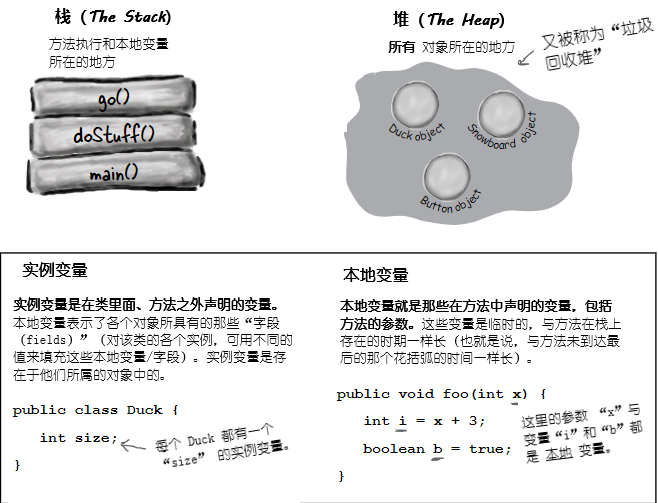
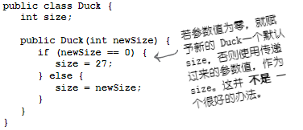
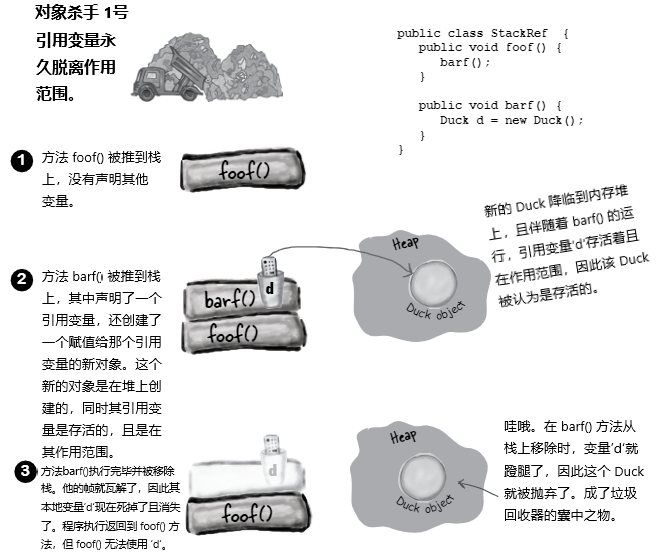

# 构造器与垃圾回收：对象的生命与死亡

**对象生下来又死去（Objects are born and objects die）**。你负责了某个对象的生命周期。你决定何时及怎样去 **构造** 他。你决定何时去 **摧毁** 他。即使你没有亲自去 *摧毁* 某个对象，也是有意无意的 *抛弃* 了他。而一旦某个对象被抛弃，无情的 **垃圾收集器（Garbage Collector, gc）** 就会让他消失，收回该对象所占用的内存。要编写Java程序，就会创建对象。早晚都会让某些对象死去，否则就会耗尽运行内存。本章将了解对象是如何创建出来的，在他们存活的时候呆在哪里，以及如何高效地留存或弃用他们。这就是说要涉及到内存堆（the heap）、栈（the stack）、作用范围（scope）、构造器、超级构造器（super constructors）、空引用（null references）等等。警告：本章涉及可能令某些人反感的对象死亡的材料。介意者请勿阅读。

## 栈与堆：Java万物存在之处

在了解创建对象涉及到的东西之前，就必须先往后一点。需要了解Java中各种东西都存在于什么地方（以及存在多长时间）。那就要了解栈和堆（the Stack and the Heap）。Java程序员关心内存的两个区域 -- 一个是对象所在的内存堆（the heap），另一个是方法执行（method invocations）与本地变量所在的栈（the stack）。在JVM启动时，就从所在的OS获取到一块内存，并使用这块内存来运行你的Java程序。至于有多少内存，以及后期是否可以调整大小，取决于所运行的JVM版本（以及在何种平台）。不过通常你没有话语权，且在良好编程下，也无需关心（这方面后期会讨论更多）。

已知所有 *对象* 都存活在可垃圾回收的堆上，而对于那些 *变量* 在什么地方，还没有关注。变量存在于何处，取决于变量是何种类别。所谓“类别（kind）”，就跟 *类型（type）*，也就是原生变量与对象引用变量，有所不同。在讲到变量存在于何处时所关心的变量类别，是指 *实例* 变量与 *本地* 变量两种。本地变量又被成为是 *栈* 变量，之所以这样称呼，正是与其所存在的位置有关。



*图 1 - 栈与堆，实例与本地变量*

## 方法是堆叠的（Methods are stacked）

在对某个方法进行调用时，所调用的那个方法，就位处调用栈的顶部（When you call a method, the method lands on the top of a call stack）。这里被推到栈上去的，是一个叫做栈 *帧（frame）* 的新事物，栈帧驻留着方法的状态，包括正在执行哪一行代码，以及所有本地变量当前的值。

在栈顶部的方法，始终是那个栈上当前正在运行的方法（此时假设只有一个栈，后续第14章会加入更多栈）。栈上的方法在抵达其最后的结束花括弧（表示方法执行完毕）后，就从栈上消失了，在这之前方法都是留在栈上的。在 `foo()` 方法调用 `bar()`方法时，那么 `bar()`方法是堆叠在 `foo()` 方法之上的。


*图 2 - 有两个方法的调用栈*


*图 3 - 另一个栈场景*


## 对于是对象的那些本地变量的情况

记住，保存了对某个对象的引用的非原生值变量，并不是对象本身（是到对象在堆上的地址）。前面已经知道了对象存活的地方 -- 在内存堆上。不论对象是被声明的还是创建出来的，对象都是在堆上。 ***当本地变量是一个到某对象的引用时，只是该变量（引用/遥控器）在栈上***。

*对象本身，还是在堆上的*。

```java
public class StackRef {
    public void foof {
        barf();
    }

    public void barf () {
        Duck d = new Duck (24);
    }
}
```


*图 4 - 本地变量为对象时的情况*


* **再问一次，*为何* 要了解这些栈/堆的情况？了解他们对编写 Java 程序有什么帮助？真的需要了解这些吗？**

> 具备 Java 栈和堆的基础知识，对于掌握变量作用域（variable scope）、对象创建中的问题（object creation issues）、内存管理（memory management）、线程（threads），以及异常处理（exception handling）等等，至关重要。在后续章节，会涉及线程与异常处理，其他内容本章就会讲到。对特定JVM及/或平台上，栈和堆的实现细节不必了解。只需要了解这里讲到有关栈和堆的情况。如吃透了这里的内容，那么对上述的其他知识点的掌握，就会容易得多。记得我说过的，往后你会感谢我在这里啰嗦栈和堆的。


### 知识点

* Java有着两块我们所关心的内存：栈（the Stack）和堆（the Heap）；

* 实例变量是在类中、方法外部声明的变量；

* 本地变量是在方法里声明的变量，或方法的参数；

* 所有本地变量，都是存活在栈上的，在声明本地变量的相应方法的栈帧中；

* 对象引用变量像原生值变量那样运作 -- 若引用变量是作为本地变量声明，那么该引用变量在栈上；

* 所有对象都存活在堆中，不管对象的引用变量是本地变量，还是实例变量。


## 既然本地变量存活在栈上，那实例变量又存活在哪里呢？

在写下 `CellPhone()`时，Java就必须给那个 `CellPhone`对象在堆上分配空间。但要分配多少空间呢？就要给那个对象足够的空间，就是说要就足够的空间来保存对象的实例变量。那就得了，实例变量存活在堆上，在他们所属对象内部。

请记住对象的实例变量的值，是存活在对象的内部的。在实例变量都是原生值时，Java根据原生变量类型，为这些实例变量分配空间。一个`int`实例变量，需要 32个二进制位，一个 `long`长整型需要 64个二进制位等等。Java并不去看原生变量里的值；对于一个 `int` 的变量，不管他的值是 `32,000,000`还是 `32`，其所占据的位大小，始终都是 32位。

但如果实例变量是 *对象*，那又是怎样的呢？比如 `CellPhone` 就 `HAS-A` `Antenna`？也就是说，`CellPHone`有一个`Antenna`类型的引用变量。

在对象有着一些除开原生变量的、对象引用变量的实例变量时，真正的问题就是：对象需要空间来保存他的那些引用变量所指的对象吗（When the new object has instance variables that are object references rather than primitives, the real question is: does the object need space for all of the objects it holds reference to）？答案是肯定的，但 *不准确*。不管哪种情况，Java都必须给实例变量 *值（values）* 分配空间。但要记住，引用变量不是 *对象* 本身，而仅仅是到对象的 *遥控器*。因此在 `CellPhone` 有一个声明为非原生类型的 `Antenna` 实例变量时，Java 就只需在 `CellPhone`对象里头，给 `Antenna` 的遥控器，而不是`Antenna`对象本身，分配空间即可。

那么什么时候`Antenna`会在堆上获取到空间呢？首先就必须找到对象 `Antenna`本身在什么时候创建出来。这是由`Antenna`这个实例变量的声明决定的。在只声明了这个实例变量，而没有给他赋值的时候，就只有声明的这个引用变量（遥控器）的空间会被创建。

```java
private Antenna ant;
```

直到有新的 `Antenna` 对象赋值给这个对象引用实例变量，才会有真实的 `Antenna`对象在堆上创建出来。

```java
private Antenna ant = new Antenna();
```


*图 5 - 对象的实例变量*

## 对象创建的奇迹

现在知道了变量与对象存活的地方，就可以深入到对象创建的神奇世界。请记住对象声明与赋值的三个步骤：声明一个引用变量，创建出一个对象，还有将对象赋值给引用变量。

到现在为止，其中的第二步 -- 奇迹发生的地方和新对象 “诞生”的地方 -- 仍旧是个大秘团。准备好了解对象生命的一些实情了吗？ *希望你不要太过娇气*。


*图 6 - 对象3步骤*

***这里是调用了一个名为 `Duck()` 的方法吗？因为他真的看起来像个方法***。


*图 7 - 对象创建的问题*

***不是的***。
***这里调用的是 `Duck` 构造器***。

构造器 *确实* 看起来且感觉很像是个方法，但他并不是一个方法。在写下关键字 `new` 时，他就有了运行的代码。也就是说，*在实例化某个对象时，所运行的代码* （It's got the code that runs when you say `new`. In other words, *the code that runs when you instantiate an object*）。

运行构造器的唯一方式，就是使用关键字 `new` 加上类名字。JVM去找到类并运行类中的构造器（好吧，技术上讲这不是运行构造器的 *唯一* 方式。但这确实是从构造器 *外部* 运行他的唯一方式。是 *可以* 在构造器中有限制地调用另一个构造器的，本章后面会讲到这点）。

> ***构造器*** 有着在实例化某个对象时运行的代码。也就是说，当于某个类类型上写下 `new` 时，所运行的代码。
> 你所创建的或不是你创建的全部类，都有一个构造器。


***那构造器在哪里呢？如果我们没有编写构造器，那又是谁编写的呢***？

自己是可以编写自己的类的构造器的（我们就即将那样做），但如果自己没有编写他，那么***编译器将为你编写出一个来***！

编译器默认的构造器看起来是这样的：

```java
public Duck () {}
```

***注意到缺了什么吗？这和方法有什么不同的地方***？


*图 8 - 构造器与方法的不同*

### 构造一个 `Duck`


*图 9 - 构造器实例*

```console
$ java -jar target/com.xfoss.learningJava-0.0.1.jar
Quack
```

### 初始化某个新 `Duck`对象的状态

多数人使用构造器来初始化对象的状态。也就是给对象的实例变量构造和赋值。

```java
public Duck () {
    size = 34;
}
```

在`Duck`类 *开发者* 知道 `Duck` 对象应该是多大的时候，这样做没有问题。但在希望由 *使用* `Duck` 类的程序员来决定，某个特定的 `Duck` 对象应该多大的时候会怎样呢？

设想 `Duck` 有个 `size` 实例变量，同时希望使用这个`Duck`类的程序员来设置新 `Duck` 对象的 `size`。可以怎么办到呢？

当然，可以给类加上一个设置器`setSize()`（setter）。但这样做会给 `Duck` 的 `size` 暂时没有取值（实例变量是有默认值的。对于数值原生值，为`0`或者浮点数的`0.0`，对于布尔值是 `false`，对于引用变量默认值是 `null`），并会让使用者必须用 *两条* 语句 -- 一条来创建 `Duck` 对象，一条来调用 `setSize()` 方法。下面的代码就是使用了一个设置器方法来设置新 `Duck` 的 `size` 初始值。


*图 10 - 使用设置器而不是构造器参数的弊端*

### 答疑

* __既然编译器会提供构造器，那为何还有自己编写构造器__ ？

> 在需要代码来帮助对象初始化，以及为使用该对象做好准备时，就必须编写自己的构造器。或许也会需要对象使用者的输入，才能完成对象的构建。就算自己不需要任何的构造器代码，但还是有必须编写构造器的理由，这一点与超类的构造器有关，后面很快就会讲到这点。

* __怎样区分构造器与普通方法？也可以让某个方法与类有相同的名字吗？__

> Java允许声明与类名字相同的方法。不过这样做不会使其成为构造器。将普通方法和构造器区别开的，就是返回值的类型。方法必须有一个返回值类型，与此相反，构造器就不能有返回值类型（**注意：构造器返回的实际上是一个对象的引用**！）。

* **构造器会被继承吗？在当前类的超类具有构造器，他本身没有构造器时，会将超类的构造器作为默认的构造器吗**？

> 不会。构造器是不被继承的。在后面后讨论这个问题。


### 使用构造器来对一些 `Duck` 的重要状态进行初始化

如果某个对象在其状态的一个或多个部分（实例变量）被初始化之前不应该被使用，那么在咱们完成其初始化之前，就不要让任何人掌握一个 `Duck` 对象！让别人构造并获得一个新的 `Duck` 对象的引用，而这个对象还没有准备好使用，直到那个人转身调用 `setSize()` 方法通常太危险了！`Duck` 的用户怎么知道他需要在制作新的鸭子后调用 `setter` 方法呢？

放置初始化代码的最佳位置是在构造函数中。而咱们需要做的就是创建出带参数的构造函数。


*图 11 - 带有参数的构造器*


## 让 `Duck` 的构造更容易

__就要确保有一个不带参数的构造器__

若 `Duck` 构造器接受一个参数时会怎样？想一下这个问题。在上面的示例中，只有一个 `Duck` 构造器 -- 并接收一个 `int` 参数作为 `Duck` 的大小。这或许不是个大问题，但将让那些尚不知道某个 `Duck` 应该多大的程序员，感到手足无措。如果 `Duck` 能有个默认的 `size`，就会很有帮助，那样 `Duck` 类的使用者，即使不知道一个合适的 `size`，也仍然可以构造出一个可工作的 `Duck`来。

__设想打算让 `Duck` 的使用者，在构造`Duck` 时有两个选项 -- 一个时提供到`Duck`的 `size`（构造器参数），另一个则不指定 `size`，因此就要使用预先准备的 *默认* `Duck` `size`__。

若只有一个构造器，那么肯定就实现不了这个。记住，某个方法（或构造器--适用同样的规则）有个参数，那么在执行该方法或构造器时，就 *必须* 传递一个适当的参数给他。就不能这样写，“如果没有传递任何东西给构造器，就使用默认的 `size`”，因为在没有传递一个 `int` 参数给构造器调用的话，就甚至不能进行编译的。*或许* 可以像下面这样写：

]


*图 12 - 只使用一个构造器*

这样做还是要求构造新 `Duck` 对象的程序员知道，传入一个 `0` 就可以得到默认 `Duck` `size` 的约定。这就很恶心了。要是其他程序员不知道呢？或者某人真的需要一个大小为零的 `Duck`呢？（假设大小为零的 `Duck` 是允许的。就是真的不想要大小为零的 `Duck` 对象存在，就要在构造器中放入验证代码来防止）关键是，不总是能识别出`Duck`的使用者，到底是真的想要一个大小为零的 `Duck`，还是他要传入一个 `0`来得到默认的 `Duck` `size`。


__实际上，需要的是有两种构造新 `Duck`的方式__ :

```java
public class Duck2 {
    int size;

    public Duck2 () {
        // 提供一个默认的 size
        size = 27;
    }

    public Duck2 (int duckSize) {
        // 使用 duckSize 参数
        size = duckSize;
    }
}
```

__要构造一个已知 `size` 的新 `Duck` 时__ ：


```java
Duck2 d = new Duck2 (15);
```


__要构造一个不知道 `size` 的 `Duck` 时__ ：

```java
Duck2 d2 = new Ducks()
```

因此这种 **构造 `Duck` 的双项选择** 做法，就需要 *两个* 构造器。其一接收一个 `int` 参数，其二没有参数。 **在类中有着多个构造器时，就是说使用了 *过载的构造器（overloaded constructors）***。

## 编译器总是会自动构造一个不带参数的构造器吗？ *不会！*

你可能会想，在 *只* 编写了一个有参数的构造器时，编译器会发现那里没有不带参数的构造器，并自动为你补上这么一个。但这并不是编译器的行事方式。编译器 *只会在你完全没有编写构造器时*，才介入到构造器的生成中来。

**在编写了带参数的构造器，且仍需一个不带参数的构造器时，就必须自己去构建这个不带参数的构造器**！

一旦你提供了一个构造器，**不管** 这个构造器是哪种，编译器就后退下来，并以为 “好的兄弟，看起来你负责了构造器这个事情”。

**某个类中有了多个构造器时，那么这些构造器就 *必须* 带有不同的参数清单**。

参数清单包含了参数的顺序及类型。只要参数清单各异，那么就可以有着多个的构造器。对于方法，这条规则也是适用的，后面的章节会讲到。


** *过载* 构造器，就是说，在类中可以有多个构造器**。

**要通过编译，各个构造器就必须有 *不同* 的参数清单**！

下面的类是合法的，因为全部5个构造器，都有着不同的参数清单。若某个类的两个构造器，都接收 `int` 参数，那么该类就不会被编译。参数变量的名称，不作为考虑参数清单差异的考虑。参数变量的 *类型*（比如 `Dog`） 和 *顺序* 才影响参数清单差异。两个构造器可以有同样的类型，***只要顺序不一样*** 就可以。接收一个字符串加一个整数的构造器，就不同于与接收一个整数与一个字符串的构造器。

]

*图 13 - 合法的多个构造器*

## 知识点

* 实例变量存活于他们所属的对象，因此也是在内存堆上的；
* 若实例变量是多某个对象的引用变量，那么该引用变量及其所指的对象，都是在堆上的；
* 构造器是在某个类类型上，提及 `new` 关键字时所运行的代码；
* 构造器的名字，必须与类的名字相同，且不能有返回值类型；
* 可使用构造器，来初始化将要构造对象的状态（即初始化对象的那些实例变量）；
* 如类中没有构造器，那么编译器将放入一个默认的构造器；
* 默认的构造器，总是不带参数的构造器；
* 若在类中放入了构造器，那么编译器就不在会构建默认的构造器了；
* 在已经放入了带参数的构造器后，还想要一个不带参数的构造器，就必须亲自构建那个不带参数的构造器；
* 应尽可能的提供不带参数的构造器，这是为了让其他程序员可以更容易的构造一个能用的对象出来。通过不带参数的构造器提供到实例变量默认值；
* Java 的 “过载构造器”特性，是指类中可以有多个构造器；
* 过载构造器必须有不同的参数清单；
* 两个构造器不能有同样的参数清单。参数清单包括了参数类型和/或顺序；
* 就是没有显式地赋值给实例变量，实例变量仍然具有默认值。对于原生变量，默认值为 `0`/`0.0`/`false`，对于引用变量，默认值为 `null`。

## 答疑

* **早前说到编写一个不带参数的构造器，是一种良好的编程习惯，那样就可以在其他人调用不带参数的构造器时，提供到 “缺失” 参数的默认值。但会不会有时候无法提供默认值？有时候类种不应该有着不带参数的构造器呢**？

> 对的。某些时候不带参数的构造器就毫无意义。在 Java API种就能见到这样的情况 -- 一些类就没有没有不带参数的构造器。比如类 `Color`，表示了某个 ... 颜色。`Color` 对象用于，比如设置或改变某个屏幕字体，或GUI按钮的颜色。在构造某个 `Color` 实例时，所构造的实例，就是某种特定颜色（也就是“死亡巧克力棕（Death-by-Chocolate Brown）”、“死机蓝屏蓝（Blue-Screen-of-Death Blue）”、“绯闻红（Scandalous Red）”等等）。在构建某个 `Color` 对象时，就必须以某种方式指定颜色。

```java
Color c = new Color(3, 45, 200);
```

> （这里使用的就是表示RGB数值的三个整数。后面在 `Swing` 章，将使用到`Color`类。）否则将得到什么呢？Java API的程序员本来可以决定，一个不带参数的`Color`构造器给出可可爱爱的紫红色。不过最后还是理智决定（But good taste prevailed）。

> 那么在尝试不通过参数就构造颜色时：

```java
Color c = new Color();
```

> 编译器就会吓坏，因为在类 `Color`里头，找不到不带参数的构造器。


### 小复习：关于构造器，需要记住的4件事

1) 构造器是在某种类类型上写关键字 `new` 所运行的代码


    ```java
    Duck d = new Duck();
    ```

2) 构造器必须有着与类同样的名字，且 **没有** 返回值类型


    ```java
    public Duck (int size) {}
    ```

3) 当类里没写构造器时，编译器就会放入一个默认的构造器。默认构造器都是不带参数的构造器。


    ```java
    public Duck () {}
    ```

4) 类中可以写多个构造器，只要他们的参数清单不同即可。在类中有着多个构造器时，就用到了 Java 的过载构造器特性。


    ```java
    public Duck () {}
    public Duck (int size) {}
    public Duck (String name) {}
    public Duck (String name, int size) {}
    ```

> 脑力大挑战
>
> **对于超类来讲是什么情况**？
> **在构造一个 `Dog` 时，`Canine` 的构造器，也会运行吗**？
> **在超类是抽象的时候，他甚至也需要一个构造器吗（If the superclass is abstract, should it even hava a constructor）**?
>
> 后面将讨论这些问题，现在可以不用想这些问题，而是可以思考一下构造器与超类，这两个东西在一起的影响。

## 答疑

* **构造器必须要是 `public` 的吗**？

> 不必是。构造器可以是 `public`、`protected`、`private` 或者 *默认（default）* （也就是没有访问修饰器，which means no access modifier at all）。在第16章及附录 B中将讨论 *默认* 访问修饰器。


* ** `private` 的构造器怎么发挥作用呢？没人可以调用到这样的构造器，那么就不会有人能构造出一个新的对象来**！

> 是不会构造出新的对象，但这样说并不完全正确。将某个东西标记为 `private` 并不是说没人可以访问到他，只是说 *类外部没人* 可以访问他。我敢打赌你一定是想到了 《第22条军规》（Bet you're thinking "Catch-22"）。只有在定义了私有构造器的类中的那些代码，才能构造那个类的新对象，但在没有构造出第一个对象的时候，又怎样才能从那个类的最初对象运行代码呢？*Patience grasshopper*。接下来的章里，将讨论这个问题。


**等一下，我们似乎还没有讲到超类与继承，以及他们跟构造器是怎么相互作用的**。

这里就开始变得有趣了。还记得上一章里，讲到的 `Snowboard` 对象，其围绕着表示`Snowboard`类的 `Object` 部分的内部核心进行封装吗？这里最重要的地方，就是所有对象，都不仅保存了他自己声明的实例变量，同时还保存了 *所有来自其超类的东西* （最起码有类 `Object`的东西，因为所有类都扩展了 `Object`）。

那么在某个对象被创建出来是（由于某人写下了关键字 `new`，除有人在某个时候在类类型之上写了 `new`之外，并无其他构造新对象的方式），对象就获取到其 *所有* 实例变量的空间，包括其从继承树往上继承到的，以及自身声明的实例变量。这得要花点时间才能搞清楚......某个超类就可能有着一些对私有变量进行封装的设置器方法（Think about it for a moment...a superclass might have setter methods encapsulating a private variable）。而那个变量，就必须存活于 *某处*。在某个对象被创建出来时，总是会有 *多个* 对象生成 -- 对象被生成，同时每个超类的对象也被生成。概念上讲，像下图这样去考虑这个问题将更好一些，那里所创建出的对象，有着分别表示各个超类的对象 *自身* 的 *各层*。

]

*图 14 - 堆上的 Snowboard 类*

### 超类构造器在对象生命周期中的角色

**The role of superclass constructors in an object's life**

***在构造新的对象时，对象继承树中的所有构造器都必须运行（All the constructors in an object's inheritace tree must run when you make a object）***。

让我们细细品味这句话是什么意思（Let that sink in）。

这意味着每个超类都有一个构造器（因为每个类都有一个构造器），同时沿继承层次往上的每个构造器，在子类的某个对象被创建出来时，都会运行。

写下关键字 `new` 可是个大事情。这就开启了整个构造器链的反应（Saying `new` is a Big Deal. It starts the whole constructor chain reaction）。且就算抽象类，也是有构造器的。虽然不在在某个抽象类上写 `new`，但抽象类同样是超类，因此在有人构造某个具体类的实例时，抽象类的构造器同样会运行。

超类构造器运行，是为了构造出对象的超类部分。记住，某个子类可能依据超类的状态（即超类实例变量的值），而继承超类的某些方法。对象要成型，他自身的所有超类部分必须要成型，这就是超类构造器 *必须* 运行的原因。继承树中所有类的实例变量，都必须被声明和初始化。基本 `Animal`中有 `Hippo` 未曾继承的实例变量（比如在实例变量为 `private`时），`Hippo`仍然会依赖`Animal`中 *使用* 到这些变量的方法。


*图 15 - 构造器链*


在构造器运行时，他就立即沿构造器链往上，调用他的超类构造器，直到类`Object`的构造器（When a contructor runs, it immediately calls its superclass constructor, all the way up the chain until you get to the class `Object` constructor）。

在后面的内容中，将了解怎样调用超类构造器，以及怎么亲自去调用超类构造器。还会了解在超类构造器带有参数时，该怎样去调用他们。

```java
package com.xfoss.learningJava;

abstract class Animal {
    Animal () {
        System.out.println ("Making an Animal");
    }
}

abstract class Canine extends Animal {}
abstract class Feline extends Animal {}

class Dog extends Canine {}
class Cat extends Feline {}
class Hippo extends Animal {
    Hippo () {
        System.out.println("Making a Hippo");
    }
}

public class AnimalTestDrive {
    public static void main (String [] args) {
        System.out.println("Starting...");
        Hippo h = new Hippo();
    }
}
```

运行结果：


```console
$ java -jar target/com.xfoss.learningJava-0.0.1.jar
Starting...
Making an Animal
Making a Hippo
```


*图 16 - 构造器链（Constructor Chaining）*


### 该怎样来亲自执行超类构造器？

**How do you invoke a superclass constructor**?

你可能已经想到，比如对于 `Duck` 的构造器，在 `Duck` 扩展了 `Animal`时，就会去调用 `Animal()`。但不是这样干的：

```java
class Duck extends Animal {
    int size;

    Duck (int newSize) {
        Animal (); // 错！不行，这样是非法的！
        size = newSize;
    }
}
```

调用超构造器（a super constructor）的唯一方式，是通过调用 `super()`。对 -- `super()` 就会调用到 ***超构造器***。

时机在哪里呢（What are the odds）？

```java
class Duck extends Animal {
    int size;

    Duck (int newSize) {
        super();
        size = newSize;
    }
}
```

构造器 `Duck()` 中的 `super()` 调用，把超类构造器放置在栈顶部。而那个超类构造器又会干什么呢？*调用他自己的超类构造器*。如此这般，直到`Object`的构造器位于栈的顶部为止。一旦 `Object()` 运行完毕，他就从栈上被移除，同时栈上的下一个构造器（调用 `Object()` 的那个子类构造器）现在就位于顶部了。随后 *那个* 构造器也执行完毕，如此这般，直到最初的构造器位于栈顶部为止，到这里这个最初的构造器才执行完毕。

> **那么之前为什么就没这么做呢（And how is it that we've gotten away without doing it）**?

> 你或许已经接近发现事实真相了。
> **在我们没有放入一个 `super()`时，我们的好友编译器就会放入一个**。
> 因此编译器在介入到构造器构造时，有两种方式（So the compiler gets involved in constructor-making in two ways）：
>
> 1. 在我们不提供构造器时：
> 编译器放入一个这样的构造器：

```java
class ClassName {
    super();
}
```

> 2. 在提供了构造器却没有放入一个到 `super()` 的调用时
>
> 编译器将在所有过载构造器中，放入一个到 `super()`的调用（除了那些调用了其他过载构造器的构造器中，这在后面会见到）。编译器所提供的调用是这样的：

```java
super();
```

> 且会一直是这样的。编译器插入的 `super()` 调用，始终是不带参数的。在超类有着过载构造器时，只会调用不带参数的构造器。

### 子类可以在父类之前就存在吗？

**Can the child exist before the parents**?

在将超类想象为子类孩子的父辈时，就能搞清楚哪个会首先存在。***对象的超类部分，必须要在子类部分构造之前就完全成型（构建完毕）***。记住，子类对象可能依赖他所继承的超类的某些东西，因此这些被继承的东西有必要是完备的。这事没有商量的余地。超类构造器必须在子类构造器之前执行完毕。

回顾前面的栈序列，就可以发现尽管首先运行的是 `Hippo()` 构造器（他是栈上第一个事物），但却是最后一个执行完毕的！各个子类构造器将立即运行他自己的超类构造器，直到 `Object` 构造器位居栈顶部为止。这是`Object`的构造器执行完毕，随后我们往下被带回到 `Animal` 的构造器。只有在 `Animal` 的构造器执行完毕，才能最终往下回到 `Hippo`构造器的剩余部分。因为这个原因：

**对 `super()` 的调用，必须是每个构造器中的第一条语句**（此规则也有例外，后面马上就会看到）！


*图 17 - 对 `super()` 的调用*


### 带参数的超类构造器

若超类构造器带有参数会怎样呢？可将某些东西传递进入到 `super()` 调用吗？当然可以。如若不能，就无法去扩展那些，没有不带参数的构造器的类了。设想这样的场景：所有动物都有个名字。类 `Animal` 中有个 `getName()` 的方法，返回实例变量 `name` 的值。该实例变量被标记为了`private`，但子类（此示例中的 `Hippo`）继承了 `getName()` 方法。那么就有这个问题：`Hippo`有着一个 `getName()`方法（通过继承得到），但并没有 `name`这个实例变量。`Hippo`就不得不依赖自己的 `Animal`部分，来保存那个`name`的实例变量，并在某人调用到 `Hippo`对象上的 `getName()`方法时，返回 `name` 的值。但 `Animal` 部分该怎样获取到这个 `name` 呢？`Hippo`到他的 `Animal`部分的唯一引用，是经由 `super()` 实现的，那么那里就是 `Hippo` 把 `Hippo` 的名字，发送给他的 `Animal` 部分的地方，如此这般，`Animal` 部分才可以将 `Hippo`的名字，存储在那个 `private` 的 `name` 实例变量中。

```java
abstract class Animal {
    private String name; // 所有动物（包括子类）都有一个名字

    public String getName () { // Hippo 继承到的一个读取器方法（a getter method）
        return name;
    }

    Animal (String theName) {
        name = theName; // 接收名字并将其赋值给 name 实例变量的构造器
    }
}

class Hippo extends Animal {
    Hippo (String name) { // Hippo构造器接收一个名字
        super(name); // 这个语句将名字在栈上向上发送给 Animal 构造器
    }
}

public class AnimalTestDrive {
    public static void main (String [] args) {
        Hippo h = new Hippo("Buffy"); // 构造一个 Hippo, 并将名字 "Buffy" 传递给 Hippo 构造器。
        System.out.println(h.getName()); // 随后调用 Hippo 继承到的 getName() 方法
    }
}
```

运行结果：

```console
$ java -jar target/com.xfoss.learningJava-0.0.1.jar
Buffy
```

### 从一个过载构造器运行另一个过载构造器

在过载构造器具有处理不同参数类型的例外，而去做同样的事情时，会怎样呢（What if you have overloaded construtors that, with the exception of handling different argument types, all do the same thing）？显然是不希望在各个构造器中有 *重复（duplicate）* 代码（苦于维护等等），那么就有把大部分构造器代码（包括对 `super()` 的调用），放在 *一个* 过载构造器中。让其他构造器去运行这个真正构造器（The Real Constructor），并让这个真正构造器去完成对象构造工作。很简单：使用 `this()` 语句，或者 `this(aString)`，或者`this(27, x)`这样的语句即可。也就是说，只需将关键字 `this`，想象为 **当前对象** 即可。

**只有在构造器中，才能写 `this`, 且必须是构造器的第一条语句**！

但那是个问题，不是吗？早先说过，`super()`必须是构造器中的第一条语句。好吧，上面这句话就是说，现在多了一个选择。

**每个构造器都可以有一个 `super()` 或 `this()` 的调用，但不能两个同时调用**！

> **在一个构造器中使用 `this()` 来调用同一类中的另一个构造器**。
> **可以在构造器中使用对 `this()` 的调用，但必须是构造器的第一条语句**。
> **构造器可以保有一个对 `super()` *或* `this()` 的调用，但不能同时使用 `super()` 和 `this()`**。


*图 18 - `this()` 和 `super()`的使用*

### 现在了解了对象是如何诞生的，那么对象会存活多长时间呢？

对象的 *生命* 完全取决于指向他的引用变量的存活时间。在引用变量还是 “存活的” 时候，那么对象也就还存活在内存堆上。如果引用变量死去（马上就会讲到“引用变量死去”的意思），那么对象也会死去。

**既然对象的生命取决于他的引用变量的存活时间，那么究竟 *变量* 会存活多长时间呢**？

变量存活时间，又取决于变量是 *本地* 变量还是 *实例* 变量。下面的代码展示了本地变量的存活时间。在示例中，变量是个原生值，但不论变量是原生值还是引用变量，他们的存活时间都是一样的。


*图 19 - 本地变量存活时间*


**本地变量 *存活时间* 与 *作用范围* 的区别**：

* **存活时间（Life）**

    本地变量与其所在的栈帧同在。也就是说，*在其所属方法执行完毕之前，本地变量都是存活的*。

* **作用范围（Scope）**

    本地变量作用范围，仅限于声明变量的方法内部。在他自己的方法调用另一个方法期间，该变量仍然是存活的，但直到他的方法恢复运行之前，都不在他的作用范围中。***只有当本地变量在其作用范围中时，才能使用那个变量***。


*图 20 - 本地变量存活时间与作用范围*


在本地变量处于存活状态是，他的状态就会持续存在。只要 `doStuff()` 方法还在栈上，那么变量 `b` 就会保持他的值不变。但变量 `b` 只能在 `doStuff()` 栈帧位于顶部时才能使用。也就是说，只有在本地变量的方法正在运行时（而非等待其上的栈帧执行完毕期间），才能使用那个本地变量。

> **Wrap vs. Encapsulation**

> Wrap, 缠绕，包裹起来，更形象
> Encapsulation, 封装，Java 中的 `getter` 和 `setter` 对 `private` 变量的封装，不如 wrap 形象，意义也大不相同

### 引用变量的存活时间问题

对于原生变量与引用变量，规则是一样的。引用变量也只能在其作用范围使用，也就是说，除非在作用范围中有某个引用变量，否则就不能使用某个对象的遥控器。然而 *真正的* 问题是：

**“引用变量的存活时间，是如何对其所指向的 *对象* 的存活时间施加影响的”**？

对象与对象的引用变量共存。在某个引用变量脱离作用范围却依然存活时，他 *所指向的* 对象，也依然是存活在内存堆上的。那么你就会问......“当引用变量所在方法结束，从而导致保存引用变量的栈帧被移除栈时，会发生什么呢”？

如果那个引用变量是到对象的 *唯一* 引用，那么该对象此时就会在堆上被抛弃。随着栈帧的瓦解，那个引用变量也瓦解了，因此被抛弃的对象，现在就 *正式地* 吃席了。这里的窍门在于明白某个对象在什么时候 ***可被垃圾回收***。

一旦某个对象可被垃圾回收（eligible for garbage collection, GC），就不用操心怎么去收回被那个对象使用的内存的问题。在程序需要更多内存时，Java的垃圾回收特性，就会自动损毁掉部分或全部的可回收对象，从而避免内存耗尽。在所有可回收对象被投进垃圾场之前，是不会耗尽内存的（If your program gets low on memory, GC will destroy some or all of the eligible objects, to keep you from running out of RAM. You can still run out of memory, but *not* before all eligible objects have been hauled off to the dump）。你的任务就只是确保在用完对象后，及时抛弃他们即可（也就是让用完的对象成为可被垃圾回收的对象），这样垃圾回收器（the garbage collector,）就有东西可以回收了。如果一直吊着这些对象不放，垃圾回收就帮不上你，你就只有自己承担程序陷入耗尽内存而亡的风险了。

> **在没有指向对象的引用变量时，对象的存活没有价值、没有意义，也没有时间点**。
> **若不能捕获到对象，那么就没法要求对象完成任何事情，这时对象就是一堆废物的二进制位**。
> **但在某个对象不可到达时，垃圾回收器就会把他找出来。很快他就会消失**。


*图 21 - 对象的存活时间*





*图 22 - 对象回收：引用变量永久脱离作用范围*
